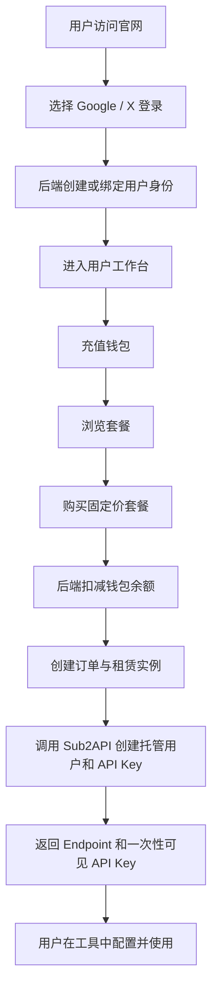
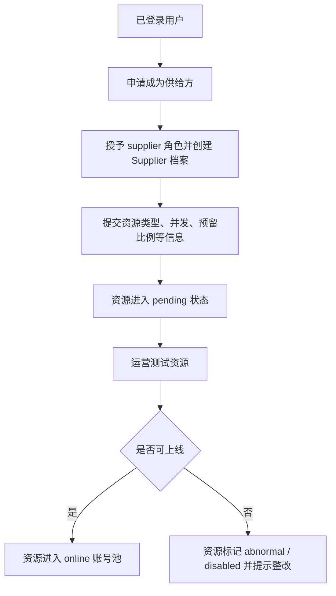
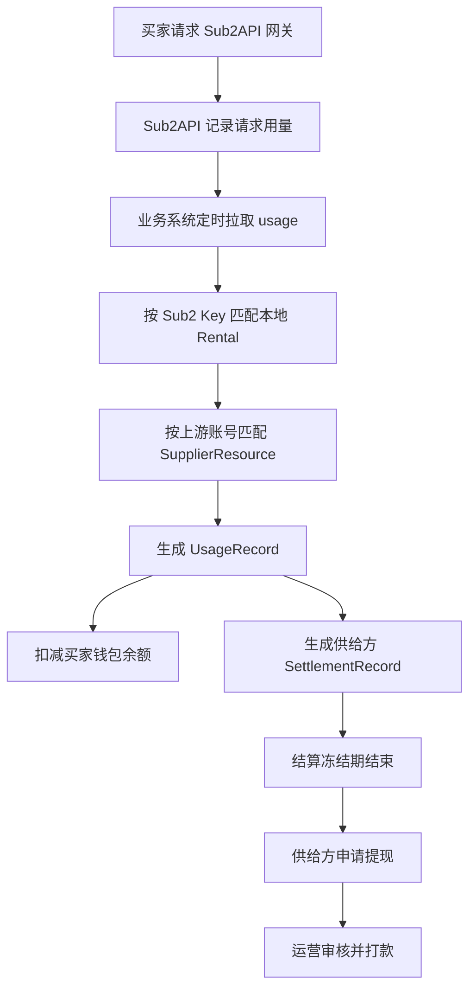

# 智算驿站需求文档

文档版本：v0.1
编写日期：2026-06-08
依据源码：`sub2share` main 分支，提交 `63d0433 chore: ignore upstream snapshot directory`
适用范围：智算驿站用户平台、运营后台、业务 API、Sub2API 适配层与后续产品演进

## 1. 项目概述

### 1.1 项目定位

智算驿站是一个面向「闲置 API / AI coding agent 额度租赁」的双侧平台。平台连接买家和供给方，让买家以更低成本获得 Codex、Claude Code、Gemini、Antigravity 等资源的可用接口额度，同时让供给方把暂时闲置的订阅额度、账号额度或资源能力出租并获得收益。

平台自身承担交易、鉴权、资源分配、密钥隔离、余额扣费、用量同步、分润结算、资源审核、运营监控等中台能力。Sub2API 作为网关内核，承担上游账号池调度、请求中转、API Key 管理和用量记录输出。

### 1.2 当前源码实现概况

当前仓库已经实现了一个 MVP 骨架：

| 模块 | 当前实现 |
| --- | --- |
| 用户端 | React + Vite，包含官网入口、OAuth 登录、工作台、套餐购买、密钥展示、钱包充值、供给方申请 |
| 运营后台 | React + Vite，包含后台登录、经营看板、用户列表、订单列表、资源池列表 |
| API 服务 | Fastify + Prisma + JWT，包含认证、钱包、商品、订单、租赁、供给、计费同步、后台接口 |
| 数据库 | Prisma + PostgreSQL，覆盖用户、钱包、商品、订单、租赁、供应商、用量、结算、提现、审计 |
| Sub2 对接 | 统一 `Sub2ApiClient`，支持托管用户、API Key 创建、Key 启停、用量拉取 |
| 部署 | pnpm workspace、Docker Compose、API/Web/Admin Dockerfile、nginx SPA 配置 |

当前代码更接近「可验证业务闭环的 MVP」，还不是完整生产系统。支付仍为 mock，供给资源审核与调度策略较轻，测试脚本为占位，生产级可靠性能力需要补强。

### 1.3 仓库结构

```text
sub2share/
├─ sub2/                  # Sub2API 网关内核对接区
│  ├─ adapter-notes/       # 业务对象与 Sub2API 对象映射说明
│  ├─ scripts/             # 同步上游与本地启动脚本
│  └─ README.md
├─ user/                  # 智算驿站业务平台 monorepo
│  ├─ apps/
│  │  ├─ api/              # Fastify 业务 API
│  │  ├─ web/              # 买家端 / 供给方端 React 应用
│  │  └─ admin/            # 运营后台 React 应用
│  ├─ packages/
│  │  ├─ shared/           # 共享类型、枚举、常量
│  │  └─ ui/               # 共享 UI 包
│  ├─ prisma/              # Prisma schema、迁移、seed
│  ├─ docker/              # Dockerfile 与 nginx 配置
│  └─ scripts/             # 本地启动与构建脚本
└─ docs/                  # 后续产品、技术、设计、验收文档
```

## 2. 产品目标

### 2.1 短期目标

1. 跑通「登录 -> 充值 -> 购买套餐 -> 开通租赁 -> 获取 Endpoint 和 API Key -> 产生用量 -> 扣费 -> 供给方分润」闭环。
2. 让买家可以自助管理租赁密钥、余额和订单。
3. 让供给方可以提交资源，并能看到资源状态与待结算收益。
4. 让运营人员可以查看用户、订单、资源池、核心经营指标，并执行基础运营动作。
5. 让业务系统与 Sub2API 保持清晰边界，通过统一 Adapter 对接。

### 2.2 中期目标

1. 将 mock 充值升级为真实支付链路。
2. 引入供给资源测试、评级、上线、限流、故障下线、收益结算和提现审核。
3. 支持更多套餐形态：按量计费、日租、周租、月租、并发增强包、请求包、余额包。
4. 建立完整对账能力：订单账、钱包账、用量账、供给方结算账、支付渠道账。
5. 引入自动化任务：用量同步、租赁到期、低余额限制、结算解冻、资源健康检查。

### 2.3 长期目标

1. 构建可持续扩展的多资源交易市场。
2. 支持多地区、多币种、多支付渠道、多上游网关。
3. 支持企业客户、团队账号、发票、合同、API SLA、风控策略和合规审计。
4. 形成供给质量评分体系，让调度策略自动偏向稳定、高性价比资源。

## 3. 用户角色与权限

### 3.1 角色定义

| 角色 | 源码枚举 | 说明 |
| --- | --- | --- |
| 买家 | `buyer` | 默认用户角色，可浏览套餐、充值、购买、管理租赁 |
| 供给方 | `supplier` | 可提交闲置资源、查看资源状态和结算 |
| 运营 | `operator` | 可访问运营后台、查看数据、触发计费同步 |
| 管理员 | `admin` | 最高权限，拥有运营权限，并可用于系统初始化和管理 |

### 3.2 当前鉴权实现

当前后端使用 JWT 作为访问令牌，`requireAuth` 校验登录状态，`requireRole` 校验角色权限。普通用户注册入口已关闭，用户侧登录仅保留 Google / X OAuth。管理员和运营人员可使用密码登录。

### 3.3 权限矩阵

| 功能 | 买家 | 供给方 | 运营 | 管理员 |
| --- | --- | --- | --- | --- |
| 浏览公开页 | 是 | 是 | 是 | 是 |
| OAuth 登录 | 是 | 是 | 可选 | 可选 |
| 密码登录后台 | 否 | 否 | 是 | 是 |
| 查看个人钱包 | 是 | 是 | 否 | 否 |
| 充值 | 是 | 是 | 否 | 否 |
| 购买套餐 | 是 | 是 | 否 | 否 |
| 查看个人租赁 | 是 | 是 | 否 | 否 |
| 暂停 / 恢复个人租赁 | 是 | 是 | 否 | 否 |
| 申请供给方 | 是 | 已是 | 否 | 否 |
| 提交供给资源 | 否 | 是 | 否 | 否 |
| 查看供给结算 | 否 | 是 | 否 | 否 |
| 查看运营看板 | 否 | 否 | 是 | 是 |
| 管理用户、订单、资源 | 否 | 否 | 是 | 是 |
| 触发用量同步 | 否 | 否 | 是 | 是 |

## 4. 核心业务流程

### 4.1 买家租赁流程



### 4.2 供给方入驻流程



### 4.3 用量计费与分润流程



### 4.4 订单失败补偿流程

当前订单购买在本地交易中先扣款、创建订单和租赁，再调用 Sub2API 开通 Key。如果 Sub2 开通失败，系统会：

1. 将订单状态改为 `failed`。
2. 将租赁状态改为 `closed`。
3. 将已扣金额退回用户钱包。
4. 记录一条 `refund` 钱包流水。

后续应补强失败原因记录、运营告警、用户可见错误解释、幂等重试和人工补开入口。

## 5. 功能需求

### 5.1 认证与账户

当前实现：

- 用户侧支持 Google OAuth 和 X OAuth。
- OAuth 成功后自动创建用户、默认授予 `buyer` 角色、创建钱包。
- OAuth 身份记录在 `UserIdentity` 表中。
- 密码注册入口禁用。
- 密码登录仅允许 `admin` 或 `operator` 角色。
- `/api/me` 返回当前用户基础信息、角色、钱包、供应商档案。

扩展需求：

| 编号 | 需求 | 优先级 |
| --- | --- | --- |
| AUTH-001 | OAuth state 从进程内 Map 迁移到 Redis，支持多实例部署和服务重启 | P0 |
| AUTH-002 | 支持 refresh token、访问令牌过期和无感刷新 | P0 |
| AUTH-003 | 后台登录增加失败次数限制、验证码或二次验证 | P1 |
| AUTH-004 | 用户可查看并解绑 OAuth 身份，至少保留一个可用登录方式 | P2 |
| AUTH-005 | 用户状态为 disabled / banned 时禁止访问核心业务接口 | P0 |
| AUTH-006 | 增加审计日志：登录成功、登录失败、OAuth 绑定、权限变化 | P1 |

验收标准：

- 未登录用户访问个人接口返回 401。
- 非运营角色访问后台 API 返回 403。
- OAuth 回调缺少 code/state 时能回到前端并显示错误。
- 多实例部署时 OAuth state 能跨实例正确校验。

### 5.2 钱包与交易流水

当前实现：

- 用户可查看钱包余额。
- 用户可发起 mock 充值。
- 充值金额低于 `MIN_RECHARGE_AMOUNT` 时拒绝。
- 购买套餐、开通失败退款、用量同步扣费都会生成钱包流水。

扩展需求：

| 编号 | 需求 | 优先级 |
| --- | --- | --- |
| WALLET-001 | 接入真实支付渠道，替换 mock 充值 | P0 |
| WALLET-002 | 钱包扣费、退款、冻结、解冻必须全量幂等 | P0 |
| WALLET-003 | 钱包余额不可被扣成负数，除非产品明确支持信用额度 | P0 |
| WALLET-004 | 增加钱包流水分页、筛选、导出 | P1 |
| WALLET-005 | 增加支付回调签名校验和回调重放防护 | P0 |
| WALLET-006 | 支持余额预警、低余额通知、自动暂停租赁策略 | P1 |
| WALLET-007 | 区分充值余额、赠送余额、冻结余额、可提现余额 | P2 |

账务规则：

1. 任何余额变化必须有对应 `WalletTransaction`。
2. `balanceAfter` 必须等于交易完成后的钱包可用余额。
3. 同一外部支付单或用量记录不得重复入账。
4. 退款金额不得超过原消费金额。
5. 资金状态变化必须在数据库事务中完成。

### 5.3 商品与套餐

当前实现：

- 商品表 `Product` 记录资源类型、计费模式、描述、状态。
- 价格表 `ProductPrice` 记录套餐 tier、固定价、周期、并发、请求量。
- 用户端只展示 `active` 商品和 `active` 价格。
- 当前订单购买只支持 fixed price 商品。
- seed 默认创建「Codex 标准租赁」月租商品。

扩展需求：

| 编号 | 需求 | 优先级 |
| --- | --- | --- |
| PRODUCT-001 | 后台可创建、编辑、上下架商品和价格 | P0 |
| PRODUCT-002 | 支持按量计费套餐 | P0 |
| PRODUCT-003 | 支持日租、周租、月租、请求包、并发包 | P1 |
| PRODUCT-004 | 支持按资源类型、模型、地区、等级配置不同价格 | P1 |
| PRODUCT-005 | 支持优惠券、折扣码、首单优惠、渠道价格 | P2 |
| PRODUCT-006 | 商品变更需保留历史版本，避免影响已购订单 | P1 |

### 5.4 订单与租赁

当前实现：

- 用户通过 `/api/orders` 创建订单。
- 后端校验商品价格状态和钱包余额。
- 创建订单、订单项、租赁、租赁限额。
- 调用 Sub2API 创建 API Key。
- 返回一次性明文 API Key。
- 用户可查看订单列表、租赁列表和租赁详情。
- 用户可暂停或恢复租赁，对应启停 Sub2 Key。

扩展需求：

| 编号 | 需求 | 优先级 |
| --- | --- | --- |
| ORDER-001 | 创建订单接口支持幂等键，防止重复点击重复扣款 | P0 |
| ORDER-002 | 订单状态流转需记录状态历史和失败原因 | P0 |
| ORDER-003 | API Key 明文只允许展示一次，刷新页面不可再取回 | P0 |
| ORDER-004 | 支持续租、升级、降级、加购请求量和并发 | P1 |
| ORDER-005 | 支持订单取消、退款申请、运营审核退款 | P1 |
| ORDER-006 | 租赁到期自动禁用 Sub2 Key 并更新状态 | P0 |
| ORDER-007 | 余额不足或欠费时自动限制 / 暂停租赁 | P0 |
| ORDER-008 | 支持重新生成 Key，并使旧 Key 失效 | P1 |

状态流转建议：

```text
订单：pending -> paid -> provisioning -> active
订单：pending -> cancelled
订单：provisioning -> failed -> refunded
订单：active -> refunding -> refunded
订单：active -> expired / closed

租赁：active -> low_balance -> limited -> suspended
租赁：active -> expired / refunded / closed
租赁：suspended -> active
```

### 5.5 Sub2API 适配

当前 `Sub2ApiClient` 已封装：

- 创建托管买家用户。
- 登录托管用户。
- 创建自定义 API Key。
- 启用 / 禁用 Key。
- 使用管理员 token 或管理员账号登录。
- 拉取 usage 列表并转换成本地 `Sub2UsageRecord`。
- 通过 hash 生成托管用户邮箱和密码。

扩展需求：

| 编号 | 需求 | 优先级 |
| --- | --- | --- |
| SUB2-001 | 明确 Sub2API 真实接口契约，并补充适配层集成测试 | P0 |
| SUB2-002 | 设置并发、RPM、TPM、请求量、消费上限等限额必须真正下发到 Sub2 | P0 |
| SUB2-003 | Sub2 调用失败需分类：鉴权失败、网络失败、参数失败、资源不足、限流 | P0 |
| SUB2-004 | Sub2 操作需要重试、退避、超时和熔断 | P1 |
| SUB2-005 | 建立 Sub2Binding 的完整对象映射和反查能力 | P1 |
| SUB2-006 | 支持资源池健康状态同步和账号上下线 | P1 |
| SUB2-007 | 支持多个 Sub2 网关实例或多个上游网关 | P2 |

边界约束：业务模块不得直接拼接 Sub2API URL。所有 Sub2 调用必须通过统一适配层完成。适配层负责协议转换、错误归一、重试策略、日志脱敏和指标上报。

### 5.6 用量计费

当前实现：

- 运营或管理员可调用 `/api/billing/sync-sub2-usage` 触发一次用量同步。
- 同步任务从 Sub2 拉取 usage。
- 根据 `sub2KeyId` 匹配本地租赁。
- 根据 `upstreamAccountId` 匹配供应商资源。
- 创建 `UsageRecord`。
- 扣买家钱包。
- 创建供应商 `SettlementRecord`。

当前高风险点：`usageRecord.upsert` 使用 `update: {}`，但后续扣钱包和创建结算没有基于「是否新建」做防重。若同一 Sub2 usage 被重复同步，可能产生重复扣费和重复结算。生产前必须修复。

扩展需求：

| 编号 | 需求 | 优先级 |
| --- | --- | --- |
| BILLING-001 | 用量同步必须端到端幂等，重复同步不重复扣款、不重复结算 | P0 |
| BILLING-002 | 保存同步 cursor、同步批次、同步开始/结束时间、错误信息 | P0 |
| BILLING-003 | 支持定时自动同步，而不是仅手动触发 | P0 |
| BILLING-004 | 计费规则应从商品价格或租赁配置读取，而不是仅使用全局折扣率 | P0 |
| BILLING-005 | 买家扣费失败时应触发低余额、限制、暂停策略 | P0 |
| BILLING-006 | 支持用量争议、用量忽略、退款、人工调整 | P1 |
| BILLING-007 | 生成账单周期报表：日账单、月账单、供应商账单 | P1 |
| BILLING-008 | 对账任务需比较 Sub2 usage、钱包流水、结算记录一致性 | P1 |

### 5.7 供给方与资源池

当前实现：

- 普通用户可申请供给方。
- 系统授予 `supplier` 角色并创建 `Supplier` 记录。
- 供给方可提交资源类型、最大并发、预留比例、日封顶等信息。
- 新资源默认进入 `pending` 状态。
- 供给方可查看自己的资源和结算记录。
- 管理后台可查看资源池列表。

扩展需求：

| 编号 | 需求 | 优先级 |
| --- | --- | --- |
| SUPPLIER-001 | 供给方申请需要资料字段：联系人、收款方式、资源说明、风险确认 | P0 |
| SUPPLIER-002 | 资源提交需要安全地登记上游账号或接入方式，敏感凭据必须加密 | P0 |
| SUPPLIER-003 | 运营可测试资源、分级、上线、暂停、禁用 | P0 |
| SUPPLIER-004 | 资源状态变更需有操作记录和原因 | P1 |
| SUPPLIER-005 | 建立 L0-L4 评级规则，影响分成比例和调度权重 | P1 |
| SUPPLIER-006 | 支持资源日封顶、预留比例、最大并发、异常自动下线 | P1 |
| SUPPLIER-007 | 供给方可查看收益明细、结算状态、可提现金额 | P1 |
| SUPPLIER-008 | 支持提现申请、运营审核、打款记录和驳回原因 | P0 |

资源状态定义：

| 状态 | 说明 |
| --- | --- |
| `pending` | 已提交，等待审核 |
| `testing` | 运营或系统正在测试 |
| `online` | 已上线，可参与调度 |
| `busy` | 临时繁忙，暂不分配新流量 |
| `paused` | 供给方或运营主动暂停 |
| `abnormal` | 监控发现异常 |
| `disabled` | 禁用，不再使用 |

### 5.8 运营后台

当前实现：

- 管理员登录。
- 经营看板：用户数、有效租赁、在线资源、待提现、用量数、GMV、供给方收益。
- 用户列表。
- 订单列表。
- 资源池列表。

扩展需求：

| 编号 | 需求 | 优先级 |
| --- | --- | --- |
| ADMIN-001 | 用户详情页：角色、状态、钱包、订单、租赁、OAuth 身份、审计记录 | P0 |
| ADMIN-002 | 订单详情页：支付、扣款、租赁、Sub2 Key、失败原因、退款记录 | P0 |
| ADMIN-003 | 资源详情页：供给方、账号状态、测试结果、用量、结算、操作记录 | P0 |
| ADMIN-004 | 支持用户禁用 / 解禁 / 角色调整 | P1 |
| ADMIN-005 | 支持资源审核、上线、暂停、禁用 | P0 |
| ADMIN-006 | 支持提现审核和打款标记 | P0 |
| ADMIN-007 | 支持手动重试 Sub2 开通、用量同步、账务修复 | P1 |
| ADMIN-008 | 后台表格支持分页、筛选、搜索、导出 | P1 |
| ADMIN-009 | 所有后台操作写入 AuditLog | P0 |

### 5.9 用户端体验

当前用户端是单页 React 应用，包含公开首页与登录后工作台。登录后有总览、套餐、密钥、钱包、供给五个视图。

扩展需求：

| 编号 | 需求 | 优先级 |
| --- | --- | --- |
| WEB-001 | 购买前清晰展示套餐限制、计费规则、退款规则和到期策略 | P0 |
| WEB-002 | API Key 一次性展示时给出复制确认、已复制状态和安全提示 | P0 |
| WEB-003 | 租赁详情页展示用量、余额消耗、到期时间、限额、状态历史 | P1 |
| WEB-004 | 钱包页展示充值记录、消费记录、退款记录、筛选和分页 | P1 |
| WEB-005 | 供给方工作台展示资源审核进度、收益、提现、问题提示 | P1 |
| WEB-006 | 错误提示要可理解，避免直接展示后端内部错误 | P0 |
| WEB-007 | 支持移动端核心流程：登录、充值、购买、复制 Key、查看余额 | P1 |

## 6. 数据模型需求

### 6.1 现有核心实体

| 实体 | 说明 |
| --- | --- |
| `User` | 平台用户 |
| `UserIdentity` | OAuth 身份绑定 |
| `UserRole` | 用户角色 |
| `WalletAccount` | 钱包账户 |
| `WalletTransaction` | 钱包流水 |
| `Product` | 商品 |
| `ProductPrice` | 商品价格 / 套餐 |
| `Order` | 订单 |
| `OrderItem` | 订单项 |
| `Rental` | 租赁实例 |
| `RentalLimit` | 租赁限额 |
| `ApiKey` | 本地 API Key 记录，存 hash 和 prefix |
| `Supplier` | 供给方 |
| `SupplierResource` | 供给资源 |
| `UsageRecord` | 用量记录 |
| `SettlementRecord` | 供给方结算记录 |
| `Withdrawal` | 提现申请 |
| `Sub2Binding` | 本地对象与 Sub2 对象绑定 |
| `AuditLog` | 审计日志 |

### 6.2 建议新增实体

| 实体 | 用途 | 优先级 |
| --- | --- | --- |
| `PaymentOrder` | 记录第三方支付单、渠道、状态、回调数据 | P0 |
| `BillingSyncCursor` | 保存用量同步游标和批次状态 | P0 |
| `OrderStatusHistory` | 记录订单状态流转和失败原因 | P0 |
| `RentalStatusHistory` | 记录租赁状态流转和操作来源 | P1 |
| `SupplierResourceCredential` | 加密保存供给资源接入凭据 | P0 |
| `ResourceHealthCheck` | 保存资源健康检查结果 | P1 |
| `Notification` | 站内通知、余额提醒、审核结果通知 | P2 |
| `Invoice` | 企业客户发票需求 | P2 |

### 6.3 数据一致性要求

1. 钱包余额与钱包流水必须可对账。
2. 订单金额与订单项金额必须可对账。
3. 租赁实例必须能反查对应订单、商品、用户、Sub2 Key。
4. 用量记录必须能反查租赁、买家、供应商资源和结算记录。
5. 结算记录必须能反查对应用量，人工调整也必须记录原因。
6. 所有敏感凭据只能保存密文或 hash，不得保存明文 API Key。

## 7. API 需求

### 7.1 当前 API 清单

| 方法 | 路径 | 说明 |
| --- | --- | --- |
| GET | `/health` | 服务健康检查 |
| POST | `/api/auth/register` | 已禁用，返回密码注册关闭 |
| POST | `/api/auth/login` | 管理员 / 运营密码登录 |
| GET | `/api/auth/oauth/:provider/start` | OAuth 开始 |
| GET | `/api/auth/oauth/:provider/callback` | OAuth 回调 |
| GET | `/api/me` | 当前用户信息 |
| GET | `/api/wallet` | 钱包信息 |
| POST | `/api/wallet/recharge` | mock 充值 |
| GET | `/api/wallet/transactions` | 钱包流水 |
| GET | `/api/products` | 商品列表 |
| POST | `/api/orders` | 创建订单并开通租赁 |
| GET | `/api/orders` | 当前用户订单 |
| GET | `/api/rentals` | 当前用户租赁 |
| GET | `/api/rentals/:id` | 租赁详情 |
| POST | `/api/rentals/:id/suspend` | 暂停租赁 |
| POST | `/api/rentals/:id/resume` | 恢复租赁 |
| POST | `/api/supplier/apply` | 申请供给方 |
| GET | `/api/supplier/profile` | 供给方档案 |
| POST | `/api/supplier/resources` | 提交供给资源 |
| GET | `/api/supplier/resources` | 供给资源列表 |
| GET | `/api/supplier/settlements` | 供给方结算 |
| POST | `/api/billing/sync-sub2-usage` | 手动触发用量同步 |
| GET | `/api/usages` | 当前用户用量 |
| GET | `/api/admin/dashboard` | 后台看板 |
| GET | `/api/admin/users` | 后台用户列表 |
| GET | `/api/admin/orders` | 后台订单列表 |
| GET | `/api/admin/resources` | 后台资源列表 |

### 7.2 API 统一规范

成功响应：

```json
{
  "ok": true,
  "data": {},
  "requestId": "..."
}
```

错误响应：

```json
{
  "ok": false,
  "error": {
    "code": "error_code",
    "message": "Human readable message",
    "details": {}
  },
  "requestId": "..."
}
```

规范要求：

1. 所有写接口支持幂等设计或明确说明不能重复提交。
2. 所有列表接口支持分页。
3. 后台列表接口支持筛选和搜索。
4. 错误 code 稳定，不随文案变化。
5. requestId 贯穿日志、错误、审计和用户反馈。

### 7.3 建议新增 API

| 方法 | 路径 | 说明 | 优先级 |
| --- | --- | --- | --- |
| POST | `/api/payments/recharge` | 创建真实充值支付单 | P0 |
| POST | `/api/payments/webhook/:provider` | 支付渠道回调 | P0 |
| POST | `/api/orders/:id/cancel` | 取消订单 | P1 |
| POST | `/api/orders/:id/refund` | 申请退款 | P1 |
| POST | `/api/rentals/:id/rotate-key` | 轮换 API Key | P1 |
| POST | `/api/rentals/:id/renew` | 续租 | P1 |
| GET | `/api/rentals/:id/usages` | 租赁用量明细 | P1 |
| GET | `/api/admin/users/:id` | 用户详情 | P0 |
| PATCH | `/api/admin/users/:id/status` | 调整用户状态 | P1 |
| GET | `/api/admin/orders/:id` | 订单详情 | P0 |
| GET | `/api/admin/resources/:id` | 资源详情 | P0 |
| POST | `/api/admin/resources/:id/test` | 测试资源 | P0 |
| PATCH | `/api/admin/resources/:id/status` | 调整资源状态 | P0 |
| GET | `/api/admin/settlements` | 结算列表 | P0 |
| POST | `/api/admin/withdrawals/:id/approve` | 审核通过提现 | P0 |
| POST | `/api/admin/withdrawals/:id/reject` | 驳回提现 | P0 |

## 8. 非功能需求

### 8.1 安全

1. JWT secret、Sub2 管理员凭据、OAuth client secret、支付密钥必须通过环境变量配置。
2. API Key 明文只在创建成功时返回一次，本地只保存 hash 和 prefix。
3. 供给方上游账号凭据必须加密保存，禁止明文入库。
4. 后台操作必须鉴权、授权、审计。
5. 支付回调必须校验签名、时间戳和幂等键。
6. 敏感日志必须脱敏，禁止记录完整 token、完整 API Key、支付密钥。
7. CORS 在生产环境应收敛到白名单域名，不应继续使用任意 origin。

### 8.2 可靠性

1. 订单创建、钱包扣费、退款、用量计费必须具备幂等性。
2. Sub2API 调用失败需要可重试和可人工修复。
3. 定时任务需要保存执行记录，失败后可继续从 cursor 恢复。
4. 服务应提供健康检查和数据库连接检查。
5. 关键异步任务应支持告警。

### 8.3 性能

1. 常用列表接口必须分页，默认不超过 100 条。
2. 后台 dashboard 聚合应避免高频全表扫描，数据量增长后可引入预聚合。
3. 用量同步应批处理，避免单条 usage 逐条慢速同步导致积压。
4. 数据库应为高频查询字段增加索引，例如 `createdAt`、`status`、`userId`、`supplierResourceId`。

### 8.4 可观测性

1. 所有请求携带 requestId。
2. 记录关键业务日志：订单创建、扣费、退款、Sub2 开通、用量同步、结算、提现。
3. 暴露核心指标：请求量、错误率、订单成功率、Sub2 开通成功率、用量同步延迟、扣费失败数。
4. 后台看板应展示任务健康度和最近同步时间。

### 8.5 合规与风控

1. 明确服务条款、隐私政策、退款政策和供给方协议。
2. 供给方资源来源需要合规确认。
3. 对异常高频调用、欠费调用、疑似滥用账号进行限制。
4. 用户封禁、资源禁用、退款拒绝等操作需要记录原因。
5. 生产环境应补充 LICENSE 和第三方依赖合规审查。

## 9. 部署与环境

### 9.1 当前依赖

- Node.js >= 18，当前本机验证为 Node 22。
- pnpm，仓库声明 `pnpm@9.15.0`。
- PostgreSQL。
- Redis。
- Docker / Docker Compose。

### 9.2 核心环境变量

| 变量 | 说明 |
| --- | --- |
| `DATABASE_URL` | PostgreSQL 连接 |
| `REDIS_URL` | Redis 连接 |
| `OPENAI_PROXY_LIMITER_STORE` | OpenAI/Codex 反代限流存储，生产默认 Redis，非生产默认 memory |
| `JWT_ACCESS_SECRET` | JWT 签名密钥 |
| `APP_PUBLIC_URL` | 用户端公开地址 |
| `SUB2_BASE_URL` | Sub2API 服务地址 |
| `SUB2_ADMIN_TOKEN` | Sub2 管理员 token |
| `SUB2_ADMIN_EMAIL` | Sub2 管理员邮箱 |
| `SUB2_ADMIN_PASSWORD` | Sub2 管理员密码 |
| `SUB2_PUBLIC_ENDPOINT` | 返回给买家的网关 Endpoint |
| `GOOGLE_OAUTH_CLIENT_ID` | Google OAuth client id |
| `GOOGLE_OAUTH_CLIENT_SECRET` | Google OAuth secret |
| `GOOGLE_OAUTH_REDIRECT_URI` | Google OAuth 回调 |
| `X_OAUTH_CLIENT_ID` | X OAuth client id |
| `X_OAUTH_CLIENT_SECRET` | X OAuth secret |
| `X_OAUTH_REDIRECT_URI` | X OAuth 回调 |
| `MIN_RECHARGE_AMOUNT` | 最小充值金额 |
| `MIN_WITHDRAWAL_AMOUNT` | 最小提现金额 |
| `DEFAULT_DISCOUNT_RATE` | 默认折扣率 |

### 9.3 本地启动需求

1. `docker compose up -d postgres redis` 启动依赖服务。
2. `pnpm install` 安装依赖。
3. `pnpm db:generate` 生成 Prisma client。
4. `pnpm db:migrate` 应用迁移。
5. `pnpm db:seed` 初始化管理员和基础商品。
6. `pnpm dev` 并行启动 API、用户端、后台。

### 9.4 生产部署需求

1. API、用户端、后台独立容器部署。
2. API 使用生产环境变量和外部 PostgreSQL/Redis。
3. Web/Admin 使用 nginx 托管静态产物，并反向代理 `/api/`。
4. 数据迁移需作为发布流程的一部分，有回滚预案。
5. Sub2API 网关可以独立部署和升级。

## 10. 运营指标

### 10.1 核心经营指标

| 指标 | 说明 |
| --- | --- |
| 注册用户数 | 平台累计用户 |
| 活跃买家数 | 近期有登录或调用行为的用户 |
| 有效租赁数 | 当前 active 租赁 |
| GMV | 用户购买和用量消费总额 |
| 供给方收益 | 已产生的供应商收入 |
| 在线资源数 | 状态为 online 的资源 |
| 订单成功率 | 成功开通订单 / 总订单 |
| Sub2 开通成功率 | Sub2 Key 创建成功 / 创建尝试 |
| 用量同步延迟 | Sub2 usage 产生到本地入账的延迟 |
| 扣费失败数 | 因余额不足或账务异常导致的扣费失败 |

### 10.2 风控指标

- 单用户短时间请求突增。
- 单 Key 错误率突增。
- 供给资源失败率突增。
- 资源成本与收费不匹配。
- 钱包余额为负。
- 重复 usage 入账。
- 订单开通失败率异常。

## 11. 当前缺口与优先级建议

### 11.1 P0 生产前必须补齐

1. 用量同步幂等，避免重复扣费和重复结算。
2. 真实支付链路，替换 mock 充值。
3. 订单创建幂等，避免重复下单和重复扣款。
4. 租赁到期与欠费自动禁用 Key。
5. OAuth state 改为 Redis 或其他共享存储。
6. Sub2API 真实接口契约验证与失败重试。
7. 后台资源审核、上线、禁用能力。
8. 钱包余额不可负与账务对账。
9. 基础测试套件：API 单元测试、关键流程集成测试、用量同步幂等测试。
10. 生产 CORS 白名单、敏感信息脱敏、后台操作审计。

### 11.2 P1 上线后快速迭代

1. 续租、升级、降级、Key 轮换。
2. 用户租赁详情和用量图表。
3. 供给方收益明细和提现。
4. 后台详情页、筛选、导出。
5. 资源健康检查和自动下线。
6. 定时账单与对账报表。
7. 通知系统：余额低、到期、审核结果、提现状态。

### 11.3 P2 长期增强

1. 企业团队、子账号、权限分组。
2. 多币种、多支付渠道。
3. 发票、合同、税务资料。
4. 多网关、多地域调度。
5. 动态定价与资源竞价。
6. 供应商评级和推荐算法。

## 12. 验收方案

### 12.1 MVP 闭环验收

1. 使用 Google 或 X OAuth 登录后，系统自动创建用户、角色和钱包。
2. 用户充值 20 美元后，钱包余额增加并产生充值流水。
3. 用户购买 Codex 标准月租套餐后，钱包扣款 20 美元。
4. 系统创建订单、订单项、租赁和租赁限额。
5. 系统调用 Sub2API 创建 API Key，并返回 Endpoint 和一次性明文 Key。
6. 用户刷新页面后，明文 Key 不再展示，但租赁记录仍可查看。
7. 用户可暂停租赁，Sub2 Key 被禁用，本地租赁状态变为 `suspended`。
8. 用户可恢复租赁，Sub2 Key 被启用，本地租赁状态变为 `active`。
9. 触发用量同步后，本地生成 usage、扣钱包、生成供应商结算。
10. 管理后台可看到用户数、有效租赁、订单、资源池等数据。

### 12.2 幂等验收

1. 重复提交同一订单请求，不得重复扣款。
2. 重复接收同一支付回调，不得重复充值。
3. 重复同步同一 usage，不得重复扣费。
4. Sub2API 创建 Key 成功但本地保存失败时，系统可以通过补偿任务恢复一致性。

### 12.3 安全验收

1. 非运营用户无法访问 `/api/admin/*`。
2. 普通用户无法查看其他用户订单、钱包、租赁。
3. 日志中不出现完整 API Key、JWT、OAuth secret、Sub2 管理员凭据。
4. 禁用用户无法继续购买或使用工作台关键功能。
5. 生产环境 CORS 不允许任意来源。

## 13. 测试需求

### 13.1 后端测试

| 测试类型 | 覆盖内容 |
| --- | --- |
| 单元测试 | 错误处理、鉴权、金额计算、Sub2 usage normalize |
| 集成测试 | 注册 / 登录、钱包、订单、租赁、供给方、后台 API |
| 事务测试 | 扣款失败、Sub2 开通失败、退款补偿 |
| 幂等测试 | 支付回调、订单创建、用量同步 |
| 权限测试 | 买家、供给方、运营、管理员权限边界 |

### 13.2 前端测试

| 测试类型 | 覆盖内容 |
| --- | --- |
| 组件测试 | 登录弹窗、套餐卡、钱包、租赁列表、后台表格 |
| 流程测试 | 登录、充值、购买、复制 Key、暂停 / 恢复 |
| 响应式测试 | 手机、平板、桌面关键页面 |
| 错误态测试 | 余额不足、OAuth 失败、Sub2 开通失败、网络错误 |

### 13.3 端到端测试

建议使用测试数据库和 mock Sub2API，覆盖：

1. 买家完整购买流程。
2. Sub2 开通失败退款流程。
3. 用量同步扣费流程。
4. 供给方申请和资源提交流程。
5. 管理员查看 dashboard 和资源池流程。

## 14. 里程碑规划

### 14.1 M1：MVP 稳定化

目标：让现有闭环安全、可重复验证、不会出现明显账务错误。

范围：

- 修复用量同步重复扣费。
- 增加订单幂等。
- 增加真实测试套件。
- 增加后台资源审核基础能力。
- 增加租赁到期和欠费禁用任务。
- OAuth state 改为 Redis。

### 14.2 M2：支付与结算上线

目标：支持真实资金流入和供给方提现。

范围：

- 接入支付渠道。
- 支付回调和充值入账。
- 供应商收益可提现。
- 提现审核与打款记录。
- 钱包与支付对账。

### 14.3 M3：资源池运营

目标：提升供给资源质量和平台运营效率。

范围：

- 资源测试、评级、上线、暂停、禁用。
- 资源健康检查。
- 调度权重与分润比例。
- 后台详情页、筛选、导出。
- 异常告警。

### 14.4 M4：商业化增强

目标：扩展套餐和客户类型。

范围：

- 按量计费、请求包、并发包。
- 团队账号。
- 发票和企业客户。
- 多支付渠道。
- 多网关和多资源类型。

## 15. 风险与应对

| 风险 | 影响 | 应对 |
| --- | --- | --- |
| 用量重复同步导致重复扣费 | 资金错误、用户投诉 | P0 修复幂等，增加唯一账务流水 |
| Sub2API 接口与适配层假设不一致 | 开通失败或限额失效 | 补充契约测试和 mock server |
| 支付回调重复或伪造 | 资金损失 | 签名校验、幂等键、回调日志 |
| 供给资源不稳定 | 用户调用失败 | 健康检查、自动下线、评级调度 |
| OAuth state 进程内存储 | 多实例登录失败 | Redis state 存储 |
| 缺少测试 | 回归风险高 | 建立核心流程测试套件 |
| API Key 泄露 | 用户和平台风险 | 一次性展示、hash 存储、Key 轮换 |
| 钱包负余额 | 账务失真 | 事务内余额校验和低余额限制 |

## 16. 源码到需求映射

| 源码位置 | 当前职责 | 需求章节 |
| --- | --- | --- |
| `user/apps/api/src/main.ts` | API 服务入口与路由注册 | 5、7 |
| `user/apps/api/src/modules/auth/routes.ts` | OAuth、后台登录、当前用户 | 5.1 |
| `user/apps/api/src/modules/wallet/routes.ts` | 钱包和 mock 充值 | 5.2 |
| `user/apps/api/src/modules/products/routes.ts` | 商品查询 | 5.3 |
| `user/apps/api/src/modules/orders/routes.ts` | 下单、扣款、开通租赁 | 5.4 |
| `user/apps/api/src/modules/rentals/routes.ts` | 租赁查询、暂停、恢复 | 5.4 |
| `user/apps/api/src/modules/suppliers/routes.ts` | 供给方申请、资源提交 | 5.7 |
| `user/apps/api/src/modules/billing/routes.ts` | 手动触发用量同步、用量查询 | 5.6 |
| `user/apps/api/src/jobs/sync-sub2-usage.ts` | 用量入账、扣费、结算 | 5.6 |
| `user/apps/api/src/integrations/sub2/client.ts` | Sub2API 适配层 | 5.5 |
| `user/apps/api/src/modules/admin/routes.ts` | 后台 dashboard 和列表 | 5.8 |
| `user/apps/web/src/app/main.tsx` | 用户端工作台 | 5.9 |
| `user/apps/admin/src/app/main.tsx` | 运营后台 | 5.8 |
| `user/prisma/schema.prisma` | 数据模型 | 6 |
| `sub2/adapter-notes/object-mapping.md` | 本地对象与 Sub2 对象映射 | 5.5 |

## 17. 结论

当前源码已经具备清晰的产品方向和完整的 MVP 雏形。最有价值的部分是：业务系统与 Sub2API 的边界清晰，核心实体建模较完整，买家购买租赁和用量分润链路已经有端到端实现。

下一阶段不宜优先扩大功能面，而应先稳住交易和账务核心：幂等、支付、用量同步、到期禁用、后台审核、测试覆盖。这些能力补齐后，智算驿站才能从演示型 MVP 进入可上线试运营状态。

## 18. 2026-06-09 需求增补：管理员入口与 OpenAI/Codex 反代

本节基于线上可用性复查和二次修复追加，优先级高于前文中已经过期的“仅 OAuth 登录”描述。

### 18.1 管理员入口 P0 需求

目标：管理员能够从后台集中管理所有用户情况、共享情况、余额情况和售出情况。

已实现范围：

- 用户管理：查看用户、创建用户、查看用户详情、启用/禁用/封禁用户、维护用户显示名/手机号、重置用户密码。
- 钱包管理：查看钱包、查看钱包详情和最近流水、查看全局钱包流水、管理员手动调整余额。
- 销售管理：查看订单、订单详情、订单关联钱包流水、订单关联反代请求、销售聚合、按商品聚合收入与数量。
- 租赁管理：查看租赁、查看 Sub2 绑定关系、追踪用户购买后的 Key 开通状态。
- 共享资源管理：查看资源池、资源上线/下线/异常状态调整。
- 结算管理：查看结算记录。
- 反代状态管理：查看 Sub2API 健康、OpenAI/Codex 默认分组、上游账号状态、阻断原因，并可触发上游账号刷新、账号测试、OpenAI refresh token 应用和端到端反代自检。
- 操作审计：查看管理员关键操作记录，覆盖用户、余额、共享资源和 Sub2 反代运维动作。
- 安全要求：后台响应不得暴露密码 hash、本地 key hash、Sub2 key hash。

后续 P0 补强：

| 编号 | 需求 | 验收标准 |
| --- | --- | --- |
| ADMIN-001 | 后台操作审计 | 已覆盖创建用户、调整余额、用户状态、资源状态、Sub2 反代运维；审计列表已支持分页、搜索和动作筛选 |
| ADMIN-002 | 后台分页筛选 | 用户、钱包、售出情况、订单、租赁、资源、结算、审计列表已支持分页、搜索和状态/类型筛选 |
| ADMIN-003 | 后台导出 | 用户、钱包、钱包流水、用量、商品、订单、租赁、反代请求、资源、结算、提现、审计支持按当前筛选条件导出全部 CSV |
| ADMIN-004 | 管理员二次验证 | 已补齐前端轻量确认层；高风险动作如余额调整、封禁、退款、停用 Key、关闭租赁、提现打款、Sub2 维护会要求确认或备注；更严格 2FA 可后续增强 |
| ADMIN-005 | 管理员最小权限 | operator 可查看和处理运营动作，admin 才能创建用户和调账 |

### 18.2 用户登录兼容 P0 需求

目标：当生产环境尚未配置 Google/X OAuth 时，普通用户仍可完成注册、登录和购买闭环。

已实现范围：

- `GET /api/auth/capabilities` 返回当前认证能力。
- 如果 Google/X OAuth 均未配置，则自动启用密码注册和密码登录。
- 如果任一 OAuth Provider 已配置，则普通用户默认走 OAuth，管理员/运营员仍可密码登录。
- disabled/banned 用户禁止登录。

验收标准：

- 无 OAuth 配置时，用户端显示密码登录/注册入口。
- 有 OAuth 配置时，用户端显示已配置的 OAuth 入口。
- 后台登录不受普通用户 OAuth 策略影响。

### 18.3 Sub2API OpenAI/Codex 反代 P0 需求

目标：业务系统售出的 API Key 必须是可直接用于 OpenAI/Codex 兼容接口的 Sub2API Key。

已实现范围：

- 新增 `SUB2_DEFAULT_GROUP_ID`，线上配置为 `2`。
- 托管用户创建时写入 `allowed_groups:[2]`。
- Key 创建时写入 `group_id:2`。
- 已存在托管用户再次购买时补齐允许分组。
- 托管用户 Sub2 内部余额设置为高额度，实际扣费以业务钱包为准。

网关侧配置要求：

| 对象 | 要求 |
| --- | --- |
| `groups` | 必须存在 active 的 OpenAI/Codex 分组，线上为 `oai` / `id=2` |
| `user_allowed_groups` | 每个托管用户必须包含 `group_id=2` |
| `api_keys` | 每个业务售出的 Sub2 Key 必须写入 `group_id=2` |
| `account_groups` | 至少一个 active OpenAI 上游账号必须绑定到 `group_id=2` |
| OpenAI 上游账号 | OAuth/API Key 凭据必须有效，不能是 revoked、expired、error |
| 管理员可观测性 | 后台必须能展示网关健康、分组状态、账号状态、阻断原因、刷新动作、上游账号测试结果、凭据应用结果和端到端自检结果 |

验收标准：

- 购买成功后，本地订单和租赁为 `active`。
- Sub2 Key `group_id` 不为空，并等于默认 OpenAI/Codex 分组。
- `GET /v1/models` 返回 200 和模型列表。
- `POST /v1/responses` 返回真实 response，而不是 `account_select_failed`、`INSUFFICIENT_BALANCE`、`upstream authentication failed`。
- 后台端到端自检创建的临时 Key 必须在测试完成后被禁用，且响应不得返回明文 Key。
- 后台应用 OpenAI refresh token 时不得保存或回显 token，只允许转发给 Sub2API 并返回脱敏结果。

### 18.4 当前线上验收状态

| 项目 | 状态 |
| --- | --- |
| 业务 API/Web/Admin/Sub2API 健康检查 | 通过 |
| 密码注册/登录兼容 | 通过 |
| 管理员后台入口 | 通过 |
| 管理员用户/钱包/销售/订单/租赁/资源/结算查看 | 通过 |
| 管理员余额调整 | 通过 |
| 购买 Codex 月租并生成 Sub2 Key | 通过 |
| Key 绑定 `oai` 分组 | 通过 |
| `/v1/models` | 通过 |
| 后台反代状态页 | 通过，显示 `openai_group_has_no_active_accounts` |
| 后台上游账号刷新动作 | 通过，当前返回 OpenAI 会话结束的失败摘要 |
| 后台上游账号测试动作 | 通过，当前返回 OpenAI 401 `token_invalidated` |
| 后台端到端自检动作 | 通过，临时 Key 已禁用，`/v1/models` 通过，`/v1/responses` 因无 active 上游账号返回 503 |
| 后台 OpenAI refresh token 应用动作 | 通过无效 token 合约测试；等待有效 token 完成真实修复 |
| 后台操作审计 | 通过，已记录 Sub2 账号测试动作并可在审计页查看 |
| 后台列表分页/筛选/搜索 | 通过，用户、钱包、售出情况、订单、租赁、资源、结算、审计均返回分页元信息并接入后台控件 |
| 后台余额流水入口 | 通过，已接入钱包流水分页、类型筛选、搜索和 CSV 导出 |
| 后台筛选 CSV 导出 | 通过，用户、钱包、钱包流水、售出情况、用量、商品、订单、租赁、反代请求、资源、结算、提现、审计均已接入 |
| 后台用户详情 | 通过，用户列表可打开详情，集中查看钱包、订单、租赁、API Key、供给资源、提现和登录身份 |
| 后台订单详情 | 通过，订单/售出列表可打开详情，集中查看订单项、租赁交付、Sub2 Key、API Key 和限制 |
| 后台共享资源详情 | 通过，资源列表可打开详情，集中查看供给方、配置、用量汇总、结算汇总、最近用量和最近结算 |
| 后台共享资源录入 | 通过，管理员可将既有用户挂接为供给方并创建共享资源 |
| `/v1/responses` | 阻塞于上游 OpenAI OAuth 会话失效 |

当前唯一未通过项需要重新授权或替换 Sub2API 内的 OpenAI 上游账号凭据，之后再执行 Responses 级别的验收。

### 18.5 管理列表可运营化增补

实现日期：2026-06-09

已实现范围：

- 后台列表接口统一支持 `q/status/resourceType/action/page/pageSize` 查询参数。
- 分页响应统一为 `items/total/page/pageSize/totalPages`。
- 用户列表支持邮箱、用户 ID、手机号、显示名、角色搜索，并支持用户状态筛选。
- 钱包列表支持邮箱、用户 ID、钱包 ID 搜索。
- 订单列表支持订单 ID、用户、支付引用搜索，并支持订单状态筛选。
- 租赁列表支持租赁 ID、用户、Endpoint、Sub2 用户/Key 搜索，并支持租赁状态和资源类型筛选。
- 共享资源列表支持供给方、资源 ID、Sub2 账号搜索，并支持资源状态和资源类型筛选。
- 结算列表支持结算 ID、用量 ID、供给方搜索，并支持结算状态筛选。
- 审计列表支持操作者、动作、对象、IP、User-Agent 搜索，并支持动作关键字筛选。
- 钱包流水列表支持流水 ID、钱包 ID、引用、备注、用户邮箱搜索，并支持流水类型筛选。
- 管理台支持按当前筛选条件导出全部 CSV，覆盖用户、钱包、钱包流水、售出情况、用量、商品、订单、租赁、反代请求、资源、结算、提现和审计。

验收记录：

| 项目 | 结果 |
| --- | --- |
| 本地 `pnpm typecheck` | 通过 |
| 本地 `pnpm build` | 通过 |
| 线上部署备份 | `/opt/zhisuan-yizhan/releases/user-list-management-backup-20260609T010611Z.tgz` |
| 线上分页接口 | 用户、钱包、订单、租赁、资源、结算、审计均通过 |
| 前端入口 | Admin 3101 返回 200 |
| 服务健康 | API/Web/Admin/Sub2API 均 200 |

### 18.6 管理员余额流水与导出增补

实现日期：2026-06-09

已实现范围：

- 管理员后台新增“余额流水”入口。
- 余额流水接入 `/api/admin/wallet-transactions`，支持分页、搜索和流水类型筛选。
- 余额流水表格展示用户、流水类型、金额、变动后余额、业务引用、备注和时间。
- 用户、钱包、钱包流水、订单、租赁、资源、结算、审计筛选条新增 CSV 导出按钮；后续已升级为按当前筛选条件导出全部分页数据。
- 售出情况页新增订单导出能力；后续已升级为按当前筛选条件导出全部售出订单。
- CSV 以 UTF-8 BOM 输出，便于 Excel 打开中文列名和内容。

验收记录：

| 项目 | 结果 |
| --- | --- |
| 本地 `pnpm typecheck` | 通过 |
| 本地 `pnpm build` | 通过 |
| 线上部署备份 | `/opt/zhisuan-yizhan/releases/user-admin-wallet-export-backup-20260609T012539Z.tgz` |
| 线上 `GET /api/admin/wallet-transactions?page=1&pageSize=5&status=adjustment` | 通过，`total=3` |
| Admin 前端 | 3101 返回 200 |
| 远端源码一致性 | Admin `main.tsx` 与 `main.css` SHA256 与本地一致 |

### 18.7 管理员用户详情增补

实现日期：2026-06-09

已实现范围：

- 用户管理列表新增“详情”操作。
- 用户详情面板复用 `GET /api/admin/users/:id`。
- 面板集中展示用户 ID、角色、状态、余额、累计消费、订单/租赁数量、API Key 数量、供给资源数量和创建时间。
- 面板展示最近钱包流水、最近订单、最近租赁、API Key、供给资源、提现记录和登录身份。
- 用户状态修改或余额调整后，如果详情面板正在打开，会自动刷新详情数据。

验收记录：

| 项目 | 结果 |
| --- | --- |
| 本地 `pnpm --filter @zyz/admin typecheck` | 通过 |
| 本地 `pnpm build` | 通过 |
| 线上部署备份 | `/opt/zhisuan-yizhan/releases/user-admin-user-detail-backup-20260609T013659Z.tgz` |
| 线上 `GET /api/admin/users/:id` | 通过 |
| 详情返回字段 | roles、wallet、wallet.transactions、orders、rentals、apiKeys、identities、supplier |
| Admin 前端 | 3101 返回 200 |
| 服务健康 | API/Web/Admin/Sub2API 均 200 |
| 远端源码一致性 | Admin `main.tsx` 与 `main.css` SHA256 与本地一致 |

### 18.8 管理员订单详情增补

实现日期：2026-06-09

已实现范围：

- 后台新增 `GET /api/admin/orders/:id`。
- 订单详情接口返回用户、订单项、商品、租赁、租赁限制和租赁 API Key。
- 订单详情响应继续走统一脱敏，不返回 `keyHash` 或 `sub2KeyHash`。
- 订单管理列表新增“详情”操作。
- 售出情况中的售出订单也复用同一订单详情面板。
- 订单详情面板展示支付金额、支付引用、订单项、租赁交付、Endpoint、Sub2 Key ID、API Key、并发/RPM/TPM/请求数/剩余额度。

验收记录：

| 项目 | 结果 |
| --- | --- |
| 本地 `pnpm typecheck` | 通过 |
| 本地 `pnpm build` | 通过 |
| 线上部署备份 | `/opt/zhisuan-yizhan/releases/user-admin-order-detail-backup-20260609T014624Z.tgz` |
| 线上 `GET /api/admin/orders/:id` | 通过，示例订单 `active` |
| 详情返回字段 | user、items、items.product、rentals、rentals.product、rentals.limits、rentals.apiKeys |
| 脱敏检查 | 未出现 `keyHash`、`sub2KeyHash` |
| Admin 前端 | 3101 返回 200 |
| 服务健康 | API/Web/Admin/Sub2API 均 200 |
| 远端源码一致性 | API `routes.ts`、Admin `main.tsx`、Admin `main.css` SHA256 与本地一致 |

### 18.11 管理员商品与价格维护增补
实现日期：2026-06-09

已实现范围：

- 后台新增 `GET /api/admin/products`，支持分页、关键字、商品状态和资源类型筛选。
- 后台新增 `POST /api/admin/products`，管理员可创建 Codex/Claude Code/Gemini/Antigravity 等资源类型的可售商品。
- 后台新增 `GET /api/admin/products/:id` 与 `PATCH /api/admin/products/:id`，管理员可查看商品明细并调整名称、描述、资源类型、计费模式和 `draft`、`active`、`offline` 状态。
- 后台新增 `POST /api/admin/products/:id/prices`，管理员可为商品创建价格档位，配置固定价格、租期、并发、请求数、折扣率、倍率和状态。
- 后台新增 `PATCH /api/admin/product-prices/:id`，管理员可更新价格档位并启停价格。
- 商品和价格的创建、更新均写入 `AuditLog`，动作包括 `admin.product.create`、`admin.product.update`、`admin.product_price.create`、`admin.product_price.update`。
- Admin 新增“商品”入口，支持商品创建、商品配置维护、商品分页筛选、CSV 导出、商品上下架、价格创建、价格启停和价格档位配置维护。

验收记录：

| 项目 | 结果 |
| --- | --- |
| 本地 `pnpm --filter @zyz/api typecheck` | 通过 |
| 本地 `pnpm --filter @zyz/admin typecheck` | 通过 |
| 本地 `pnpm build` | 通过 |
| 线上部署备份 | `/opt/zhisuan-yizhan/releases/user-admin-products-backup-20260609T022634Z.tgz` |
| 远端 API/Admin 构建 | 通过 |
| 远端 `zyz-api` / `zyz-admin` | active |
| 线上 `GET /api/admin/products` | 通过，部署前商品总数 `1` |
| 线上 `POST /api/admin/products` | 通过 |
| 验收商品 | `b371698e-0e0f-4c9d-8511-9c6c5e44c484`，最终状态 `draft`，不会进入公开售卖 |
| 线上 `POST /api/admin/products/:id/prices` | 通过 |
| 验收价格 | `ba01627c-8309-413c-9905-f324ac5ef933`，最终状态 `offline` |
| 线上商品/价格状态切换 | 商品 `offline -> draft`、价格 `active -> offline` 均通过 |
| 线上审计记录 | `admin.product*` 总计 6 条，`admin.product_price*` 总计 3 条 |
| 脱敏检查 | 未出现 `passwordHash` |
| Admin 前端 | 3101 返回 200 |
| 服务健康 | API/Web/Admin/Sub2API 均 200 |
| 远端源码一致性 | API `routes.ts`、Admin `main.tsx`、Admin `main.css` SHA256 与本地一致 |

### 18.12 本系统 OpenAI/Codex 兼容反代入口增补
实现日期：2026-06-09

已实现范围：

- API 新增本系统原生 `/v1/*` OpenAI 兼容代理入口。
- `/v1/*` 使用售出的本地 API Key 鉴权，不再只依赖用户直接访问 Sub2API 公共地址。
- 本地代理会校验 `ApiKey.status=active`、用户状态、租赁状态、租赁到期时间、`sub2KeyHash` 绑定关系和 `codex` 资源类型。
- 校验通过后，代理将请求按原路径和请求体转发到 Sub2API，并继续使用同一个售出 Key 作为上游 Bearer Token。
- 代理支持 `GET`、`POST`、`PUT`、`PATCH`、`DELETE`，可覆盖 `/v1/models`、`/v1/responses` 等 OpenAI 兼容路径。
- 每次本地代理鉴权通过后会更新 `ApiKey.lastUsedAt`，便于管理员在用户详情、订单详情中追踪 Key 使用情况。
- 本地代理的鉴权失败和上游不可达会返回 OpenAI 风格 `{ error: ... }`，避免混用业务 API envelope。
- 新订单返回的 `endpointUrl` 改为本系统 OpenAI 兼容入口，来源优先级为 `OPENAI_PROXY_PUBLIC_ENDPOINT`、`API_PUBLIC_URL + /v1`；非生产环境才允许回退到 `http://localhost:${API_PORT}/v1`，生产环境缺少公开 API 入口时直接启动失败。
- `.env.example` 新增 `OPENAI_PROXY_PUBLIC_ENDPOINT`。
- 购买链路补充商品状态校验，防止知道 `priceId` 的请求绕过前端购买 `draft/offline` 商品。

验收记录：

| 项目 | 结果 |
| --- | --- |
| 本地 `pnpm --filter @zyz/api typecheck` | 通过 |
| 本地 `pnpm --filter @zyz/api build` | 通过 |
| 本地 `pnpm build` | 通过 |
| 线上代理部署备份 | `/opt/zhisuan-yizhan/releases/user-openai-proxy-backup-20260609T023739Z.tgz` |
| 线上购买校验修复备份 | `/opt/zhisuan-yizhan/releases/user-order-product-status-backup-20260609T023850Z.tgz` |
| 线上代理健壮性备份 | `/opt/zhisuan-yizhan/releases/user-openai-proxy-hardening-backup-20260609T024023Z.tgz` |
| 线上 `/v1/models` 无 Key | 401，`missing_api_key` |
| 线上 `/v1/models` 无效 Key | 401，`invalid_api_key` |
| 验收订单 | `fcd6c3b4-6db0-481b-9368-e2700e382fd1` |
| 验收租赁 | `2fef564d-6cfc-4c69-9aca-51e8f1c875bc`，最终 `suspended` |
| 验收商品 | `8d87c287-dbf9-40d9-af32-c4d9694bc27a`，最终 `draft` |
| 验收价格 | `b3f8a21a-1e2b-4a1f-827c-1a637784ba69`，最终 `offline` |
| 新订单 Endpoint | `http://192.168.31.26:4100/v1` |
| 线上 `/v1/models` 有效售出 Key | 200，已通过本系统代理到 Sub2API |
| 线上 `/v1/responses` 有效售出 Key | 到达上游，返回 503 `api_error: Service temporarily unavailable` |
| 线上 Sub2API 状态复查 | `ready=false`，`blockingReasons=openai_group_has_no_active_accounts` |
| 下线商品再次购买 | 404，`product_price_not_found` |
| 暂停租赁后再次访问 `/v1/models` | 403，`rental_not_active` |
| 服务健康 | API/Admin/Web/Sub2API 均 200 |
| 远端源码一致性 | API `env.ts`、`client.ts`、`main.ts`、`openai-proxy/routes.ts`、`orders/routes.ts` SHA256 与本地一致 |

当前结论：

- 本系统已经具备自己的 OpenAI/Codex 兼容反代入口，并且入口基于本地售卖、租赁和余额体系做访问控制，再转发到 Sub2API。
- `/v1/models` 已经用真实售出 Key 线上验证通过。
- `/v1/responses` 仍无法真实生成，当前返回的是 Sub2API/OpenAI 上游层的 503；这与此前 `openai_group_has_no_active_accounts` 属于同一类上游供给问题，不是本地代理鉴权或路由问题。

### 18.13 管理员租赁与 API Key 启停增补
实现日期：2026-06-09

已实现范围：

- 后台新增 `PATCH /api/admin/rentals/:id/status`。
- 管理员可将租赁切换为 `active`、`suspended`、`closed` 等状态。
- 租赁恢复为 `active` 时，会尝试启用对应 Sub2 Key；启用失败时阻止本地误激活。
- 租赁切换为非 `active` 状态时，会停用本地 API Key，并尝试禁用对应 Sub2 Key。
- 后台新增 `PATCH /api/admin/api-keys/:id/status`。
- 管理员可单独启停 API Key；启用 API Key 时要求租赁处于 `active` 状态。
- 租赁列表接口返回最近 API Key，便于管理员直接核对 Key 状态、前缀和最近使用时间。
- Admin “租赁”页面新增恢复、暂停、关闭租赁，以及启用/停用 API Key 操作。
- 租赁 CSV 导出新增 API Key 状态列。
- 动作写入审计：`admin.rental.status`、`admin.api_key.status`。

验收记录：

| 项目 | 结果 |
| --- | --- |
| 本地 `pnpm --filter @zyz/api typecheck` | 通过 |
| 本地 `pnpm --filter @zyz/admin typecheck` | 通过 |
| 本地 `pnpm build` | 通过 |
| 线上部署备份 | `/opt/zhisuan-yizhan/releases/user-admin-rental-key-control-backup-20260609T025109Z.tgz` |
| 远端 API/Admin 构建 | 通过 |
| 远端 `zyz-api` / `zyz-admin` | active |
| 验收租赁 | `2fef564d-6cfc-4c69-9aca-51e8f1c875bc` |
| 验收 API Key | `2deffad3-97bc-4b49-b611-7bd5c6d861b1` |
| 管理员恢复租赁 | 通过，租赁 `active`，Key `active` |
| 管理员停用 API Key | 通过，Key `inactive` |
| 管理员启用 API Key | 通过，Key `active` |
| 管理员暂停租赁 | 通过，最终租赁 `suspended`，Key `inactive` |
| 租赁列表复查 | `total=1`，状态 `suspended`，Key 状态 `inactive` |
| 线上审计记录 | `admin.rental.status` 总计 2 条，`admin.api_key.status` 总计 2 条 |
| 服务健康 | API/Admin/Web/Sub2API 均 200 |
| 远端源码一致性 | API `routes.ts`、Admin `main.tsx`、Admin `main.css` SHA256 与本地一致 |

当前结论：

- 管理员现在不仅能查看售出的租赁通道，还能直接处置异常租赁和 API Key。
- 该能力与本系统 `/v1/*` 反代入口的本地 Key/租赁状态校验形成闭环，同时尽量同步 Sub2API Key 启停，降低绕过本系统入口继续使用旧 Key 的风险。

### 18.14 管理员全局用量与同步入口增补
实现日期：2026-06-09

已实现范围：

- 后台新增 `GET /api/admin/usages`。
- 支持按关键字、用量状态、资源类型分页筛选全局 `UsageRecord`。
- 用量列表返回租赁、用户、商品、供给资源、供给方和最近结算记录。
- 用量接口返回筛选范围内的汇总：记录数、买家计费、供给收入、输入量、输出量。
- 后台新增 `POST /api/admin/usages/sync-sub2`，管理员可触发一次 Sub2 用量同步。
- 手动同步动作写入审计：`admin.usage.sync_sub2`。
- Admin 新增“用量”入口，支持查看全局用量、汇总卡、筛选分页、CSV 导出和手动同步。
- 用量页字段覆盖用户、Sub2 request、模型、资源类型、状态、输入/输出量、API 成本、买家计费、供给收入、供给方和发生时间。

验收记录：

| 项目 | 结果 |
| --- | --- |
| 本地 `pnpm --filter @zyz/api typecheck` | 通过 |
| 本地 `pnpm --filter @zyz/admin typecheck` | 通过 |
| 本地 `pnpm build` | 通过 |
| 线上部署备份 | `/opt/zhisuan-yizhan/releases/user-admin-usage-console-backup-20260609T030326Z.tgz` |
| 远端 API/Admin 构建 | 通过 |
| 远端 `zyz-api` / `zyz-admin` | active |
| 线上 `GET /api/admin/usages?page=1&pageSize=5` | 通过，当前 `total=0` |
| 线上 `GET /api/admin/usages?status=billed` | 通过，当前 `total=0` |
| 线上 `POST /api/admin/usages/sync-sub2` | 通过，`imported=0`、`skipped=0`、`unmatched=0` |
| 线上审计记录 | `admin.usage.sync_sub2` 已记录，当前 `total=1` |
| 服务健康 | API/Admin/Web/Sub2API 均 200 |
| 远端源码一致性 | API `routes.ts`、Admin `main.tsx`、Admin `main.css` SHA256 与本地一致 |

当前结论：

- 管理员现在可以从全局视角核对用量、买家扣费、供给方收入和同步结果。
- 当前线上没有已入账 usage，因此本次验证确认了空数据、汇总、同步触发、审计和部署状态；待 OpenAI/Codex Responses 恢复真实生成并产生用量后，该页面可直接用于对账。

### 18.10 管理员共享资源录入增补

实现日期：2026-06-09

已实现范围：

- 后台新增 `POST /api/admin/resources`。
- 管理员可按供给方邮箱将既有用户挂接为供给方，并自动补齐 `supplier` 角色。
- 管理员可录入资源类型、状态、等级、并发、分成比例、保留比例、日上限和 Sub2 账号 ID。
- 创建共享资源动作写入 `AuditLog`，动作名为 `admin.resource.create`。
- Admin “共享资源”页面新增创建共享资源表单，创建成功后自动刷新列表并打开详情。

验收记录：

| 项目 | 结果 |
| --- | --- |
| 本地 `pnpm typecheck` | 通过 |
| 本地 `pnpm build` | 通过 |
| 线上部署备份 | `/opt/zhisuan-yizhan/releases/user-admin-resource-create-backup-20260609T020700Z.tgz` |
| 线上 `POST /api/admin/resources` | 通过 |
| 验收资源 | `8b7706ac-2ac6-4962-83e5-0ed6ae49e067`，状态 `disabled`，不会参与在线调度 |
| 线上 `GET /api/admin/resources/:id` | 通过 |
| 线上审计记录 | `admin.resource.create` 已记录 |
| 脱敏检查 | 未出现 `passwordHash` |
| Admin 前端 | 3101 返回 200 |
| 服务健康 | API/Web/Admin/Sub2API 均 200 |
| 远端源码一致性 | API `routes.ts`、Admin `main.tsx` SHA256 与本地一致 |

### 18.9 管理员共享资源详情增补

实现日期：2026-06-09

已实现范围：

- 后台新增 `GET /api/admin/resources/:id`。
- 共享资源详情接口返回供给方、供给方用户、最近用量、最近结算、用量汇总和结算汇总。
- 资源管理列表新增“详情”操作。
- 资源详情面板展示资源配置、Sub2 账号、分成、保留比例、日上限、最后检查时间、供给方信息、最近用量和最近结算。
- 管理员修改资源状态后，如果详情面板正在打开，会自动刷新详情数据。

验收记录：

| 项目 | 结果 |
| --- | --- |
| 本地 `pnpm typecheck` | 通过 |
| 本地 `pnpm build` | 通过 |
| 线上部署备份 | `/opt/zhisuan-yizhan/releases/user-admin-resource-detail-backup-20260609T015817Z.tgz` |
| 线上资源列表 | 通过，当前 `total=0` |
| 详情接口样本验证 | 当前线上没有真实共享资源样本，待有资源后可直接打开详情 |
| Admin 前端 | 3101 返回 200 |
| 服务健康 | API/Web/Admin/Sub2API 均 200 |
| 远端源码一致性 | API `routes.ts`、Admin `main.tsx`、Admin `main.css` SHA256 与本地一致 |

### 18.15 管理员提现管理增补
实现日期：2026-06-09

已实现范围：

- 后台新增 `GET /api/admin/withdrawals`。
- 支持按关键字、提现状态分页筛选全局提现记录。
- 提现列表返回供给方、供给方用户、金额、币种、状态、打款引用、备注和时间信息。
- 提现接口返回筛选范围内的汇总：记录数与提现总金额。
- 后台新增 `POST /api/admin/withdrawals`，管理员可按供给方邮箱创建提现记录。
- 后台新增 `PATCH /api/admin/withdrawals/:id`，管理员可将提现流转为 `approved`、`paid`、`rejected`、`cancelled` 等状态，并可补充打款引用。
- 创建和状态变更动作写入审计：`admin.withdrawal.create`、`admin.withdrawal.status`。
- Admin 后台新增“提现”页面，支持汇总卡、创建表单、筛选、分页、CSV 导出和状态操作。
- 已覆盖管理员首页中“待处理提现”指标后的实际处理入口，补齐供给方收益出款的运营闭环。

验收记录：

| 项目 | 结果 |
| --- | --- |
| 本地 `pnpm --filter @zyz/api typecheck` | 通过 |
| 本地 `pnpm --filter @zyz/admin typecheck` | 通过 |
| 本地 `pnpm build` | 通过 |
| 线上部署备份 | `/opt/zhisuan-yizhan/releases/user-admin-withdrawal-console-backup-20260609032152.tgz` |
| 远端 API/Admin 构建 | 通过 |
| 远端 `zyz-api` / `zyz-admin` | active |
| 线上 `GET /api/admin/withdrawals?page=1&pageSize=5` | 通过 |
| 线上烟测提现 | `f22beffa-407b-40a6-808f-9f108193552d` |
| 提现状态流转 | `pending` -> `approved` -> `paid` |
| 打款引用 | `smoke-payout-20260609032518` |
| 线上审计记录 | `admin.withdrawal.*` 当前 `total=6` |
| API/Admin/Web/Sub2API 健康 | 均返回 200 |
| 远端源码一致性 | API `routes.ts`、Admin `main.tsx`、Admin `main.css` SHA256 与本地一致 |

当前结论：

- 管理员现在可以在后台直接处理供给方提现，不再只有数据模型和首页统计。
- 当前提现能力仍是运营记账型闭环，真实银行、Stripe、PayPal 或链上打款网关尚未接入；`payoutRef` 用于记录外部打款凭证。
- OpenAI/Codex Responses 反代的最终生成能力仍受 Sub2API 上游状态阻断，当前阻断原因为 `openai_group_has_no_active_accounts`。

### 18.16 OpenAI/Codex 反代协议兼容性增补
实现日期：2026-06-09

已实现范围：

- `/v1/*` 代理路由改为 Fastify 独立作用域，避免影响业务 API 的 JSON body parser。
- 代理路由使用原始 `Buffer` 接收请求体，减少 JSON、multipart、二进制和大请求体被业务 parser 改写或拒绝的风险。
- 新增代理请求体上限配置：`OPENAI_PROXY_BODY_LIMIT_BYTES`，默认 `52428800`。
- 新增上游请求超时配置：`OPENAI_PROXY_UPSTREAM_TIMEOUT_MS`，默认 `300000`。
- 代理方法补充 `HEAD`，保持对 OpenAI 兼容路径的更完整方法覆盖。
- 转发时去除 `accept-encoding` 并设置 `identity`，降低流式 SSE 被压缩缓冲或 header/body 不一致的风险。
- 转发时补充 `x-forwarded-for`、`x-forwarded-host`、`x-forwarded-proto`、`x-request-id`。
- 代理响应补充 `x-proxy-request-id`，便于用户请求、API 日志与上游响应关联。
- 上游请求增加超时保护，超时返回 OpenAI 风格 `upstream_timeout`，连接失败返回 `upstream_unavailable`。
- streaming 响应期间继续监听客户端断开连接；用户关闭连接时会中止上游 Sub2API fetch，避免流式生成继续占用上游资源。
- 每次有效代理请求记录方法、路径、上游状态、耗时、API Key ID 和租赁 ID。

验收记录：

| 项目 | 结果 |
| --- | --- |
| 本地 `pnpm --filter @zyz/api typecheck` | 通过 |
| 本地 `pnpm build` | 通过 |
| 线上部署备份 | `/opt/zhisuan-yizhan/releases/user-openai-proxy-compat-backup-20260609033942.tgz` |
| 远端 API 构建 | 通过 |
| 远端 `zyz-api` | active |
| 线上无效 Key `GET /v1/models` | 401，`invalid_api_key` |
| 线上 multipart 无 Key `POST /v1/responses` | 401，`missing_api_key`，验证不再被 content-type parser 以 415 拦截 |
| 线上有效售出 Key `GET /v1/models` | 200，返回 10 个模型，响应含 `x-proxy-request-id` |
| 线上有效售出 Key `HEAD /v1/models` | 已转发到 Sub2API，返回上游 404，响应含 `x-proxy-request-id` |
| 线上有效售出 Key streaming `POST /v1/responses` | 已转发到 Sub2API，返回既有 503 `api_error: Service temporarily unavailable`，响应含 `x-proxy-request-id` |
| 烟测订单 | `f8822e5f-fce4-4fd2-b6fe-ac31b2383ba5` |
| 烟测租赁 | `38b51a69-935d-4bad-8fd5-ca2aea3fcc65`，验收后已暂停 |
| 暂停后再次访问 `/v1/models` | 401，`invalid_api_key` |
| API/Admin/Web/Sub2API 健康 | 均返回 200 |
| Sub2/OpenAI 状态 | `ready=false`，阻断原因 `openai_group_has_no_active_accounts` |
| 远端源码一致性 | API `env.ts`、OpenAI proxy `routes.ts`、`.env.example` SHA256 与本地一致 |

当前结论：

- 本系统 `/v1/*` 已从 JSON-only 代理增强为更接近透明的 OpenAI/Codex 兼容代理，支持大请求体、原始请求体、流式响应透传、请求追踪和超时保护。
- 线上有效售出 Key 能通过增强后的代理访问模型列表，并能将 streaming Responses 请求送达 Sub2API。
- 当前 Responses 真实生成仍未完成，证据仍指向 Sub2API/OpenAI 上游无 active 账号：`openai_group_has_no_active_accounts`。

### 18.17 租赁 API Key 轮换能力增补

实现日期：2026-06-09

已实现范围：

- 新增用户自助接口：`POST /api/rentals/:id/rotate-key`。
- 新增管理员接口：`POST /api/admin/rentals/:id/rotate-key`。
- 新增共享后端轮换流程：创建新 Sub2 Key、停用旧本地 Key、更新租赁 Sub2 绑定、创建新本地 API Key、尽力停用旧 Sub2 Key。
- 管理员轮换动作写入审计：`admin.rental.rotate_key`。
- 用户端租赁页新增 `Rotate Key` 操作入口。
- 管理员后台租赁列表新增 `Rotate Key` 操作入口。
- 用户租赁列表、详情和轮换响应不再返回 `sub2KeyHash`、嵌套 `user`、`order` 或历史 `apiKeys`。
- 新 API Key 只在轮换响应中返回一次，审计记录不保存明文 Key。

验收记录：

| 项目 | 结果 |
| --- | --- |
| 本地 API typecheck | 通过 |
| 本地 Admin typecheck | 通过 |
| 本地 Web typecheck | 通过 |
| 本地 API build | 通过 |
| 本地 Admin build | 通过 |
| 本地 Web build | 通过 |

当前结论：

- 系统已经具备售出 Key 的安全轮换能力，能覆盖用户自助和管理员售后两类场景。
- 因当前执行环境无法连接线上 SSH 和 GitHub，本次能力尚未部署到服务器，也尚未推送远端仓库；待网络恢复后需要补做线上烟测与推送。

### 18.18 OpenAI/Codex 反代本地限额闸门增补

实现日期：2026-06-09

已实现范围：

- `/v1/*` 反代入口新增基于本地 `UsageRecord` 的 `requestLimit` 软限制。
- 当租赁已同步 usage 数量大于等于 `RentalLimit.requestLimit` 时，非模型元数据请求返回 OpenAI 风格 `429 request_limit_exceeded`。
- `GET/HEAD /v1/models` 和 `GET/HEAD /v1/models/:id` 不受本地请求数软限制影响，便于用户继续查看模型列表和排查配置。
- Sub2 usage 同步入账时会按 `buyerCharge` 扣减 `RentalLimit.remainingSpend`。
- `remainingSpend` 或 `requestLimit` 达到上限后，租赁会被标记为 `limited`；若同时钱包不足，优先标记为 `low_balance`。

验收记录：

| 项目 | 结果 |
| --- | --- |
| 本地 API typecheck | 通过 |

当前结论：

- 系统已经具备用本地同步后 usage 做套餐限制兜底的能力，不再只依赖 Sub2API 内部限额。
- 该能力仍是同步后软限制，实时限流仍应由 Sub2API 或上游网关承担。

### 18.19 Key 轮换后的历史 usage 归属修复

实现日期：2026-06-09

已实现范围：

- 租赁 API Key 轮换时，为旧 Sub2 Key 写入 `Sub2Binding` 历史绑定：
  - `objectType=rental_api_key_history`
  - `objectId=<rentalId>:<oldSub2KeyId>`
  - `sub2Type=api_key`
  - `sub2Id=<oldSub2KeyId>`
- Sub2 usage 同步时先按当前 `Rental.sub2KeyId` 查找租赁。
- 若当前 Key 匹配不到租赁，再按 `Sub2Binding(sub2Type=api_key, sub2Id=<usage.apiKeyId>)` 反查租赁。
- 支持当前绑定 `objectType=rental` 和历史绑定 `objectType=rental_api_key_history` 两种归属路径。
- 历史绑定的 `meta.rentalId` 可用于明确反查；若缺失，则回退解析 `<rentalId>:<oldSub2KeyId>`。

验收记录：

| 项目 | 结果 |
| --- | --- |
| 本地 API typecheck | 通过 |
| 本地 API build | 通过 |
| 本地 Admin build | 通过 |

当前结论：

- Key 轮换后，轮换前已经产生但尚未同步的旧 Sub2 Key usage 仍可入账到原租赁。
- 该修复降低了因 Key 轮换导致 usage `unmatched`、漏扣买家钱包和漏生成供应商结算的风险。

### 18.20 Key 轮换剩余额度继承修复

实现日期：2026-06-09

已实现范围：

- 租赁 API Key 轮换时优先读取 `RentalLimit.remainingSpend`。
- 若不存在 `remainingSpend`，再读取 `RentalLimit.spendLimit`。
- 新 Sub2 Key 创建时使用上述有效剩余额度作为 quota。
- 若有效剩余额度小于或等于 `0`，轮换直接返回 `spend_limit_exhausted`。
- 避免用户通过反复轮换 API Key 重置套餐额度。

验收记录：

| 项目 | 结果 |
| --- | --- |
| 本地 API typecheck | 通过 |
| 本地 API build | 通过 |

当前结论：

- Key 轮换现在会继承租赁剩余额度，不会把已消耗的套餐额度恢复成原始额度。

### 18.21 用户租赁暂停/恢复状态机保护

实现日期：2026-06-09

已实现范围：

- 用户暂停接口 `POST /api/rentals/:id/suspend` 拒绝操作 `expired`、`refunded`、`closed` 终态租赁。
- 用户恢复接口 `POST /api/rentals/:id/resume` 拒绝恢复 `expired`、`refunded`、`closed` 终态租赁。
- 租赁已到期时，本地租赁会被标记为 `expired`，本地 API Key 会被标记为 `inactive`。
- 已到期租赁会尽力禁用 Sub2 Key；即使 Sub2 禁用失败，本地 `expired` 状态仍作为权威状态。
- 用户恢复租赁前会检查钱包余额必须大于 `OPENAI_PROXY_MIN_WALLET_BALANCE`。
- 用户恢复租赁前会检查 `remainingSpend` 和 `requestLimit` 未耗尽。
- `active` 租赁重复恢复会直接返回当前租赁，不重复调用 Sub2。

验收记录：

| 项目 | 结果 |
| --- | --- |
| 本地 API typecheck | 通过 |
| 本地 API build | 通过 |

当前结论：

- 用户自助入口不能再把退款、关闭或过期租赁恢复为可用反代通道。
- 低余额、额度耗尽和请求数耗尽状态需要满足条件后才能恢复，减少绕过风控的可能性。

### 18.22 到期租赁自动收敛与管理员维护入口

实现日期：2026-06-09

已实现范围：

- 新增后端任务 `user/apps/api/src/jobs/expire-overdue-rentals.ts`。
- 扫描 `active`、`low_balance`、`limited`、`suspended` 且 `endsAt <= now` 的租赁。
- 将到期租赁本地状态更新为 `expired`。
- 将到期租赁下的本地 API Key 更新为 `inactive`。
- 尽力调用 Sub2API 禁用对应 Sub2 Key，并返回禁用成功/失败统计。
- `/v1/*` OpenAI/Codex 反代入口命中过期租赁时，会先执行本地到期收敛，再返回 `rental_expired`。
- 新增管理员接口 `POST /api/admin/rentals/expire-overdue`，支持批量处理过期租赁。
- 管理员后台租赁列表新增 `Expire overdue rentals` 维护按钮。
- 管理员批量到期处理动作写入审计：`admin.rental.expire_overdue`。

验收记录：

| 项目 | 结果 |
| --- | --- |
| 本地 API typecheck | 通过 |
| 本地 Admin typecheck | 通过 |
| 本地 API build | 通过 |
| 本地 Admin build | 通过 |

当前结论：

- 过期租赁不再只依赖人工逐条关闭；反代请求路径和管理员维护路径都会把过期租赁收敛为本地终态。
- 后台“有效租赁”、租赁列表、API Key 状态和售出情况更容易保持一致。

### 18.23 共享资源可用性测试入口

实现日期：2026-06-09

已实现范围：

- 后台新增 `POST /api/admin/resources/:id/test`。
- 测试接口会读取共享资源绑定的 `sub2AccountId`，并调用 Sub2API 账号测试能力。
- 测试完成后更新资源 `lastCheckedAt`。
- 测试通过时，`pending`、`testing`、`abnormal` 资源会自动收敛为 `online`。
- 测试失败时，`pending`、`testing`、`online`、`busy` 资源会自动收敛为 `abnormal`。
- `paused`、`disabled` 资源不会被测试动作自动恢复，避免绕过人工停用。
- 测试动作写入审计：`admin.resource.test`。
- 管理员后台共享资源列表中的“测试”按钮已接入真实测试接口，不再只是将状态改为 `testing`。

验收记录：

| 项目 | 结果 |
| --- | --- |
| 本地 API typecheck | 通过 |
| 本地 Admin typecheck | 通过 |
| 本地 API build | 通过 |
| 本地 Admin build | 通过 |

当前结论：

- 管理员可以在共享资源池直接验证 Sub2 上游账号可用性，资源状态、最后检查时间和审计记录会同步沉淀。
- 该能力补齐了需求表中 `POST /api/admin/resources/:id/test` 的 P0 缺口，增强了 OpenAI/Codex 反代资源池的运营可观测性。

### 18.24 管理员用户角色管理

实现日期：2026-06-09

已实现范围：

- 后台新增 `PATCH /api/admin/users/:id/roles`。
- 管理员可调整用户角色集合，支持 `buyer`、`supplier`、`operator`、`admin`。
- 角色更新会删除不再需要的旧角色，并补齐新角色。
- 管理员不能移除自己的 `admin` 角色。
- 当系统仅剩一个 `admin` 角色时，不能移除该角色。
- 角色调整动作写入审计：`admin.user.roles`。
- 管理员后台用户详情面板新增角色编辑表单。

验收记录：

| 项目 | 结果 |
| --- | --- |
| 本地 API typecheck | 通过 |
| 本地 Admin typecheck | 通过 |
| 本地 API build | 通过 |
| 本地 Admin build | 通过 |

当前结论：

- 管理员现在可以完整管理用户状态、余额和角色权限，用户管理不再局限于创建时设定角色。
- 该能力增强了后台权限治理，避免 operator/admin/supplier 权限只能通过数据库手工修正。

### 18.25 管理员订单取消与退款

实现日期：2026-06-09

已实现范围：

- 后台新增 `POST /api/admin/orders/:id/cancel`。
- 后台新增 `POST /api/admin/orders/:id/refund`。
- 未付款且未交付的订单可由管理员取消，订单状态更新为 `cancelled`。
- 已付款或已交付订单需要走退款流程，避免误取消导致账务缺口。
- 退款会将订单状态更新为 `refunded`，租赁状态更新为 `refunded`，本地 API Key 更新为 `inactive`。
- 退款会向买家钱包回充 `paidAmount`，写入 `refund` 钱包流水，并扣回 `totalSpent` 但不低于 `0`。
- 若同一订单已存在 `refund` 钱包流水，不会重复回充钱包。
- 退款会尽力禁用对应 Sub2 Key。
- 操作写入审计：`admin.order.cancel`、`admin.order.refund`。
- 管理员后台订单列表、售出订单列表和订单详情面板新增“取消”“退款”动作。

验收记录：

| 项目 | 结果 |
| --- | --- |
| 本地 API typecheck | 通过 |
| 本地 Admin typecheck | 通过 |
| 本地 API build | 通过 |
| 本地 Admin build | 通过 |

当前结论：

- 管理员现在可以在后台处理售出后的异常订单，不再需要直接改库完成取消、退款、停用租赁和回充余额。
- 售出情况管理从“查看订单”推进到“处理订单售后”，更接近可运营闭环。

### 18.26 Sub2 用量同步状态持久化

实现日期：2026-06-09

已实现范围：

- 新增 Prisma 模型 `BillingSyncState` 与 `BillingSyncRun`。
- 新增迁移 `user/prisma/migrations/0003_billing_sync_state/migration.sql`。
- `BillingSyncState` 保存 Sub2 usage 当前 cursor、最近状态、最近错误、最近统计和开始/结束时间。
- `BillingSyncRun` 保存每次同步批次的 cursor 输入/输出、状态、导入/恢复/跳过/未匹配数量、错误和时间。
- `syncSub2UsageOnce(cursor, { persistCursor: true })` 支持持久化同步状态。
- `POST /api/admin/usages/sync-sub2` 默认启用 cursor 持久化。
- `POST /api/billing/sync-sub2-usage` 默认启用 cursor 持久化。
- 新增 `GET /api/admin/usages/sync-state`。
- 管理员后台“用量”页面新增同步状态面板和最近批次列表。

验收记录：

| 项目 | 结果 |
| --- | --- |
| 本地 Prisma generate | 通过 |
| 本地 API typecheck | 通过 |
| 本地 Admin typecheck | 通过 |
| 本地 API build | 通过 |
| 本地 Admin build | 通过 |

当前结论：

- 用量同步现在具备 cursor、批次、时间和错误的持久化记录，满足 `BILLING-002` 的核心生产化要求。
- 管理员可以从后台判断 Sub2 usage 同步是否连续、是否失败、失败原因是什么。

### 18.27 Sub2 用量定时自动同步

实现日期：2026-06-09

已实现范围：

- 新增后端任务 `user/apps/api/src/jobs/sub2-usage-scheduler.ts`。
- 新增环境变量 `SUB2_USAGE_SYNC_INTERVAL_MS`，用于配置自动同步间隔；设置为 `0` 时禁用。
- 新增环境变量 `SUB2_USAGE_SYNC_ON_START`，用于控制服务启动后是否立即同步一次。
- 布尔环境变量支持 `true/false`、`1/0`、`yes/no`、`on/off` 解析，避免字符串 `"false"` 被误判为真。
- 定时任务每次执行 `syncSub2UsageOnce(undefined, { persistCursor: true })`，复用持久化 cursor。
- 定时任务具备运行中保护；上一轮未完成时跳过下一轮，避免并发同步同一批 usage。
- 服务关闭时通过 Fastify `onClose` 清理定时器。
- `.env.example` 已补充生产部署推荐配置。

验收记录：

| 项目 | 结果 |
| --- | --- |
| 本地 API typecheck | 通过 |
| 本地 Admin typecheck | 通过 |
| 本地 API build | 通过 |
| 本地 Admin build | 通过 |

当前结论：

- 用量同步现在从“管理员手动触发”推进为“服务内自动推进”，补齐 `BILLING-003` 的核心生产化要求。
- 结合 `BillingSyncState` 和 `BillingSyncRun`，管理员仍可在后台观察每次自动同步的 cursor、批次、导入结果和失败原因。

### 18.28 用户状态鉴权保护

实现日期：2026-06-09

已实现范围：

- `requireAuth` 验签后回查数据库中的用户记录。
- 用户不存在时返回未授权。
- 用户状态不是 `active` 时拒绝访问核心业务接口。
- `requireRole` 使用数据库实时角色，不再只依赖 JWT 内旧角色。
- 管理员禁用/封禁用户后，旧 JWT 立即失效于业务接口和后台接口。
- 管理员不能禁用或封禁自己的 admin 账号。
- 系统不能禁用或封禁最后一个 active admin，避免管理入口被锁死。
- 用户状态变更审计保留状态和角色快照。

验收记录：

| 项目 | 结果 |
| --- | --- |
| 本地 API typecheck | 通过 |
| 本地 Admin typecheck | 通过 |
| 本地 API build | 通过 |
| 本地 Admin build | 通过 |

当前结论：

- 用户状态控制现在不只发生在登录瞬间，而是覆盖所有依赖 JWT 的业务访问，补齐 `AUTH-005` 的核心 P0 要求。
- 管理员角色和状态调整会即时影响权限边界，降低旧 token 绕过禁用、封禁或角色变更的风险。

### 18.29 订单创建幂等保护

实现日期：2026-06-09

已实现范围：

- `Order` 新增 `idempotencyKey` 字段。
- 新增数据库唯一约束 `@@unique([userId, idempotencyKey])`。
- 新增迁移 `user/prisma/migrations/0004_order_idempotency_key/migration.sql`。
- `POST /api/orders` 支持 `Idempotency-Key`、`X-Idempotency-Key` 和请求体 `idempotencyKey`。
- header 与 body 同时传入但不一致时，返回 `idempotency_key_conflict`。
- 同一用户重复使用同一幂等键时，接口返回既有订单与租赁，不再次扣款、不再次创建租赁、不再次开通 Sub2 Key。
- 并发重复请求由数据库唯一索引兜底，命中唯一冲突后回读既有订单。
- 同一幂等键用于不同商品或价格时，返回 `idempotency_key_conflict`。
- 重放响应包含 `Idempotency-Replayed: true`，且 `apiKey` 为 `null`，保持 API Key 明文只展示一次。
- 用户侧购买请求会自动生成幂等键并随请求提交。

验收记录：

| 项目 | 结果 |
| --- | --- |
| 本地 Prisma generate | 通过 |
| 本地 API typecheck | 通过 |
| 本地 Web typecheck | 通过 |
| 本地 Admin typecheck | 通过 |
| 本地 API build | 通过 |
| 本地 Web build | 通过 |
| 本地 Admin build | 通过 |

当前结论：

- 订单创建链路现在具备数据库级重复提交保护，补齐 `ORDER-001` 的核心 P0 要求。
- 余额扣款、订单、租赁和 Sub2 Key 开通不再完全依赖前端防抖来避免重复执行，售出情况和钱包流水更容易保持一致。

### 18.30 钱包原子扣费与流水一致性

实现日期：2026-06-09

已实现范围：

- `POST /api/orders` 下单扣费改为数据库条件扣减，余额足够时才原子 `decrement`。
- Sub2 usage 同步扣费改为数据库条件扣减，余额足够时才将 usage 从 `pending` 更新为 `billed`。
- usage 同步余额不足时不写扣费流水，租赁标记为 `low_balance`。
- 用户充值改为数据库 `increment` 后回读余额写流水。
- 管理员正向调账改为数据库 `increment` 后回读余额写流水。
- 管理员负向调账改为带 `availableBalance >= amount` 条件的数据库 `decrement`，避免并发扣成负数。
- 钱包流水 `balanceAfter` 均使用更新后重新读取的钱包余额。

验收记录：

| 项目 | 结果 |
| --- | --- |
| 本地 API typecheck | 通过 |
| 本地 API build | 通过 |
| 本地 Admin build | 通过 |

当前结论：

- 钱包扣费链路现在具备数据库级余额条件保护，补强 `WALLET-002` 与 `WALLET-003`。
- 订单扣费、用量扣费、充值和管理员调账的余额流水更接近可对账账本，降低并发请求导致余额或累计消费被旧值覆盖的风险。

### 18.31 订单退款幂等与并发保护

实现日期：2026-06-09

已实现范围：

- 新增迁移 `user/prisma/migrations/0005_order_refund_unique/migration.sql`。
- 数据库新增部分唯一索引 `WalletTransaction_order_refund_unique`，限制同一订单只能有一条 `refund` 钱包流水。
- `POST /api/admin/orders/:id/refund` 在已有退款流水时返回重放结果，不再次回充钱包。
- 已有退款流水但订单/租赁/API Key 状态未收敛时，只收敛本地状态，不再次回充钱包。
- 新退款会先把订单从可退款状态条件更新为 `refunding`，只有抢占成功的请求才继续回充。
- 并发退款未抢占成功且尚未看到退款流水时，返回 `refund_in_progress`。
- 退款回充使用数据库原子更新：`availableBalance + paidAmount`，`totalSpent = max(totalSpent - paidAmount, 0)`。
- 退款完成后继续将租赁设为 `refunded`、本地 API Key 设为 `inactive`，并尽力停用 Sub2 Key。

验收记录：

| 项目 | 结果 |
| --- | --- |
| 本地 API typecheck | 通过 |
| 本地 API build | 通过 |

当前结论：

- 管理员订单退款现在具备可重试和并发保护能力，补强 `WALLET-002` 与售后管理闭环。
- 重复点击或并发调用退款接口不会重复回充买家钱包，售出情况、钱包流水和租赁状态更容易保持一致。

### 18.32 Sub2API 错误分类与超时保护

实现日期：2026-06-09

已实现范围：

- 新增环境变量 `SUB2_REQUEST_TIMEOUT_MS`，默认 `30000` 毫秒。
- 新增 `Sub2ApiError` 与 `Sub2ApiErrorKind`。
- Sub2 管理 API 通用请求接入统一超时。
- Sub2 usage 同步拉取接入统一超时和错误分类。
- 资源账号测试接入统一超时。
- Sub2 `/health` 探测接入 5 秒超时。
- HTTP 401/403 分类为 `authentication`。
- HTTP 400/404/422 分类为 `parameter`。
- HTTP 402 或 quota/balance/insufficient 语义分类为 `resource`。
- HTTP 429 或 rate limit/too many 语义分类为 `rate_limited`。
- HTTP 409 分类为 `conflict`。
- HTTP 5xx 分类为 `upstream`。
- 网络失败分类为 `network`，请求超时分类为 `timeout`，无效 JSON 分类为 `invalid_response`。

验收记录：

| 项目 | 结果 |
| --- | --- |
| 本地 API typecheck | 通过 |
| 本地 API build | 通过 |
| 本地 Admin build | 通过 |

当前结论：

- Sub2 调用失败不再只有普通错误字符串，补齐 `SUB2-003` 的核心分类要求。
- Sub2 管理 API、usage 同步、资源测试和健康探测具备统一超时基础，为后续 `SUB2-004` 的重试、退避和熔断继续打底。

### 18.33 Sub2API 安全退避重试

实现日期：2026-06-09

已实现范围：

- 新增环境变量 `SUB2_REQUEST_RETRY_ATTEMPTS`，默认 `2`。
- 新增环境变量 `SUB2_REQUEST_RETRY_BASE_MS`，默认 `500`。
- Sub2 管理 API 通用请求新增退避重试入口。
- `GET`、`HEAD`、`PUT`、`DELETE` 默认允许重试。
- Sub2 usage 拉取作为游标式 `GET` 显式允许重试。
- 创建 Key、创建托管用户、应用 OpenAI refresh token、刷新上游账号等 `POST` 默认不自动重试，避免重复创建或重复副作用。
- 仅 `network`、`timeout`、`rate_limited`、`upstream` 分类会触发重试。
- 退避延迟使用 `SUB2_REQUEST_RETRY_BASE_MS * 2^attempt`。

验收记录：

| 项目 | 结果 |
| --- | --- |
| 本地 API typecheck | 通过 |
| 本地 API build | 通过 |
| 本地 Admin build | 通过 |

当前结论：

- Sub2 usage 同步、Key 启停、分组/账号查询等幂等操作具备短时失败吸收能力，推进 `SUB2-004` 的重试与退避要求。
- 创建型 Sub2 请求仍保持不自动重试，避免网络超时后重复创建 Sub2 Key 或托管对象。

### 18.34 认证审计日志

实现日期：2026-06-09

已实现范围：

- 密码注册成功写入 `auth.register.success`。
- 密码登录成功写入 `auth.login.success`。
- 密码登录失败写入 `auth.login.failure`，覆盖用户不存在、密码错误、账号禁用/封禁、OAuth 必须登录等原因。
- OAuth provider 返回错误写入 `auth.oauth.failure`。
- OAuth callback 缺少 code/state 写入 `auth.oauth.failure`。
- OAuth state 无效或过期写入 `auth.oauth.failure`。
- OAuth token/profile 交换失败写入 `auth.oauth.failure`。
- OAuth 账号禁用/封禁写入 `auth.oauth.failure`。
- OAuth 登录成功写入 `auth.oauth.login.success`。
- 新 OAuth 身份绑定写入 `auth.oauth.identity.create`。
- 认证审计统一写入 `AuditLog`，后台审计列表可按 action 搜索/筛选。
- 审计内容会脱敏 password、token、secret、code、verifier、authorization、cookie 等敏感字段。

验收记录：

| 项目 | 结果 |
| --- | --- |
| 本地 API typecheck | 通过 |
| 本地 API build | 通过 |
| 本地 Admin build | 通过 |

当前结论：

- 认证链路现在具备后台可检索审计记录，补强 `AUTH-006`。
- 管理员可以从审计列表追踪登录成功、失败原因和 OAuth 绑定动作，账号风险排查更容易闭环。

### 18.35 订单状态历史

实现日期：2026-06-09

已实现范围：

- 新增数据表 `OrderStatusHistory`，沉淀订单 `fromStatus`、`toStatus`、操作者、原因、扩展 meta 和创建时间。
- `Order` 新增 `statusHistory` 关系，订单详情接口默认返回最近 50 条状态变化。
- 用户下单记录 `null -> provisioning`，保留下单商品、价格和扣款金额快照。
- Sub2 Key 开通成功记录 `provisioning -> active`，保留 Sub2 user/key 标识。
- Sub2 Key 开通失败记录 `provisioning -> failed`，保留截断后的错误摘要，并继续执行原退款回滚链路。
- 管理员取消订单记录 `admin.order.cancel` 状态历史。
- 管理员退款记录 `refunding` 抢占和 `refunded` 完成，已有退款流水的收敛分支也会补状态历史。
- 管理后台订单详情新增“状态历史”表格，展示状态流转、操作者、原因、meta 和时间。
- 新增独立说明文档 `docs/order-status-history.md`。

验收记录：

| 项目 | 结果 |
| --- | --- |
| 本地 Prisma generate | 通过 |
| 本地 API typecheck | 通过 |
| 本地 Admin typecheck | 通过 |
| 本地 API build | 通过 |
| 本地 Admin build | 通过 |

当前结论：

- 订单不再只有当前状态，售后、退款、开通失败和状态收敛都有可追踪历史，补齐 `ORDER-002` 的核心可观测性要求。
- 管理员可以在订单详情中复查状态变化来源，后续可继续扩展为按操作者、原因或异常状态筛选。

### 18.36 OpenAI 反代本地并发闸门

实现日期：2026-06-09

已实现范围：

- `/v1/*` OpenAI/Codex 反代入口新增租赁级进程内并发租约。
- 并发上限读取 `RentalLimit.maxConcurrency`，没有限制记录时按 `1` 处理。
- 请求通过余额、状态和请求数检查后才占用并发租约。
- 响应完成或客户端断开连接后自动释放租约，覆盖流式响应场景。
- 超过上限时返回 OpenAI 风格 `429 concurrency_limit_exceeded`。
- 代理日志新增 `activeProxyRequests` 和 `proxyConcurrencyLimit`，便于管理员排查售出套餐是否打满并发。
- 新增独立说明文档 `docs/openai-proxy-concurrency-gate.md`。

验收记录：

| 项目 | 结果 |
| --- | --- |
| 本地 API typecheck | 通过 |
| 本地 API build | 通过 |

当前结论：

- 本系统反代入口不再完全依赖 Sub2API 承担并发保护，售出的 `maxConcurrency` 套餐具备本地实时兜底，推进 `SUB2-002` 和租赁限额闭环。
- 当前实现是单 API 进程内计数，适合现有单实例部署；若后续多实例扩容，应升级为 Redis 或网关级共享并发计数。

### 18.37 商品价格消费上限

实现日期：2026-06-09

已实现范围：

- `ProductPrice` 新增 `spendLimit` 字段，用于在套餐价格层配置消费上限。
- 新增迁移 `user/prisma/migrations/0007_product_price_spend_limit/migration.sql`。
- 管理员创建/更新价格时支持 `spendLimit`。
- 管理后台创建价格表单新增“消费上限”输入框，商品价格列表展示消费上限。
- 买家端套餐卡片展示消费上限，避免用户看到的权益与后台配置不一致。
- 用户下单创建 `RentalLimit` 时，将 `ProductPrice.spendLimit` 同步写入 `spendLimit` 和 `remainingSpend`。
- Sub2 Key 创建时把 `ProductPrice.spendLimit` 作为 `spendLimit` 下发，映射到 Sub2 quota。
- 新增独立说明文档 `docs/product-price-spend-limit.md`。

验收记录：

| 项目 | 结果 |
| --- | --- |
| 本地 Prisma generate | 通过 |
| 本地 Prisma validate | 通过 |
| 本地 API typecheck | 通过 |
| 本地 Admin typecheck | 通过 |
| 本地 Web typecheck | 通过 |
| 本地 API build | 通过 |
| 本地 Admin build | 通过 |
| 本地 Web build | 通过 |
| 本地 API build | 通过 |
| 本地 Admin build | 通过 |
| 本地 Web build | 通过 |

当前结论：

- 套餐售卖链路现在可以把“消费上限”从管理员配置一路传递到租赁本地限额和 Sub2 Key quota，补强 `SUB2-002` 与售出套餐限额闭环。
- RPM/TPM 仍只是 `RentalLimit` 模型中的预留字段，后续需要继续补商品配置入口、Sub2 契约确认和本地实时闸门。

### 18.38 管理员租赁限额调整

实现日期：2026-06-09

已实现范围：

- 新增后台接口 `PATCH /api/admin/rentals/:id/limits`。
- 仅 `admin` 角色可调整已售租赁限额。
- 支持调整 `maxConcurrency`、`rpmLimit`、`tpmLimit`、`requestLimit`、`spendLimit`、`remainingSpend`。
- 空值可清除可选限制字段；租赁没有 `RentalLimit` 时自动创建。
- 调整动作写入审计日志 `admin.rental.limits`。
- 管理后台“租赁通道”列表新增限额编辑表单，管理员可直接修正售后、升级、降级或风控场景下的售出套餐权益。
- 订单详情“租赁限制”补充展示消费上限。
- 新增独立说明文档 `docs/rental-limit-admin.md`。

验收记录：

| 项目 | 结果 |
| --- | --- |
| 本地 API typecheck | 通过 |
| 本地 Admin typecheck | 通过 |
| 本地 API build | 通过 |
| 本地 Admin build | 通过 |

当前结论：

- 管理员入口现在不只可启停租赁和轮换 Key，也能直接管理已售租赁的关键限额，进一步补齐“售出情况”和反代风控的运营闭环。
- 本地 `/v1/*` 反代会立即读取新的并发、请求数和剩余额度；已存在 Sub2 Key 的上游 quota 若要同步生效，当前仍建议通过 Key 轮换刷新。

### 18.39 OpenAI 反代 RPM/TPM 闸门

实现日期：2026-06-09

已实现范围：

- `/v1/*` OpenAI/Codex 反代入口新增租赁级 60 秒滚动窗口。
- `RentalLimit.rpmLimit` 用于限制每分钟请求数。
- `RentalLimit.tpmLimit` 用于限制每分钟估算输入 token 数。
- 超过 RPM 时返回 OpenAI 风格 `429 rpm_limit_exceeded`。
- 超过 TPM 时返回 OpenAI 风格 `429 tpm_limit_exceeded`。
- `GET /v1/models`、`HEAD /v1/models` 和模型详情元数据请求不计入 RPM/TPM，便于用户排查模型可用性。
- 代理日志新增 `proxyRpmLimit`、`proxyRpmUsed`、`proxyTpmLimit`、`proxyTpmUsed` 和 `proxyEstimatedInputTokens`。
- 新增独立说明文档 `docs/openai-proxy-rate-gates.md`。

验收记录：

| 项目 | 结果 |
| --- | --- |
| 本地 API typecheck | 通过 |
| 本地 API build | 通过 |

当前结论：

- 本地反代入口现在能够实时使用管理员配置的 RPM/TPM 限额，进一步推进 `SUB2-002` 的限额闭环。
- TPM 当前采用请求体长度粗略估算输入 token，适合作为前置保护；最终精确计费仍以 Sub2 usage 同步为准。

### 18.40 用量计费价格规则

实现日期：2026-06-09

已实现范围：

- Sub2 usage 入账时根据租赁所属订单项 `priceId` 查找 `ProductPrice`。
- 买家用量扣费改为 `apiEquivalentCost * ProductPrice.discountRate * ProductPrice.tierMultiplier`。
- 找不到订单项价格或价格记录已不存在时，才回退到 `apiEquivalentCost * DEFAULT_DISCOUNT_RATE`。
- 供应商收益继续按 `buyerCharge * SupplierResource.shareRate` 计算。
- 钱包流水 note 标记计费来源，便于管理员对账：
  - `sub2 usage billing product_price:<tierCode>`
  - `sub2 usage billing default_discount_rate`
- 新增独立说明文档 `docs/billing-price-rules.md`。

验收记录：

| 项目 | 结果 |
| --- | --- |
| 本地 API typecheck | 通过 |
| 本地 API build | 通过 |

当前结论：

- 用量扣费不再只依赖全局默认折扣率，套餐价格层配置开始真实影响 usage 扣费、售出收入和供应商结算，补齐 `BILLING-004` 的核心要求。
- 历史已入账 usage 不回溯重算，避免破坏既有钱包流水和结算记录。

### 18.41 到期结算释放

实现日期：2026-06-09

已实现范围：

- 新增任务 `releaseAvailableSettlements`。
- 新增后台接口 `POST /api/admin/settlements/release-available`。
- 仅 `admin` 角色可触发释放。
- 默认每次最多处理 200 条，接口可传 `limit`，最大 1000。
- 仅释放 `status = pending` 且 `availableAt <= now` 的结算记录。
- 释放后将结算状态更新为 `available`。
- 不修改 `frozen`、`withdrawn`、`cancelled` 等非 pending 状态。
- 管理后台“结算管理”页面新增 `Release available` 按钮。
- 操作写入审计日志 `admin.settlement.release_available`。
- 新增独立说明文档 `docs/settlement-release.md`。

验收记录：

| 项目 | 结果 |
| --- | --- |
| 本地 API typecheck | 通过 |
| 本地 Admin typecheck | 通过 |
| 本地 API build | 通过 |
| 本地 Admin build | 通过 |

当前结论：

- 供应商结算不再只能创建为 `pending`，管理员可将到期结算收敛为 `available`，补强供给收益、结算管理和提现准备的后台闭环。
- 当前能力是后台手动维护入口；后续可扩展为服务内定时任务自动释放。

### 18.42 提现结算余额护栏

实现日期：2026-06-09

已实现范围：

- 创建提现时校验金额不得低于 `MIN_WITHDRAWAL_AMOUNT`。
- 创建 `pending`、`approved`、`paid` 提现时校验供给方可提现金额。
- 可提现金额按 `available settlements - pending/approved/paid withdrawals` 计算。
- `paid` 状态必须提供 `payoutRef`。
- 提现状态流转收紧：
  - `pending -> approved | rejected | cancelled`
  - `approved -> paid | cancelled`
  - `paid`、`rejected`、`cancelled` 为终态
- 后台提现列表的操作按钮按当前状态展示，避免触发无效流转。
- 新增独立说明文档 `docs/withdrawal-settlement-guards.md`。

验收记录：

| 项目 | 结果 |
| --- | --- |
| 本地 API typecheck | 通过 |
| 本地 Admin typecheck | 通过 |
| 本地 API build | 通过 |
| 本地 Admin build | 通过 |

当前结论：

- 管理员创建、审批和打款提现时会受到可用结算余额约束，降低超额提现和无效状态流转风险，补强 `SUPPLIER-008` 与 `ADMIN-006`。
- 逐条结算分配和核销能力见 `18.43 提现结算分配与核销`。

### 18.43 提现结算分配与核销

实现日期：2026-06-09

已实现范围：

- `SettlementRecord` 新增 `reservedAmount` 和 `withdrawnAmount`。
- 新增 `WithdrawalSettlement` 分配表，记录提现与结算的分配金额和状态。
- 新增迁移 `user/prisma/migrations/0008_withdrawal_settlement_allocations/migration.sql`。
- 创建 `pending` / `approved` 提现时，从供给方 `available` 结算中分配金额，分配状态为 `reserved`。
- 创建 `paid` 提现时，直接分配并记为 `paid`，对应结算增加 `withdrawnAmount`。
- `approved -> paid` 时，将该提现的 `reserved` 分配转为 `paid`，并把结算金额从 `reservedAmount` 转入 `withdrawnAmount`。
- `pending/approved -> rejected/cancelled` 时，释放该提现的 `reserved` 分配。
- 结算状态随金额变化自动收敛：全额提现后为 `withdrawn`，全额占用但未打款时为 `frozen`，仍有可用余额时为 `available`。
- 管理后台提现列表展示已分配金额和结算条数。
- 管理后台结算列表展示占用金额和已提现金额。
- 新增独立说明文档 `docs/withdrawal-settlement-allocation.md`。

验收记录：

| 项目 | 结果 |
| --- | --- |
| 本地 Prisma generate | 通过 |
| 本地 API typecheck | 通过 |
| 本地 Admin typecheck | 通过 |
| 本地 API build | 通过 |
| 本地 Admin build | 通过 |

当前结论：

- 提现现在能够追踪到具体结算记录，并支持部分分配、打款核销和取消释放，进一步补齐供给方收益到提现打款的账务闭环。
- 历史无分配记录的处理中提现仍会作为保守占用；管理员推进这些提现时系统会补充分配。

### 18.44 账务对账入口

实现日期：2026-06-09

已实现范围：

- 新增管理员接口 `GET /api/admin/reconciliation`。
- 接口权限限定为 `operator` 或 `admin`。
- 对账结果返回 `checkedAt`、`ok`、`scanLimit`、`summary`、`scanned` 和 `issues`。
- 管理后台侧边栏新增 `账务对账` 入口。
- 页面展示当前对账状态、扫描上限、检查时间、五类问题计数和问题明细。
- 本轮对账覆盖以下一致性规则：
  - 已入账用量缺少买家扣费流水。
  - 买家扣费流水引用的用量不存在。
  - 用量供应商收益与结算记录合计不一致。
  - 结算记录占用金额加已提现金额超过结算金额。
  - 待处理、已审批或已打款提现的有效分配金额与提现金额不一致。
- 对账接口为只读巡检，不自动改账。
- 每类候选数据默认扫描上限为 500，最多返回 50 条问题明细，避免管理员页面对生产库造成长时间重负载。
- 新增独立说明文档 `docs/billing-reconciliation.md`。

验收记录：

| 项目 | 结果 |
| --- | --- |
| 本地 API typecheck | 通过 |
| 本地 Admin typecheck | 通过 |
| 本地 API build | 通过 |
| 本地 Admin build | 通过 |

当前结论：

- 管理员现在可以从一个入口集中复查用量扣费、钱包流水、供应商结算和提现分配之间的账务一致性。
- 该能力补齐了“可用性巡检”中对账务链路的可视化检查面，后续可进一步扩展为全量异步对账任务和修复工单。

### 18.45 反代请求日志

实现日期：2026-06-10

已实现范围：

- 新增 `ProxyRequestLog` 数据模型。
- 新增迁移 `user/prisma/migrations/0009_proxy_request_logs/migration.sql`。
- OpenAI/Codex `/v1/*` 反代入口新增持久化请求日志。
- 日志覆盖缺少 Key、Key 无效、本地准入失败、限额失败、并发失败、Sub2API 超时或不可用、Sub2API 正常返回等场景。
- 日志记录 `requestId`、用户、租赁、API Key 前缀、方法、路径、客户端状态码、上游状态码、错误码、耗时、请求字节数、估算输入 token、IP 和 User-Agent。
- 流式响应会在响应头返回时先写入日志，并在响应流结束、错误或客户端断开后回写 `durationMs`。
- 客户端中途断开流式响应时，日志会回写 `errorCode=client_disconnected`，便于管理员在 `反代请求` 页面筛选。
- 日志不保存请求体、响应体或 API Key 明文。
- 日志写入失败只写服务端 warning，不阻断用户请求。
- 新增管理员接口 `GET /api/admin/proxy-requests`。
- 管理后台新增 `反代请求` 入口，支持分页、状态码过滤、错误码过滤、关键词搜索和当前筛选条件 CSV 导出。
- 新增独立说明文档 `docs/proxy-request-logs.md`。

验收记录：

| 项目 | 结果 |
| --- | --- |
| 本地 Prisma generate | 通过 |
| 本地 API typecheck | 通过 |
| 本地 Admin typecheck | 通过 |
| 本地 API build | 通过 |
| 本地 Admin build | 通过 |

当前结论：

- 管理员现在可以从后台直接回溯每一次 OpenAI/Codex 反代请求的本地准入结果和 Sub2API 上游状态。
- 该能力补齐了反代可观测性，便于定位用户侧 Key 问题、租赁限额问题、本地风控拦截和上游账号不可用之间的边界。

### 18.46 系统可用性巡检

实现日期：2026-06-10

已实现范围：

- 新增管理员接口 `GET /api/admin/system-health`。
- 接口权限限定为 `operator` 或 `admin`。
- 巡检结果返回 `checkedAt`、整体 `status`、`summary` 和逐项 `checks`。
- 管理后台侧边栏新增 `可用性巡检` 入口。
- 页面展示整体状态、检查时间、正常/警告/错误数量和逐项检查摘要。
- 巡检覆盖数据库、用户状态、订单状态、租赁可用性、余额账户、共享资源、Sub2/OpenAI 上游、反代请求、用量同步、账务对账、结算提现。
- Sub2/OpenAI 上游检查复用 Sub2API 状态接口，失败时会收敛为 `sub2_status_query_failed`。
- 反代请求检查统计最近 1 小时请求量、4xx、5xx、本地错误码、客户端中途断开和上游流异常数量。
- 用量同步检查超过 24 小时未成功同步时标记 warning，最近同步失败时标记 error。
- 账务对账检查复用 `GET /api/admin/reconciliation` 的有界扫描逻辑。
- 新增独立说明文档 `docs/system-health-check.md`。

验收记录：

| 项目 | 结果 |
| --- | --- |
| 本地 API typecheck | 通过 |
| 本地 Admin typecheck | 通过 |
| 本地 API build | 通过 |
| 本地 Admin build | 通过 |

当前结论：

- 管理员现在可以从一个页面系统性复查平台核心可用性，而不是分别进入经营看板、反代状态、反代请求、用量同步、账务对账和提现页面手工拼接判断。
- 该入口进一步补齐“系统性可用性复查”的运营闭环，后续可扩展为定时巡检、巡检历史和自动修复工单。

### 18.47 API 存活与就绪探针

实现日期：2026-06-10

已实现范围：

- 保持既有 `GET /health` 兼容，继续检查数据库并返回 `zhisuan-yizhan-api`。
- 新增公开端点 `GET /live`。
- `/live` 不访问数据库或 Sub2API，只证明 API 进程能够处理 HTTP 请求。
- 新增公开端点 `GET /ready`。
- `/ready` 并行检查 PostgreSQL 数据库和 `${SUB2_BASE_URL}/health`。
- `/ready` 在数据库和 Sub2API 都正常时返回 HTTP 200。
- `/ready` 在任一依赖异常时返回 HTTP 503，并在响应体中返回依赖状态和错误摘要。
- Sub2API 就绪检查超时时间为 5 秒。
- 新增独立说明文档 `docs/api-readiness-probes.md`。

验收记录：

| 项目 | 结果 |
| --- | --- |
| 本地 API typecheck | 通过 |
| 本地 API build | 通过 |

当前结论：

- 线上部署、反向代理和监控系统现在可以区分进程存活与依赖就绪，降低错误重启或错误接流量的风险。
- OpenAI/Codex 反代链路的外部依赖 Sub2API 已进入公开 readiness 探针范围。

### 18.48 Sub2 绑定巡检与修复

实现日期：2026-06-10

已实现范围：

- 新增管理员接口 `GET /api/admin/sub2/bindings/reconciliation`。
- 新增管理员接口 `POST /api/admin/sub2/bindings/repair`。
- 绑定巡检覆盖当前租赁 `sub2KeyId` 缺失 `api_key` 绑定、当前 `api_key` 绑定与租赁字段不一致、`sub2UserId` 缺少 user 绑定、绑定指向不存在租赁等问题。
- 修复接口只修复本地 `Sub2Binding` 映射，不调用 Sub2API，不改 Key、不改余额、不改订单或租赁状态。
- 修复当前 `api_key` 绑定时会优先按 `sub2Type + sub2Id` 查找既有记录，避免唯一索引冲突。
- `user` 绑定采用保守策略：同一个 `sub2UserId` 已经存在绑定时不强行改绑到当前租赁，兼容同一买家多租赁复用 Sub2 user 的情况。
- orphan binding 仅提示，不自动删除，避免误删历史追踪信息。
- 修复动作写入审计日志 `admin.sub2.bindings.repair`。
- 系统可用性巡检新增 `Sub2 绑定` 检查项。
- 管理后台 `反代状态` 页面新增 `Sub2 绑定巡检` 面板，支持巡检和修复。
- 新增独立说明文档 `docs/sub2-binding-reconciliation.md`。

验收记录：

| 项目 | 结果 |
| --- | --- |
| 本地 API typecheck | 通过 |
| 本地 Admin typecheck | 通过 |
| 本地 API build | 通过 |
| 本地 Admin build | 通过 |

当前结论：

- 本地租赁与 Sub2API 对象映射现在可以由管理员主动巡检和补齐，降低 Sub2 usage 无法归因到租赁的风险。
- 该能力补强 `SUB2-005`，并让反代排障、Key 轮换和历史用量同步具备更清晰的本地映射依据。

### 18.49 系统安全维护动作

实现日期：2026-06-10

已实现范围：

- 新增管理员接口 `POST /api/admin/system-maintenance/run`。
- 接口权限限定为 `admin`。
- 默认执行过期租赁收敛、到期结算释放和 Sub2 本地绑定修复。
- 过期租赁收敛复用 `expireOverdueRentals`，会停用本地 API Key，并尽力停用对应 Sub2 Key。
- 到期结算释放复用 `releaseAvailableSettlements`，只处理 `status = pending` 且 `availableAt <= now` 的结算。
- Sub2 本地绑定修复复用 `repairSub2Bindings`，只修复本地 `Sub2Binding` 映射。
- 维护动作执行完成后会重新生成一次系统可用性巡检结果。
- 维护动作写入审计日志 `admin.system.maintenance_run`。
- 管理后台 `可用性巡检` 页面新增 `运行安全维护` 按钮。
- 页面展示最近维护结果：过期租赁、释放结算、修复绑定和完成时间。
- 新增独立说明文档 `docs/system-safe-maintenance.md`。

验收记录：

| 项目 | 结果 |
| --- | --- |
| 本地 API typecheck | 通过 |
| 本地 Admin typecheck | 通过 |
| 本地 API build | 通过 |
| 本地 Admin build | 通过 |

当前结论：

- 管理员现在可以从巡检页直接执行一组低风险维护动作，补齐“发现问题 -> 安全处理 -> 重新巡检”的闭环。
- 该动作不直接改用户余额、不创建订单、不发放新 Key、不自动同步 Sub2 usage，避免把高风险账务动作混入通用维护入口。
- 该能力不直接改用户余额、不创建订单、不发放新 Key、不自动同步 Sub2 usage，避免把高风险账务动作混入通用维护入口。

### 18.50 OpenAI/Codex 反代请求量即时台账

实现日期：2026-06-10

已实现范围：

- `requestLimit` 准入判断从“仅依赖已同步 UsageRecord”扩展为“已同步 UsageRecord + 本地 ProxyRequestLog 台账”。
- 反代入口在转发到 Sub2API 前并行统计同一租赁的 `UsageRecord` 数量与本地已转发请求数量。
- 本地已转发请求只统计 `upstreamStatusCode` 不为空的 `ProxyRequestLog`，避免把本地准入失败、限流失败、并发失败或上游不可达误算为已使用请求。
- 请求量使用值采用 `max(usageRecordCount, proxyRequestCount)`，避免 Sub2 usage 同步完成后与本地 proxy log 对同一真实请求重复计数。
- 模型元数据请求继续排除在请求量限制之外：
  - `GET /v1/models`
  - `HEAD /v1/models`
  - `GET /v1/models/:id`
  - `HEAD /v1/models/:id`
- 当本地即时台账或已同步 usage 显示请求量达到 `RentalLimit.requestLimit` 时，反代入口返回 HTTP `429` 与 OpenAI 风格错误 `request_limit_exceeded`。
- 成功转发日志新增 `proxyRequestLimit`、`proxyRequestUsed`、`proxyUsageRecordCount`、`proxyLedgerRequestCount`，方便排查限制来源。
- 新增独立说明文档 `docs/openai-proxy-request-ledger-limit.md`。

验收记录：

| 项目 | 结果 |
| --- | --- |
| 本地 API typecheck | 通过 |
| 本地 API build | 通过 |

当前结论：

- 反代请求量限制现在可以在 Sub2 usage 同步之前依靠本地已转发台账即时生效，降低短时间超卖或超用风险。
- 该能力仍依赖本地 `ProxyRequestLog` 能够写入；日志数据库异常时仍以不阻断用户请求为优先，并通过服务端 warning、`/ready` 与管理员可用性巡检暴露风险。

### 18.51 OpenAI/Codex 本地反代端到端自检

实现日期：2026-06-10

已实现范围：

- `POST /api/admin/sub2/proxy-smoke-test` 从直连 Sub2API 网关烟测升级为本地反代端到端烟测。
- 自检流程会创建临时 Sub2 Codex/OpenAI Key。
- 自检流程会创建或复用本地 smoke 用户 `admin-openai-proxy-smoke@local.invalid`。
- 自检流程会创建离线 smoke 商品、0 金额订单、active smoke 租赁和 active 本地 API Key。
- 自检请求通过 `OPENAI_PROXY_PUBLIC_ENDPOINT` 或推导出的本地公开 `/v1` endpoint 发起，而不是绕过本地代理直连 Sub2API。
- 自检覆盖本地钱包余额准入、本地 API Key 哈希、租赁状态、Codex 资源类型校验、请求量/并发/速率门禁、`ProxyRequestLog` 写入和 Sub2API 上游。
- 自检依次请求：
  - `GET /v1/models`
  - `POST /v1/responses`
- 自检完成后会停用本地 API Key、关闭本地租赁、关闭本地订单，并禁用 Sub2 临时 Key。
- 自检完成后会将本地 smoke 钱包余额归零，避免污染管理员余额汇总。
- 自检响应新增 `localProxy` 字段，返回本地 endpoint、smoke 租赁、本地 Key 前缀、代理日志数量、本地清理状态和 smoke 钱包归零状态。
- 管理后台 `反代状态` 页面新增本地代理、代理日志、本地清理展示项。
- 审计日志 `admin.sub2.proxy_smoke_test` 新增 `localProxy` 结果。
- 新增独立说明文档 `docs/local-openai-proxy-smoke-test.md`。

验收记录：

| 项目 | 结果 |
| --- | --- |
| 本地 API typecheck | 通过 |
| 本地 Admin typecheck | 通过 |
| 本地 API build | 通过 |
| 本地 Admin build | 通过 |

当前结论：

- 管理员后台的“端到端自检”现在能证明本系统自己的 OpenAI/Codex 反代链路是否可用，而不只是证明 Sub2API 网关自身是否可用。
- 真正完成目标仍需要在线上具备 active Sub2/OpenAI 上游账号后，重新运行该自检并看到 `/v1/responses` 真实生成成功。

### 18.52 内部 Smoke 数据运营口径隔离

实现日期：2026-06-10

已实现范围：

- 新增共享内部常量文件 `user/apps/api/src/common/internal-records.ts`。
- 统一标识本地反代自检使用的 smoke buyer id、smoke 用户邮箱、smoke 商品名称和 `meta.smokeTest=true`。
- 后台 dashboard 默认排除内部 smoke 用户、租赁、订单、钱包和 usage。
- `用户管理`、`订单`、`租赁`、`余额管理`、`余额流水`、`售出情况`、`用量`、`商品` 默认排除内部 smoke 数据。
- `可用性巡检` 的用户、订单、租赁和钱包统计默认排除内部 smoke 数据。
- `账务对账` 的 usage 扣费与钱包流水扫描默认排除内部 smoke 数据。
- `Sub2 绑定巡检` 和 `Sub2 绑定修复` 默认排除 `meta.smokeTest=true` 的 Sub2Binding 与 smoke 租赁，避免多次自检挤占真实租赁扫描窗口。
- Sub2 usage 同步遇到 smoke 租赁时仍创建 `UsageRecord`，但写为 `status=ignored`、`buyerCharge=0`、`supplierIncome=0`。
- smoke usage 不扣减钱包、不更新租赁额度/状态、不创建供应商结算，避免内部健康检查影响真实余额、售出和分润。
- 反代请求日志仍保留 smoke 请求，用于证明代理链路健康和排查自检失败。
- 新增独立说明文档 `docs/internal-smoke-data-hygiene.md`。

验收记录：

| 项目 | 结果 |
| --- | --- |
| 本地 API typecheck | 通过 |
| 本地 API build | 通过 |

当前结论：

- 内部反代自检现在可以长期反复运行，而不会污染默认运营统计、账务对账或 Sub2 绑定巡检窗口。
- smoke Sub2Binding 仍被保留用于延迟 usage 归因，兼顾了审计可追溯性和运营数据准确性。

### 18.53 Stale Smoke 自检资源清理

实现日期：2026-06-10

已实现范围：

- `POST /api/admin/system-maintenance/run` 新增 stale smoke 清理动作，默认启用。
- 新增参数：
  - `cleanupSmokeData`
  - `cleanupSmokeDataAgeMinutes`
  - `cleanupSmokeDataLimit`
- 默认清理超过 30 分钟或已过期的内部 smoke 租赁，避免异常中断后留下 active 临时资源。
- 清理动作会停用本地 smoke API Key、关闭本地 smoke 租赁、关闭本地 smoke 订单。
- 当不存在新近 active smoke 租赁时，清理动作会将 smoke 钱包余额归零。
- 对存在 `sub2KeyId` 的 stale smoke 租赁，清理动作会尽力停用对应 Sub2 Key。
- 维护结果新增 `actions.cleanupSmokeData`，返回清理数量、Sub2 Key 停用成功/失败数量和错误摘要。
- 管理后台 `可用性巡检` 最近维护卡片新增 `清理自检` 和 `自检 Key` 展示。
- 清理动作保留 smoke Sub2Binding，避免延迟 Sub2 usage 同步回来后变成 unmatched。
- 新增独立说明文档 `docs/stale-smoke-maintenance.md`。

验收记录：

| 项目 | 结果 |
| --- | --- |
| 本地 API typecheck | 通过 |
| 本地 Admin typecheck | 通过 |
| 本地 API build | 通过 |
| 本地 Admin build | 通过 |

当前结论：

- 即使本地反代端到端自检在中途异常退出，管理员也可以通过安全维护入口收敛本地和 Sub2 临时资源，降低 active 临时 Key 残留风险。
- 默认 30 分钟阈值避免打断正在运行的自检，同时让长期残留能够被巡检页面一键处理。

### 18.54 OpenAI/Codex 反代公开 Endpoint 配置校验

实现日期：2026-06-10

已实现范围：

- `openAiProxyPublicEndpoint` 改为显式解析函数，避免继续从前端 `APP_PUBLIC_URL` 推导 OpenAI 兼容反代入口。
- 解析优先级固定为：
  - `OPENAI_PROXY_PUBLIC_ENDPOINT`
  - `API_PUBLIC_URL + /v1`
  - 非生产环境默认 `http://localhost:${API_PORT}/v1`
- 生产环境如果缺少 `OPENAI_PROXY_PUBLIC_ENDPOINT` 和 `API_PUBLIC_URL`，API 服务会启动失败，避免售出不可用的前端 `/v1` 地址。
- 显式配置值会统一移除尾部 `/`，保证订单交付、Key 轮换和后台自检使用稳定 endpoint。
- 新订单交付的 `Rental.endpointUrl`、API Key 轮换写回的 `Rental.endpointUrl`、管理后台本地端到端自检都会使用同一份公开反代 endpoint。
- 新增独立说明文档 `docs/openai-proxy-public-endpoint.md`。
- `docs/local-openai-proxy-smoke-test.md` 补充线上验证要求：生产环境必须配置 `OPENAI_PROXY_PUBLIC_ENDPOINT` 或 `API_PUBLIC_URL`，不再依赖前端地址推导。

验收记录：

| 项目 | 结果 |
| --- | --- |
| 本地 API typecheck | 通过 |
| 本地 API build | 通过 |

当前结论：

- 售出的 Codex/OpenAI 租赁不再因为前端和 API 分域部署而拿到错误的 `/v1` endpoint。
- 生产环境配置缺失会在启动期暴露，而不是等到用户购买后才表现为代理不可用。

### 18.55 管理后台筛选结果全量 CSV 导出

实现日期：2026-06-10

已实现范围：

- 管理后台列表导出从“当前页 CSV”升级为“当前筛选条件下全部分页数据 CSV”。
- 导出复用现有分页接口，不新增后端导出面，降低权限和数据脱敏边界变化。
- 导出时使用 `pageSize=200` 逐页读取，直到当前筛选结果的 `totalPages` 全部完成。
- 导出过程中页面消息显示已拉取数量和总数。
- 同一时间只允许一个列表导出任务运行，避免管理员重复点击造成多组并发分页请求。
- 文件名使用 `filtered-all` 后缀，和早期 `current-page` 文件区分。
- 覆盖列表：
  - 用户管理
  - 余额管理
  - 余额流水
  - 售出情况
  - 用量记录
  - 商品管理
  - 订单管理
  - 租赁通道
  - 反代请求
  - 共享资源
  - 结算管理
  - 提现管理
  - 操作审计
- 新增独立说明文档 `docs/admin-filtered-csv-export.md`。

验收记录：

| 项目 | 结果 |
| --- | --- |
| 本地 Admin typecheck | 通过 |
| 本地 Admin build | 通过 |

当前结论：

- 管理员可以基于同一套筛选条件一次性导出完整运营数据，不再需要按页手动导出和合并。
- 这项能力直接补强用户、共享、余额、售出、租赁和反代请求的日常运营盘点效率。

### 18.56 售出情况分页筛选与汇总

实现日期：2026-06-10

已实现范围：

- `/api/admin/sales` 从最近 100 条快照升级为分页列表接口。
- 接口支持统一列表参数 `q/status/page/pageSize`。
- 响应新增 `items/total/page/pageSize/totalPages`，同时保留 `orders` 字段兼容既有前端渲染。
- 搜索覆盖订单 ID、支付引用、用户 ID、用户邮箱、显示名、商品名称、租赁 ID、Sub2 Key ID 和租赁 endpoint。
- 售出汇总卡跟随当前筛选条件，统计订单数、订单金额、已付金额、相关租赁用量收入和供给方收入。
- 管理后台 `售出情况` 页面接入筛选、分页、订单详情、取消、退款和 `导出全部筛选`。
- 新增独立说明文档 `docs/admin-sales-pagination.md`。

验收记录：

| 项目 | 结果 |
| --- | --- |
| 本地 API typecheck | 通过 |
| 本地 Admin typecheck | 通过 |
| 本地 API build | 通过 |
| 本地 Admin build | 通过 |

当前结论：

- 售出情况现在是完整运营列表，不再只是最近订单快照。
- 管理员可以按状态、用户、商品或租赁维度追踪售出订单，并直接进入售后处理和完整导出。

### 18.57 OpenAI/Codex 流式反代断开保护

实现日期：2026-06-10

已实现范围：

- `forwardToSub2` 返回上游 `Response` 和清理函数，不再在响应头返回后立即移除客户端断开监听。
- streaming 响应透传期间继续保留 `reply.raw.close` 监听。
- 客户端在 `/v1/responses` 流式响应中途断开时，通过 `AbortController` 中止上游 Sub2API fetch。
- `HEAD` 或无响应体请求会立即清理监听。
- 有响应体请求会在上游 Node `Readable` 的 `end`、`error`、`close` 事件中清理监听，避免监听残留。
- 流式请求日志会在响应流完成、异常或客户端断开后回写完整 `durationMs`。
- 客户端中途断开会回写 `errorCode=client_disconnected`；上游流异常会回写 `upstream_stream_error` 或 `upstream_stream_closed`。
- 响应状态、响应头、OpenAI 风格错误结构和 `x-proxy-request-id` 保持不变。
- 新增独立说明文档 `docs/openai-proxy-stream-abort.md`。

验收记录：

| 项目 | 结果 |
| --- | --- |
| 本地 API typecheck | 通过 |
| 本地 API build | 通过 |

当前结论：

- 本地 OpenAI/Codex 反代对 streaming Responses 的资源收敛和日志可观测性更完整，用户主动断开后不会继续无谓占用 Sub2API 上游流。
- 管理员可以通过 `durationMs` 和 `client_disconnected` 错误码识别长流式请求、中途取消和上游流异常。

### 18.58 可用性巡检识别流式反代异常

实现日期：2026-06-10

已实现范围：

- `GET /api/admin/system-health` 的 `反代请求` 检查新增最近 1 小时客户端中途断开统计。
- `GET /api/admin/system-health` 的 `反代请求` 检查新增最近 1 小时上游流异常统计。
- `errorCode=client_disconnected` 会作为 warning 信号进入巡检指标。
- `errorCode=upstream_stream_error` 或 `upstream_stream_closed` 会作为 error 信号进入巡检指标。
- 巡检摘要展示 5xx、4xx、客户端断开和上游流异常数量。
- 指标明细新增 `proxyRecentClientDisconnects` 和 `proxyRecentStreamErrors`。
- `docs/system-health-check.md` 已同步说明该判定边界。

验收记录：

| 项目 | 结果 |
| --- | --- |
| 本地 API typecheck | 通过 |
| 本地 API build | 通过 |

当前结论：

- 管理员不需要进入反代请求列表逐条查找，也能在 `可用性巡检` 页面第一眼看到流式请求中途取消或上游流异常趋势。
- 该能力让反代可用性巡检和最新的 streaming 日志语义保持一致。

### 18.59 管理员共享资源配置维护

实现日期：2026-06-10

已实现范围：

- 新增管理员接口 `PATCH /api/admin/resources/:id`。
- 管理员可更新共享资源状态、等级、最大并发、分成比例、保留比例、日上限和 Sub2 账号 ID。
- `dailyCap` 与 `sub2AccountId` 支持传入 `null` 清空。
- 更换或清空 Sub2 账号时会清空 `lastCheckedAt`，避免旧测试结果继续被误读。
- 资源配置更新动作写入审计日志：`admin.resource.update`。
- 资源状态快改接口补充资源不存在时的明确 404，并避免未传入字段参与更新。
- 管理后台资源详情新增配置调整表单，保存后刷新列表和详情。
- 共享资源列表新增分成、保留比例、日上限展示。
- 共享资源 CSV 导出新增 `shareRate`、`reserveRatio`、`dailyCap`、`lastCheckedAt` 字段。
- 新增独立说明文档 `docs/admin-resource-config.md`。

验收记录：

| 项目 | 结果 |
| --- | --- |
| 本地 API typecheck | 通过 |
| 本地 Admin typecheck | 通过 |
| 本地 API build | 通过 |
| 本地 Admin build | 通过 |

当前结论：

- 管理员现在可以在后台持续维护共享资源核心配置，不再只能创建资源或粗略上下线。
- 该能力补强“共享情况管理”闭环，覆盖供给方参数调整、账号替换、日限额控制和导出盘点场景。

### 18.60 管理后台高风险操作确认

实现日期：2026-06-10

已实现范围：

- 管理后台新增统一确认 helper：`confirmAdminAction`。
- 管理后台新增审计备注 helper：`promptAdminNote`。
- 用户禁用、封禁和角色调整会要求确认。
- 管理员手动余额调整会要求确认。
- 商品和价格档位下线会要求确认。
- 租赁暂停、关闭、限额调整、Key 轮换和批量过期处理会要求确认。
- API Key 停用会要求确认。
- 订单取消和退款会要求输入审计备注；备注传入后端既有 `note` 字段。
- 共享资源暂停、异常、禁用和配置调整会要求确认。
- 提现审批、驳回、取消、打款会要求输入审计备注；打款仍要求填写 `payoutRef`。
- 到期结算释放、系统维护、Sub2 绑定修复和 OpenAI refresh token 应用会要求确认。
- 新增独立说明文档 `docs/admin-risk-confirmations.md`。

验收记录：

| 项目 | 结果 |
| --- | --- |
| 本地 Admin typecheck | 通过 |
| 本地 Admin build | 通过 |

当前结论：

- 管理后台对退款、封禁、余额调整、Key 停用、提现打款和 Sub2 维护等高风险动作具备前端误触防线。
- 当前实现是轻量确认层，后端权限、状态机和审计日志仍是最终安全边界；后续可继续升级为管理员密码复核或 2FA。

### 18.61 管理员用户资料维护

实现日期：2026-06-10

已实现范围：

- 新增管理员接口 `PATCH /api/admin/users/:id`。
- 管理员可更新用户 `displayName`、`phone`，并可重置用户密码。
- `displayName` 和 `phone` 支持传入 `null` 清空。
- 密码只用于 bcrypt hash 入库，不进入接口响应。
- 审计日志新增动作 `admin.user.update`，只记录 `passwordReset=true/false`，不记录明文密码或 hash。
- 管理后台用户详情新增基础资料表单，保存前要求确认，保存后刷新用户列表和详情。
- 用户详情摘要展示显示名和手机号。
- 用户 CSV 导出新增 `phone` 字段。
- 新增独立说明文档 `docs/admin-user-profile-management.md`。

验收记录：

| 项目 | 结果 |
| --- | --- |
| 本地 API typecheck | 通过 |
| 本地 Admin typecheck | 通过 |
| 本地 API build | 通过 |
| 本地 Admin build | 通过 |

当前结论：

- 管理员可以处理用户资料修正、手机号补录和密码找回，不再需要直接改库完成账号售后。
- 该能力进一步补齐“所有用户情况”的后台管理闭环，并继续保持密码敏感信息不回显、不进入审计明文。

### 18.62 管理员钱包详情

实现日期：2026-06-10

已实现范围：

- 新增管理员接口 `GET /api/admin/wallets/:id`。
- 钱包详情接口返回钱包所属用户、最近 100 条余额流水和流水汇总。
- 管理后台 `余额管理` 列表新增 `详情` 操作。
- 钱包详情面板展示钱包 ID、用户 ID、可用余额、冻结余额、累计充值、累计消费、流水数量和更新时间。
- 钱包详情面板展示最近 20 条余额流水，包含类型、金额、余额后、引用、备注和时间。
- 管理员调账后，如果当前钱包详情正在打开，会自动刷新详情。
- 新增独立说明文档 `docs/admin-wallet-detail.md`。

验收记录：

| 项目 | 结果 |
| --- | --- |
| 本地 API typecheck | 通过 |
| 本地 Admin typecheck | 通过 |
| 本地 API build | 通过 |
| 本地 Admin build | 通过 |

当前结论：

- 管理员可以在余额管理页直接核对单个钱包的余额和最近流水，不再需要手工复制钱包 ID 到全局流水页搜索。
- 该能力补强“余额情况”管理闭环，尤其方便调账后即时复核流水和余额是否一致。

### 18.63 管理员订单钱包流水核对

实现日期：2026-06-10

已实现范围：

- 增强管理员接口 `GET /api/admin/orders/:id`。
- 订单详情响应新增 `walletTransactions`，返回该订单 `refType=order`、`refId=orderId` 的最近 50 条钱包流水。
- 订单详情响应新增 `walletTransactionSummary`，返回关联流水数量与金额汇总。
- 管理后台订单详情摘要新增钱包流水数量和流水金额。
- 管理后台订单详情新增 `钱包流水` 区块，展示类型、金额、余额后、用户、备注和时间。
- 新增独立说明文档 `docs/admin-order-wallet-ledger.md`。

验收记录：

| 项目 | 结果 |
| --- | --- |
| 本地 API typecheck | 通过 |
| 本地 Admin typecheck | 通过 |
| 本地 API build | 通过 |
| 本地 Admin build | 通过 |

当前结论：

- 管理员可以在售出订单详情中直接核对购买扣款、开通失败退款和管理员退款流水。
- 该能力补强“售出情况”和“余额情况”的交叉核对闭环，减少售后处理时跨页面手工搜索订单 ID 的成本。

### 18.64 管理员订单反代请求排障

实现日期：2026-06-10

已实现范围：

- 增强管理员接口 `GET /api/admin/orders/:id`。
- 订单详情响应新增 `proxyRequests`，返回该订单所有租赁最近 50 条本地 OpenAI/Codex 反代请求日志。
- 订单详情响应新增 `proxyRequestSummary`，返回该订单关联反代请求数量。
- 管理后台订单详情摘要新增反代请求数量。
- 管理后台订单详情新增 `最近反代请求` 区块，展示状态码、上游状态码、错误码、方法、路径、租赁/商品、Key 前缀、耗时、请求大小、估算 tokens 和时间。
- 新增独立说明文档 `docs/admin-order-proxy-requests.md`。

验收记录：

| 项目 | 结果 |
| --- | --- |
| 本地 API typecheck | 通过 |
| 本地 Admin typecheck | 通过 |
| 本地 API build | 通过 |
| 本地 Admin build | 通过 |

当前结论：

- 管理员可以在售出订单详情中直接判断用户请求是否到达本地反代，以及 Sub2API 上游返回了什么结果。
- 该能力补强“售出情况”和 OpenAI/Codex 反代可观测性的交叉排障闭环，减少在订单、租赁和全局反代请求列表之间手工切换。

### 18.65 管理员租赁详情与排障

实现日期：2026-06-10

已实现范围：

- 新增管理员接口 `GET /api/admin/rentals/:id`。
- 租赁详情响应返回用户、商品、订单、限制、API Key、最近用量记录和最近本地 OpenAI/Codex 反代请求日志。
- 租赁详情响应新增 `usageSummary`，聚合该租赁的用量数量、输入/输出 tokens、API 等价成本、买家计费和供给方收入。
- 租赁详情响应新增 `proxyRequestSummary`，聚合该租赁关联本地反代请求数量。
- 管理后台租赁列表新增 `Detail` 操作。
- 管理后台新增租赁详情面板，展示交付配置、Sub2 user/key、endpoint、到期时间、额度限制、API Key、最近用量、最近反代请求和关联订单。
- 租赁状态、额度、API Key 状态、Key 轮换和过期批处理后，若当前租赁详情已打开，会自动刷新详情。
- 新增独立说明文档 `docs/admin-rental-detail.md`。

验收记录：

| 项目 | 结果 |
| --- | --- |
| 本地 API typecheck | 通过 |
| 本地 Admin typecheck | 通过 |
| 本地 API build | 通过 |
| 本地 Admin build | 通过 |

当前结论：

- 管理员可以围绕单个租赁直接核对订单、交付、Key、用量和反代请求证据。
- 该能力补强“售出情况”“共享情况”和 OpenAI/Codex 反代可观测性的交叉排障闭环，减少已知 endpoint、租赁 ID 或 Key 前缀时的跨页面检索成本。

### 18.66 商品价格 RPM/TPM 限额下发

实现日期：2026-06-10

已实现范围：

- `ProductPrice` 新增 `rpmLimit` 和 `tpmLimit` 字段。
- 新增迁移 `user/prisma/migrations/0010_product_price_rate_limits/migration.sql`。
- 种子套餐为 Codex 标准月租写入默认 `rpmLimit=60`、`tpmLimit=120000`。
- 管理员创建/更新价格时支持传入 RPM/TPM。
- 管理后台创建价格表单新增 RPM/TPM 输入框，价格档位维护表单支持更新或清空 RPM/TPM，商品价格摘要展示 RPM/TPM。
- 管理后台产品 CSV 导出新增套餐限额摘要，包含并发、RPM、TPM、请求数和消费上限。
- 买家端套餐卡片展示 RPM/TPM。
- 用户下单创建 `RentalLimit` 时从所选价格写入 `rpmLimit` 和 `tpmLimit`，由本地 OpenAI/Codex `/v1/*` 反代闸门执行。
- 新增独立说明文档 `docs/product-price-rate-limits.md`，并更新 `docs/product-price-spend-limit.md` 的历史边界说明。

验收记录：

| 项目 | 结果 |
| --- | --- |
| 本地 Prisma generate | 通过 |
| 本地 Prisma validate | 通过 |
| 本地 API typecheck | 通过 |
| 本地 Admin typecheck | 通过 |
| 本地 Web typecheck | 通过 |
| 本地 API build | 通过 |
| 本地 Admin build | 通过 |
| 本地 Web build | 通过 |

当前结论：

- 管理员可以在售卖套餐层直接定义 OpenAI/Codex 反代的 RPM/TPM 权益，用户购买后自动下发到租赁限额。
- 该能力补强“商品配置 -> 售出交付 -> 反代限流”的闭环；Sub2API 上游仍只使用已确认的 Key/quota 契约，不伪造未确认的上游速率字段。

### 18.67 管理员价格档位配置维护

实现日期：2026-06-10

已实现范围：

- 管理后台每个价格档位新增内联配置表单。
- 管理员可修改价格名称、固定价格、租期、并发、RPM、TPM、请求数、消费上限、折扣率、倍率和状态。
- 保存价格前要求确认，确认内容包含关键配置值。
- 后端 `PATCH /api/admin/product-prices/:id` 支持对 `durationDays`、`rpmLimit`、`tpmLimit`、`requestLimit` 和 `spendLimit` 传入 `null` 清空。
- `admin.product_price.update` 审计记录补充租期、并发、RPM/TPM、请求数、消费上限、折扣率和倍率。
- 新增独立说明文档 `docs/admin-product-price-config.md`。

验收记录：

| 项目 | 结果 |
| --- | --- |
| 本地 API typecheck | 通过 |
| 本地 Admin typecheck | 通过 |
| 本地 API build | 通过 |
| 本地 Admin build | 通过 |

当前结论：

- 管理员现在可以在后台闭环维护既有套餐价格和限额配置，不再只能创建新价格或启停价格。
- 该能力补齐 `PRODUCT-001` 中“编辑价格”的实际运营入口；变更只影响后续新下单租赁，已售租赁仍通过租赁限额入口单独维护。

### 18.68 管理员商品配置维护

实现日期：2026-06-10

已实现范围：

- 管理后台每个商品新增内联配置表单。
- 管理员可修改商品名称、描述、资源类型、计费模式和状态。
- 保存商品前要求确认，确认内容包含关键配置值。
- 后端 `PATCH /api/admin/products/:id` 支持 `description=null` 清空商品描述。
- 后端商品更新 schema 拒绝空更新，避免写入无意义审计。
- 新增独立说明文档 `docs/admin-product-config.md`。

验收记录：

| 项目 | 结果 |
| --- | --- |
| 本地 API typecheck | 通过 |
| 本地 Admin typecheck | 通过 |
| 本地 API build | 通过 |
| 本地 Admin build | 通过 |

当前结论：

- 管理员现在可以在后台闭环维护售卖商品基础配置，不再只能创建商品或快捷上下架。
- 该能力补齐 `PRODUCT-001` 中“编辑商品”的实际运营入口；商品配置变更影响后续售卖展示，已售租赁仍以历史订单和租赁记录为准。

### 18.69 管理员供给方管理

实现日期：2026-06-10

已实现范围：

- 新增管理员接口 `GET /api/admin/suppliers`，支持分页、关键字搜索和状态筛选。
- 新增管理员接口 `PATCH /api/admin/suppliers/:id`，支持维护显示名、状态和默认分成。
- 供给方列表返回用户、最近资源、资源数量和提现数量。
- 管理后台新增 `供给方` 导航入口。
- 管理后台供给方列表展示邮箱、显示名、状态、默认分成、资源/提现数量和最近资源。
- 管理后台支持供给方 CSV 导出。
- 供给方更新写入审计日志：`admin.supplier.update`。
- 新增独立说明文档 `docs/admin-supplier-management.md`。

验收记录：

| 项目 | 结果 |
| --- | --- |
| 本地 API typecheck | 通过 |
| 本地 Admin typecheck | 通过 |
| 本地 API build | 通过 |
| 本地 Admin build | 通过 |

当前结论：

- 管理员现在可以直接管理所有供给方，不必先进入某个共享资源或用户详情。
- 该能力补强“共享情况”管理闭环；供给方默认分成不会自动改写已创建共享资源，既有资源仍通过共享资源配置入口独立维护。

### 18.70 管理员 API Key 全局管理

实现日期：2026-06-10

已实现范围：

- 新增管理员接口 `GET /api/admin/api-keys`，支持分页、关键字搜索、状态筛选和资源类型筛选。
- API Key 搜索覆盖 Key ID、名称、前缀、用户 ID、用户邮箱、用户显示名、租赁 ID、Sub2 Key ID、endpoint、商品名称和资源类型。
- API Key 列表返回用户、租赁、商品和订单上下文。
- 管理后台新增 `API Key` 导航入口。
- 管理后台 API Key 列表展示用户、Key、租赁、状态、最近使用时间和创建时间。
- 管理员可以直接启用或停用单个 API Key。
- 管理后台支持按当前筛选条件导出全部 API Key CSV。
- 新增独立说明文档 `docs/admin-api-key-management.md`。

验收记录：

| 项目 | 结果 |
| --- | --- |
| 本地 API typecheck | 通过 |
| 本地 Admin typecheck | 通过 |
| 本地 API build | 通过 |
| 本地 Admin build | 通过 |

当前结论：

- 管理员现在可以从 Key 前缀、用户、租赁、商品或 endpoint 直接定位 API Key，不必只依赖订单详情或租赁详情。
- 该能力补强 OpenAI/Codex 反代运营闭环；列表只暴露 Key 前缀和元数据，不返回完整明文 Key。

### 18.71 管理员 API Key 批量处置

实现日期：2026-06-10

已实现范围：

- 新增管理员接口 `POST /api/admin/api-keys/bulk-status`。
- 批量接口复用全局 API Key 列表筛选条件，支持关键字、当前状态和资源类型过滤。
- 批量接口仅允许 `admin` 操作，并排除内部 smoke 用户数据。
- 批量启用会拒绝非 active 租赁下的 API Key，避免恢复已暂停、已过期或已关闭租赁。
- 批量启停会逐条尝试同步 Sub2 Key 状态；批量启用时 Sub2 启用失败会阻断本地状态更新。
- 批量接口写入审计日志：`admin.api_key.bulk_status`。
- 管理后台 `API Key` 页面新增维护条，支持按当前筛选批量启用或停用，单次最多处理 500 条。
- 批量操作结果返回命中数、处理数、变更数、截断标记和 Sub2 同步失败数量。
- 更新独立说明文档 `docs/admin-api-key-management.md`。

验收记录：

| 项目 | 结果 |
| --- | --- |
| 本地 API typecheck | 通过 |
| 本地 Admin typecheck | 通过 |
| 本地 API build | 通过 |
| 本地 Admin build | 通过 |

当前结论：

- 管理员现在可以对泄露、异常请求或售后批量处置场景按筛选条件快速停用 API Key，不再需要逐条点击。
- 该能力继续补强 OpenAI/Codex 反代运营闭环；完整 Key 仍不出现在后台列表、导出或批量操作响应中。

### 18.72 可用性巡检增加 API Key 准入一致性

实现日期：2026-06-10

已实现范围：

- `GET /api/admin/system-health` 新增检查项：`apiKeys` / `API Key 可用性`。
- 巡检聚焦 OpenAI/Codex 本地 `/v1/*` 反代准入条件，不误报其他资源类型 Key。
- 检查 active OpenAI/Codex Key 的用户状态、钱包余额门槛、租赁绑定、租赁状态、租赁到期时间、Sub2 Key ID 和 Sub2 Key hash。
- active Key 挂在缺失租赁、非 active 租赁、过期租赁、非 active 用户或 Key hash 不一致时标记 error。
- 钱包余额不足、缺少 Sub2 Key ID 或缺少 Sub2 Key hash 时标记 warning。
- 巡检返回 `activeOpenAiProxyApiKeys`、`scanned`、`truncated`、各类问题计数和最多 50 条 issue 样本。
- 更新独立说明文档 `docs/system-health-check.md`。

验收记录：

| 项目 | 结果 |
| --- | --- |
| 本地 API typecheck | 通过 |
| 本地 Admin typecheck | 通过 |
| 本地 API build | 通过 |
| 本地 Admin build | 通过 |

当前结论：

- 管理员现在可以在可用性巡检页提前发现 OpenAI/Codex Key 与租赁准入条件不一致的问题，不必等用户请求 `/v1/*` 返回 401/403/402 后再排查。
- 该能力把全局 API Key 管理、租赁状态管理和本地 OpenAI/Codex 反代准入规则接入同一个巡检闭环。

### 18.73 安全维护收敛异常反代 Key

实现日期：2026-06-10

已实现范围：

- `POST /api/admin/system-maintenance/run` 新增默认维护动作：`deactivateInvalidProxyApiKeys`。
- 该动作扫描 active OpenAI/Codex 本地反代 Key，默认上限 500 条。
- 自动停用以下确定无法通过本地 `/v1/*` 反代准入的 Key：
  - 缺失关联租赁。
  - 关联租赁非 active。
  - 关联租赁已过期。
  - Key hash 与租赁 `sub2KeyHash` 不一致。
- 不因用户钱包余额不足、缺少 Sub2 Key ID 或缺少 Sub2 Key hash 自动停用 Key，避免误伤可恢复或需要人工判断的场景。
- 维护动作只更新本地 `ApiKey.status=inactive`，不调用 Sub2API。
- 维护结果返回命中数、扫描数、停用数、截断标记、处理上限、原因计数和最多 20 个 Key ID 样本。
- 管理后台可用性巡检页的安全维护结果新增 `异常 Key` 指标。
- 更新独立说明文档 `docs/system-safe-maintenance.md`。

验收记录：

| 项目 | 结果 |
| --- | --- |
| 本地 API typecheck | 通过 |
| 本地 Admin typecheck | 通过 |
| 本地 API build | 通过 |
| 本地 Admin build | 通过 |

当前结论：

- 管理员现在可以从“巡检发现 API Key 准入异常”进一步推进到“一键安全收敛确定不可用 Key”，减少异常 active Key 长期滞留。
- 该能力继续补强 OpenAI/Codex 反代可用性闭环；对可恢复或需人工判断的问题仍保持只巡检不自动处理。

### 18.74 系统巡检历史

实现日期：2026-06-10

已实现范围：

- 新增数据表 `SystemHealthSnapshot`。
- 新增迁移 `user/prisma/migrations/0011_system_health_snapshots/migration.sql`。
- `GET /api/admin/system-health` 每次生成当前巡检时写入 `source=manual` 快照。
- `POST /api/admin/system-maintenance/run` 完成后写入 `source=maintenance` 快照。
- 快照保存整体状态、summary、完整 checks、操作者和创建时间。
- 新增管理员接口 `GET /api/admin/system-health/snapshots`，支持分页、状态筛选和关键字搜索。
- 管理后台 `可用性巡检` 页面新增最近 12 条巡检历史表。
- 新增独立说明文档 `docs/system-health-history.md`。

验收记录：

| 项目 | 结果 |
| --- | --- |
| Prisma generate | 通过 |
| 本地 API typecheck | 通过 |
| 本地 Admin typecheck | 通过 |
| 本地 API build | 通过 |
| 本地 Admin build | 通过 |

当前结论：

- 管理员现在可以把单次系统巡检扩展为可回溯的历史记录，用于判断 OpenAI/Codex 反代、账务、租赁、资源和结算问题是否持续存在。
- 该能力补强“系统性复查可用性”的时间维度；后续可以继续扩展时间范围筛选、趋势图和保留策略。

### 18.75 管理员巡检历史分页管理

实现日期：2026-06-10

已实现范围：

- 管理后台侧边栏新增 `巡检历史` 独立入口。
- `巡检历史` 入口接入 `GET /api/admin/system-health/snapshots`，复用统一列表状态管理。
- 支持按 `ok`、`warning`、`error` 状态筛选巡检快照。
- 支持按快照 ID、来源、操作者 ID、操作者邮箱和操作者显示名搜索。
- 支持 25、50、100、200 条分页，并可前后翻页。
- 支持导出当前筛选条件下的全部巡检快照 CSV，字段包含快照 ID、状态、来源、检查总数、ok/warning/error 汇总、操作者和创建时间。
- `可用性巡检` 页面继续保留最近 12 条历史作为当前巡检上下文，完整历史追踪由独立入口承担。

管理员价值：

- 管理员可以直接追踪系统可用性变化，不再依赖截图或临时审计查询。
- 可将筛选后的巡检快照导出用于线上事故复盘、运营交接和长期趋势分析。
- 该能力进一步补齐“系统性复查可用性”的时间线管理入口。

### 18.76 OpenAI/Codex 反代核心规则测试覆盖

实现日期：2026-06-10

已实现范围：

- 新增 `user/apps/api/src/modules/openai-proxy/helpers.ts`，将反代元数据请求识别、请求体文本化、请求体字节数统计和输入 token 粗估抽为可测试 helper。
- `user/apps/api/package.json` 的 `test` 脚本从占位命令改为真实执行 Node test runner。
- 新增 `user/apps/api/tests/openai-proxy-helpers.test.ts`。
- 测试覆盖 `GET /v1/models`、`HEAD /v1/models?limit=20`、`GET /v1/models/:id` 的元数据豁免规则。
- 测试覆盖 `POST /v1/responses`、`POST /v1/chat/completions` 等真实生成请求不会被误判为元数据请求。
- 测试覆盖 Buffer、字符串和 JSON 请求体的 token 粗估和字节统计。
- 新增独立说明文档 `docs/openai-proxy-test-coverage.md`。

当前结论：

- API 包现在具备最小但真实的自动化测试入口，可以在后续反代规则调整时防止核心门禁回归。
- 该能力补强“系统性复查可用性”的工程验证维度，尤其是 OpenAI/Codex 反代入口的请求分类、速率/请求数豁免和 TPM 估算基础。

### 18.77 OpenAI/Codex 反代请求关联 ID 全路径覆盖

实现日期：2026-06-10

已实现范围：

- `/v1/*` 代理入口在处理开始时统一写入 `x-proxy-request-id`。
- 本地缺 Key、Key 无效、用户禁用、余额不足、租赁失效、请求量限制、RPM/TPM 限制和并发限制等早期拦截响应现在也会带上请求 ID。
- 成功转发到 Sub2API 后，系统仍在复制上游响应头之后重新写入本地 `x-proxy-request-id`，避免上游同名头覆盖本地关联 ID。
- `x-proxy-request-id` 与 `ProxyRequestLog.requestId` 保持一致，可在管理员 `反代请求` 页面搜索定位。
- 新增测试覆盖请求 ID 响应头 helper。
- 新增独立说明文档 `docs/openai-proxy-request-correlation.md`。

当前结论：

- OpenAI/Codex 反代的本地拦截、上游异常和成功转发现在都具备统一用户侧请求 ID。
- 管理员处理售后时可以直接要求用户提供 `x-proxy-request-id`，并在后台反代请求日志中定位对应记录。

### 18.78 管理员反代请求 ID 快速排障

实现日期：2026-06-10

已实现范围：

- `GET /api/admin/proxy-requests` 的关键词搜索新增请求 ID 归一化。
- 管理员可以直接粘贴 `x-proxy-request-id: <requestId>` 或 `x-request-id=<requestId>` 形式的响应头搜索反代日志。
- 管理后台 `反代请求` 页面将请求 ID 独立成列展示。
- 每条反代日志新增请求 ID 复制按钮，方便管理员将日志关联 ID 回填给用户、工单或服务端日志检索。
- 搜索框占位提示明确支持 `x-proxy-request-id`。
- 新增测试覆盖请求 ID 响应头归一化。
- 更新独立说明文档 `docs/proxy-request-logs.md` 与 `docs/openai-proxy-request-correlation.md`。

当前结论：

- 用户侧响应头、管理员反代日志、服务端请求 ID 之间的排障链路更直接。
- 该能力进一步补齐 OpenAI/Codex 反代售后和系统可用性复查入口。

### 18.79 浏览器端可读取反代请求 ID

实现日期：2026-06-10

已实现范围：

- API CORS 配置新增 `exposedHeaders`，先暴露 `x-proxy-request-id`，后续已扩展为同时暴露常见上游 request id 响应头。
- 浏览器端 JavaScript 调用本地 `/v1/*` OpenAI/Codex 反代时，可以读取响应头中的 `x-proxy-request-id`。
- `x-proxy-request-id` 和上游 request id 暴露头配置集中在 `user/apps/api/src/modules/openai-proxy/helpers.ts`，与代理响应头常量保持一致。
- 新增测试覆盖 `openAiProxyCorsExposedHeaders`。
- 更新独立说明文档 `docs/openai-proxy-request-correlation.md` 与 `docs/openai-proxy-public-endpoint.md`。

当前结论：

- Web 集成方可以在 UI、错误提示或工单里直接展示反代请求 ID。
- 该能力让用户侧错误、管理员反代日志和服务端请求 ID 的关联链路在浏览器场景下也可用。

### 18.80 API CORS 暴露头运行级测试

实现日期：2026-06-10

已实现范围：

- 新增 `user/apps/api/src/common/cors.ts`，集中管理 API CORS 选项。
- `buildServer()` 改为复用 `apiCorsOptions`，避免真实服务配置和测试配置分叉。
- 新增 `user/apps/api/tests/api-cors.test.ts`。
- 测试通过最小 Fastify 实例注册 `@fastify/cors` 和 `apiCorsOptions`，注入带 `Origin` 的 `/v1/models` 请求。
- 测试验证响应包含 `access-control-expose-headers` 中的本地和上游 request id 诊断头，并能同时返回本地 `x-proxy-request-id`。
- 更新独立说明文档 `docs/openai-proxy-request-correlation.md` 与 `docs/openai-proxy-public-endpoint.md`。

当前结论：

- `x-proxy-request-id` 和常见上游 request id 的浏览器可读性不再只依赖静态常量检查，已经由真实 Fastify CORS 响应验证覆盖。
- 该能力进一步提高 OpenAI/Codex 反代线上排障链路的可验证性。

### 18.81 OpenAI/Codex 反代本地错误类型兼容

实现日期：2026-06-10

已实现范围：

- 新增 `openAiProxyErrorType()`，集中维护本地代理错误到 OpenAI 风格 `error.type` 的映射。
- 新增 `openAiProxyErrorPayload()`，统一生成本地拦截错误 payload。
- `/v1/*` 本地错误响应继续保留原 HTTP 状态码、`error.code` 和 `error.message`，只细化 `error.type`。
- 401/403 认证、权限、用户状态和租赁状态错误返回 `invalid_request_error`。
- 402 余额不足和花费额度耗尽返回 `insufficient_quota`。
- 429 请求量、RPM/TPM 和并发限制返回 `rate_limit_error`。
- 502/504 Sub2API 上游不可用或超时返回 `api_error`。
- 新增测试覆盖错误类型映射和 OpenAI 风格 payload 结构。
- 新增独立说明文档 `docs/openai-proxy-error-compatibility.md`。

当前结论：

- 用户侧 OpenAI/Codex SDK 或业务集成方可以按 `error.type` 更准确地区分额度、限流和上游可用性问题。
- 管理员排障仍可继续依赖原有业务 `code`、HTTP 状态码和 `x-proxy-request-id` 定位日志。
- 该能力补强 Sub2API 反代入口的 OpenAI 兼容性，同时保持已有业务错误码稳定。

### 18.82 系统巡检覆盖 OpenAI 反代静态契约

实现日期：2026-06-10

已实现范围：

- 新增 `inspectOpenAiProxyContract()`，集中检查 OpenAI/Codex 本地反代静态契约。
- 检查 `openAiProxyPublicEndpoint` 是否为合法 HTTP(S) URL，并且规范化后指向 `/v1` API base path。
- 检查 API CORS 暴露头是否包含 `x-proxy-request-id`，避免浏览器端无法读取排障请求 ID。
- 检查本地 402、429、5xx 代理错误是否分别映射到 `insufficient_quota`、`rate_limit_error`、`api_error`。
- `GET /api/admin/system-health` 新增检查项：`openAiProxyContract` / `OpenAI 反代契约`。
- 新增测试覆盖正常 endpoint、非法 URL、缺少 `/v1` 和非法协议。
- 更新独立说明文档 `docs/system-health-check.md` 与 `docs/openai-proxy-error-compatibility.md`。

当前结论：

- 管理员系统巡检现在不仅能看到最近真实反代请求是否异常，也能提前发现公开 endpoint、浏览器可读请求 ID、OpenAI 错误类型等静态契约回归。
- 该能力继续补强“系统性复查可用性”的管理入口，让 OpenAI/Codex 反代兼容性问题更容易在上线前或巡检时暴露。

### 18.83 管理后台售出分布摘要

实现日期：2026-06-10

已实现范围：

- `/api/admin/sales` 响应新增 `breakdown` 字段，并跟随当前筛选条件统计。
- 新增订单状态分布：订单状态、订单数、应付金额、已付金额。
- 新增资源类型分布：资源类型、订单项数、商品数量、关联租赁数和订单项金额。
- 新增商品排行：商品 ID、商品名称、资源类型、订单项数、商品数量和订单项金额，默认按金额降序返回前 12 个商品。
- 新增租赁交付状态分布：租赁状态和租赁数。
- 管理后台 `售出情况` 页面新增订单状态分布、资源类型分布、商品排行和租赁交付状态四个分布表。
- 新增独立说明文档 `docs/admin-sales-breakdown.md`，并更新 `docs/admin-sales-pagination.md`。

当前结论：

- 管理员现在不仅能分页查看售出订单，也能在同一页面判断售出结构、商品表现和租赁交付状态。
- 该能力进一步补齐“售出情况”管理入口，减少运营复盘和售后排查时逐条浏览订单的成本。

### 18.84 管理员订单交付核查摘要

实现日期：2026-06-10

已实现范围：

- `GET /api/admin/orders/:id` 响应新增 `deliverySummary`。
- `deliverySummary.status` 汇总全部检查项，取值为 `ok`、`warning`、`error`。
- `deliverySummary.summary` 返回检查项数量、租赁数量、active 租赁数量、API Key 数量、active API Key 数量和关联反代请求数量。
- `deliverySummary.checks` 覆盖付款状态、租赁交付、OpenAI endpoint、Sub2 Key、本地 active API Key、钱包准入和反代请求证据。
- 已取消、已退款订单不再要求 endpoint、Sub2 Key、本地 API Key 或钱包准入仍然可用，避免售后关闭状态被误判为交付错误。
- 管理后台订单详情新增 `交付核查` 摘要和明细表。
- `订单` 与 `售出情况` 详情复用同一核查视图。
- 新增独立说明文档 `docs/admin-order-delivery-check.md`。

当前结论：

- 管理员可以在订单详情中直接判断售出交付是否完整，不再需要逐个区块拼接付款、租赁、Key、endpoint、钱包和反代请求证据。
- 该能力补强“售出情况”与 OpenAI/Codex 本地反代可用性的交叉核查闭环。

### 18.85 系统巡检覆盖售出交付阻断

实现日期：2026-06-10

已实现范围：

- `GET /api/admin/system-health` 新增检查项：`salesDelivery` / `售出交付`。
- 巡检扫描 `paid`、`provisioning`、`active` 状态订单，默认最多扫描最近 200 条。
- 已取消、已退款和其他终态订单不纳入交付可用性要求。
- 检查应交付订单是否没有租赁、`active` 订单是否没有 active 租赁、租赁是否缺少 `endpointUrl`、`sub2KeyId` 或 active 本地 API Key。
- 巡检返回命中数、扫描数、是否截断、问题订单数、各类问题计数，以及最多 50 条问题样本。
- 新增独立说明文档 `docs/system-health-sales-delivery.md`，并更新 `docs/system-health-check.md` 与 `docs/admin-order-delivery-check.md`。

当前结论：

- 管理员不再只能逐单打开订单详情才能发现售出交付阻断，系统巡检会把近期应交付订单的租赁、endpoint、Sub2 Key 和 API Key 缺口提升为全局健康信号。
- 该能力进一步补强“系统性复查可用性”和“售出情况”管理入口之间的闭环。

### 18.86 管理后台展示巡检问题样本

实现日期：2026-06-10

已实现范围：

- 管理后台 `可用性巡检` 页面新增 `巡检问题样本` 表。
- 前端从每个检查项的 `detail.issues` 中统一抽取 issue 样本。
- 问题样本展示级别、检查项、类型、定位对象和说明。
- 定位对象会优先拼接 `productId`、`priceId`、`orderId`、`rentalId`、`apiKeyId`、`userId`、`bindingId`、`refId`、`expected`、`actual` 等字段。
- 没有 `message` 的 issue 会回退展示紧凑 JSON，避免后端临时新增 issue 结构时前端空白。
- 新增独立说明文档 `docs/system-health-issue-samples.md`，并更新 `docs/system-health-check.md`。

当前结论：

- 系统巡检不再只提供红黄绿状态和指标摘要，管理员可以在后台直接看到后端返回的问题样本。
- 该能力让售出交付、API Key 准入、OpenAI 反代契约等巡检项形成更直接的排障入口，继续补强“系统性复查整个系统可用性”的目标。

### 18.87 支付充值配置进入系统巡检

实现日期：2026-06-10

已实现范围：

- 后端环境配置新增 `PAYMENT_PROVIDER`，当前支持 `mock` 与 `disabled`。
- `/api/wallet/recharge` 只有在 `PAYMENT_PROVIDER=mock` 时才会执行 mock 充值。
- 当 `PAYMENT_PROVIDER=disabled` 时，用户充值接口返回 `503 recharge_unavailable`，避免错误写入伪充值流水。
- `GET /api/admin/system-health` 新增 `payments` / `支付充值` 检查项。
- 生产环境继续使用 `PAYMENT_PROVIDER=mock` 时，巡检标记为 warning。
- 充值被禁用时，巡检标记为 error。
- 新增独立说明文档 `docs/payment-provider-health.md`，并更新 `docs/system-health-check.md`。

当前结论：

- 余额充值模式现在是显式配置，不再是隐藏在钱包接口中的无条件 mock 行为。
- 管理员可以在可用性巡检中看到充值链路是否禁用，或者生产环境是否仍处于 mock 风险模式。
- 真实支付渠道仍是后续 P0 能力，本次补强先完成误用防护和后台可见性。

### 18.88 管理员首页展示最近巡检快照

实现日期：2026-06-10

已实现范围：

- `GET /api/admin/dashboard` 返回最近一条 `SystemHealthSnapshot`。
- 管理后台首页 `系统状态` 区块改为展示真实巡检快照，而不是静态健康文案。
- 首页展示整体巡检状态、最近巡检时间、快照来源，以及 ok/warning/error 摘要数量。
- 如果尚无巡检快照，首页显示 `尚无巡检快照`。
- 前端新增 `health-row error` 样式，让阻断状态在首页以红色展示。
- 新增独立说明文档 `docs/admin-dashboard-health-snapshot.md`，并更新 `docs/system-health-check.md`。

当前结论：

- 管理员首页现在能直接承接系统巡检结果，避免 Sub2/OpenAI 上游、支付充值、售出交付或账务风险被静态“正常”文案掩盖。
- 首页只读取最近快照，不触发新的巡检，也不会污染巡检历史。

### 18.89 商品目录可购买性巡检

实现日期：2026-06-10

已实现范围：

- 公开接口 `GET /api/products` 只返回至少存在一个可直接开通价格的 active 商品。
- 公开接口暴露普通商品的 active 固定价格档位，以及 `pay_as_you_go` 商品的 active 按量价格。
- `GET /api/admin/system-health` 新增 `productCatalog` / `商品目录` 检查项。
- 巡检默认扫描最近 200 个 active 商品，并返回最多 50 条问题样本。
- 巡检识别 active 商品没有 active 价格、active 普通商品没有任何可购买固定价格、active 普通商品价格缺少 `fixedPrice` 等配置问题。
- 新增独立说明文档 `docs/product-catalog-purchasability.md`，并更新 `docs/system-health-check.md`。

当前结论：

- 用户端商品目录不会再暴露当前下单链路无法购买的价格档位，同时可以展示按量商品价格。
- 管理员可以通过系统巡检发现商品配置已 active 但不会出现在公开可购买目录中的问题，减少售前配置错误引发的下单失败。

### 18.90 按量商品零预付开通

实现日期：2026-06-10

已实现范围：

- `POST /api/orders` 支持 `pay_as_you_go` 商品使用 `fixedPrice=null` 的 active 价格档位开通租赁。
- 按量开通订单 `totalAmount=0`、`paidAmount=0`，不会创建预付费 `consume` 钱包流水。
- 按量开通仍会创建订单、订单项、租赁、租赁限额、Sub2 Key、本地 API Key 和 Sub2Binding。
- Sub2 开通失败时，按量订单不会写入零金额退款流水。
- 管理员创建或更新价格时，非 `pay_as_you_go` 商品仍必须配置固定价格。
- 管理后台价格表单允许固定价格留空，用于按量商品；普通商品留空会被后端拒绝。
- 用户端按量价格展示为 `按量计费`，按钮文案为 `开通按量`。
- 新增独立说明文档 `docs/pay-as-you-go-order-provisioning.md`，并更新 `docs/product-catalog-purchasability.md` 与 `docs/system-health-check.md`。

当前结论：

- OpenAI/Codex 本地反代现在不仅能以固定价套餐售出，也能以按量商品零预付开通。
- 该能力让商品配置、售出交付、Sub2API Key 开通、本地 `/v1/*` 反代和后续 usage 扣费更贴近真实按量业务闭环。

### 18.91 Pending Usage 账务恢复

实现日期：2026-06-10

已实现范围：

- Sub2 usage 同步遇到已存在的 `sub2RequestId` 时，不再一律跳过。
- 若已存在 usage 为 `pending` 且 `buyerCharge > 0`，同步任务会重新尝试买家钱包扣费。
- 恢复扣费成功后，usage 更新为 `billed`，并补齐 `WalletTransaction(type=consume, refType=usage, refId=usage.id)`。
- 恢复扣费成功后，若存在供应商收入，会补齐该 usage 对应的 `SettlementRecord`。
- 若余额仍不足，usage 保持 `pending`，租赁保持或进入 `low_balance`，等待后续充值后再次同步恢复。
- 恢复扣费完成后，若租赁没有其他 pending usage 且额度未耗尽，会从 `low_balance` 自动恢复为 `active`。
- 若请求次数或消费额度已经耗尽，恢复后租赁进入 `limited`。
- 新增数据库幂等迁移 `user/prisma/migrations/0012_usage_billing_idempotency/migration.sql`：
  - 同一 usage 最多一条 `consume` 钱包流水。
  - 同一 usage 最多一条供应商结算记录。
- 管理员手动同步 usage 的结果新增 `recovered` 计数，提示本次恢复入账的 pending usage 数量。
- 新增独立说明文档 `docs/pending-usage-recovery.md`，并更新 `docs/wallet-atomic-ledger.md` 与 `docs/billing-sync-state.md`。

当前结论：

- 按量商品零预付开通后的账务链路更完整：余额不足导致的 pending usage 可以在用户充值后的下一次同步中自动恢复入账。
- 余额、售出收入、供应商共享收益和管理员用量同步结果之间的一致性更强，减少 pending 账务长期滞留造成的人工对账压力。

### 18.92 Pending Usage 积压巡检

实现日期：2026-06-10

已实现范围：

- `GET /api/admin/system-health` 新增 `pendingUsageBilling` / `Pending 用量账务` 检查项。
- 巡检扫描非 smoke 数据中的 `UsageRecord(status=pending, buyerCharge>0)`。
- 巡检汇总 pending usage 数量、待扣买家金额、待结算供应商金额和最早 usage 发生时间。
- 巡检默认扫描最早 200 条 pending usage，并返回最多 50 条问题样本。
- pending usage 位于 `low_balance`、`limited` 或其他非 active 租赁时标记 warning。
- pending usage 仍位于 active 租赁时标记 error，提示存在未入账用量但租赁仍可能继续可用的风险。
- 巡检问题样本包含 usage ID、租赁 ID、租赁状态、用户 ID、用户邮箱、待扣金额、待结算金额、发生时间和积压分钟数。
- 新增独立说明文档 `docs/pending-usage-health-check.md`，并更新 `docs/system-health-check.md`、`docs/system-health-issue-samples.md` 与 `docs/pending-usage-recovery.md`。

当前结论：

- 管理员现在可以在系统可用性巡检中直接看到 pending usage 积压规模，不再需要手工筛选用量列表。
- 该能力把“余额不足导致待恢复扣费”和“租赁仍 active 却有未入账 usage”的风险提升为全局健康信号，继续补强余额、售出收入和共享收益之间的闭环。

### 18.93 用量同步调度配置巡检

实现日期：2026-06-10

已实现范围：

- `GET /api/admin/system-health` 新增 `billingSyncScheduler` / `用量同步调度` 检查项。
- 巡检读取 `SUB2_USAGE_SYNC_INTERVAL_MS`、`SUB2_USAGE_SYNC_ON_START` 和 `NODE_ENV`。
- 当 `SUB2_USAGE_SYNC_INTERVAL_MS=0` 时：
  - 生产环境标记 error。
  - 非生产环境标记 warning。
- 当自动同步间隔超过 24 小时用量同步陈旧阈值时标记 warning。
- 生产环境启用定时同步但 `SUB2_USAGE_SYNC_ON_START=false` 时标记 warning。
- 巡检指标暴露 `enabled`、`intervalMs`、`onStart`、`nodeEnv` 和 `staleThresholdMs`。
- 新增独立说明文档 `docs/billing-sync-scheduler-health.md`，并更新 `docs/billing-sync-scheduler.md`、`docs/system-health-check.md` 与 `docs/system-health-issue-samples.md`。

当前结论：

- 管理员现在可以在可用性巡检中直接确认 Sub2 usage 是否会自动同步，不再只依赖最近同步状态间接推断。
- 该能力补强 `BILLING-003` 的运营可见性，降低生产环境因自动同步未启用而导致余额扣费、售出收入和供应商结算长期滞后的风险。

### 18.94 OpenAI/Codex 流式响应空闲超时保护

实现日期：2026-06-10

已实现范围：

- 后端环境配置新增 `OPENAI_PROXY_STREAM_IDLE_TIMEOUT_MS`，默认 `300000` 毫秒。
- `.env.example` 新增该配置项。
- `/v1/*` OpenAI/Codex 反代在拿到 Sub2API 响应体后，会通过本地透传流监控上游数据输出。
- 每次收到上游数据 chunk 时刷新空闲计时器。
- 若流式响应超过空闲阈值没有任何数据输出，会中止上游 `AbortController` 并销毁本地透传流。
- 空闲超时会回写 `ProxyRequestLog.errorCode=upstream_stream_idle_timeout`，并更新完整 `durationMs`。
- 系统可用性巡检的反代请求检查会把 `upstream_stream_idle_timeout` 计入上游流异常。
- 新增独立说明文档 `docs/openai-proxy-stream-idle-timeout.md`，并更新 `docs/openai-proxy-stream-abort.md`、`docs/system-health-check.md` 与 `docs/sub2-error-classification.md`。

当前结论：

- OpenAI/Codex 流式反代不再只保护“连接前超时”和“客户端断开”，也能收敛上游已返回响应头但长时间无数据的卡顿场景。
- 该能力降低长时间空闲流占用租赁并发、API 连接和 Sub2API 上游生成资源的风险，并把问题暴露到管理员反代日志与系统巡检中。

### 18.95 OpenAI/Codex 反代速率记账顺序修正

实现日期：2026-06-10

已实现范围：

- `/v1/*` OpenAI/Codex 本地代理将并发租约与 RPM/TPM 消费收敛到统一 limiter store。
- 当前请求会先取得租赁级并发租约，再通过 `consumeOpenAiProxyRateLimit()` 原子消费 RPM/TPM。
- RPM/TPM 失败时会立即释放刚取得的并发租约。
- 并发失败的请求仍返回 `429 concurrency_limit_exceeded` 并写入 `ProxyRequestLog`，但不再污染 RPM/TPM 额度。
- memory 模式继续复用 `evaluateProxyRateLimitWindow()` helper；Redis 模式通过 Lua 脚本裁剪窗口、判断限额并写入事件。
- 自动化测试覆盖“检查不修改窗口，commit 后才计入 RPM/TPM”的 helper 行为。
- 新增独立说明文档 `docs/openai-proxy-rate-accounting-order.md`，并更新 `docs/openai-proxy-rate-gates.md`。

当前结论：

- 本地反代的速率额度现在更接近真实转发结果：并发打满但没有进入上游的请求不会额外消耗 RPM/TPM。
- 管理员在 `反代请求` 页面排查售后时，可以更准确地区分并发耗尽、RPM 耗尽和 TPM 耗尽三类问题。
- 该能力继续补强 OpenAI/Codex 反代可用性和售出套餐限额的一致性；生产环境默认 Redis 共享限流器后，多实例部署可以保持并发与 RPM/TPM 一致。

### 18.96 OpenAI/Codex 反代速率窗口运行期清理

实现日期：2026-06-10

已实现范围：

- 本地 RPM/TPM 滚动窗口清理抽为 `pruneProxyRateLimitWindow()` helper。
- 新增 `isProxyRateLimitWindowEmpty()` helper，用于识别已经没有有效请求和 token 事件的窗口。
- `evaluateProxyRateLimitWindow()` 复用统一清理逻辑，确保每次速率判断都只基于当前 60 秒有效事件。
- `/v1/*` OpenAI/Codex 反代路由新增节流的 `proxyRateWindows` 全局清理：
  - 最多每 60 秒扫描一次进程内窗口表。
  - 扫描时裁掉每个租赁窗口中的过期事件。
  - 裁剪后为空的租赁窗口会从 Map 中删除。
- 自动化测试覆盖窗口过期裁剪和空窗口识别。
- 新增独立说明文档 `docs/openai-proxy-rate-window-cleanup.md`，并更新 `docs/openai-proxy-rate-gates.md`。

当前结论：

- 单实例部署下，本地 RPM/TPM 速率保护不再长期保留已经过期的租赁窗口，降低 API 进程长时间运行后的内存增长风险。
- 该能力属于反代运行期稳定性补强，不改变数据库账务、请求日志或 Sub2API 上游契约。
- 生产环境默认 Redis 共享限流器；显式 memory 模式下，该清理仍只影响当前 API 进程内窗口。

### 18.97 OAuth State Redis 存储与巡检

实现日期：2026-06-10

已实现范围：

- 新增 `OAUTH_STATE_STORE` 环境变量，支持 `redis` 与 `memory`。
- 未显式配置时，生产环境默认使用 Redis，非生产环境默认使用内存。
- OAuth start 阶段把 provider、PKCE verifier 和过期时间写入统一 state store。
- OAuth callback 阶段一次性消费 state，消费后立即删除，防止重复回调重放。
- Redis state 使用 10 分钟 TTL，服务重启或多实例回调时仍可读取。
- API 关闭时释放 OAuth state Redis 客户端连接。
- `GET /api/admin/system-health` 新增 `oauthStateStore` / `OAuth State` 检查项：
  - 生产环境使用内存 state 标记 error。
  - Redis 不可达标记 error。
  - 非生产环境内存 state 标记 warning。
- `GET /ready` 纳入 OAuth state store 依赖；Redis 模式不可达时返回 HTTP 503。
- `.env.example` 新增 `OAUTH_STATE_STORE=redis`。
- 新增自动化测试覆盖默认模式、state 序列化、一次性消费和 provider 匹配。
- 新增独立说明文档 `docs/oauth-state-redis-store.md`，并更新 `docs/system-health-check.md`。

当前结论：

- OAuth 登录不再必然依赖发起登录的同一个 API 进程，滚动发布、重启和多实例部署下的登录稳定性更接近生产要求。
- 管理员可以在可用性巡检中直接发现 OAuth state 仍使用内存或 Redis 不可达的问题，部署平台也可以通过 `/ready` 避免把登录流量发送到 Redis 不可用实例。
- 该能力补强 `AUTH-001`；refresh token 生命周期和无感刷新仍属于后续 `AUTH-002` 范围。

### 18.98 访问令牌刷新

实现日期：2026-06-10

已实现范围：

- 后端环境配置新增 `JWT_REFRESH_SECRET`、`JWT_ACCESS_EXPIRES_IN` 和 `JWT_REFRESH_EXPIRES_IN`。
- 登录、注册和 OAuth 回调继续返回兼容字段 `token`，并新增 `refreshToken`、`expiresIn`、`refreshExpiresIn`。
- 新增 `POST /api/auth/refresh`，使用 refresh token 换取新的 access token 和 refresh token。
- refresh token 验证成功后会回查用户状态与角色，用户不存在、禁用或封禁时不会继续签发访问 token。
- access token payload 使用 `type=access`，refresh token payload 使用 `type=refresh`。
- `requireAuth()` 会拒绝 `type=refresh` 的 token，防止 refresh token 被当成普通访问 token 使用。
- Web 用户端和 Admin 管理端 API helper 遇到 401 时会自动尝试刷新访问 token，并重试原请求一次。
- OAuth 回调 hash 新增 `auth_refresh_token`，用户端会保存 refresh token。
- `GET /api/admin/system-health` 新增 `authTokens` / `Auth Tokens` 检查项：
  - 生产环境缺少 `JWT_REFRESH_SECRET` 标记 error。
  - 生产环境 `JWT_REFRESH_SECRET` 与 `JWT_ACCESS_SECRET` 相同标记 error。
  - access token 与 refresh token 有效期相同标记 warning。
- 新增独立说明文档 `docs/auth-refresh-token.md`。
- 新增独立说明文档 `docs/auth-token-config-health.md`，并更新 `docs/system-health-check.md`。
- 新增测试覆盖 refresh token payload 不可访问受保护接口。
- 新增测试覆盖认证 token 配置巡检。

当前结论：

- 用户端和管理员端具备基础无感续签能力，长时间管理用户、共享、余额、售出情况和 OpenAI/Codex 反代排障时不再只依赖单个长寿命访问 token。
- 管理员可以在可用性巡检中直接发现 refresh token 密钥复用或有效期配置不合理的问题。
- 该能力补强 `AUTH-002` 的基础链路；当前 refresh token 仍是签名式 JWT，单 token 撤销、设备级会话管理和 refresh token 复用检测仍可后续扩展为持久化会话表。

### 18.99 OpenAI/Codex 反代运行态巡检

实现日期：2026-06-10

已实现范围：

- 新增 `inspectOpenAiProxyRuntime()` helper，用于把 OpenAI 反代运行态指标转成巡检摘要和问题样本。
- `limiter-store.ts` 新增 `inspectOpenAiProxyRuntimeState()`：
  - 生成快照前会强制裁剪过期 RPM/TPM 事件。
  - 返回当前 limiter store、作用域、共享状态和 Redis 可达性。
  - 返回活跃并发租赁数和并发租约数。
  - 返回活跃速率窗口租赁数、请求事件数、token 事件数和估算 token 总量。
  - 返回速率窗口长度、清理间隔和最近清理时间。
- `GET /api/admin/system-health` 新增 `openAiProxyRuntime` / `OpenAI 反代运行态` 检查项。
- 生产环境下如果显式使用 memory 限流器，巡检标记 warning，提示保持单实例部署或切换 Redis。
- 新增独立说明文档 `docs/openai-proxy-runtime-health.md`，并更新 `docs/system-health-check.md`、`docs/openai-proxy-concurrency-gate.md` 和 `docs/openai-proxy-rate-window-cleanup.md`。
- 新增测试覆盖生产环境 memory 限流器的 warning 判定。

当前结论：

- 管理员可以在 `可用性巡检` 中直接看到当前 OpenAI/Codex 反代 limiter store、Redis 可达性、并发和 RPM/TPM 运行态。
- 该能力把历史反代请求日志和实时限流状态接入同一个管理入口，继续补强系统性可用性复查。
- Redis 模式下巡检会读取共享限流状态；memory 模式下只读取当前 API 进程内状态。

### 18.100 OpenAI/Codex 反代 Redis 共享限流器

实现日期：2026-06-10

已实现范围：

- 新增环境变量 `OPENAI_PROXY_LIMITER_STORE`，支持 `redis` 与 `memory`。
- 未显式配置时，生产环境默认 `redis`，非生产环境默认 `memory`。
- 新增 `user/apps/api/src/modules/openai-proxy/limiter-store.ts`，统一封装反代限流状态：
  - `acquireOpenAiProxyConcurrency()`：租赁级并发租约。
  - `consumeOpenAiProxyRateLimit()`：租赁级 RPM/TPM 消费。
  - `inspectOpenAiProxyRuntimeState()`：管理员运行态巡检。
  - `inspectOpenAiProxyLimiterReadiness()`：部署 readiness 检查。
- Redis 并发租约使用租赁级 sorted set 保存每个请求的独立 lease，获取、续租和释放都通过 Lua 脚本执行；进程异常退出后，未续租 lease 会被后续 acquire 或巡检裁剪。
- Redis RPM/TPM 使用 Lua 脚本在同一次操作中裁剪 60 秒窗口、判断限额并写入事件，避免多实例下的检查/提交竞态。
- `/v1/*` 反代路由在取得并发租约后原子消费 RPM/TPM；如果速率失败，会立即释放并发租约。
- Redis limiter 不可达时，本地反代返回 OpenAI 风格 `503 proxy_limiter_unavailable`，并写入 `ProxyRequestLog`。
- `GET /ready` 新增 `openAiProxyLimiter` 依赖；Redis 模式只执行轻量 `PING`，Redis 不可达时返回 HTTP 503。
- `GET /api/admin/system-health` 的 `openAiProxyRuntime` 指标新增 limiter store、共享作用域和 Redis 可达性。
- `.env.example` 新增 `OPENAI_PROXY_LIMITER_STORE=redis`。
- 新增独立说明文档 `docs/openai-proxy-redis-limiter.md`，并更新 `docs/api-readiness-probes.md`、`docs/system-health-check.md`、`docs/openai-proxy-rate-gates.md`、`docs/openai-proxy-rate-accounting-order.md`、`docs/openai-proxy-concurrency-gate.md`、`docs/openai-proxy-rate-window-cleanup.md` 与 `docs/openai-proxy-runtime-health.md`。
- 新增自动化测试覆盖 limiter store 默认模式。

当前结论：

- OpenAI/Codex 本地反代的并发、RPM 和 TPM 闸门不再只能依赖单 API 进程内状态，生产默认 Redis 后可以支持多 API 实例一致限流。
- 部署平台可以通过 `/ready` 在 Redis limiter 不可达时摘除实例，减少售出的 OpenAI/Codex 入口进入不受控状态的风险。
- 该能力继续推进“基于 Sub2API 的完整 OpenAI/Codex 反代内核”；真实 `/v1/responses` 生成仍依赖 Sub2API 内存在 active 且凭据有效的 OpenAI 上游账号。

### 18.101 系统维护触发 Sub2 用量同步

实现日期：2026-06-10

已实现范围：

- `POST /api/admin/system-maintenance/run` 新增默认维护动作 `syncSub2Usage`。
- 维护流程会调用 `syncSub2UsageOnce(undefined, { persistCursor: true })`：
  - 复用持久化 cursor。
  - 写入 `BillingSyncRun`。
  - 更新 `BillingSyncState`。
  - 复用既有 usage 幂等、钱包扣费、pending 恢复和供应商结算逻辑。
- Sub2 usage 同步失败不会中断整次系统维护：
  - `actions.syncSub2Usage.ok=false`
  - `error` 会脱敏并限制长度。
  - 维护动作仍继续生成新的系统健康快照。
- 管理后台 `可用性巡检` 页最近维护结果新增 `用量同步` 指标。
- 维护完成提示会展示 usage imported/recovered，或提示 usage sync failed。
- 新增独立说明文档 `docs/system-maintenance-usage-sync.md`，并更新 `docs/system-safe-maintenance.md`。

当前结论：

- 管理员运行一次系统维护即可同时收敛反代交付、账务入账、结算释放和巡检快照。
- 余额情况、售出收入、供应商结算和 pending usage 风险更容易在同一轮维护后变成最新状态。
- 该动作不绕过账务幂等规则，不直接手工改钱包余额；真实 usage 数据仍依赖 Sub2API。

### 18.102 共享资源凭据加密保存

实现日期：2026-06-10

已实现范围：

- 新增 Prisma 模型 `SupplierResourceCredential`。
- 新增迁移 `user/prisma/migrations/0013_supplier_resource_credentials/migration.sql`。
- 新增后端加密 helper：
  - `encryptSupplierResourceCredential()`
  - `decryptSupplierResourceCredential()`
  - `credentialFingerprint()`
- 使用 `aes-256-gcm:v1` 加密格式保存共享资源接入凭据。
- 后端环境配置纳入 `API_KEY_ENCRYPTION_SECRET`，至少 16 字符。
- `GET /api/admin/system-health` 新增 `resourceCredentials` / `资源凭据` 检查项：
  - 生产环境缺少 `API_KEY_ENCRYPTION_SECRET` 标记 error。
  - 非生产环境缺少该配置标记 warning。
- 管理员接口：
  - `PUT /api/admin/resources/:id/credential`
  - `DELETE /api/admin/resources/:id/credential`
- 资源列表、资源详情和资源 CSV 导出只展示凭据类型、状态、指纹、加密版本和轮换时间，不返回明文或密文。
- 资源详情页新增接入凭据管理区，可登记、轮换或删除凭据。
- 凭据写入和删除写入审计日志：
  - `admin.resource.credential_upsert`
  - `admin.resource.credential_delete`
- 新增独立说明文档 `docs/supplier-resource-credential-encryption.md`，并更新 `docs/admin-resource-config.md` 与 `docs/system-health-check.md`。
- 新增自动化测试覆盖加密、解密、错误密钥拒绝和指纹稳定性。

当前结论：

- 共享资源现在具备安全登记上游接入凭据的基础能力，不再需要通过外部记录或直接改库维护敏感信息。
- 管理员可以在后台判断某个资源是否登记了凭据，并追踪凭据轮换审计记录，同时避免泄露凭据明文。
- 当前能力已经具备安全保存和管理凭据的基础；把凭据应用到 Sub2API 上游账号由后续显式管理员动作承接，并保持日志和响应脱敏。

### 18.103 共享资源凭据应用到 Sub2 上游账号

实现日期：2026-06-10

已实现范围：

- 新增管理员接口 `POST /api/admin/resources/:id/apply-credential-to-sub2`。
- 接口复用共享资源绑定的 `sub2AccountId` 作为目标 Sub2 OpenAI 上游账号 ID。
- 接口要求资源已保存 active 的 `openai_refresh_token` 类型凭据。
- 接口要求 `API_KEY_ENCRYPTION_SECRET` 已配置，并只在请求处理中临时解密 refresh token。
- 后端调用既有 `sub2Client.applyOpenAiRefreshToken()`：
  - 先调用 Sub2API `/api/v1/admin/openai/refresh-token` 换取 OAuth credentials。
  - 再调用 Sub2API `/api/v1/admin/accounts/:id/apply-oauth-credentials` 写入目标账号。
- 返回结果只包含资源 ID、Sub2 账号 ID、凭据摘要和 `ok/refreshed/applied/error` 结果摘要。
- 新增审计动作 `admin.resource.credential_apply_sub2`，审计中只记录凭据摘要和应用结果，不记录 refresh token、密文或 OAuth credentials。
- Admin 共享资源详情页新增“应用到 Sub2”表单，支持可选 `client_id` 和 `proxy_id`。
- 新增独立说明文档 `docs/supplier-resource-credential-sub2-apply.md`，并更新 `docs/supplier-resource-credential-encryption.md` 与 `docs/admin-resource-config.md`。

当前结论：

- 共享资源凭据保存与 Sub2 上游账号修复已经形成闭环，管理员不需要重复粘贴已保存的 refresh token。
- 该能力直接推进 OpenAI/Codex 反代最终可用性：当资源凭据有效时，管理员可以把它应用到 Sub2 上游账号，再运行账号测试和端到端自检验证 `/v1/responses`。
- 成功应用凭据仍不等同于真实生成完成；最终结论必须以 Sub2 账号测试和本地 OpenAI/Codex 端到端自检为准。

### 18.104 资源凭据可应用性巡检

实现日期：2026-06-10

已实现范围：

- `GET /api/admin/system-health` 的 `resourceCredentials` 检查从“仅检查加密密钥”升级为“凭据可应用性巡检”。
- 巡检继续检查 `API_KEY_ENCRYPTION_SECRET`，并新增数据库统计：
  - `totalCredentials`
  - `activeOpenAiRefreshTokens`
  - `activeApplicableCredentials`
  - `activeMissingSub2Account`
  - `inactiveOpenAiRefreshTokens`
- 巡检会统计 Codex 共享资源下 active 的 `openai_refresh_token` 凭据。
- 巡检会判断这些凭据是否已经绑定可应用的 `sub2AccountId`。
- 当 Sub2 状态包含 `openai_group_has_no_active_accounts` 时：
  - 若没有可应用凭据，资源凭据巡检标记 error。
  - 若存在可应用凭据，资源凭据巡检标记 warning，并提示管理员可尝试应用。
- 巡检 detail 只返回凭据摘要和候选资源样本，不返回凭据明文或密文。
- 新增独立说明文档 `docs/resource-credential-readiness-health.md`，并更新 `docs/system-health-check.md` 与 `docs/supplier-resource-credential-sub2-apply.md`。

当前结论：

- 管理员看到 Sub2/OpenAI 上游无 active 账号时，不再只能停留在“上游不可用”的结论，而能同时看到本地是否已有可用于修复的共享资源凭据。
- 如果凭据存在但缺少 Sub2 账号绑定，巡检会直接暴露该配置缺口。
- 该能力仍是只读巡检，不自动应用凭据；最终恢复仍需管理员执行“应用到 Sub2”、账号测试和端到端自检。

### 18.105 系统巡检候选样本展示

实现日期：2026-06-10

已实现范围：

- Admin `可用性巡检` 页面新增 `巡检候选样本` 表。
- 前端会从每个检查项的 `detail.samples` 中抽取最多 100 条候选样本。
- 候选样本展示：
  - 检查项名称和 ID。
  - 定位对象，自动拼接 `resourceId`、`sub2AccountId`、`productId`、`orderId`、`rentalId`、`apiKeyId` 等字段。
  - 摘要，自动拼接 `supplierEmail`、`credentialType`、`status`、`resourceStatus`、`keyFingerprint`、`lastRotatedAt` 等字段。
- `巡检问题样本` 的定位字段新增 `resourceId` 与 `sub2AccountId`，便于资源凭据类问题定位。
- 更新 `docs/system-health-issue-samples.md`、`docs/system-health-check.md` 与 `docs/resource-credential-readiness-health.md`。

当前结论：

- 资源凭据可应用性巡检不再只是返回隐藏在 JSON detail 里的候选信息，管理员可以直接在后台页面看到可应用资源。
- 该能力提高了“Sub2 上游无 active 账号”时的处置效率：从巡检页即可定位资源，再进入共享资源详情执行“应用到 Sub2”。

### 18.106 巡检候选直达共享资源详情

实现日期：2026-06-10

已实现范围：

- Admin `巡检候选样本` 表新增操作列。
- 当候选样本包含 `resourceId` 时，页面显示 `打开资源` 按钮。
- 点击后会：
  - 切换到 `共享资源` 页面。
  - 使用资源 ID 作为列表搜索条件。
  - 打开该共享资源详情面板。
- 该路径复用既有 `GET /api/admin/resources/:id` 详情接口，不新增敏感字段。
- 更新 `docs/system-health-issue-samples.md`、`docs/system-health-check.md` 与 `docs/resource-credential-readiness-health.md`。

当前结论：

- 管理员从可用性巡检发现可应用资源凭据后，可以一键到达资源详情，再执行“应用到 Sub2”、资源测试或凭据轮换。
- 这进一步缩短了 `openai_group_has_no_active_accounts` 这类上游阻断的人工修复路径。

### 18.107 共享资源凭据应用后自动复查

实现日期：2026-06-10

已实现范围：

- `POST /api/admin/resources/:id/apply-credential-to-sub2` 在凭据应用成功后自动触发一次 Sub2 账号测试。
- 测试结果会返回给 Admin 前端，并展示在操作提示中。
- 测试结果会同步更新共享资源：
  - 写入新的 `lastCheckedAt`。
  - 根据测试结果更新资源状态。
- 账号测试异常不会泄露敏感信息；错误会通过既有脱敏逻辑进入测试摘要。
- 审计日志 `admin.resource.credential_apply_sub2` 新增测试结果和资源状态摘要，仍不记录 refresh token、密文或 OAuth credentials。
- 更新 `docs/supplier-resource-credential-sub2-apply.md` 与 `docs/admin-resource-config.md`。

当前结论：

- 管理员执行“应用到 Sub2”不再只是一次写入动作，而会立刻得到 Sub2 账号可用性的复查结果。
- 共享资源状态和最后检查时间会随维修动作沉淀，便于后续巡检、资源池运营和端到端自检继续使用同一套证据。

### 18.108 共享资源凭据应用后可选端到端自检

实现日期：2026-06-10

已实现范围：

- `POST /api/admin/resources/:id/apply-credential-to-sub2` 新增请求字段：
  - `runSmokeTest`：是否在凭据应用和账号测试后继续执行本地 OpenAI/Codex 反代端到端自检。
  - `smokeModel`：可选自检模型，未传时沿用 `SUB2_SMOKE_MODEL`。
- 当 `runSmokeTest=true` 时：
  - 如果凭据应用失败，返回 `smokeTestSkippedReason=credential_apply_failed`。
  - 如果 Sub2 账号测试失败，返回 `smokeTestSkippedReason=sub2_account_test_failed`。
  - 如果凭据应用成功且账号测试通过，则复用既有 `runLocalOpenAiProxySmokeTest()`，创建临时 Sub2 Key、本地 smoke 用户/订单/租赁/API Key，调用本地 `/models` 与 `/responses`，并清理临时资源。
- `admin.resource.credential_apply_sub2` 审计日志新增端到端自检请求、跳过原因和自检摘要；审计仍不记录 refresh token、密文、OAuth credentials 或明文 API Key。
- Admin 共享资源详情的“应用到 Sub2”表单新增：
  - “应用后端到端自检”开关。
  - “自检模型，可选”输入框。
  - 操作成功提示会同时展示凭据应用、Sub2 账号测试和端到端自检结果。
- 更新 `docs/supplier-resource-credential-sub2-apply.md` 与 `docs/admin-resource-config.md`。

当前结论：

- 管理员不再需要先应用凭据、再切换到 Sub2 页面手动执行自检，关键维修动作可以同次产出 `/v1/models` 与 `/v1/responses` 的本地反代证据。
- 该能力进一步收敛 OpenAI/Codex 反代修复闭环，但真实 `/v1/responses` 生成仍依赖 Sub2API 中至少存在一个 active 且凭据有效的 OpenAI 上游账号。

### 18.109 可用性巡检直达异常反代请求

实现日期：2026-06-10

已实现范围：

- `GET /api/admin/system-health` 的 `proxy` / `反代请求` 检查项新增最近异常请求样本：
  - 扫描最近 1 小时内 HTTP `>=400` 或存在 `errorCode` 的 `ProxyRequestLog`。
  - 默认返回最近 20 条样本。
  - 样本包含 request id、日志 id、租赁 ID、API Key ID/前缀、HTTP 状态、上游状态、错误码、路径、耗时和时间。
  - 样本不包含请求体、响应体、明文 Key 或 Bearer token。
- Admin `可用性巡检` 页的 `巡检问题样本` 表新增 `操作` 列。
- 当 issue 包含 `resourceId` 时，仍可直接打开共享资源详情。
- 当 issue 来自反代请求巡检并包含 request id、日志 id、租赁 ID、API Key ID 或 Key 前缀时，可直接打开 `反代请求` 页并带入筛选条件。
- 更新 `docs/system-health-check.md` 与 `docs/system-health-issue-samples.md`。

当前结论：

- 管理员看到反代请求巡检 warning/error 后，不再需要手动复制 request id 或切换页面拼筛选条件，可以从巡检样本直接进入具体请求日志。
- 该能力进一步补强 OpenAI/Codex 反代可观测性，把系统性可用性巡检和逐条反代请求排障连成同一个操作路径。

### 18.110 可用性巡检直达核心运营对象

实现日期：2026-06-11

已实现范围：

- Admin `可用性巡检` 页的 `巡检问题样本` 操作列从资源和反代请求扩展为核心运营对象直达。
- 前端会从 issue 中解析以下定位字段：
  - `resourceId`
  - `userId`
  - `orderId`
  - `rentalId`
  - `walletId` / `walletAccountId`
  - `apiKeyId` / `apiKeyPrefix`
  - `usageId`
  - `productId` / `priceId`
  - `settlementId` / `settlementRecordId`
  - `withdrawalId`
  - `requestId` / `proxyRequestLogId`
- 点击操作按钮后会切换到对应管理页，并把定位字段写入列表搜索条件；已有详情接口的用户、订单、租赁和共享资源会同步打开详情面板。
- 巡检问题样本的对象摘要同步展示 `usageId`、`walletId`、`walletAccountId`、`settlementId`、`settlementRecordId` 和 `withdrawalId` 等字段，避免按钮和可见定位信息不一致。
- 该能力复用既有管理员列表、详情、分页、筛选和脱敏响应，不新增敏感字段。
- 更新 `docs/system-health-check.md` 与 `docs/system-health-issue-samples.md`。

当前结论：

- 管理员从系统巡检发现用户、余额、售出订单、租赁、Key、用量、商品、结算、提现或反代问题后，可以一键进入对应管理上下文。
- 该能力继续补强“系统性复查整个系统可用性”与“完整管理员入口”的连接，减少巡检页和用户/共享/余额/售出运营页面之间的人工跳转成本。

### 18.111 管理员失败订单重试开通

实现日期：2026-06-11

已实现范围：

- 新增管理员接口 `POST /api/admin/orders/:id/retry-provision`，用于对 `failed` 订单重新执行 Sub2 Key 开通。
- 接口仅允许处理已经失败、仅有一个租约、租约未写入 Sub2 交付字段且没有 active 本地 API Key 的订单，避免重复开通。
- 对 `paidAmount > 0` 的失败订单，重试前要求已存在该订单的 `refund` 钱包流水，确认初次失败开通已经完成退款。
- 重试开始时将订单从 `failed` 抢占为 `provisioning`，写入状态历史 `admin.order.retry_provision.start`，并将租约恢复为 `active`。
- 固定价订单重试时会重新从买家钱包扣除 `paidAmount`，创建新的 `consume` 钱包流水；按量订单不创建预付费扣款流水。
- Sub2 开通成功后会：
  - 调用 `sub2Client.createKey()` 创建新 Key。
  - 将订单更新为 `active`。
  - 将租约写入 `sub2UserId`、`sub2KeyId`、`endpointUrl` 和 `sub2KeyHash`。
  - 创建本地 `ApiKey`。
  - 补齐 `Sub2Binding` 的 `user` 和 `api_key` 绑定。
  - 写入状态历史 `admin.order.retry_provision.complete`。
- Sub2 开通或本地写回失败后会：
  - 尝试停用已经创建的 Sub2 Key。
  - 将订单回到 `failed`，租约回到 `closed`。
  - 如果本次重试已扣款，立即回补钱包并创建 `adjustment` 冲正流水；冲正仍挂在该订单下，但不创建第二笔 `refund`，避免破坏同订单退款唯一约束。
  - 写入状态历史 `admin.order.retry_provision_failed`。
- 新增审计动作 `admin.order.retry_provision`，审计中记录状态、租约、Sub2 Key ID、扣款流水和失败摘要，但不记录明文 API Key。
- Admin 订单列表、售出订单列表和订单详情面板中，`failed` 订单新增 `Retry` 操作入口。
- 重试成功后，后台会刷新当前列表和已打开的订单详情；新 API Key 只在操作成功提示中展示一次。
- 新增独立说明文档 `docs/admin-order-retry-provision.md`。

当前结论：

- 失败开通订单不再只能依赖用户重新下单或管理员人工改库，管理员可以在后台完成可审计的重试开通。
- 该能力把失败订单、买家余额、售出订单、租约交付、本地 API Key 和 Sub2 Key 绑定纳入同一条修复路径，进一步补齐完整管理员入口。
- 最终 OpenAI/Codex 反代可用性仍取决于 Sub2API 上游存在有效 active OpenAI 账号；订单重试只负责把本地售卖和 Sub2 Key 交付状态重新收敛。

### 18.112 系统巡检订单状态直达重试候选

实现日期：2026-06-11

已实现范围：

- `GET /api/admin/system-health` 的 `orders` / `订单状态` 检查新增 `detail.issues` 问题样本。
- 订单状态巡检会扫描最近 `failed` 和 `refunding` 订单，默认最多返回 50 条样本。
- 样本包含 `orderId`、`userId`、`userEmail`、`rentalId`、`orderStatus`、`paidAmount`、`type` 和 `message`。
- `failed` 订单会区分：
  - `failed_order_retry_candidate`：满足后台失败订单 `Retry` 的前置条件。
  - `failed_order_manual_review`：存在重试阻塞原因，需要人工复查。
- `refunding` 订单返回 `refunding_order_review`，提示管理员复查退款收敛状态。
- 可重试候选要求订单仅有一个租约、租约存在限额、没有 Sub2 交付字段、没有 active 本地 API Key，并且固定价订单已经存在原始 `refund` 钱包流水。
- 管理后台 `可用性巡检` 页复用既有问题样本表；由于样本包含 `orderId`，管理员可以直接点击 `打开订单` 进入订单详情，再执行失败订单 `Retry` 或查看钱包流水、状态历史与交付核查。
- 新增独立说明文档 `docs/system-health-order-status.md`，并更新 `docs/system-health-check.md` 与 `docs/system-health-issue-samples.md`。

当前结论：

- 订单状态 warning 不再只是聚合计数，管理员可以从可用性巡检直接定位到具体失败订单或退款中订单。
- 失败订单的发现、打开、判断重试条件、执行 Retry 和复查余额流水形成更完整的管理员闭环。
- 该能力继续补强“系统性复查整个系统可用性”和“方便管理员管理售出情况、余额情况”的目标。

### 18.113 OpenAI/Codex 反代上游 HTTP 错误码归一

实现日期：2026-06-11

已实现范围：

- 新增 helper `upstreamHttpProxyErrorCode()`。
- `/v1/*` 本地反代收到 Sub2API/OpenAI 上游 HTTP `>=400` 响应时，`ProxyRequestLog.errorCode` 写入 `upstream_http_<status>`。
- 示例：
  - HTTP 400 -> `upstream_http_400`
  - HTTP 429 -> `upstream_http_429`
  - HTTP 500 -> `upstream_http_500`
- 上游 HTTP `2xx` 和 `3xx` 不写入错误码。
- 本地不读取、不缓存、不改写上游响应体；客户端仍收到原始上游响应。
- 流式响应异常、客户端断开或空闲超时仍沿用既有流式错误码，并可在流结束阶段覆盖日志错误码。
- 反代请求列表、CSV 和系统巡检问题样本可以按 `upstream_http_<status>` 展示或筛选上游 HTTP 错误。
- 新增自动化测试覆盖上游 HTTP 错误码生成边界。
- 新增独立说明文档 `docs/openai-proxy-upstream-http-error-code.md`，并更新 `docs/proxy-request-logs.md`、`docs/system-health-check.md` 与 `docs/openai-proxy-error-compatibility.md`。

当前结论：

- 管理员现在可以更快区分本地准入错误、上游 HTTP 错误、上游不可达和流式链路异常。
- 该能力不改变用户侧 OpenAI/Codex 响应，只增强本地可观测性和系统巡检问题类型。
- 这进一步补齐基于 Sub2API 的 OpenAI/Codex 反代排障闭环。

### 18.114 反代请求日志记录请求模型

实现日期：2026-06-11

已实现范围：

- `ProxyRequestLog` 新增 `model` 字段。
- 新增迁移 `user/prisma/migrations/0014_proxy_request_log_model/migration.sql`。
- `/v1/*` 本地反代写日志时，从 JSON 请求体顶层提取 `model` 字符串。
- 提取规则：
  - 支持 Buffer、Uint8Array 和对象形式请求体。
  - 只读取顶层 `model`。
  - 空字符串、缺失字段、无效 JSON 或非对象 JSON 记录为空。
  - 最长保留 160 个字符。
- 不保存 prompt、messages、input、tool 调用参数、请求体或响应体。
- `GET /api/admin/proxy-requests` 的关键词搜索支持模型名。
- Admin 全局 `反代请求` 列表、订单详情最近反代请求、租赁详情最近反代请求展示模型。
- `反代请求` CSV 导出新增 `model` 列。
- 新增自动化测试覆盖模型提取边界。
- 新增独立说明文档 `docs/proxy-request-log-model.md`，并更新 `docs/proxy-request-logs.md`、`docs/admin-order-proxy-requests.md` 与 `docs/admin-rental-detail.md`。

当前结论：

- 管理员可以按模型排查 OpenAI/Codex 反代错误、限流、上游 HTTP 错误和请求体积。
- 订单和租赁售后排查能直接看到用户最近请求的模型，减少从 Sub2 usage 同步结果中反查的延迟。
- 该能力继续补强“完整管理员入口”和“基于 Sub2API 的完整 OpenAI/Codex 反代排障闭环”。

### 18.115 可用性巡检反代异常样本暴露模型

实现日期：2026-06-11

已实现范围：

- `GET /api/admin/system-health` 的 `proxy` / `反代请求` 检查中，最近异常反代请求样本新增 `model` 字段。
- 反代请求样本的 `message` 中展示请求模型。
- Admin `可用性巡检` 页的问题样本对象摘要字段新增 `model`。
- 更新 `docs/system-health-check.md`、`docs/system-health-issue-samples.md` 与 `docs/proxy-request-log-model.md`。

当前结论：

- 管理员从可用性巡检页看到反代异常时，不必再跳转后才能知道涉及模型。
- 反代错误、上游 HTTP 错误、流式异常和模型维度可以在同一条巡检样本中汇合，继续补强 OpenAI/Codex 反代排障入口。

### 18.116 Sub2/OpenAI 上游阻断进入巡检问题样本

实现日期：2026-06-11

已实现范围：

- `GET /api/admin/system-health` 的 `Sub2/OpenAI 上游` 检查把每个 blocking reason 转换为 `detail.issues`。
- issue 暴露 `sub2BlockingReason`、`sub2GroupId`、`sub2GroupName`、`sub2GroupStatus`、`sub2AccountCount`、`openAiAccountCount`、`activeOpenAiAccountCount`、`gatewayReachable` 和脱敏错误。
- `Sub2/OpenAI 上游` 指标新增 OpenAI 账号数和 active OpenAI 账号数。
- Admin `可用性巡检` 页的问题样本对象摘要新增 Sub2 阻断字段，并为 Sub2 上游问题提供“打开反代状态”操作。
- 新增独立说明文档 `docs/sub2-upstream-health-issues.md`，并更新 `docs/system-health-check.md` 与 `docs/system-health-issue-samples.md`。

当前结论：

- 管理员看到 `/v1/responses` 真实生成不可用时，可以直接从巡检问题样本判断是否卡在 Sub2API 网关、OpenAI 默认分组、账号数量或 active 账号状态。
- 该能力继续推进“完整 OpenAI/Codex 反代维修闭环”，但真实生成仍需要 Sub2API 中存在 active 且凭据有效的 OpenAI 上游账号。

### 18.117 Sub2/OpenAI 上游阻断维修建议

实现日期：2026-06-11

已实现范围：

- `Sub2/OpenAI 上游` 巡检 issue 新增 `actionHint` 字段。
- 不同 blocking reason 会给出不同维修建议：
  - 网关不可达：检查 Sub2API 地址、服务健康、网络和后台令牌。
  - 默认分组缺失或 inactive：配置或启用默认 OpenAI 分组。
  - 默认分组无账号：添加 OpenAI 账号或应用已保存凭据。
  - 默认分组无 active 账号：刷新/测试现有账号或应用有效 refresh token，再运行端到端自检。
  - 状态查询失败：复查 Sub2 管理凭据与脱敏错误。
- Admin `可用性巡检` 页会把 `actionHint` 追加到问题样本说明。
- Admin `反代状态` 页会按当前 blocking reason 汇总展示维修建议。
- 更新 `docs/sub2-upstream-health-issues.md`、`docs/system-health-check.md` 与 `docs/system-health-issue-samples.md`。

当前结论：

- 管理员从系统巡检页进入反代状态页前，已经能看到下一步维修方向。
- 该能力降低了 `openai_group_has_no_active_accounts` 这类问题的人工判断成本，但仍需要有效上游账号或 refresh token 才能最终恢复 `/v1/responses` 真实生成。

### 18.118 本地反代端到端自检纳入系统巡检证据

实现日期：2026-06-11

已实现范围：

- `GET /api/admin/system-health` 新增 `localProxySmoke` / `本地反代自检` 检查项。
- 巡检读取最近的 `admin.sub2.proxy_smoke_test` 审计日志，以及 `admin.resource.credential_apply_sub2` 中携带的 `smokeTest`。
- 巡检不会在刷新系统健康时主动创建临时 Key、订单、租赁或发起真实 OpenAI/Codex 请求。
- 最近自检失败标记 `error`。
- 最近自检成功但超过 24 小时标记 `warning`。
- 未找到最近自检证据标记 `warning`。
- 问题样本暴露 `auditLogId`、`auditAction`、模型、`modelsOk`、`responsesOk`、`localProxyOk`、`keyDisabled`、代理日志数量、证据时间、证据年龄和维修建议。
- Admin `可用性巡检` 页支持从该问题样本一键打开对应审计记录。
- 新增独立说明文档 `docs/local-proxy-smoke-health-evidence.md`，并更新 `docs/system-health-check.md`、`docs/system-health-issue-samples.md` 与 `docs/local-openai-proxy-smoke-test.md`。

当前结论：

- 管理员刷新系统巡检即可知道最近 24 小时内是否有真实端到端 smoke 证据证明本地 OpenAI/Codex 反代链路。
- 该能力不替代实时 smoke test；如果需要证明当前瞬时可用性，仍应在 `反代状态` 页运行端到端自检。

### 18.119 本地反代自检跳过原因纳入巡检证据

实现日期：2026-06-11

已实现范围：

- `localProxySmoke` 巡检会识别 `admin.resource.credential_apply_sub2` 审计中的 `smokeTestSkippedReason`。
- 如果管理员请求“应用后端到端自检”，但凭据应用失败或 Sub2 账号测试失败导致 smoke 跳过，巡检会把该记录视为最新维修证据并标记 `error`。
- 问题样本新增 `smokeTestSkippedReason`，对象摘要同步展示该字段。
- 支持的跳过原因包括：
  - `credential_apply_failed`
  - `sub2_account_test_failed`
- 更新 `docs/local-proxy-smoke-health-evidence.md` 与 `docs/system-health-issue-samples.md`。

当前结论：

- 管理员不再只看到“没有 smoke 证据”；当维修动作已经请求自检但卡在凭据应用或账号测试阶段时，系统巡检可以直接指出前置失败原因。
- 这进一步补强 OpenAI/Codex 反代恢复链路：凭据应用、账号测试、端到端自检三个阶段都会进入巡检证据闭环。

### 18.120 本地反代自检证据查询按来源隔离

实现日期：2026-06-11

已实现范围：

- `localProxySmoke` 巡检不再从混合审计日志窗口中直接取第一条可解析 smoke 证据。
- 巡检会独立读取最新一条 `admin.sub2.proxy_smoke_test`。
- 巡检会扫描最近 100 条 `admin.resource.credential_apply_sub2`，筛选其中的 `smokeTest` 或 `smokeTestSkippedReason`。
- 直接自检证据和资源凭据应用证据会按 `createdAt` 统一排序，选择最新一条作为当前巡检证据。
- 巡检指标新增 `evidenceCandidates`，便于管理员判断本次扫描中找到多少条可用 smoke 证据。
- 更新 `docs/local-proxy-smoke-health-evidence.md`。

当前结论：

- 近期大量没有请求 smoke 的资源凭据操作，不会再把最新直接端到端自检证据挤出系统巡检窗口。
- `localProxySmoke` 更稳定地反映最近真实自检或维修动作产生的可用性证据。

### 18.121 OpenAI/Codex 反代运行契约纳入系统巡检

实现日期：2026-06-12

已实现范围：

- `inspectOpenAiProxyContract()` 从“公开接口静态契约”扩展为“公开接口契约 + 生产运行契约”。
- `GET /api/admin/system-health` 的 `openAiProxyContract.summary` 新增：
  - `requestBodyMode=raw-buffer`
  - `parsesAllContentTypesAsBuffer=true`
  - `forwardsOriginalBodyBytes=true`
  - `bodylessMethods=GET,HEAD`
  - `bodyLimitBytes`
  - `upstreamTimeoutMs`
  - `streamIdleTimeoutMs`
  - `upstreamAcceptEncoding=identity`
  - `stripsInboundAuthorization=true`
  - `stripsInboundAcceptEncoding=true`
  - `reinjectsLocalBearerToSub2=true`
  - `forwardsRequestId=true`
  - `forwardsForwardedHostAndProto=true`
  - `abortsUpstreamOnClientClose=true`
  - `logsStreamCompletion=true`
  - `logsStreamErrors=true`
  - `hasStreamIdleTimeout=true`
- 如果 `bodyLimitBytes`、`upstreamTimeoutMs` 或 `streamIdleTimeoutMs` 不是正整数，`openAiProxyContract` 会标记 `error`。
- 测试覆盖正常契约摘要和异常运行参数。
- 更新 `docs/system-health-check.md` 与 `docs/openai-proxy-test-coverage.md`。

当前结论：

- 管理员可以直接从系统巡检确认本地 OpenAI/Codex 反代是否按 Sub2API 代理内核运行：全内容类型 raw buffer 接收、原始字节转发、上游 identity 编码、请求 ID 透传、客户端中断处理和流式日志闭环。
- 该能力不替代真实端到端 smoke test；当前线上 `/v1/responses` 仍取决于提供有效的 OpenAI/Sub2 上游 token 后重新通过账号测试与本地反代自检。

### 18.122 共享资源巡检指标区分问题数与资源样本数

实现日期：2026-06-12

已实现范围：

- `GET /api/admin/system-health` 的 `resources.metrics.issueSamples` 改为结构化资源健康 issue 数量。
- `resources.metrics.resourceSamples` 新增为实际返回的资源候选样本数量。
- 当线上没有任何生产 Codex 资源时，`codex_online_resource_missing` 会形成 `issueSamples=1`，同时 `resourceSamples=0`，避免管理员把“没有候选资源行”误读成“没有问题样本”。
- 新增纯 helper `supplierResourceAvailabilityMetrics()` 并补单元测试，锁定该指标语义。
- 更新 `docs/system-health-check.md` 与 `docs/internal-smoke-data-hygiene.md`。

当前结论：

- `resources` warning 在系统巡检指标层会更准确地表达“有问题、但当前没有可直接打开的生产资源行”。
- 管理后台仍会通过 `resourceList=true`、`resourceType=codex` 引导管理员进入共享资源列表创建或修复生产 Codex 资源。

### 18.123 资源凭据缺失问题增加共享资源入口

实现日期：2026-06-12

已实现范围：

- `resourceCredentials.detail.issues` 中的 `openai_refresh_token_candidate_missing` 现在同时携带：
  - `resourceList=true`
  - `resourceType=codex`
  - `resourceStatus=null`
  - `sub2Status=true`
- 管理后台 `可用性巡检` 的同一问题行会同时出现“打开共享资源”和“打开反代状态”。
- 新增纯 helper `resourceCredentialCodexResourceListFields()` 并补单元测试，锁定该问题样本的资源列表定位字段。
- 更新 `docs/resource-credential-readiness-health.md` 与 `docs/system-health-issue-samples.md`。

当前结论：

- 当 Sub2/OpenAI 上游无 active 账号且本地没有可应用 refresh token 时，管理员可以选择两条修复路径：
  - 进入 `反代状态` 页直接向已有 Sub2 账号粘贴有效 refresh token 并运行测试。
  - 进入 `共享资源` 列表创建或补齐生产 Codex 资源、绑定 Sub2 账号和 active OpenAI refresh token。

### 18.124 支付 mock 风险增加充值流水影响指标

实现日期：2026-06-12

已实现范围：

- `GET /api/admin/system-health` 的 `payments.metrics` 新增最近充值流水影响指标：
  - `rechargeWindowHours`
  - `rechargeWindowStartedAt`
  - `recentRechargeTransactions`
  - `recentRechargeAmount`
  - `latestRechargeAt`
- 巡检只统计生产非自检用户的 `recharge` 钱包流水，避免内部 smoke 数据干扰余额风险判断。
- 生产环境 `PAYMENT_PROVIDER=mock` 且最近窗口内存在充值流水时，`production_mock_recharge` 的 `message` 和 `actionHint` 会提示管理员先复核充值流水，再把余额与售出收入视为真实收款依据。
- 新增 `inspectPaymentProviderHealth()` 纯 helper 和单元测试，覆盖 mock 无近期流水、mock 有近期流水、disabled 充值三类配置。
- 更新 `docs/payment-provider-health.md`。

当前结论：

- 管理员不只知道“生产环境仍启用 mock 充值”，还能看到最近 24 小时 mock 充值是否已经写入余额流水、写入多少笔、金额多少、最后一次发生在什么时候。
- 该能力继续补强“余额情况、售出情况”管理入口的可用性复查闭环；真实支付渠道接入仍是后续生产级任务。

### 18.125 巡检共享资源跳转支持生产资源范围

实现日期：2026-06-12

已实现范围：

- `GET /api/admin/system-health` 的共享资源与资源凭据问题样本新增 `resourceScope=production`：
  - 共享资源巡检的异常资源和 `codex_online_resource_missing` 问题会标记生产资源范围。
  - 资源凭据巡检的 `openai_refresh_token_candidate_missing` 问题会同时携带 `resourceList=true`、`resourceScope=production`、`resourceType=codex` 和 `resourceStatus=null`。
- `GET /api/admin/resources` 支持隐藏查询语义 `action=production`：
  - 当 `action=production` 时，列表会应用 `nonSmokeSupplierResourceWhere()`，排除内部 smoke / disabled 自检资源。
  - 不带该参数时，普通共享资源列表仍保留内部资源行，方便管理员审计或清理。
- Admin `可用性巡检` 页会解析 `resourceScope`：
  - 问题样本对象摘要展示 `resourceScope`，让管理员知道当前跳转口径。
  - 点击“打开共享资源”时把 `resourceScope=production` 映射为资源列表查询 `action=production`。
  - 仅按生产范围过滤、没有 `resourceStatus` 的问题也会显示为“巡检关联共享资源列表”。
- 资源凭据 helper `resourceCredentialCodexResourceListFields()` 的单元测试同步锁定 `resourceScope=production`。
- 更新 `docs/system-health-issue-samples.md` 与 `docs/internal-smoke-data-hygiene.md`。

当前结论：

- 系统巡检发现“没有生产 online Codex 资源”或“没有可应用 refresh token”时，管理员点击共享资源入口不会再被内部 disabled smoke 资源误导。
- 内部自检资源仍可在普通共享资源列表中看到，生产修复路径和内部审计路径已经分离。

### 18.126 Sub2 上游主问题直达修复账号

实现日期：2026-06-12

已实现范围：

- 将 Sub2/OpenAI 上游巡检 issue 纯逻辑抽为 `sub2-upstream-health` helper：
  - `sub2AccountHealthSamples()`
  - `buildSub2UpstreamIssues()`
- `GET /api/admin/system-health` 的 `sub2.detail.issues` 现在显式携带 `sub2Status=true`。
- 当阻断原因是 `openai_group_has_no_active_accounts`，且巡检已经找到非 active 或不可调度的 OpenAI 上游账号时，主问题样本会携带首个修复候选账号：
  - `sub2AccountId`
  - `sub2AccountName`
  - `accountStatus`
  - `credentialsStatus`
  - `schedulable`
  - `repairAction=apply_openai_refresh_token_to_sub2_account`
- Admin `可用性巡检` 页已有的 `打开反代状态` 操作会自动消费 `sub2AccountId`，进入反代状态页后凭据应用表单预选该账号。
- 新增 `admin-sub2-upstream-health.test.ts`，覆盖失败账号样本提取、主问题修复候选字段和无候选账号时仍可打开反代状态。
- 更新 `docs/sub2-upstream-health-issues.md` 与 `docs/system-health-issue-samples.md`。

当前结论：

- `openai_group_has_no_active_accounts` 不再只告诉管理员“分组没有 active 账号”，而是能从主问题行直接定位优先修复的 Sub2/OpenAI 账号。
- 真实 `/v1/responses` 仍需要管理员提供有效 refresh token，但从系统巡检进入粘贴 token 的路径更短、更明确。

### 18.127 本地反代自检问题继承 Sub2 修复账号

实现日期：2026-06-12

已实现范围：

- `LocalProxySmokeEvidenceIssue` 新增可选修复账号字段：
  - `sub2AccountId`
  - `sub2AccountName`
  - `accountStatus`
  - `credentialsStatus`
  - `schedulable`
  - `repairAction`
- 新增纯 helper `attachLocalProxySmokeIssueRepairCandidate()`：
  - 复用 Sub2/OpenAI 上游巡检的账号候选样本。
  - 只给带 `sub2Status=true` 的本地 smoke 问题附加修复账号字段。
  - 保留原有 `requestId`、`proxyRequestLogId`、`proxyRequestPath`、`proxyRequestStatusCode` 和 `proxyRequestErrorCode`，方便同时定位失败代理请求。
- `GET /api/admin/system-health` 在生成 `localProxySmoke` 检查前，会把 Sub2 修复候选账号附加到本地反代自检问题。
- Admin `可用性巡检` 页已有的 `打开反代状态` 操作会消费该 `sub2AccountId`，进入反代状态页后凭据应用表单预选该账号。
- 新增单元测试 `local proxy smoke issues inherit Sub2 repair account candidates`。
- 更新 `docs/local-proxy-smoke-health-evidence.md` 与 `docs/system-health-issue-samples.md`。

当前结论：

- 当 `/v1/responses` 端到端自检失败且上游 OpenAI 账号失效时，管理员可以从 smoke 失败行直接进入预选账号的修复表单。
- 本地反代请求日志定位和 Sub2/OpenAI 账号修复路径现在出现在同一条巡检问题样本上，排障路径更连贯。

### 18.128 巡检共享资源入口预填创建表单

实现日期：2026-06-12

已实现范围：

- Admin `可用性巡检` 页从问题样本点击 `打开共享资源` 时，会把 issue 中的字段传入共享资源页：
  - `resourceType`
  - `resourceStatus`
  - `resourceScope`
  - `sub2AccountId`
- 共享资源页新增创建表单默认值状态：
  - 巡检入口携带 `resourceType` 时，创建表单默认选中该资源类型。
  - 巡检入口携带 `sub2AccountId` 时，创建表单默认填入该 Sub2 账号 ID。
  - 普通进入共享资源页或清空资源筛选时，会清空巡检预填，恢复默认表单。
- 资源列表查询仍沿用 `resourceScope=production -> action=production` 的生产资源范围筛选。
- 更新 `docs/admin-resource-config.md` 与 `docs/system-health-issue-samples.md`。

当前结论：

- 当 `resourceCredentials` 巡检发现 `openai_refresh_token_candidate_missing` 且已定位 `sub2AccountId=2` 时，管理员打开共享资源页后可以直接创建绑定账号 #2 的生产 Codex 资源。
- 共享资源创建、Sub2 账号修复和资源凭据补录的路径进一步收敛到同一个管理入口。

### 18.129 支付风险巡检直达售出情况

实现日期：2026-06-12

已实现范围：

- `GET /api/admin/system-health` 的 `payments.detail.issues` 新增 `salesList=true`。
- 生产 mock 充值和充值禁用两类支付配置问题，都会同时携带：
  - `walletList=true`
  - `walletTransactionList=true`
  - `walletTransactionType=recharge`
  - `salesList=true`
- Admin `可用性巡检` 页识别 `salesList`，在支付风险问题行提供 `打开售出情况` 操作。
- 点击 `打开售出情况` 会进入 `售出情况` 页面并刷新列表/汇总。
- 更新 `docs/payment-provider-health.md` 与 `docs/system-health-issue-samples.md`。

当前结论：

- 支付配置风险不再只连到余额和充值流水，也能直接连到售出收入视图。
- 管理员复核生产 mock 充值时，可以在同一条巡检问题上完成余额、充值流水、售出情况三类运营视角跳转。

### 18.130 共享资源缺失巡检继承 Sub2 修复账号

实现日期：2026-06-12

已实现范围：

- `GET /api/admin/system-health` 的 `resources` 巡检在生成 `codex_online_resource_missing` 问题时，会接收 Sub2/OpenAI 上游巡检的账号样本。
- 当问题没有具体共享资源绑定的 `sub2AccountId`，且 Sub2/OpenAI 上游巡检已经发现可优先修复的账号时，问题样本会继承：
  - `sub2AccountId`
  - `sub2AccountName`
  - `accountStatus`
  - `credentialsStatus`
  - `schedulable`
  - `repairAction=apply_openai_refresh_token_to_sub2_account`
- 如果现有非 online Codex 资源本身已经绑定 `sub2AccountId`，系统保留该资源绑定，不用候选账号覆盖真实资源关系。
- Admin `可用性巡检 -> 打开共享资源` 已能消费该字段，进入共享资源页后创建表单会默认填入候选账号 ID。
- 新增单元测试覆盖“缺少资源绑定时继承修复账号”和“已有资源绑定时保留原绑定”两种路径。

当前结论：

- 线上 `resources` warning 与 `resourceCredentials`/`sub2`/`localProxySmoke` 的修复指向进一步统一到同一个账号候选。
- 管理员从“没有 online Codex 资源”的问题行进入共享资源页，也能直接创建绑定账号 #2 的生产 Codex 资源，不需要再从其他巡检问题行复制账号 ID。

### 18.131 共享资源缺失巡检预填供给方邮箱

实现日期：2026-06-12

已实现范围：

- `GET /api/admin/system-health` 的 `resources` 巡检在生成 `codex_online_resource_missing` 问题时，会查找 active 用户关联的供给方候选。
- 当当前系统恰好只有一个可用供给方候选，且问题没有具体共享资源行时，问题样本会附带该供给方的 `supplierEmail`。
- Admin `可用性巡检 -> 打开共享资源` 会继续传递 `supplierEmail`：
  - 共享资源列表使用该邮箱作为搜索条件。
  - 创建共享资源表单默认填入供给方邮箱。
  - 创建表单仍会同时保留此前的 `resourceType` 与 `sub2AccountId` 预填。
- 如果系统存在多个供给方候选，后端不会随意选择默认供给方，避免把生产资源绑定到错误供应商。
- 新增单元测试覆盖共享资源缺失问题携带供给方邮箱的字段输出。

当前结论：

- 当前线上只有一个供给方 `admin@zhisuan.local`，所以 `resources` warning 可以把生产 Codex 资源创建表单预填到“供给方邮箱 + codex + Sub2 账号 #2”。
- 管理员仍需要粘贴有效 OpenAI refresh token 并运行测试，才能把资源安全切换到 online。

### 18.132 创建共享资源时保存初始凭据

实现日期：2026-06-12

已实现范围：

- `POST /api/admin/resources` 新增可选初始凭据字段：
  - `credentialType`
  - `credentialStatus`
  - `credentialSecret`
- 只有填写 `credentialSecret` 时，后端才会在创建共享资源的同一事务内创建 `SupplierResourceCredential`。
- 初始凭据复用 `API_KEY_ENCRYPTION_SECRET` 与 `aes-256-gcm:v1` 加密格式，响应和审计日志只返回凭据摘要，不回显明文或密文。
- 管理后台 `共享资源` 创建表单新增可选初始凭据输入，默认类型为 `openai_refresh_token`、状态为 `active`。
- 创建成功后如果保存了初始凭据，页面提示“初始凭据已保存”，并打开资源详情继续执行“应用到 Sub2”、账号测试或端到端自检。
- 新增 `initialResourceCredentialCreateData()` helper 与单元测试，覆盖加密创建数据和空凭据省略。

当前结论：

- 管理员从 `resources` warning 进入共享资源页后，可以在同一个创建表单里完成“供给方邮箱 + codex + Sub2 账号 #2 + OpenAI refresh token”的登记。
- 系统仍不会默认把新填凭据应用到 Sub2；真实 OpenAI/Codex 反代恢复仍需要管理员显式应用 token 并通过 `/v1/responses` 自检。

### 18.133 创建共享资源后显式应用初始凭据

实现日期：2026-06-12

已实现范围：

- `POST /api/admin/resources` 新增显式应用字段：
  - `applyCredentialToSub2`
  - `credentialClientId`
  - `credentialProxyId`
  - `credentialRunSmokeTest`
  - `credentialSmokeModel`
- 当 `applyCredentialToSub2=true` 时，后端会要求初始凭据存在、类型为 `openai_refresh_token`、状态为 `active`，避免先创建资源再因明显配置错误失败。
- 创建资源成功后，后端复用资源详情页的 `applyStoredResourceCredentialToSub2()` 流程：
  - 解密本地加密凭据。
  - 调用 Sub2API 应用 OpenAI refresh token。
  - 应用成功后测试 Sub2 账号。
  - 按测试结果更新共享资源状态和 `lastCheckedAt`。
  - 可选运行本地 OpenAI/Codex 端到端 smoke test。
  - 写入统一审计日志 `admin.resource.credential_apply_sub2`。
- 管理后台 `共享资源` 创建表单新增：
  - `创建后应用到 Sub2`
  - `client_id`
  - `proxy_id`
  - `应用后端到端自检`
  - `自检模型`
- 勾选创建后应用时，前端会弹出确认框；未勾选时仍只创建资源并保存加密凭据。

当前结论：

- 管理员从 `resources` warning 进入共享资源页后，可以在一个表单里完成“登记资源、保存 refresh token、应用到 Sub2、账号测试、可选 `/v1/responses` 自检”的完整修复动作。
- 如果 refresh token 无效，系统会保留真实失败结果和审计证据，不会伪造 online 状态。
### 18.134 共享资源详情展示最近凭据应用历史

#### 背景

OpenAI/Codex 反代恢复依赖有效的 Sub2 OpenAI 上游账号。管理员将共享资源中保存的 `openai_refresh_token` 应用到 Sub2 后，需要在资源详情中直接确认应用结果、账号测试、端到端烟测和失败 requestId，而不是再去审计日志里手动搜索。

#### 新增能力

- `GET /api/admin/resources/:id` 返回最近 5 条当前资源的凭据相关审计摘要：
  - `admin.resource.credential_apply_sub2`
  - `admin.sub2.account.save_refresh_token_resource`
- 返回字段为 `credentialApplyLogs`，只包含脱敏后的审计摘要。
- Admin 共享资源详情页新增“最近凭据应用”区块。
- 每条记录展示：
  - 应用时间和操作者。
  - 来源：资源应用或 Sub2 直接保存。
  - Sub2 账号 ID。
  - 应用/保存成功或失败、`refreshed`、`applied`、fingerprint 或错误。
  - Sub2 账号测试结果和 HTTP 状态。
  - `/v1/responses` 端到端烟测结果、模型和错误。
  - 关联代理请求路径、HTTP 状态、错误码和 requestId。

#### 价值

- 管理员可以在同一个共享资源详情页完成“凭据保存 -> 应用到 Sub2 -> 查看账号测试 -> 查看端到端烟测 -> 定位失败请求”的运维闭环。
- 对当前 `openai_group_has_no_active_accounts` 阻断，管理员能够更快判断某个资源是否已经尝试修复，以及失败点是否仍在上游 `/v1/responses`。
- 该能力不暴露 refresh token 明文或密文，只消费已有脱敏审计摘要。

### 18.135 Sub2 直接应用 Token 后同步共享资源凭据

#### 背景

管理员也可能从“反代状态”页直接粘贴 OpenAI refresh token 并应用到 Sub2 OpenAI 账号。此前该路径只修复 Sub2 上游账号，不会自动登记平台共享资源；如果没有再到共享资源页手动登记，系统健康仍可能继续提示缺少生产 Codex 共享资源或缺少可应用资源凭据。

#### 新增能力

- `POST /api/admin/sub2/accounts/:id/apply-openai-refresh-token` 新增可选字段：
  - `saveToResource`
  - `resourceId`
  - `supplierEmail`
- 默认不保存；只有管理员显式勾选时才同步保存。
- 如果填写 `resourceId`，系统会更新该 Codex 共享资源的 `sub2AccountId` 和加密凭据。
- 如果未填写 `resourceId`，但填写 `supplierEmail`，系统会为该供给方新建 Codex 共享资源并保存加密凭据。
- 只有 Sub2 应用成功后才保存本地资源凭据。
- 保存动作写入 `admin.sub2.account.save_refresh_token_resource` 审计日志。
- Admin “反代状态”页新增“保存为共享资源凭据”“目标资源 ID”“供给方邮箱”控件，并在保存前二次确认。

#### 价值

- 管理员可以从同一个反代状态页完成“修复 Sub2 上游账号 + 沉淀平台共享资源 + 保存加密凭据”的闭环。
- 对 `openai_group_has_no_active_accounts` 的修复不再容易停留在 Sub2 层，平台侧资源健康也能随之恢复。
- 该能力不改变默认安全边界；未勾选时不会保存 token，勾选后也只保存加密凭据和 fingerprint。

### 18.136 系统健康到 Sub2 修复页的上下文预填

#### 背景

系统健康报告已经能定位 `openai_group_has_no_active_accounts` 的优先修复账号，并在部分问题行中携带供给方邮箱或共享资源信息。此前点击“打开反代状态”时只传递 `sub2AccountId`，管理员仍需要手动把供给方邮箱或目标资源 ID 填到资源同步表单。

#### 新增能力

- 系统健康 issue 行点击“打开反代状态”时，会把 `sub2AccountId`、`resourceId`、`supplierEmail`、`resourceType` 和 `resourceStatus` 组成修复上下文。
- 系统健康 sample 行也会解析并携带同类字段。
- 当 Sub2 修复问题缺少 `supplierEmail`，但系统内恰好只有一个 active 供给方时，健康报告会把该邮箱补入修复上下文。
- Admin “反代状态”页收到上下文后：
  - 自动预选 Sub2 OpenAI 账号。
  - 自动预填目标资源 ID。
  - 自动预填供给方邮箱。
  - 当上下文含资源 ID 或供给方邮箱时，默认勾选“保存为共享资源凭据”。
- Apply OpenAI Credentials 表单会随上下文变化重新挂载，避免旧默认值残留。

#### 价值

- 管理员从巡检问题直接进入修复页后，只需要粘贴有效 refresh token 并确认应用/保存。
- 该能力把“系统健康定位问题”和“Sub2 账号修复 + 平台资源凭据沉淀”串成更短的运维路径。
- 对当前真实阻断，拿到有效 OpenAI refresh token 后可以更快恢复资源健康和反代烟测证据。

### 18.137 Sub2 直接应用 Token 的端到端自检证据纳入巡检

#### 背景

管理员可以在“反代状态”页直接对某个 Sub2 OpenAI 账号应用 refresh token，并选择运行本地 OpenAI/Codex 端到端 smoke test。此前该动作会写入 `admin.sub2.account.apply_openai_refresh_token` 审计日志，但 `localProxySmoke` 巡检只读取直接 smoke 和资源凭据应用 smoke，导致这条最短修复路径产生的 `/v1/responses` 证据没有进入系统健康页。

#### 新增能力

- `localProxySmoke` 巡检新增扫描最近 100 条 `admin.sub2.account.apply_openai_refresh_token` 审计日志。
- 巡检会从该审计中解析：
  - `smokeTest`
  - `smokeTestSkippedReason`
  - `resourceCredentialSync.resourceId`
  - Sub2 账号 ID
- 直接 smoke、资源凭据应用 smoke、直接 token 应用 smoke 会按 `createdAt` 统一排序，最新一条作为当前巡检证据。
- 问题样本新增对直接 token 应用路径的 `sub2AccountId` 和可选 `resourceId` 支持。
- 测试覆盖直接 token 应用 smoke 解析、跨来源排序和问题样本字段。

#### 价值

- 管理员从“系统健康 -> 反代状态 -> 应用 refresh token -> 运行端到端自检”完成修复动作后，下一次巡检能直接看到该次 smoke 结果。
- 如果直接应用 token 后仍卡在 `/v1/responses`，巡检问题会保留对应 requestId、代理日志和 Sub2 账号上下文。
- 这使最短修复路径和全局可用性巡检的证据闭环一致，减少重复运行 smoke 或手动查审计日志。

### 18.138 管理后台前端入口覆盖纳入发布门禁

#### 背景

后端 `adminCapabilities` 已能证明用户、共享、余额、售出和 OpenAI/Codex 反代相关 API 路由存在，但管理员实际使用还依赖 Admin 前端是否提供清晰入口。此前侧边栏按钮和列表管理视图分散在 `main.tsx`，缺少自动化测试防止关键入口被误删。

#### 新增能力

- 新增 `apps/admin/src/app/admin-surfaces.ts`：
  - 集中声明必需管理范围。
  - 集中声明侧边栏导航项。
  - 集中声明列表型管理页面。
  - 标记目标关键入口：用户管理、共享资源、余额管理、售出情况、反代状态。
- Admin 侧边栏改为从 `adminNavigationItems` 渲染。
- 新增 `inspectAdminSurfaceCoverage()`，检查：
  - 必需管理范围是否都有前端入口。
  - 所有列表型页面是否可从侧边栏进入。
  - 侧边栏 view 是否重复。
- `apps/admin/package.json` 的 `test` 脚本改为真实运行 `node --import tsx --test tests/*.test.ts`。
- 新增 `tests/admin-surfaces.test.ts`，覆盖前端入口完整性。
- 生产部署脚本新增 `pnpm --filter @zyz/admin test`，让 Admin 入口覆盖进入发布门禁。

#### 价值

- 管理员入口不再只依赖人工检查页面是否存在。
- 用户、共享、余额、售出、反代这五个核心范围拥有前端可达性测试。
- 后续维护 Admin 页面时，关键入口缺失会在本地测试和生产部署阶段被拦截。

### 18.139 管理后台前端入口覆盖纳入系统巡检

#### 背景

18.138 已经让 Admin 前端入口覆盖进入测试和发布门禁，但线上系统健康页仍只能看到后端能力矩阵、前端静态入口和业务状态。若未来侧边栏入口被误改，管理员需要依赖发布测试日志或人工点击才能确认问题，统一巡检缺少“前端入口清单完整性”的直接证据。

#### 新增能力

- Admin surface 清单从 `apps/admin/src/app/admin-surfaces.ts` 上移到 `packages/shared/src/index.ts`。
- `@zyz/shared` 改为输出 `dist/index.js` 和 `dist/index.d.ts`，供 API 运行时和 Admin 前端共同消费。
- Admin 侧边栏和 Admin tests 改为从 `@zyz/shared` 导入：
  - `adminNavigationItems`
  - `managedListViews`
  - `inspectAdminSurfaceCoverage()`
- API `GET /api/admin/system-health` 新增检查项：
  - `id=adminSurfaceCoverage`
  - `label=管理前端入口`
- 该检查复用共享 `inspectAdminSurfaceCoverage()`，并在异常时返回结构化 `detail.issues`：
  - `required_surface_area_missing`
  - `managed_list_view_missing`
  - `duplicate_navigation_view`
- 每条 issue 会携带 `areaId` 或 `view`、`refId`、`message` 和 `actionHint`。
- API tests 新增共享入口矩阵覆盖断言。
- 生产部署脚本在 API/Admin typecheck 和 tests 前先执行 `pnpm --filter @zyz/shared run build`，保证 Node 运行时可解析共享包产物。

#### 价值

- 线上系统巡检现在能同时证明：
  - Admin 后端 API 能力路由完整。
  - Admin 前端核心入口清单完整。
  - Web/Admin 静态入口可访问。
- 管理员入口退化会直接出现在 `GET /api/admin/system-health` 和巡检问题样本中。
- 前端、后端和发布脚本消费同一份入口矩阵，减少侧边栏、测试和系统健康之间的重复事实源。

### 18.140 支付充值巡检新增最近流水样本

#### 背景

生产环境当前仍处于 `PAYMENT_PROVIDER=mock`，系统健康会标记 `payments` warning。此前管理员只能看到最近 24 小时充值笔数、金额和最后充值时间，若需要判断 mock 充值是否已经影响用户余额、售出收入或账务复核，仍需要跳转到余额流水页面再筛选。

#### 新增能力

- `inspectPaymentRechargeActivity()` 新增最近 5 条充值流水查询。
- `PaymentRechargeActivitySummary` 新增 `recentRechargeSamples`。
- `payments.metrics` 新增 `recentRechargeSamples` 数量。
- `payments.detail.samples` 返回充值候选样本：
  - `walletTransactionId`
  - `walletId`
  - `userId`
  - `userEmail`
  - `amount`
  - `balanceAfter`
  - `currency`
  - `refType`
  - `refId`
  - `createdAt`
- Admin `巡检候选样本` 增加充值样本操作：
  - 打开用户。
  - 打开余额。
  - 打开余额流水，并自动筛选 `recharge`。
  - 打开售出情况。
- 系统健康对象摘要补充 `areaId`、`view`、`path`、`walletTransactionId` 和 `userEmail` 等定位字段。

#### 价值

- 管理员不离开系统健康页即可判断 mock 充值 warning 是否已经写入具体用户余额流水。
- 余额、充值流水和售出情况之间的复核路径更短。
- 在真实支付 provider 接入前，生产 mock 充值风险仍被明确标记，同时具备更强的影响面证据。

### 18.141 OpenAI/Codex 反代上游 Request ID 追踪

#### 背景

本地 OpenAI/Codex `/v1/*` 反代已经具备本地 `x-proxy-request-id`、请求日志、模型记录、上游 HTTP 错误码归一和系统健康异常样本。实际排查 Sub2API 或 OpenAI 上游错误时，还需要上游响应头里的 request id，才能把本地日志、Sub2API 网关日志和上游账号侧排障关联起来。

#### 新增能力

- `ProxyRequestLog` 新增 `upstreamRequestId` 字段。
- 新增 Prisma migration：`0015_proxy_request_log_upstream_request_id`。
- `/v1/*` 反代收到 Sub2API 响应后，会提取常见上游 request id 响应头：
  - `x-request-id`
  - `openai-request-id`
  - `x-openai-request-id`
  - `request-id`
- 提取值会清理 CR/LF 并截断到 240 字符。
- Fastify CORS 暴露头新增常见上游 request id，浏览器客户端也能读取并提交给管理员。
- `GET /api/admin/proxy-requests` 支持按 `upstreamRequestId` 搜索。
- Admin `反代请求` 列表和 CSV 导出展示 `upstreamRequestId`。
- `GET /api/admin/system-health` 的 `proxy` 异常样本新增 `upstreamRequestId`，问题摘要会展示上游 request id。
- Admin `可用性巡检` 问题样本对象摘要新增 `upstreamRequestId`，并可用该值打开 `反代请求` 列表筛选。
- `openAiProxyContract` 巡检 summary 新增：
  - `upstreamRequestIdHeaders`
  - `corsExposesUpstreamRequestIds`
  - `capturesUpstreamRequestId`

#### 价值

- 管理员可以用本地 `x-proxy-request-id` 查平台日志，也可以用上游 request id 反查对应本地请求。
- `/v1/responses` 发生 `upstream_http_401`、`upstream_http_429`、`upstream_http_500` 或 `upstream_http_503` 时，排障材料可以同时包含用户、租赁、Key、模型、本地 request id 和上游 request id。
- 该能力继续补强“基于 Sub2API 的完整 OpenAI/Codex 反代”和“完整管理员入口”的排障闭环。

#### 边界

- 不保存请求体、响应体、明文 API Key 或 refresh token。
- `upstreamRequestId` 只作为跨系统排障线索，不参与账务、扣费或鉴权。
- 当前线上真实 `/v1/responses` 恢复仍依赖有效 OpenAI refresh token / active Sub2 OpenAI 账号。

### 18.142 本地反代自检证据携带上游 Request ID

#### 背景

18.141 已经让普通 `/v1/*` 反代请求日志记录 `upstreamRequestId`，但管理员最常用于恢复 OpenAI/Codex 可用性的路径是端到端 smoke test。此前 smoke 审计中的 `localProxy.proxyRequestLogs[]` 只保存本地 request id、路径、状态和错误码，`localProxySmoke` 巡检问题也无法直接展示上游 request id。

#### 新增能力

- `Sub2ProxySmokeRequestLogSummary` 新增 `upstreamRequestId`。
- `runLocalOpenAiProxySmokeTest()` 读取 smoke 租赁关联 `ProxyRequestLog` 时，会同步选择并写入 `upstreamRequestId`。
- `normalizeLocalProxySmokeAuditLog()` 会解析既有 smoke 审计中的 `localProxy.proxyRequestLogs[].upstreamRequestId`。
- `localProxySmoke.detail.latest` 新增主代理请求的 `upstreamRequestId`。
- `localProxySmoke.detail.issues[]` 新增主代理请求的 `upstreamRequestId`。
- 单元测试覆盖：
  - 直接 smoke 审计解析上游 request id。
  - Sub2 直接应用 refresh token 后的 smoke 审计解析上游 request id。
  - smoke 失败问题样本携带上游 request id。

#### 价值

- 管理员从系统健康页看到 `/v1/responses` smoke 失败时，可以直接复制本地 request id 和上游 request id。
- 资源凭据应用、Sub2 直接应用 token 和手动 smoke 三条修复路径的证据格式保持一致。
- 该能力进一步缩短“系统健康 -> smoke 失败 -> 反代请求日志 -> Sub2/OpenAI 上游排障”的路径。

#### 边界

- 只保存代理请求日志摘要和上游 request id，不保存请求体、响应体、明文 Key 或 token。
- 旧审计记录没有 `upstreamRequestId` 时仍保持兼容，字段返回为空。

### 18.143 管理员用户详情支持横向钻取

#### 背景

管理员在处理单个用户的售后、余额、租赁或供给问题时，需要频繁从用户详情跳到余额流水、订单、租赁、API Key、共享资源和提现列表。此前用户详情页已经聚合展示这些关联对象，但多数行仍是只读文本，管理员需要手工复制 ID 后再切换页面搜索。

#### 新增能力

- `用户详情` 顶部新增 `打开余额` 操作。
- `最近钱包流水` 行新增 `打开` 操作，按流水 ID 打开余额流水列表。
- `最近订单` 行新增 `打开` 操作，打开订单管理并进入订单详情。
- `最近租赁` 行新增 `打开` 操作，打开租赁通道并进入租赁详情。
- `API Key` 行新增 `打开` 操作，按 Key ID 打开 API Key 管理列表。
- `供给资源` 行新增 `打开` 操作，打开共享资源列表并进入资源详情。
- `提现记录` 行新增 `打开` 操作，按提现 ID 打开提现管理列表。
- 新增独立文档 `docs/admin-user-detail-cross-links.md`。

#### 价值

- 管理员可以从单个用户详情页串联用户情况、余额情况、售出情况和共享情况。
- 余额争议、订单售后、租赁交付、供给资源和提现复核的导航路径更短。
- 复用既有管理列表、详情加载和权限边界，不新增绕过后台入口的隐藏操作。

### 18.144 管理员订单详情支持横向钻取

#### 背景

管理员处理售出订单时，经常需要从订单详情继续打开用户、余额流水、反代请求、商品、租赁和 API Key。此前订单详情已经展示这些证据，但多数行仍是只读文本，跨页面复核需要复制 ID 后手工筛选。

#### 新增能力

- `订单详情` 顶部新增 `打开用户` 操作。
- `钱包流水` 行新增 `打开` 操作，按流水 ID 打开余额流水列表。
- `最近反代请求` 行新增 `打开` 操作，按 `requestId` 打开反代请求列表。
- `订单项` 行新增 `打开` 操作，按商品 ID 打开商品配置列表。
- `租赁交付` 和 `租赁限制` 行新增 `打开` 操作，打开租赁通道并进入租赁详情。
- `API Key` 行新增 `打开` 操作，按 Key ID 打开 API Key 管理列表。
- 该能力同时覆盖 `售出情况` 和 `订单管理` 两个入口。
- 新增独立文档 `docs/admin-order-detail-cross-links.md`。

#### 价值

- 管理员从售出订单即可串联用户情况、余额流水、反代请求、租赁交付和 API Key。
- 订单交付失败、退款复核、反代失败和用量争议的定位路径更短。
- 复用既有管理列表、详情加载和权限边界，不新增绕过后台入口的隐藏操作。

### 18.145 管理员反代请求支持横向钻取

#### 背景

管理员处理 OpenAI/Codex 反代故障时，经常从全局 `反代请求` 列表定位单条失败日志，然后继续追踪用户、售出订单、租赁交付、API Key、商品配置和用量记录。此前列表已经支持筛选与复制 request id，但行内缺少跳转动作，仍需要手工复制 ID 后切换页面。

#### 新增能力

- `GET /api/admin/proxy-requests` 的租赁关联信息新增 `orderId` 与 `productId`。
- `反代请求` 列表新增 `操作` 列。
- 行内操作覆盖：
  - 按用户 ID 打开用户管理并进入用户详情。
  - 按订单 ID 打开订单管理并进入订单详情。
  - 按租赁 ID 打开租赁管理并进入租赁详情。
  - 按 API Key ID、Key 前缀或关联 Key 打开 API Key 管理。
  - 按商品 ID 打开商品配置。
  - 按 `upstreamRequestId` 或本地 `requestId` 打开用量记录。
- 新增独立文档 `docs/admin-proxy-request-cross-links.md`。

#### 价值

- 管理员从一次 OpenAI/Codex 请求即可串联用户情况、售出情况、租赁交付、API Key、商品配置和用量证据。
- `/v1/responses` smoke 失败、上游 HTTP 错误、限流错误和客户工单 request id 的定位路径更短。
- 复用既有管理列表、详情加载和权限边界，不新增绕过后台入口的隐藏操作。

### 18.146 管理员余额与流水支持横向钻取

#### 背景

管理员处理充值、退款、订单扣费、用量扣费或提现冻结问题时，经常从余额账户或余额流水继续追踪用户、订单、用量和提现记录。此前余额详情与全局余额流水列表已经展示 `refType/refId`，但行内缺少跳转动作，需要手工复制 ID 后切换页面。

#### 新增能力

- `余额管理` 列表行新增 `用户` 与 `流水` 操作。
- `余额详情` 顶部新增 `打开用户` 与 `打开流水` 操作。
- `余额详情` 的最近余额流水新增 `操作` 列。
- 全局 `余额流水` 列表新增 `操作` 列。
- 流水行内操作覆盖：
  - 按钱包 ID 打开余额账户列表。
  - 按用户 ID 打开用户管理并进入用户详情。
  - 按流水 ID 打开余额流水列表。
  - `refType=order` 时打开订单管理并进入订单详情。
  - `refType=usage` 时打开用量记录列表。
  - `refType=withdrawal` 时打开提现管理列表。
- 新增独立文档 `docs/admin-wallet-cross-links.md`。

#### 价值

- 管理员从余额账户或单条流水即可串联用户情况、售出情况、反代用量和提现记录。
- 充值争议、退款复核、用量扣费异常和提现冻结排查路径更短。
- 复用既有管理列表、详情加载和权限边界，不新增绕过后台入口的隐藏操作。

### 18.147 管理员共享资源支持横向钻取

#### 背景

管理员处理共享资源、供给方、Sub2/OpenAI 上游、用量结算和提现问题时，经常需要从资源详情继续追踪供给方用户、Sub2 状态、最近用量、反代请求、结算和提现记录。此前共享资源详情已经展示这些证据，但多数行仍是只读文本，跨页面复核需要复制 ID 后手工筛选。

#### 新增能力

- `供给方管理` 行新增用户、资源、提现直达操作。
- `供给方管理` 的最近资源行新增打开资源操作。
- `共享资源池` 行新增供给方、反代状态、用量、结算直达操作。
- `资源详情` 顶部新增供给方、反代状态、用量、结算和提现直达操作。
- `资源详情` 的供给方区块新增打开用户和提现操作。
- `资源详情` 的最近用量新增操作列，可打开用量、用户、租赁和反代请求。
- `资源详情` 的最近结算新增操作列，可打开结算和对应用量。
- `最近凭据应用` 新增操作列，可打开 Sub2 反代状态和关联反代请求。
- 新增独立文档 `docs/admin-shared-resource-cross-links.md`。

#### 价值

- 管理员从单个共享资源即可串联供给方、Sub2/OpenAI 账号、用量、反代请求、结算和提现。
- 当前线上 `resources`、`resourceCredentials`、`sub2` 巡检问题对应的人工修复入口更短。
- 复用既有管理列表、详情加载和权限边界，不新增绕过后台入口的隐藏操作。

### 18.148 管理员租赁交付支持横向钻取

#### 背景

管理员处理租赁交付、API Key、OpenAI/Codex 反代、用量扣费和供应商结算问题时，经常需要从单个租赁继续追踪用户、售出订单、商品、Key、请求日志、用量记录和结算记录。此前租赁详情已经展示这些证据，但多数行仍是只读文本，跨页面复核需要复制 ID 后手工筛选。

#### 新增能力

- `租赁通道` 列表行新增用户、订单、商品、API Key、用量和反代请求直达操作。
- `租赁详情` 顶部新增打开用户、订单、商品、用量和反代请求操作。
- `租赁详情` 的 API Key 表新增操作列，可打开 API Key 管理。
- `租赁详情` 的最近用量新增操作列，可打开用量、反代请求和结算。
- `租赁详情` 的最近反代请求新增操作列，可打开反代请求、API Key 和用量记录。
- 新增独立文档 `docs/admin-rental-cross-links.md`。

#### 价值

- 管理员从单个租赁即可串联用户情况、售出情况、商品配置、API Key、反代请求、用量和结算。
- 交付失败、Key 停用、余额/限额异常、`/v1/responses` 失败和用量争议的定位路径更短。
- 复用既有管理列表、详情加载和权限边界，不新增绕过后台入口的隐藏操作。

### 18.149 管理员用量记录支持横向钻取

#### 背景

管理员处理余额扣费、售出交付、共享资源分润、Sub2 usage 同步和 OpenAI/Codex 反代问题时，经常需要从单条用量继续追踪用户、订单、租赁、商品、共享资源、反代请求和结算记录。此前 `用量记录` 列表已经支持筛选和聚合指标，但行内缺少跳转动作，跨页面复核仍需要复制 ID 后手工筛选。

#### 新增能力

- `用量记录` 列表新增 `操作` 列。
- 行内操作覆盖：
  - 按用户 ID 打开用户管理并进入用户详情。
  - 按订单 ID 打开订单管理并进入订单详情。
  - 按租赁 ID 打开租赁通道并进入租赁详情。
  - 按商品 ID 打开商品配置。
  - 按共享资源 ID 打开共享资源详情。
  - 按 `sub2RequestId` 打开反代请求列表。
  - 按结算 ID 打开结算记录列表。
- 空列表状态补充占位行。
- 新增独立文档 `docs/admin-usage-cross-links.md`。

#### 价值

- 管理员从单条用量即可串联用户情况、售出情况、租赁交付、商品配置、共享资源、反代请求和结算。
- 余额扣费争议、供应商分润争议、Sub2 usage 同步异常和 `/v1/responses` 请求排障路径更短。
- 复用既有管理列表、详情加载和权限边界，不新增绕过后台入口的隐藏操作。

### 18.150 管理员 API Key 支持横向钻取

#### 背景

管理员处理 Key 停用、泄露处置、客户请求失败、租赁交付、限额争议和 OpenAI/Codex 反代问题时，经常需要从单个 API Key 继续追踪用户、售出订单、租赁、商品、反代请求和用量记录。此前 `API Key 管理` 已经支持筛选、启用、停用和批量状态调整，但行内缺少跳转动作，跨页面复核仍需要复制 ID 后手工筛选。

#### 新增能力

- `API Key 管理` 列表行新增横向钻取操作。
- 行内操作覆盖：
  - 按用户 ID 打开用户管理并进入用户详情。
  - 按订单 ID 打开订单管理并进入订单详情。
  - 按租赁 ID 打开租赁通道并进入租赁详情。
  - 按商品 ID 打开商品配置。
  - 按 API Key ID 打开反代请求列表。
  - 按租赁 ID 打开用量记录列表。
- 保留既有启用、停用和批量状态操作。
- 新增独立文档 `docs/admin-api-key-cross-links.md`。

#### 价值

- 管理员从单个 API Key 即可串联用户情况、售出情况、租赁交付、商品配置、反代请求和用量。
- Key 停用、泄露处置、客户请求失败、限额争议和 `/v1/responses` 排障路径更短。
- 复用既有管理列表、详情加载和权限边界，不新增绕过后台入口的隐藏操作。

### 18.151 管理员结算提现支持横向钻取

#### 背景

管理员处理供应商收益争议、提现审核、打款复核和共享资源分润问题时，经常需要从单条结算或提现继续追踪供给方用户、共享资源、用量记录和对应结算记录。此前 `供给方结算` 与 `提现管理` 已经支持筛选、释放到期结算、录入提现和状态流转，但行内缺少跳转动作，跨页面复核仍需要复制 ID 后手工筛选。

#### 新增能力

- `供给方结算` 列表新增 `操作` 列。
- 结算行内操作覆盖：
  - 打开供给方用户。
  - 打开共享资源详情。
  - 打开用量记录列表。
  - 打开提现管理列表，并按结算 ID 定位。
- `提现管理` 列表新增横向钻取操作。
- 提现行内操作覆盖：
  - 打开供给方用户。
  - 打开首个分配结算关联的共享资源。
  - 打开首个分配结算关联的用量记录。
  - 打开首个分配结算记录。
- `GET /api/admin/withdrawals` 搜索新增支持提现分配 ID 和结算记录 ID。
- 结算和提现空列表补充占位行。
- 新增独立文档 `docs/admin-settlement-withdrawal-cross-links.md`。

#### 价值

- 管理员从结算或提现即可串联供给方、共享资源、用量、结算和打款记录。
- 供应商收益争议、提现审核、打款复核和共享资源分润排障路径更短。
- 复用既有管理列表、详情加载和权限边界，不新增绕过后台入口的隐藏操作。

### 18.152 管理员审计日志支持横向钻取

#### 背景

管理员进行可用性复查、Sub2/OpenAI 反代故障排查、用户售后、余额争议、资源凭据修复和打款复核时，经常需要从审计记录继续追踪用户、订单、租赁、API Key、共享资源、反代请求、用量、结算或提现。此前 `操作审计` 页面只展示日志文本和对象 ID，跨页面复核需要复制 ID 后手工筛选。

#### 新增能力

- `操作审计` 列表新增 `操作` 列。
- 每条审计日志支持按操作者 ID 打开用户详情。
- 按 `objectType/objectId` 直接跳转已有管理入口：
  - `auth` / `user` -> 用户管理。
  - `wallet` -> 余额管理。
  - `order` -> 订单管理。
  - `rental` -> 租赁通道。
  - `api_key` -> API Key 管理。
  - `product` -> 商品配置。
  - `supplier_resource` -> 共享资源详情。
  - `settlement` -> 结算管理。
  - `withdrawal` -> 提现管理。
  - `sub2_account` -> Sub2/OpenAI 反代状态。
- 从审计 `before/after` 载荷派生常见关联入口，覆盖用户、余额、订单、租赁、Key、商品、资源、用量、结算、提现、Sub2 账号和反代请求。
- 对 `product_price` 日志使用载荷中的 `productId` 打开商品配置。
- 对 Sub2 本地反代自检日志解析 `localProxy.proxyRequestLogs[]`，优先打开失败的反代请求记录。
- 新增独立文档 `docs/admin-audit-log-cross-links.md`。

#### 价值

- 管理员从审计页即可串联用户情况、共享情况、余额情况、售出情况和反代可用性证据。
- 当前线上 `sub2`、`resourceCredentials`、`localProxySmoke` 等健康问题对应的审计证据可以更快落到失败请求、Sub2 状态或共享资源入口。
- 复用既有管理列表、详情加载和权限边界，不新增绕过后台入口的隐藏操作。

### 18.153 管理员商品售出支持横向钻取

#### 背景

管理员维护商品和价格时，经常需要继续复核该商品对应的售出订单、租赁交付、用量扣费和 OpenAI/Codex 反代请求。此前 `商品与价格` 页面已经支持创建、编辑、上下架商品和价格，但商品 ID、价格 ID 并没有完整进入订单、售出、租赁、用量和反代请求列表的搜索条件，跨页面复核仍需要手工尝试不同字段。

#### 新增能力

- 后端管理列表搜索扩展稳定 ID 条件：
  - `GET /api/admin/orders` 支持 `productId`、`priceId` 和商品名称。
  - `GET /api/admin/sales` 支持 `productId`、`priceId`、商品 ID 和租赁商品 ID。
  - `GET /api/admin/rentals` 支持 `productId`、商品 ID、订单项 `productId` 和 `priceId`。
  - `GET /api/admin/usages` 支持租赁商品 ID、订单项 `productId` 和 `priceId`。
  - `GET /api/admin/proxy-requests` 支持订单 ID、商品 ID、订单项 `productId` 和 `priceId`。
- `商品与价格` 列表新增商品级操作：
  - 打开售出情况。
  - 打开订单列表。
  - 打开租赁列表。
  - 打开用量列表。
  - 打开反代请求列表。
- 每个价格档位新增价格级操作，可按价格 ID 打开售出、订单、租赁、用量和反代请求。
- `售出情况` 的商品排行新增操作列，可打开商品配置，并按商品 ID 筛选售出、订单、租赁和用量。
- 新增独立文档 `docs/admin-product-sales-cross-links.md`。

#### 价值

- 管理员从商品配置即可串联售出情况、租赁交付、用量账务和反代证据。
- 商品下架、价格变更、套餐限额争议、交付失败和 `/v1/responses` 排障路径更短。
- 复用既有管理列表、详情加载和权限边界，不新增绕过后台入口的隐藏操作。

### 18.154 OpenAI/Codex 反代 CORS 方法契约

#### 背景

本地 `/v1/*` 反代支持 `GET`、`HEAD`、`POST`、`PUT`、`PATCH` 和 `DELETE`，但浏览器端 OpenAI/Codex 客户端在调用非简单请求时会先发起 OPTIONS preflight。此前 CORS 预检实测可返回完整方法集合，但该结果依赖 `@fastify/cors` 默认值，没有和本地反代路由常量形成显式绑定。

#### 新增能力

- `buildApiCorsOptions()` 的 `methods` 显式复用 `openAiProxyRouteMethods`。
- `inspectApiCorsPolicy()` 的巡检摘要新增 `allowedMethods`。
- API CORS 测试新增 `/v1/responses/:id` 的 `PATCH` preflight 覆盖，断言：
  - OPTIONS 返回 `204`。
  - `access-control-allow-methods` 与本地反代路由方法完全一致。
  - `authorization, content-type` 请求头可通过预检。
- 新增独立文档 `docs/openai-proxy-cors-methods.md`。

#### 价值

- 浏览器端 OpenAI/Codex 兼容客户端不再依赖 CORS 库默认方法集合。
- 本地反代路由、CORS preflight 和系统巡检摘要使用同一方法来源，减少后续依赖升级或配置调整带来的漂移。
- `/v1/responses/:id`、`/v1/responses/:id/input_items` 等非 POST 管理型请求可以稳定进入本地鉴权、余额、租赁、限流和 Sub2API 转发链路。

### 18.155 Sub2 用量同步恢复计数持久化

#### 背景

Sub2 usage 同步已经支持 pending usage 恢复扣费：当用户余额恢复后，后续同步遇到同一 `sub2RequestId` 会尝试补扣买家钱包、补齐供应商结算并返回 `recovered`。此前该计数只存在于当前接口响应或维护完成提示中，`BillingSyncRun` 和 `BillingSyncState` 没有独立保存，管理员刷新页面后无法区分本次同步是新导入 usage，还是恢复了历史 pending usage。

#### 新增能力

- 新增 Prisma migration：`0016_billing_sync_recovered_counts`。
- `BillingSyncRun` 新增 `recovered` 字段。
- `BillingSyncState` 新增 `lastRecovered` 字段。
- `syncSub2UsageOnce(cursor, { persistCursor: true })` 成功后持久化本批次恢复数量和最近恢复数量。
- `GET /api/admin/usages/sync-state` 返回 `recovered` / `lastRecovered`。
- `GET /api/admin/system-health` 的 `billingSync.metrics` 新增 `lastRecovered`。
- Admin `用量记录` 页面同步状态面板展示 `导入 / 恢复 / 跳过 / 未匹配`。
- 新增独立文档 `docs/billing-sync-recovered-counts.md`。

#### 价值

- 管理员可以追溯余额恢复后有多少 pending usage 被补扣、补结算。
- 售出收入、买家余额和供应商共享收益复盘时，不再把恢复入账混在新导入 usage 里。
- 系统巡检能直接展示最近恢复数量，帮助判断 pending usage 风险是否正在收敛。

### 18.156 管理员首页关键巡检项预览

#### 背景

管理后台首页已经展示最近一次系统巡检的整体 `ok / warning / error` 摘要，但管理员进入后台后仍需要再打开完整巡检页，才能判断当前风险集中在 Sub2/OpenAI 上游、资源凭据、本地反代 smoke、售出交付、用量同步还是账务对账。对于可用性维修来说，入口页缺少关键问题预览会延长首次定位时间。

#### 新增能力

- `GET /api/admin/dashboard` 读取最近 `SystemHealthSnapshot.checks`，并返回 `latestSystemHealth.criticalChecks`。
- `criticalChecks` 最多返回 8 条，字段包括：
  - `id`
  - `label`
  - `status`
  - `summary`
  - `issueCount`
  - `sampleCount`
- 预览优先覆盖：
  - Sub2/OpenAI 上游。
  - 本地 OpenAI/Codex 反代 smoke。
  - 资源凭据与共享资源。
  - OpenAI 反代契约和运行态。
  - 反代请求、售出交付、API Key。
  - 用量同步、pending usage、账务对账。
  - 管理员 API 覆盖、Admin 前端入口覆盖和部署运行态。
- 非 `ok` 检查项优先展示；系统整体正常时仍保留核心 `ok` 项作为覆盖证据。
- Admin 首页 `系统状态` 面板展示关键巡检项预览，并提供进入完整可用性巡检的按钮。
- 扩展文档 `docs/admin-dashboard-health-snapshot.md`。

#### 价值

- 管理员进入后台首页即可看到当前阻断链路，不必先跳转完整巡检页。
- Sub2/OpenAI 账号失效、资源凭据缺失、反代 smoke 失败、售出交付异常和账务风险更早暴露。
- 首页仍只读取最近快照，不主动触发巡检，不增加巡检历史噪音。

### 18.157 管理员首页关键巡检项直达入口

#### 背景

18.156 已经让管理员在首页看到最近巡检中的关键问题，但问题项仍然只是摘要文本。管理员看到 `sub2`、`resourceCredentials`、`localProxySmoke`、`payments` 或 `proxy` 等风险后，仍需要判断应该打开哪个后台页面继续维修。为了让首页更接近可操作的运维入口，需要把关键检查项直接映射到对应管理页面。

#### 新增能力

- Admin 首页关键巡检项新增行内操作按钮。
- 检查项到管理入口的映射包括：
  - `sub2`、`localProxySmoke`、`openAiProxyContract`、`openAiProxyRuntime` -> `反代状态`。
  - `resources`、`resourceCredentials` -> `共享资源`。
  - `proxy` -> `反代请求`。
  - `salesDelivery`、`payments` -> `售出情况`。
  - `apiKeys` -> `API Key`。
  - `billingSync`、`pendingUsageBilling` -> `用量记录`。
  - `reconciliation` -> `账务对账`。
  - `productCatalog` -> `商品配置`。
  - `orders` -> `订单管理`。
  - `rentals` -> `租赁通道`。
  - `wallets` -> `余额管理`。
  - `settlements` -> `结算`。
  - 管理员 API 覆盖、Admin 前端入口覆盖、部署运行态、前端运行态、CORS、认证令牌和 OAuth State 等治理项 -> `可用性巡检`。
- 该映射仅影响 Admin 前端导航，不改后端权限边界或健康检查结果。
- 扩展文档 `docs/admin-dashboard-health-snapshot.md`。

#### 价值

- 首页不只是展示问题，还能直接进入相应维修页面。
- Sub2/OpenAI 上游、共享资源、售出、余额、用量和反代请求之间的管理员操作路径进一步缩短。
- 该能力继续补强“完整管理员入口”，让用户、共享、余额、售出和 OpenAI/Codex 反代状态从首页可见、可达。

### 18.158 管理员首页核心指标直达入口

#### 背景

管理员首页已经汇总用户数、有效租赁、在线资源、售出金额、可用余额、累计充值、累计消费和供给收益，但这些指标此前只是静态数字。管理员看到某个指标异常或需要盘点时，仍要再从侧边栏寻找对应页面。为了让后台总览承担“运营入口”的职责，核心指标应直接连接到用户、共享、余额、售出和供给收益管理页。

#### 新增能力

- 首页顶部 8 个指标卡改为可点击入口：
  - `用户数` -> `用户管理`。
  - `有效租赁` -> `租赁通道`。
  - `在线资源` -> `共享资源`。
  - `售出金额` -> `售出情况`。
  - `可用余额` -> `余额管理`。
  - `累计充值`、`累计消费` -> `余额流水`。
  - `供给收益` -> `结算`。
- 经营摘要表增加数字级入口：
  - `待提现` -> `提现`。
  - `订单数` -> `订单管理`。
  - `用量记录` -> `用量记录`。
  - `按量 GMV` -> `售出情况`。
- 指标卡保留原视觉密度，但改用 button 元素，支持鼠标和键盘触达。
- 扩展文档 `docs/admin-dashboard-health-snapshot.md`。

#### 价值

- 管理员从首页即可进入用户、共享、余额、售出、租赁、用量、结算和提现等核心管理面。
- 经营指标从“看板数字”升级为“运营入口”，进一步补齐完整管理员入口体验。
- 该能力不改变权限边界，只复用既有 Admin 页面和 API。

### 18.159 管理员首页指标口径筛选直达

#### 背景

18.158 让首页指标可以进入对应管理页面，但部分指标进入后仍显示全量列表。例如 `有效租赁` 打开全部租赁，`在线资源` 打开全部资源，`累计充值` 和 `累计消费` 打开全部余额流水。管理员还需要二次筛选，才能看到与指标数字一致的数据集。为了让首页指标成为真正可核对的运营入口，跳转时应携带对应筛选条件。

#### 新增能力

- `有效租赁` 打开 `租赁通道` 时默认筛选 `status=active`。
- `在线资源` 打开 `共享资源` 时默认筛选 `status=online`。
- `累计充值` 打开 `余额流水` 时默认筛选 `type=recharge`。
- `累计消费` 打开 `余额流水` 时默认筛选 `type=consume`。
- `待提现` 打开 `提现` 时默认筛选 `status=pending`。
- 新增 Admin 前端通用 `openStatusListCandidate()`，复用既有列表查询状态，不新增后端接口。
- 扩展文档 `docs/admin-dashboard-health-snapshot.md`。

#### 价值

- 管理员从首页指标进入列表后，默认看到与指标统计口径一致的数据。
- 租赁、共享资源、余额流水和提现的运营核对路径进一步缩短。
- 该能力继续完善“用户情况、共享情况、余额情况、售出情况”的后台入口闭环。

### 18.160 系统巡检 Sub2 绑定问题直达

#### 背景

Sub2Binding 负责把本地租赁、API Key 与 Sub2API 对象建立归因映射。此前系统健康巡检已经统计 `sub2Bindings` 的异常数量，但没有把具体 issue 暴露到统一问题样本表，管理员看到 warning 后仍需要切换到 `反代状态` 页面重新巡检，再手动复制租赁 ID 或绑定 ID。

#### 新增能力

- `GET /api/admin/system-health` 的 `sub2Bindings` 检查项在存在问题时返回 `detail.issues`。
- issue 保留 `rentalId`、`bindingId`、`sub2Type`、`expected`、`actual` 和 `message` 等定位字段。
- Admin `可用性巡检` 页面复用已有问题样本解析逻辑：
  - 带 `rentalId` 的 Sub2Binding 问题可直接点击 `打开租赁`。
  - `bindingId`、`expected`、`actual` 会进入对象定位文本，便于继续核对。
- 新增 `sub2BindingHealthCheck()` 纯函数和单元测试，保证该巡检项不会在后续重构中丢失问题明细。
- 新增独立文档 `docs/system-health-sub2-binding-drilldown.md`。

#### 价值

- 管理员可以从统一可用性巡检页直达受影响租赁，缩短 Sub2 usage 归因异常、API Key 绑定缺失和绑定不一致问题的排查路径。
- 该能力只暴露证据和跳转入口，不自动调用修复接口，不改变订单、余额、租赁或 Sub2 上游 Key。
- 继续补齐 OpenAI/Codex 反代可用性与完整管理员入口之间的运维闭环。

### 18.161 系统巡检账务对账问题直达

#### 背景

账务对账已经能够扫描用量扣费、钱包流水、供给方结算和提现分配一致性问题。但此前 `GET /api/admin/system-health` 的 `reconciliation` 检查项只返回汇总指标，管理员在统一可用性巡检页看到 error 后，还需要进入 `账务对账` 页面重新查看明细，再复制 `refType/refId` 到对应管理页面。

#### 新增能力

- `GET /api/admin/system-health` 的 `reconciliation` 检查项在存在问题时返回 `detail.issues`。
- issue 保留账务对账原始定位字段：`refType`、`refId`、`amount`、`expected`、`actual` 和 `message`。
- Admin `可用性巡检` 页面新增 `refType/refId` 自动映射：
  - `refType=usage` -> 打开用量记录。
  - `refType=wallet_transaction` -> 打开余额流水并按流水 ID 搜索。
  - `refType=settlement` -> 打开供给方结算。
  - `refType=withdrawal` -> 打开提现管理。
  - `refType=order` -> 打开订单管理。
- 新增 `reconciliationHealthCheck()` 纯函数和单元测试，保证该巡检项不会在后续重构中丢失问题明细。
- 新增独立文档 `docs/system-health-reconciliation-drilldown.md`，并扩展 `docs/billing-reconciliation.md` 与 `docs/system-health-issue-samples.md`。

#### 价值

- 管理员可以从统一可用性巡检页直达账务异常对象，缩短余额扣费、用量入账、供应商结算和提现分配问题的排查路径。
- `账务对账` 页面继续保留完整扫描视图，系统健康页负责暴露高风险问题样本和入口。
- 该能力只读展示证据和跳转入口，不自动改账，不修改钱包余额、订单、用量、结算或提现。

### 18.162 系统巡检负余额问题直达

#### 背景

余额账户巡检已经能够统计钱包可用余额或冻结余额是否出现负数，但此前 `GET /api/admin/system-health` 的 `wallets` 检查项只返回 `negativeWallets` 汇总。管理员在统一可用性巡检页看到余额账户 error 后，还需要进入余额管理页手工筛选异常钱包，无法直接定位用户、钱包和具体负数字段。

#### 新增能力

- `GET /api/admin/system-health` 的 `wallets` 检查项在存在负余额时返回 `detail.issues`。
- 后端读取最近 20 个负余额钱包样本，并按实际异常字段生成问题：
  - `negative_available_balance`
  - `negative_frozen_balance`
- issue 保留 `walletId`、`walletAccountId`、`userId`、`userEmail`、`userStatus`、`availableBalance`、`frozenBalance`、`amount` 和 `updatedAt`。
- Admin `可用性巡检` 页的问题样本摘要展示用户状态、可用余额和冻结余额。
- 管理员可从问题样本直接打开余额账户或用户详情，继续核对余额流水、调账记录和关联订单。
- 新增 `walletHealthCheck()` 纯函数和单元测试，保证负余额样本不会在后续重构中丢失。
- 新增独立文档 `docs/system-health-wallet-drilldown.md`，并更新 `docs/system-health-check.md` 与 `docs/system-health-issue-samples.md`。

#### 价值

- 管理员可以从统一可用性巡检页直达异常钱包，缩短余额扣费、退款、提现冻结或人工调账导致负数时的排查路径。
- 余额管理页继续保留完整钱包和流水视图，系统健康页负责暴露高风险样本和入口。
- 该能力只读展示证据和跳转入口，不自动改账，不修改钱包余额、余额流水、订单、用量、结算或提现。

### 18.163 系统巡检维修动作摘要显式化

#### 背景

当前线上阻断集中在 Sub2/OpenAI 上游没有 active OpenAI 账号。系统健康问题样本已经携带 `repairAction=apply_openai_refresh_token_to_sub2_account`，但 Admin 巡检页的对象摘要没有稳定展示该字段。管理员能点击“打开反代状态”或“打开共享资源”，却需要从 actionHint 文案中推断下一步实际维修动作。

#### 新增能力

- `@zyz/shared` 新增 `adminSystemHealthIssueRefFields` 与 `adminSystemHealthSampleSummaryFields`。
- Admin `可用性巡检` 页面的问题样本对象摘要改为复用共享字段清单。
- 问题样本摘要新增展示 `repairAction`。
- 候选样本摘要新增展示 `sampleType` 与 `repairAction`。
- Admin 单元测试锁定 `repairAction`、`sub2AccountId`、`resourceScope` 和 `sampleType` 会进入巡检摘要字段清单。
- 更新 `docs/system-health-issue-samples.md` 与 `docs/resource-credential-readiness-health.md`。

#### 价值

- 管理员看到 `sub2`、`resourceCredentials`、`resources` 或 `localProxySmoke` 问题时，可以在同一行确认推荐维修动作是把有效 OpenAI refresh token 应用到 Sub2 账号。
- 共享字段清单减少前端页面和测试之间的漂移，后续新增健康问题定位字段时更容易保持管理员入口一致。
- 该能力只影响巡检问题展示和可读性，不自动写入凭据、不修改 Sub2 账号、不触发真实 smoke test。

### 18.164 管理员首页关键巡检项维修摘要

#### 背景

18.156 已经让管理员首页显示最近巡检的关键问题，18.157 已经让每个关键问题可以跳到对应管理入口，18.163 又让完整巡检页显示 `repairAction`。但首页 `latestSystemHealth.criticalChecks` 仍然只返回 `issueCount` 和 `sampleCount`，管理员在首页看到 `sub2`、`resourceCredentials` 或 `localProxySmoke` 后，仍要先进入完整巡检页才知道当前推荐修复动作和定位账号。

#### 新增能力

- `GET /api/admin/dashboard` 的 `latestSystemHealth.criticalChecks[]` 新增轻量问题摘要：
  - `primaryIssue`
  - `primarySample`
- 摘要字段保留首个 issue/sample 中的高信号定位信息：
  - `repairAction`
  - `sub2AccountId`
  - `sub2AccountName`
  - `accountStatus`
  - `credentialsStatus`
  - `resourceType`
  - `resourceScope`
  - `supplierEmail`
  - `requestId`
  - `proxyRequestLogId`
- Admin 首页关键巡检项会在摘要下方显示这些定位字段。
- API 单元测试锁定 dashboard preview 会保留首个 issue 的 `repairAction/sub2AccountId` 和首个 sample 的 `sampleType/repairAction`。
- 更新 `docs/admin-dashboard-health-snapshot.md`。

#### 价值

- 管理员进入首页即可看到当前阻断不只是 “Sub2 无 active 账号”，还可直接看到推荐维修动作是 `apply_openai_refresh_token_to_sub2_account` 以及目标 Sub2 账号。
- 首页仍只读最近快照，不触发新巡检、不写入凭据、不自动运行 smoke test。
- 该能力缩短从总览页到反代修复页的判断路径，继续补齐完整管理员入口。

### 18.165 管理员首页关键巡检项上下文跳转

#### 背景

18.164 已经把首个 issue/sample 的维修动作、Sub2 账号和请求定位字段展示到首页，但关键巡检项按钮此前仍只按 `check.id` 粗略跳转。例如 `resourceCredentials` 只能打开共享资源列表，`localProxySmoke` 只能打开反代状态页，管理员还需要手工把首页看到的 `sub2AccountId`、`requestId` 或资源状态再转换成下一步筛选条件。

#### 新增能力

- Admin 首页关键巡检项按钮改为传入完整 `DashboardHealthCheckPreview`，不再只传 `check.id`。
- 当 `primaryIssue` / `primarySample` 携带 `repairAction=apply_openai_refresh_token_to_sub2_account` 或 `sub2AccountId`，且问题来自 `sub2`、`localProxySmoke`、`resourceCredentials` 或 `resources` 时，按钮直接打开 `反代状态`，并带入目标账号、资源、资源类型、资源状态和供给方邮箱上下文。
- 当 `proxy` 或 `localProxySmoke` 问题携带 `requestId`、`proxyRequestLogId` 或 `upstreamRequestId` 且没有更高优先级的 Sub2 修复上下文时，按钮打开 `反代请求` 并按定位值搜索。
- 当资源或资源凭据问题携带 `supplierEmail`、`resourceType`、`resourceStatus`、`resourceScope` 或 `sub2AccountId` 时，按钮打开 `共享资源`，并带入列表筛选与创建资源默认值。
- `GET /api/admin/dashboard` 的关键巡检详情预览字段补充 `resourceStatus`，Admin 首页摘要也会展示该字段。
- 扩展文档 `docs/admin-dashboard-health-snapshot.md`。

#### 价值

- 管理员从首页看到 Sub2/OpenAI 阻断时，可以一键到达目标账号修复上下文，减少从摘要字段到维修入口的手动转换。
- 资源凭据、资源状态和代理请求失败不再只有模块级跳转，而是尽量带着问题样本打开对应筛选结果。
- 该能力只改变 Admin 导航和只读摘要，不自动写入 refresh token、不修改 Sub2 账号、不触发真实 OpenAI/Codex smoke test。

### 18.166 Sub2 修复上下文可视化

#### 背景

18.165 已经让首页关键巡检项可以带着上下文打开 `反代状态`，完整巡检页也能把 issue/sample 的 Sub2 账号、资源和供给方传入修复表单。但这些上下文此前主要体现在表单默认值中，管理员进入页面后不容易一眼确认当前是从哪个巡检项进入、推荐维修动作是什么、目标账号和资源状态是否与问题样本一致。

#### 新增能力

- `Sub2RepairContext` 扩展为可携带 `checkId`、`checkLabel`、`repairAction`、`sub2AccountName`、`accountStatus`、`credentialsStatus`、`resourceScope`、`requestId`、`proxyRequestLogId` 和 `upstreamRequestId`。
- Admin 首页 `criticalChecks` 打开 `反代状态` 时，会把首个 `primaryIssue` / `primarySample` 的上述上下文字段传入反代状态页。
- Admin `可用性巡检` 页的问题样本和候选样本点击 `打开反代状态` 时，也会携带来源检查项、维修动作、资源范围和请求定位字段。
- Admin `反代状态` 页在存在上下文时展示 `修复定位` 诊断块，包含：
  - 来源检查项。
  - 推荐维修动作。
  - 目标 Sub2/OpenAI 账号。
  - 账号状态与凭据状态。
  - 资源、资源类型、资源状态与资源范围。
  - 供给方邮箱。
  - 本地/代理/上游请求定位。
- 普通进入 `反代状态` 页时不显示空上下文面板。
- 更新 `docs/admin-sub2-repair-context-prefill.md`。

#### 价值

- 管理员从首页或完整巡检页进入反代修复页后，可以在应用 OpenAI refresh token 前确认目标对象，降低粘贴到错误账号或资源的风险。
- `localProxySmoke`、`resourceCredentials`、`resources` 与 `sub2` 问题的上下文在首页、完整巡检页和反代状态页之间保持一致。
- 该能力只展示脱敏定位信息，不显示、不缓存、不写入 OpenAI refresh token，也不自动触发真实 smoke test。

### 18.167 管理员首页支付巡检充值流水直达

#### 背景

支付充值巡检已经能在生产环境仍启用 mock 充值或充值关闭时产生 `payments` warning/error，并在完整 `可用性巡检` 页暴露 `walletTransactionList=true`、`walletTransactionType=recharge`、`walletList=true` 和 `salesList=true`。但管理员首页关键巡检项此前仍把 `payments` 统一跳转到 `售出情况`，无法优先复查充值流水与余额影响，容易把支付配置风险和售出交付风险混在同一个入口里。

#### 新增能力

- `GET /api/admin/dashboard` 的关键巡检预览字段补充支付链路定位信息：
  - `walletTransactionList`
  - `walletTransactionType`
  - `walletTransactionId`
  - `walletLookup`
  - `walletList`
  - `salesList`
- Admin 首页关键巡检项将 `payments` 纳入更高优先级排序，使支付充值 warning 可以稳定出现在首页关键巡检列表中。
- Admin 首页点击 `payments` 关键巡检项时按上下文逐级定位：
  - 若存在 `walletTransactionId`，打开对应余额流水搜索结果。
  - 若存在 `walletTransactionList=true` 或 `walletTransactionType=recharge`，打开 `余额流水` 并筛选充值流水。
  - 若存在钱包定位字段，打开 `余额管理`。
  - 若只剩 `salesList=true`，再打开 `售出情况` 作为后备复核入口。
- 首页关键巡检摘要新增展示 `walletTransactionType`、`walletTransactionId`、`walletLookup` 和 `walletId`，便于管理员确认当前跳转口径。
- API 单元测试锁定 dashboard preview 会保留支付巡检 issue 中的 `walletTransactionList`、`walletTransactionType` 和 `salesList`。

#### 价值

- 管理员在首页看到支付充值 warning 时，可以优先直达充值流水，核对 mock/disabled 支付配置是否已经影响余额入账。
- 支付配置风险和售出交付风险的入口更清晰：充值链路先看余额流水，售出情况仍作为收入复核后备入口。
- 该能力只读展示巡检上下文和改变 Admin 导航，不修改充值配置、不写入钱包流水、不触发真实支付或退款动作。

### 18.168 Sub2/OpenAI smoke 失败诊断穿透

#### 背景

当前线上真实阻断集中在 `/v1/responses` 端到端 smoke 失败。完整 `可用性巡检` 页已经能在 `localProxySmoke` 问题样本里看到 `proxyRequestPath=/v1/responses`、`proxyRequestStatusCode=503`、`proxyRequestErrorCode=upstream_http_503`、自检模型和维修建议。但管理员从首页关键巡检项进入 `反代状态` 时，`修复定位` 诊断块此前只展示账号、资源和请求 ID，无法直接看到失败路径、状态码和 smoke 分段结果。

#### 新增能力

- `GET /api/admin/dashboard` 的关键巡检预览字段补充：
  - `actionHint`
  - `proxyRequestPath`
  - `proxyRequestStatusCode`
  - `proxyRequestErrorCode`
  - `model`
  - `modelsOk`
  - `responsesOk`
  - `localProxyOk`
  - `smokeTestSkippedReason`
  - `ageMinutes`
- Admin 首页关键巡检摘要会展示上述字段，便于管理员在首页直接看到失败发生在 `/v1/responses` 还是其他代理阶段。
- Admin 从首页或完整巡检页打开 `反代状态` 时，会把这些 smoke 诊断字段传入 `Sub2RepairContext`。
- `反代状态 -> 修复定位` 诊断块新增展示：
  - `维修建议`
  - `Smoke`：模型、models 阶段、responses 阶段、本地代理阶段结果。
  - `失败请求`：失败路径、HTTP 状态码、错误码、跳过原因和证据年龄。
- API 单元测试锁定 dashboard preview 会保留 smoke 诊断字段；Admin 单元测试锁定修复上下文会展示 `维修建议`、`Smoke` 和 `失败请求`。

#### 价值

- 管理员进入反代修复页后，不必再回到完整巡检页确认 `/v1/responses`、HTTP 503 和 `upstream_http_503` 等关键证据。
- 修复动作、目标账号、资源上下文和真实失败阶段在同一个诊断块内汇合，更贴近“应用有效 OpenAI refresh token 后重新跑端到端自检”的操作路径。
- 该能力只读展示脱敏诊断字段，不显示、不缓存、不写入 OpenAI refresh token，也不自动触发 smoke test。

### 18.169 Sub2 修复后端到端自检默认化

#### 背景

18.168 已经让管理员在 `反代状态 -> 修复定位` 里看到 `/v1/responses` 失败路径、HTTP 状态码、自检模型和 smoke 分段结果。但应用 OpenAI refresh token 的表单此前仍默认不勾选 `应用后端到端自检`，且 `自检模型` 需要管理员手动填写。当前真实阻断正是 `/v1/responses` smoke 失败，如果修复 token 后忘记立即跑 smoke，管理员仍需要重新回到按钮区触发自检，容易留下“账号已修但真实 Codex 反代未验证”的空窗。

#### 新增能力

- Admin 新增 `sub2RepairContextShouldRunSmokeTest()`：
  - 来源检查项为 `localProxySmoke` 时默认需要端到端自检。
  - `responsesOk=false` 或 `localProxyOk=false` 时默认需要端到端自检。
  - 存在 `proxyRequestPath`、`proxyRequestStatusCode` 或 `proxyRequestErrorCode` 时默认需要端到端自检。
- Admin 新增 `sub2RepairContextSmokeModel()`，从修复上下文读取并清理 smoke 模型。
- `反代状态 -> Apply OpenAI Credentials` 表单在 smoke 失败上下文下：
  - 默认勾选 `应用后端到端自检`。
  - 默认填入上一次失败 smoke 使用的模型，例如 `gpt-5.3-codex`。
  - 表单 key 纳入 smoke 模型和自检默认值，切换不同巡检上下文时会重新挂载，避免旧默认值残留。
- Admin 单元测试锁定失败 smoke 上下文会默认启用自检并保留模型；普通 Sub2 账号上下文不会强制启用自检。

#### 价值

- 管理员从 `/v1/responses` 失败进入反代修复页后，粘贴有效 refresh token 即可直接执行“应用凭据 -> 测试账号 -> 端到端 smoke”的闭环。
- 修复动作更贴近当前目标中的完整 OpenAI/Codex 反代可用性验证，不再只停在账号刷新或账号测试层面。
- 该能力只改变 Admin 表单默认值，不自动提交、不自动写入 token，也不在没有管理员确认时触发 smoke test。
