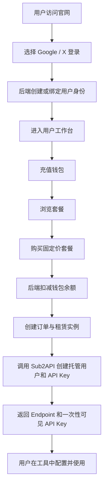
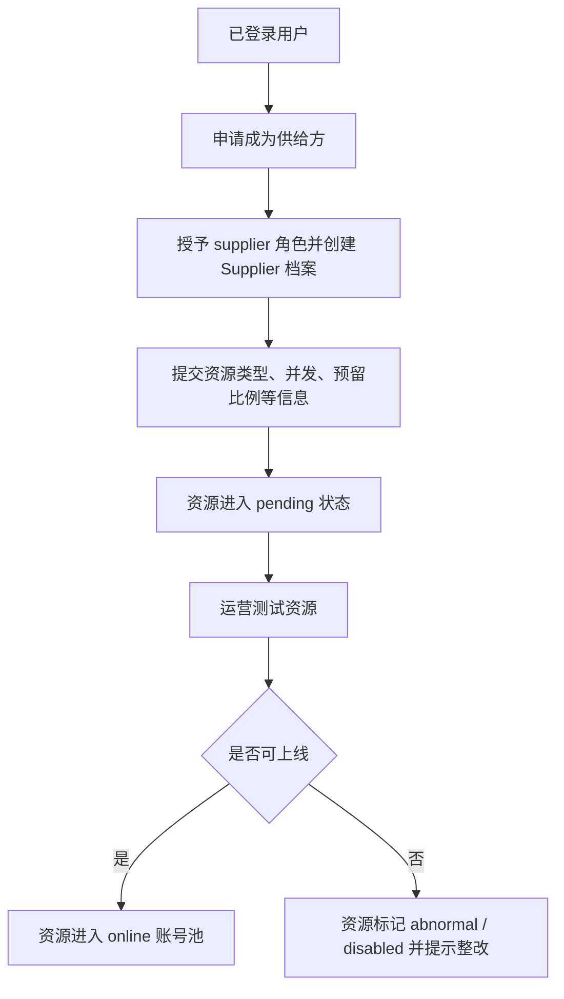
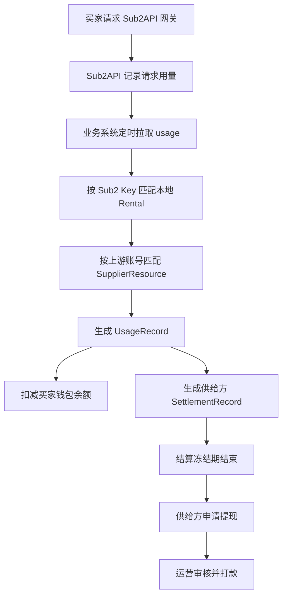

# 智算驿站需求文档

文档版本：v0.1
编写日期：2026-06-08
依据源码：`sub2share` main 分支，提交 `63d0433 chore: ignore upstream snapshot directory`
适用范围：智算驿站用户平台、运营后台、业务 API、Sub2API 适配层与后续产品演进

## 1. 项目概述

### 1.1 项目定位

智算驿站是一个面向「闲置 API / AI coding agent 额度租赁」的双侧平台。平台连接买家和供给方，让买家以更低成本获得 Codex、Claude Code、Gemini、Antigravity 等资源的可用接口额度，同时让供给方把暂时闲置的订阅额度、账号额度或资源能力出租并获得收益。

平台自身承担交易、鉴权、资源分配、密钥隔离、余额扣费、用量同步、分润结算、资源审核、运营监控等中台能力。Sub2API 作为网关内核，承担上游账号池调度、请求中转、API Key 管理和用量记录输出。

### 1.2 当前源码实现概况

当前仓库已经实现了一个 MVP 骨架：

| 模块 | 当前实现 |
| --- | --- |
| 用户端 | React + Vite，包含官网入口、OAuth 登录、工作台、套餐购买、密钥展示、钱包充值、供给方申请 |
| 运营后台 | React + Vite，包含后台登录、经营看板、用户列表、订单列表、资源池列表 |
| API 服务 | Fastify + Prisma + JWT，包含认证、钱包、商品、订单、租赁、供给、计费同步、后台接口 |
| 数据库 | Prisma + PostgreSQL，覆盖用户、钱包、商品、订单、租赁、供应商、用量、结算、提现、审计 |
| Sub2 对接 | 统一 `Sub2ApiClient`，支持托管用户、API Key 创建、Key 启停、用量拉取 |
| 部署 | pnpm workspace、Docker Compose、API/Web/Admin Dockerfile、nginx SPA 配置 |

当前代码更接近「可验证业务闭环的 MVP」，还不是完整生产系统。支付仍为 mock，供给资源审核与调度策略较轻，测试脚本为占位，生产级可靠性能力需要补强。

### 1.3 仓库结构

```text
sub2share/
├─ sub2/                  # Sub2API 网关内核对接区
│  ├─ adapter-notes/       # 业务对象与 Sub2API 对象映射说明
│  ├─ scripts/             # 同步上游与本地启动脚本
│  └─ README.md
├─ user/                  # 智算驿站业务平台 monorepo
│  ├─ apps/
│  │  ├─ api/              # Fastify 业务 API
│  │  ├─ web/              # 买家端 / 供给方端 React 应用
│  │  └─ admin/            # 运营后台 React 应用
│  ├─ packages/
│  │  ├─ shared/           # 共享类型、枚举、常量
│  │  └─ ui/               # 共享 UI 包
│  ├─ prisma/              # Prisma schema、迁移、seed
│  ├─ docker/              # Dockerfile 与 nginx 配置
│  └─ scripts/             # 本地启动与构建脚本
└─ docs/                  # 后续产品、技术、设计、验收文档
```

## 2. 产品目标

### 2.1 短期目标

1. 跑通「登录 -> 充值 -> 购买套餐 -> 开通租赁 -> 获取 Endpoint 和 API Key -> 产生用量 -> 扣费 -> 供给方分润」闭环。
2. 让买家可以自助管理租赁密钥、余额和订单。
3. 让供给方可以提交资源，并能看到资源状态与待结算收益。
4. 让运营人员可以查看用户、订单、资源池、核心经营指标，并执行基础运营动作。
5. 让业务系统与 Sub2API 保持清晰边界，通过统一 Adapter 对接。

### 2.2 中期目标

1. 将 mock 充值升级为真实支付链路。
2. 引入供给资源测试、评级、上线、限流、故障下线、收益结算和提现审核。
3. 支持更多套餐形态：按量计费、日租、周租、月租、并发增强包、请求包、余额包。
4. 建立完整对账能力：订单账、钱包账、用量账、供给方结算账、支付渠道账。
5. 引入自动化任务：用量同步、租赁到期、低余额限制、结算解冻、资源健康检查。

### 2.3 长期目标

1. 构建可持续扩展的多资源交易市场。
2. 支持多地区、多币种、多支付渠道、多上游网关。
3. 支持企业客户、团队账号、发票、合同、API SLA、风控策略和合规审计。
4. 形成供给质量评分体系，让调度策略自动偏向稳定、高性价比资源。

## 3. 用户角色与权限

### 3.1 角色定义

| 角色 | 源码枚举 | 说明 |
| --- | --- | --- |
| 买家 | `buyer` | 默认用户角色，可浏览套餐、充值、购买、管理租赁 |
| 供给方 | `supplier` | 可提交闲置资源、查看资源状态和结算 |
| 运营 | `operator` | 可访问运营后台、查看数据、触发计费同步 |
| 管理员 | `admin` | 最高权限，拥有运营权限，并可用于系统初始化和管理 |

### 3.2 当前鉴权实现

当前后端使用 JWT 作为访问令牌，`requireAuth` 校验登录状态，`requireRole` 校验角色权限。普通用户注册入口已关闭，用户侧登录仅保留 Google / X OAuth。管理员和运营人员可使用密码登录。

### 3.3 权限矩阵

| 功能 | 买家 | 供给方 | 运营 | 管理员 |
| --- | --- | --- | --- | --- |
| 浏览公开页 | 是 | 是 | 是 | 是 |
| OAuth 登录 | 是 | 是 | 可选 | 可选 |
| 密码登录后台 | 否 | 否 | 是 | 是 |
| 查看个人钱包 | 是 | 是 | 否 | 否 |
| 充值 | 是 | 是 | 否 | 否 |
| 购买套餐 | 是 | 是 | 否 | 否 |
| 查看个人租赁 | 是 | 是 | 否 | 否 |
| 暂停 / 恢复个人租赁 | 是 | 是 | 否 | 否 |
| 申请供给方 | 是 | 已是 | 否 | 否 |
| 提交供给资源 | 否 | 是 | 否 | 否 |
| 查看供给结算 | 否 | 是 | 否 | 否 |
| 查看运营看板 | 否 | 否 | 是 | 是 |
| 管理用户、订单、资源 | 否 | 否 | 是 | 是 |
| 触发用量同步 | 否 | 否 | 是 | 是 |

## 4. 核心业务流程

### 4.1 买家租赁流程



### 4.2 供给方入驻流程



### 4.3 用量计费与分润流程



### 4.4 订单失败补偿流程

当前订单购买在本地交易中先扣款、创建订单和租赁，再调用 Sub2API 开通 Key。如果 Sub2 开通失败，系统会：

1. 将订单状态改为 `failed`。
2. 将租赁状态改为 `closed`。
3. 将已扣金额退回用户钱包。
4. 记录一条 `refund` 钱包流水。

后续应补强失败原因记录、运营告警、用户可见错误解释、幂等重试和人工补开入口。

## 5. 功能需求

### 5.1 认证与账户

当前实现：

- 用户侧支持 Google OAuth 和 X OAuth。
- OAuth 成功后自动创建用户、默认授予 `buyer` 角色、创建钱包。
- OAuth 身份记录在 `UserIdentity` 表中。
- 密码注册入口禁用。
- 密码登录仅允许 `admin` 或 `operator` 角色。
- `/api/me` 返回当前用户基础信息、角色、钱包、供应商档案。

扩展需求：

| 编号 | 需求 | 优先级 |
| --- | --- | --- |
| AUTH-001 | OAuth state 从进程内 Map 迁移到 Redis，支持多实例部署和服务重启 | P0 |
| AUTH-002 | 支持 refresh token、访问令牌过期和无感刷新 | P0 |
| AUTH-003 | 后台登录增加失败次数限制、验证码或二次验证 | P1 |
| AUTH-004 | 用户可查看并解绑 OAuth 身份，至少保留一个可用登录方式 | P2 |
| AUTH-005 | 用户状态为 disabled / banned 时禁止访问核心业务接口 | P0 |
| AUTH-006 | 增加审计日志：登录成功、登录失败、OAuth 绑定、权限变化 | P1 |

验收标准：

- 未登录用户访问个人接口返回 401。
- 非运营角色访问后台 API 返回 403。
- OAuth 回调缺少 code/state 时能回到前端并显示错误。
- 多实例部署时 OAuth state 能跨实例正确校验。

### 5.2 钱包与交易流水

当前实现：

- 用户可查看钱包余额。
- 用户可发起 mock 充值。
- 充值金额低于 `MIN_RECHARGE_AMOUNT` 时拒绝。
- 购买套餐、开通失败退款、用量同步扣费都会生成钱包流水。

扩展需求：

| 编号 | 需求 | 优先级 |
| --- | --- | --- |
| WALLET-001 | 接入真实支付渠道，替换 mock 充值 | P0 |
| WALLET-002 | 钱包扣费、退款、冻结、解冻必须全量幂等 | P0 |
| WALLET-003 | 钱包余额不可被扣成负数，除非产品明确支持信用额度 | P0 |
| WALLET-004 | 增加钱包流水分页、筛选、导出 | P1 |
| WALLET-005 | 增加支付回调签名校验和回调重放防护 | P0 |
| WALLET-006 | 支持余额预警、低余额通知、自动暂停租赁策略 | P1 |
| WALLET-007 | 区分充值余额、赠送余额、冻结余额、可提现余额 | P2 |

账务规则：

1. 任何余额变化必须有对应 `WalletTransaction`。
2. `balanceAfter` 必须等于交易完成后的钱包可用余额。
3. 同一外部支付单或用量记录不得重复入账。
4. 退款金额不得超过原消费金额。
5. 资金状态变化必须在数据库事务中完成。

### 5.3 商品与套餐

当前实现：

- 商品表 `Product` 记录资源类型、计费模式、描述、状态。
- 价格表 `ProductPrice` 记录套餐 tier、固定价、周期、并发、请求量。
- 用户端只展示 `active` 商品和 `active` 价格。
- 当前订单购买只支持 fixed price 商品。
- seed 默认创建「Codex 标准租赁」月租商品。

扩展需求：

| 编号 | 需求 | 优先级 |
| --- | --- | --- |
| PRODUCT-001 | 后台可创建、编辑、上下架商品和价格 | P0 |
| PRODUCT-002 | 支持按量计费套餐 | P0 |
| PRODUCT-003 | 支持日租、周租、月租、请求包、并发包 | P1 |
| PRODUCT-004 | 支持按资源类型、模型、地区、等级配置不同价格 | P1 |
| PRODUCT-005 | 支持优惠券、折扣码、首单优惠、渠道价格 | P2 |
| PRODUCT-006 | 商品变更需保留历史版本，避免影响已购订单 | P1 |

### 5.4 订单与租赁

当前实现：

- 用户通过 `/api/orders` 创建订单。
- 后端校验商品价格状态和钱包余额。
- 创建订单、订单项、租赁、租赁限额。
- 调用 Sub2API 创建 API Key。
- 返回一次性明文 API Key。
- 用户可查看订单列表、租赁列表和租赁详情。
- 用户可暂停或恢复租赁，对应启停 Sub2 Key。

扩展需求：

| 编号 | 需求 | 优先级 |
| --- | --- | --- |
| ORDER-001 | 创建订单接口支持幂等键，防止重复点击重复扣款 | P0 |
| ORDER-002 | 订单状态流转需记录状态历史和失败原因 | P0 |
| ORDER-003 | API Key 明文只允许展示一次，刷新页面不可再取回 | P0 |
| ORDER-004 | 支持续租、升级、降级、加购请求量和并发 | P1 |
| ORDER-005 | 支持订单取消、退款申请、运营审核退款 | P1 |
| ORDER-006 | 租赁到期自动禁用 Sub2 Key 并更新状态 | P0 |
| ORDER-007 | 余额不足或欠费时自动限制 / 暂停租赁 | P0 |
| ORDER-008 | 支持重新生成 Key，并使旧 Key 失效 | P1 |

状态流转建议：

```text
订单：pending -> paid -> provisioning -> active
订单：pending -> cancelled
订单：provisioning -> failed -> refunded
订单：active -> refunding -> refunded
订单：active -> expired / closed

租赁：active -> low_balance -> limited -> suspended
租赁：active -> expired / refunded / closed
租赁：suspended -> active
```

### 5.5 Sub2API 适配

当前 `Sub2ApiClient` 已封装：

- 创建托管买家用户。
- 登录托管用户。
- 创建自定义 API Key。
- 启用 / 禁用 Key。
- 使用管理员 token 或管理员账号登录。
- 拉取 usage 列表并转换成本地 `Sub2UsageRecord`。
- 通过 hash 生成托管用户邮箱和密码。

扩展需求：

| 编号 | 需求 | 优先级 |
| --- | --- | --- |
| SUB2-001 | 明确 Sub2API 真实接口契约，并补充适配层集成测试 | P0 |
| SUB2-002 | 设置并发、RPM、TPM、请求量、消费上限等限额必须真正下发到 Sub2 | P0 |
| SUB2-003 | Sub2 调用失败需分类：鉴权失败、网络失败、参数失败、资源不足、限流 | P0 |
| SUB2-004 | Sub2 操作需要重试、退避、超时和熔断 | P1 |
| SUB2-005 | 建立 Sub2Binding 的完整对象映射和反查能力 | P1 |
| SUB2-006 | 支持资源池健康状态同步和账号上下线 | P1 |
| SUB2-007 | 支持多个 Sub2 网关实例或多个上游网关 | P2 |

边界约束：业务模块不得直接拼接 Sub2API URL。所有 Sub2 调用必须通过统一适配层完成。适配层负责协议转换、错误归一、重试策略、日志脱敏和指标上报。

### 5.6 用量计费

当前实现：

- 运营或管理员可调用 `/api/billing/sync-sub2-usage` 触发一次用量同步。
- 同步任务从 Sub2 拉取 usage。
- 根据 `sub2KeyId` 匹配本地租赁。
- 根据 `upstreamAccountId` 匹配供应商资源。
- 创建 `UsageRecord`。
- 扣买家钱包。
- 创建供应商 `SettlementRecord`。

当前高风险点：`usageRecord.upsert` 使用 `update: {}`，但后续扣钱包和创建结算没有基于「是否新建」做防重。若同一 Sub2 usage 被重复同步，可能产生重复扣费和重复结算。生产前必须修复。

扩展需求：

| 编号 | 需求 | 优先级 |
| --- | --- | --- |
| BILLING-001 | 用量同步必须端到端幂等，重复同步不重复扣款、不重复结算 | P0 |
| BILLING-002 | 保存同步 cursor、同步批次、同步开始/结束时间、错误信息 | P0 |
| BILLING-003 | 支持定时自动同步，而不是仅手动触发 | P0 |
| BILLING-004 | 计费规则应从商品价格或租赁配置读取，而不是仅使用全局折扣率 | P0 |
| BILLING-005 | 买家扣费失败时应触发低余额、限制、暂停策略 | P0 |
| BILLING-006 | 支持用量争议、用量忽略、退款、人工调整 | P1 |
| BILLING-007 | 生成账单周期报表：日账单、月账单、供应商账单 | P1 |
| BILLING-008 | 对账任务需比较 Sub2 usage、钱包流水、结算记录一致性 | P1 |

### 5.7 供给方与资源池

当前实现：

- 普通用户可申请供给方。
- 系统授予 `supplier` 角色并创建 `Supplier` 记录。
- 供给方可提交资源类型、最大并发、预留比例、日封顶等信息。
- 新资源默认进入 `pending` 状态。
- 供给方可查看自己的资源和结算记录。
- 管理后台可查看资源池列表。

扩展需求：

| 编号 | 需求 | 优先级 |
| --- | --- | --- |
| SUPPLIER-001 | 供给方申请需要资料字段：联系人、收款方式、资源说明、风险确认 | P0 |
| SUPPLIER-002 | 资源提交需要安全地登记上游账号或接入方式，敏感凭据必须加密 | P0 |
| SUPPLIER-003 | 运营可测试资源、分级、上线、暂停、禁用 | P0 |
| SUPPLIER-004 | 资源状态变更需有操作记录和原因 | P1 |
| SUPPLIER-005 | 建立 L0-L4 评级规则，影响分成比例和调度权重 | P1 |
| SUPPLIER-006 | 支持资源日封顶、预留比例、最大并发、异常自动下线 | P1 |
| SUPPLIER-007 | 供给方可查看收益明细、结算状态、可提现金额 | P1 |
| SUPPLIER-008 | 支持提现申请、运营审核、打款记录和驳回原因 | P0 |

资源状态定义：

| 状态 | 说明 |
| --- | --- |
| `pending` | 已提交，等待审核 |
| `testing` | 运营或系统正在测试 |
| `online` | 已上线，可参与调度 |
| `busy` | 临时繁忙，暂不分配新流量 |
| `paused` | 供给方或运营主动暂停 |
| `abnormal` | 监控发现异常 |
| `disabled` | 禁用，不再使用 |

### 5.8 运营后台

当前实现：

- 管理员登录。
- 经营看板：用户数、有效租赁、在线资源、待提现、用量数、GMV、供给方收益。
- 用户列表。
- 订单列表。
- 资源池列表。

扩展需求：

| 编号 | 需求 | 优先级 |
| --- | --- | --- |
| ADMIN-001 | 用户详情页：角色、状态、钱包、订单、租赁、OAuth 身份、审计记录 | P0 |
| ADMIN-002 | 订单详情页：支付、扣款、租赁、Sub2 Key、失败原因、退款记录 | P0 |
| ADMIN-003 | 资源详情页：供给方、账号状态、测试结果、用量、结算、操作记录 | P0 |
| ADMIN-004 | 支持用户禁用 / 解禁 / 角色调整 | P1 |
| ADMIN-005 | 支持资源审核、上线、暂停、禁用 | P0 |
| ADMIN-006 | 支持提现审核和打款标记 | P0 |
| ADMIN-007 | 支持手动重试 Sub2 开通、用量同步、账务修复 | P1 |
| ADMIN-008 | 后台表格支持分页、筛选、搜索、导出 | P1 |
| ADMIN-009 | 所有后台操作写入 AuditLog | P0 |

### 5.9 用户端体验

当前用户端是单页 React 应用，包含公开首页与登录后工作台。登录后有总览、套餐、密钥、钱包、供给五个视图。

扩展需求：

| 编号 | 需求 | 优先级 |
| --- | --- | --- |
| WEB-001 | 购买前清晰展示套餐限制、计费规则、退款规则和到期策略 | P0 |
| WEB-002 | API Key 一次性展示时给出复制确认、已复制状态和安全提示 | P0 |
| WEB-003 | 租赁详情页展示用量、余额消耗、到期时间、限额、状态历史 | P1 |
| WEB-004 | 钱包页展示充值记录、消费记录、退款记录、筛选和分页 | P1 |
| WEB-005 | 供给方工作台展示资源审核进度、收益、提现、问题提示 | P1 |
| WEB-006 | 错误提示要可理解，避免直接展示后端内部错误 | P0 |
| WEB-007 | 支持移动端核心流程：登录、充值、购买、复制 Key、查看余额 | P1 |

## 6. 数据模型需求

### 6.1 现有核心实体

| 实体 | 说明 |
| --- | --- |
| `User` | 平台用户 |
| `UserIdentity` | OAuth 身份绑定 |
| `UserRole` | 用户角色 |
| `WalletAccount` | 钱包账户 |
| `WalletTransaction` | 钱包流水 |
| `Product` | 商品 |
| `ProductPrice` | 商品价格 / 套餐 |
| `Order` | 订单 |
| `OrderItem` | 订单项 |
| `Rental` | 租赁实例 |
| `RentalLimit` | 租赁限额 |
| `ApiKey` | 本地 API Key 记录，存 hash 和 prefix |
| `Supplier` | 供给方 |
| `SupplierResource` | 供给资源 |
| `UsageRecord` | 用量记录 |
| `SettlementRecord` | 供给方结算记录 |
| `Withdrawal` | 提现申请 |
| `Sub2Binding` | 本地对象与 Sub2 对象绑定 |
| `AuditLog` | 审计日志 |

### 6.2 建议新增实体

| 实体 | 用途 | 优先级 |
| --- | --- | --- |
| `PaymentOrder` | 记录第三方支付单、渠道、状态、回调数据 | P0 |
| `BillingSyncCursor` | 保存用量同步游标和批次状态 | P0 |
| `OrderStatusHistory` | 记录订单状态流转和失败原因 | P0 |
| `RentalStatusHistory` | 记录租赁状态流转和操作来源 | P1 |
| `SupplierResourceCredential` | 加密保存供给资源接入凭据 | P0 |
| `ResourceHealthCheck` | 保存资源健康检查结果 | P1 |
| `Notification` | 站内通知、余额提醒、审核结果通知 | P2 |
| `Invoice` | 企业客户发票需求 | P2 |

### 6.3 数据一致性要求

1. 钱包余额与钱包流水必须可对账。
2. 订单金额与订单项金额必须可对账。
3. 租赁实例必须能反查对应订单、商品、用户、Sub2 Key。
4. 用量记录必须能反查租赁、买家、供应商资源和结算记录。
5. 结算记录必须能反查对应用量，人工调整也必须记录原因。
6. 所有敏感凭据只能保存密文或 hash，不得保存明文 API Key。

## 7. API 需求

### 7.1 当前 API 清单

| 方法 | 路径 | 说明 |
| --- | --- | --- |
| GET | `/health` | 服务健康检查 |
| POST | `/api/auth/register` | 已禁用，返回密码注册关闭 |
| POST | `/api/auth/login` | 管理员 / 运营密码登录 |
| GET | `/api/auth/oauth/:provider/start` | OAuth 开始 |
| GET | `/api/auth/oauth/:provider/callback` | OAuth 回调 |
| GET | `/api/me` | 当前用户信息 |
| GET | `/api/wallet` | 钱包信息 |
| POST | `/api/wallet/recharge` | mock 充值 |
| GET | `/api/wallet/transactions` | 钱包流水 |
| GET | `/api/products` | 商品列表 |
| POST | `/api/orders` | 创建订单并开通租赁 |
| GET | `/api/orders` | 当前用户订单 |
| GET | `/api/rentals` | 当前用户租赁 |
| GET | `/api/rentals/:id` | 租赁详情 |
| POST | `/api/rentals/:id/suspend` | 暂停租赁 |
| POST | `/api/rentals/:id/resume` | 恢复租赁 |
| POST | `/api/supplier/apply` | 申请供给方 |
| GET | `/api/supplier/profile` | 供给方档案 |
| POST | `/api/supplier/resources` | 提交供给资源 |
| GET | `/api/supplier/resources` | 供给资源列表 |
| GET | `/api/supplier/settlements` | 供给方结算 |
| POST | `/api/billing/sync-sub2-usage` | 手动触发用量同步 |
| GET | `/api/usages` | 当前用户用量 |
| GET | `/api/admin/dashboard` | 后台看板 |
| GET | `/api/admin/users` | 后台用户列表 |
| GET | `/api/admin/orders` | 后台订单列表 |
| GET | `/api/admin/resources` | 后台资源列表 |

### 7.2 API 统一规范

成功响应：

```json
{
  "ok": true,
  "data": {},
  "requestId": "..."
}
```

错误响应：

```json
{
  "ok": false,
  "error": {
    "code": "error_code",
    "message": "Human readable message",
    "details": {}
  },
  "requestId": "..."
}
```

规范要求：

1. 所有写接口支持幂等设计或明确说明不能重复提交。
2. 所有列表接口支持分页。
3. 后台列表接口支持筛选和搜索。
4. 错误 code 稳定，不随文案变化。
5. requestId 贯穿日志、错误、审计和用户反馈。

### 7.3 建议新增 API

| 方法 | 路径 | 说明 | 优先级 |
| --- | --- | --- | --- |
| POST | `/api/payments/recharge` | 创建真实充值支付单 | P0 |
| POST | `/api/payments/webhook/:provider` | 支付渠道回调 | P0 |
| POST | `/api/orders/:id/cancel` | 取消订单 | P1 |
| POST | `/api/orders/:id/refund` | 申请退款 | P1 |
| POST | `/api/rentals/:id/rotate-key` | 轮换 API Key | P1 |
| POST | `/api/rentals/:id/renew` | 续租 | P1 |
| GET | `/api/rentals/:id/usages` | 租赁用量明细 | P1 |
| GET | `/api/admin/users/:id` | 用户详情 | P0 |
| PATCH | `/api/admin/users/:id/status` | 调整用户状态 | P1 |
| GET | `/api/admin/orders/:id` | 订单详情 | P0 |
| GET | `/api/admin/resources/:id` | 资源详情 | P0 |
| POST | `/api/admin/resources/:id/test` | 测试资源 | P0 |
| PATCH | `/api/admin/resources/:id/status` | 调整资源状态 | P0 |
| GET | `/api/admin/settlements` | 结算列表 | P0 |
| POST | `/api/admin/withdrawals/:id/approve` | 审核通过提现 | P0 |
| POST | `/api/admin/withdrawals/:id/reject` | 驳回提现 | P0 |

## 8. 非功能需求

### 8.1 安全

1. JWT secret、Sub2 管理员凭据、OAuth client secret、支付密钥必须通过环境变量配置。
2. API Key 明文只在创建成功时返回一次，本地只保存 hash 和 prefix。
3. 供给方上游账号凭据必须加密保存，禁止明文入库。
4. 后台操作必须鉴权、授权、审计。
5. 支付回调必须校验签名、时间戳和幂等键。
6. 敏感日志必须脱敏，禁止记录完整 token、完整 API Key、支付密钥。
7. CORS 在生产环境应收敛到白名单域名，不应继续使用任意 origin。

### 8.2 可靠性

1. 订单创建、钱包扣费、退款、用量计费必须具备幂等性。
2. Sub2API 调用失败需要可重试和可人工修复。
3. 定时任务需要保存执行记录，失败后可继续从 cursor 恢复。
4. 服务应提供健康检查和数据库连接检查。
5. 关键异步任务应支持告警。

### 8.3 性能

1. 常用列表接口必须分页，默认不超过 100 条。
2. 后台 dashboard 聚合应避免高频全表扫描，数据量增长后可引入预聚合。
3. 用量同步应批处理，避免单条 usage 逐条慢速同步导致积压。
4. 数据库应为高频查询字段增加索引，例如 `createdAt`、`status`、`userId`、`supplierResourceId`。

### 8.4 可观测性

1. 所有请求携带 requestId。
2. 记录关键业务日志：订单创建、扣费、退款、Sub2 开通、用量同步、结算、提现。
3. 暴露核心指标：请求量、错误率、订单成功率、Sub2 开通成功率、用量同步延迟、扣费失败数。
4. 后台看板应展示任务健康度和最近同步时间。

### 8.5 合规与风控

1. 明确服务条款、隐私政策、退款政策和供给方协议。
2. 供给方资源来源需要合规确认。
3. 对异常高频调用、欠费调用、疑似滥用账号进行限制。
4. 用户封禁、资源禁用、退款拒绝等操作需要记录原因。
5. 生产环境应补充 LICENSE 和第三方依赖合规审查。

## 9. 部署与环境

### 9.1 当前依赖

- Node.js >= 18，当前本机验证为 Node 22。
- pnpm，仓库声明 `pnpm@9.15.0`。
- PostgreSQL。
- Redis。
- Docker / Docker Compose。

### 9.2 核心环境变量

| 变量 | 说明 |
| --- | --- |
| `DATABASE_URL` | PostgreSQL 连接 |
| `REDIS_URL` | Redis 连接 |
| `JWT_ACCESS_SECRET` | JWT 签名密钥 |
| `APP_PUBLIC_URL` | 用户端公开地址 |
| `SUB2_BASE_URL` | Sub2API 服务地址 |
| `SUB2_ADMIN_TOKEN` | Sub2 管理员 token |
| `SUB2_ADMIN_EMAIL` | Sub2 管理员邮箱 |
| `SUB2_ADMIN_PASSWORD` | Sub2 管理员密码 |
| `SUB2_PUBLIC_ENDPOINT` | 返回给买家的网关 Endpoint |
| `GOOGLE_OAUTH_CLIENT_ID` | Google OAuth client id |
| `GOOGLE_OAUTH_CLIENT_SECRET` | Google OAuth secret |
| `GOOGLE_OAUTH_REDIRECT_URI` | Google OAuth 回调 |
| `X_OAUTH_CLIENT_ID` | X OAuth client id |
| `X_OAUTH_CLIENT_SECRET` | X OAuth secret |
| `X_OAUTH_REDIRECT_URI` | X OAuth 回调 |
| `MIN_RECHARGE_AMOUNT` | 最小充值金额 |
| `MIN_WITHDRAWAL_AMOUNT` | 最小提现金额 |
| `DEFAULT_DISCOUNT_RATE` | 默认折扣率 |

### 9.3 本地启动需求

1. `docker compose up -d postgres redis` 启动依赖服务。
2. `pnpm install` 安装依赖。
3. `pnpm db:generate` 生成 Prisma client。
4. `pnpm db:migrate` 应用迁移。
5. `pnpm db:seed` 初始化管理员和基础商品。
6. `pnpm dev` 并行启动 API、用户端、后台。

### 9.4 生产部署需求

1. API、用户端、后台独立容器部署。
2. API 使用生产环境变量和外部 PostgreSQL/Redis。
3. Web/Admin 使用 nginx 托管静态产物，并反向代理 `/api/`。
4. 数据迁移需作为发布流程的一部分，有回滚预案。
5. Sub2API 网关可以独立部署和升级。

## 10. 运营指标

### 10.1 核心经营指标

| 指标 | 说明 |
| --- | --- |
| 注册用户数 | 平台累计用户 |
| 活跃买家数 | 近期有登录或调用行为的用户 |
| 有效租赁数 | 当前 active 租赁 |
| GMV | 用户购买和用量消费总额 |
| 供给方收益 | 已产生的供应商收入 |
| 在线资源数 | 状态为 online 的资源 |
| 订单成功率 | 成功开通订单 / 总订单 |
| Sub2 开通成功率 | Sub2 Key 创建成功 / 创建尝试 |
| 用量同步延迟 | Sub2 usage 产生到本地入账的延迟 |
| 扣费失败数 | 因余额不足或账务异常导致的扣费失败 |

### 10.2 风控指标

- 单用户短时间请求突增。
- 单 Key 错误率突增。
- 供给资源失败率突增。
- 资源成本与收费不匹配。
- 钱包余额为负。
- 重复 usage 入账。
- 订单开通失败率异常。

## 11. 当前缺口与优先级建议

### 11.1 P0 生产前必须补齐

1. 用量同步幂等，避免重复扣费和重复结算。
2. 真实支付链路，替换 mock 充值。
3. 订单创建幂等，避免重复下单和重复扣款。
4. 租赁到期与欠费自动禁用 Key。
5. OAuth state 改为 Redis 或其他共享存储。
6. Sub2API 真实接口契约验证与失败重试。
7. 后台资源审核、上线、禁用能力。
8. 钱包余额不可负与账务对账。
9. 基础测试套件：API 单元测试、关键流程集成测试、用量同步幂等测试。
10. 生产 CORS 白名单、敏感信息脱敏、后台操作审计。

### 11.2 P1 上线后快速迭代

1. 续租、升级、降级、Key 轮换。
2. 用户租赁详情和用量图表。
3. 供给方收益明细和提现。
4. 后台详情页、筛选、导出。
5. 资源健康检查和自动下线。
6. 定时账单与对账报表。
7. 通知系统：余额低、到期、审核结果、提现状态。

### 11.3 P2 长期增强

1. 企业团队、子账号、权限分组。
2. 多币种、多支付渠道。
3. 发票、合同、税务资料。
4. 多网关、多地域调度。
5. 动态定价与资源竞价。
6. 供应商评级和推荐算法。

## 12. 验收方案

### 12.1 MVP 闭环验收

1. 使用 Google 或 X OAuth 登录后，系统自动创建用户、角色和钱包。
2. 用户充值 20 美元后，钱包余额增加并产生充值流水。
3. 用户购买 Codex 标准月租套餐后，钱包扣款 20 美元。
4. 系统创建订单、订单项、租赁和租赁限额。
5. 系统调用 Sub2API 创建 API Key，并返回 Endpoint 和一次性明文 Key。
6. 用户刷新页面后，明文 Key 不再展示，但租赁记录仍可查看。
7. 用户可暂停租赁，Sub2 Key 被禁用，本地租赁状态变为 `suspended`。
8. 用户可恢复租赁，Sub2 Key 被启用，本地租赁状态变为 `active`。
9. 触发用量同步后，本地生成 usage、扣钱包、生成供应商结算。
10. 管理后台可看到用户数、有效租赁、订单、资源池等数据。

### 12.2 幂等验收

1. 重复提交同一订单请求，不得重复扣款。
2. 重复接收同一支付回调，不得重复充值。
3. 重复同步同一 usage，不得重复扣费。
4. Sub2API 创建 Key 成功但本地保存失败时，系统可以通过补偿任务恢复一致性。

### 12.3 安全验收

1. 非运营用户无法访问 `/api/admin/*`。
2. 普通用户无法查看其他用户订单、钱包、租赁。
3. 日志中不出现完整 API Key、JWT、OAuth secret、Sub2 管理员凭据。
4. 禁用用户无法继续购买或使用工作台关键功能。
5. 生产环境 CORS 不允许任意来源。

## 13. 测试需求

### 13.1 后端测试

| 测试类型 | 覆盖内容 |
| --- | --- |
| 单元测试 | 错误处理、鉴权、金额计算、Sub2 usage normalize |
| 集成测试 | 注册 / 登录、钱包、订单、租赁、供给方、后台 API |
| 事务测试 | 扣款失败、Sub2 开通失败、退款补偿 |
| 幂等测试 | 支付回调、订单创建、用量同步 |
| 权限测试 | 买家、供给方、运营、管理员权限边界 |

### 13.2 前端测试

| 测试类型 | 覆盖内容 |
| --- | --- |
| 组件测试 | 登录弹窗、套餐卡、钱包、租赁列表、后台表格 |
| 流程测试 | 登录、充值、购买、复制 Key、暂停 / 恢复 |
| 响应式测试 | 手机、平板、桌面关键页面 |
| 错误态测试 | 余额不足、OAuth 失败、Sub2 开通失败、网络错误 |

### 13.3 端到端测试

建议使用测试数据库和 mock Sub2API，覆盖：

1. 买家完整购买流程。
2. Sub2 开通失败退款流程。
3. 用量同步扣费流程。
4. 供给方申请和资源提交流程。
5. 管理员查看 dashboard 和资源池流程。

## 14. 里程碑规划

### 14.1 M1：MVP 稳定化

目标：让现有闭环安全、可重复验证、不会出现明显账务错误。

范围：

- 修复用量同步重复扣费。
- 增加订单幂等。
- 增加真实测试套件。
- 增加后台资源审核基础能力。
- 增加租赁到期和欠费禁用任务。
- OAuth state 改为 Redis。

### 14.2 M2：支付与结算上线

目标：支持真实资金流入和供给方提现。

范围：

- 接入支付渠道。
- 支付回调和充值入账。
- 供应商收益可提现。
- 提现审核与打款记录。
- 钱包与支付对账。

### 14.3 M3：资源池运营

目标：提升供给资源质量和平台运营效率。

范围：

- 资源测试、评级、上线、暂停、禁用。
- 资源健康检查。
- 调度权重与分润比例。
- 后台详情页、筛选、导出。
- 异常告警。

### 14.4 M4：商业化增强

目标：扩展套餐和客户类型。

范围：

- 按量计费、请求包、并发包。
- 团队账号。
- 发票和企业客户。
- 多支付渠道。
- 多网关和多资源类型。

## 15. 风险与应对

| 风险 | 影响 | 应对 |
| --- | --- | --- |
| 用量重复同步导致重复扣费 | 资金错误、用户投诉 | P0 修复幂等，增加唯一账务流水 |
| Sub2API 接口与适配层假设不一致 | 开通失败或限额失效 | 补充契约测试和 mock server |
| 支付回调重复或伪造 | 资金损失 | 签名校验、幂等键、回调日志 |
| 供给资源不稳定 | 用户调用失败 | 健康检查、自动下线、评级调度 |
| OAuth state 进程内存储 | 多实例登录失败 | Redis state 存储 |
| 缺少测试 | 回归风险高 | 建立核心流程测试套件 |
| API Key 泄露 | 用户和平台风险 | 一次性展示、hash 存储、Key 轮换 |
| 钱包负余额 | 账务失真 | 事务内余额校验和低余额限制 |

## 16. 源码到需求映射

| 源码位置 | 当前职责 | 需求章节 |
| --- | --- | --- |
| `user/apps/api/src/main.ts` | API 服务入口与路由注册 | 5、7 |
| `user/apps/api/src/modules/auth/routes.ts` | OAuth、后台登录、当前用户 | 5.1 |
| `user/apps/api/src/modules/wallet/routes.ts` | 钱包和 mock 充值 | 5.2 |
| `user/apps/api/src/modules/products/routes.ts` | 商品查询 | 5.3 |
| `user/apps/api/src/modules/orders/routes.ts` | 下单、扣款、开通租赁 | 5.4 |
| `user/apps/api/src/modules/rentals/routes.ts` | 租赁查询、暂停、恢复 | 5.4 |
| `user/apps/api/src/modules/suppliers/routes.ts` | 供给方申请、资源提交 | 5.7 |
| `user/apps/api/src/modules/billing/routes.ts` | 手动触发用量同步、用量查询 | 5.6 |
| `user/apps/api/src/jobs/sync-sub2-usage.ts` | 用量入账、扣费、结算 | 5.6 |
| `user/apps/api/src/integrations/sub2/client.ts` | Sub2API 适配层 | 5.5 |
| `user/apps/api/src/modules/admin/routes.ts` | 后台 dashboard 和列表 | 5.8 |
| `user/apps/web/src/app/main.tsx` | 用户端工作台 | 5.9 |
| `user/apps/admin/src/app/main.tsx` | 运营后台 | 5.8 |
| `user/prisma/schema.prisma` | 数据模型 | 6 |
| `sub2/adapter-notes/object-mapping.md` | 本地对象与 Sub2 对象映射 | 5.5 |

## 17. 结论

当前源码已经具备清晰的产品方向和完整的 MVP 雏形。最有价值的部分是：业务系统与 Sub2API 的边界清晰，核心实体建模较完整，买家购买租赁和用量分润链路已经有端到端实现。

下一阶段不宜优先扩大功能面，而应先稳住交易和账务核心：幂等、支付、用量同步、到期禁用、后台审核、测试覆盖。这些能力补齐后，智算驿站才能从演示型 MVP 进入可上线试运营状态。

## 18. 2026-06-09 需求增补：管理员入口与 OpenAI/Codex 反代

本节基于线上可用性复查和二次修复追加，优先级高于前文中已经过期的“仅 OAuth 登录”描述。

### 18.1 管理员入口 P0 需求

目标：管理员能够从后台集中管理所有用户情况、共享情况、余额情况和售出情况。

已实现范围：

- 用户管理：查看用户、创建用户、查看用户详情、启用/禁用/封禁用户。
- 钱包管理：查看钱包、查看钱包流水、管理员手动调整余额。
- 销售管理：查看订单、销售聚合、按商品聚合收入与数量。
- 租赁管理：查看租赁、查看 Sub2 绑定关系、追踪用户购买后的 Key 开通状态。
- 共享资源管理：查看资源池、资源上线/下线/异常状态调整。
- 结算管理：查看结算记录。
- 反代状态管理：查看 Sub2API 健康、OpenAI/Codex 默认分组、上游账号状态、阻断原因，并可触发上游账号刷新、账号测试、OpenAI refresh token 应用和端到端反代自检。
- 操作审计：查看管理员关键操作记录，覆盖用户、余额、共享资源和 Sub2 反代运维动作。
- 安全要求：后台响应不得暴露密码 hash、本地 key hash、Sub2 key hash。

后续 P0 补强：

| 编号 | 需求 | 验收标准 |
| --- | --- | --- |
| ADMIN-001 | 后台操作审计 | 已覆盖创建用户、调整余额、用户状态、资源状态、Sub2 反代运维；审计列表已支持分页、搜索和动作筛选 |
| ADMIN-002 | 后台分页筛选 | 用户、钱包、售出情况、订单、租赁、资源、结算、审计列表已支持分页、搜索和状态/类型筛选 |
| ADMIN-003 | 后台导出 | 用户、钱包、钱包流水、用量、商品、订单、租赁、反代请求、资源、结算、提现、审计支持按当前筛选条件导出全部 CSV |
| ADMIN-004 | 管理员二次验证 | 高风险动作如大额调账、封禁、删除 Key 需要二次确认或二次验证 |
| ADMIN-005 | 管理员最小权限 | operator 可查看和处理运营动作，admin 才能创建用户和调账 |

### 18.2 用户登录兼容 P0 需求

目标：当生产环境尚未配置 Google/X OAuth 时，普通用户仍可完成注册、登录和购买闭环。

已实现范围：

- `GET /api/auth/capabilities` 返回当前认证能力。
- 如果 Google/X OAuth 均未配置，则自动启用密码注册和密码登录。
- 如果任一 OAuth Provider 已配置，则普通用户默认走 OAuth，管理员/运营员仍可密码登录。
- disabled/banned 用户禁止登录。

验收标准：

- 无 OAuth 配置时，用户端显示密码登录/注册入口。
- 有 OAuth 配置时，用户端显示已配置的 OAuth 入口。
- 后台登录不受普通用户 OAuth 策略影响。

### 18.3 Sub2API OpenAI/Codex 反代 P0 需求

目标：业务系统售出的 API Key 必须是可直接用于 OpenAI/Codex 兼容接口的 Sub2API Key。

已实现范围：

- 新增 `SUB2_DEFAULT_GROUP_ID`，线上配置为 `2`。
- 托管用户创建时写入 `allowed_groups:[2]`。
- Key 创建时写入 `group_id:2`。
- 已存在托管用户再次购买时补齐允许分组。
- 托管用户 Sub2 内部余额设置为高额度，实际扣费以业务钱包为准。

网关侧配置要求：

| 对象 | 要求 |
| --- | --- |
| `groups` | 必须存在 active 的 OpenAI/Codex 分组，线上为 `oai` / `id=2` |
| `user_allowed_groups` | 每个托管用户必须包含 `group_id=2` |
| `api_keys` | 每个业务售出的 Sub2 Key 必须写入 `group_id=2` |
| `account_groups` | 至少一个 active OpenAI 上游账号必须绑定到 `group_id=2` |
| OpenAI 上游账号 | OAuth/API Key 凭据必须有效，不能是 revoked、expired、error |
| 管理员可观测性 | 后台必须能展示网关健康、分组状态、账号状态、阻断原因、刷新动作、上游账号测试结果、凭据应用结果和端到端自检结果 |

验收标准：

- 购买成功后，本地订单和租赁为 `active`。
- Sub2 Key `group_id` 不为空，并等于默认 OpenAI/Codex 分组。
- `GET /v1/models` 返回 200 和模型列表。
- `POST /v1/responses` 返回真实 response，而不是 `account_select_failed`、`INSUFFICIENT_BALANCE`、`upstream authentication failed`。
- 后台端到端自检创建的临时 Key 必须在测试完成后被禁用，且响应不得返回明文 Key。
- 后台应用 OpenAI refresh token 时不得保存或回显 token，只允许转发给 Sub2API 并返回脱敏结果。

### 18.4 当前线上验收状态

| 项目 | 状态 |
| --- | --- |
| 业务 API/Web/Admin/Sub2API 健康检查 | 通过 |
| 密码注册/登录兼容 | 通过 |
| 管理员后台入口 | 通过 |
| 管理员用户/钱包/销售/订单/租赁/资源/结算查看 | 通过 |
| 管理员余额调整 | 通过 |
| 购买 Codex 月租并生成 Sub2 Key | 通过 |
| Key 绑定 `oai` 分组 | 通过 |
| `/v1/models` | 通过 |
| 后台反代状态页 | 通过，显示 `openai_group_has_no_active_accounts` |
| 后台上游账号刷新动作 | 通过，当前返回 OpenAI 会话结束的失败摘要 |
| 后台上游账号测试动作 | 通过，当前返回 OpenAI 401 `token_invalidated` |
| 后台端到端自检动作 | 通过，临时 Key 已禁用，`/v1/models` 通过，`/v1/responses` 因无 active 上游账号返回 503 |
| 后台 OpenAI refresh token 应用动作 | 通过无效 token 合约测试；等待有效 token 完成真实修复 |
| 后台操作审计 | 通过，已记录 Sub2 账号测试动作并可在审计页查看 |
| 后台列表分页/筛选/搜索 | 通过，用户、钱包、售出情况、订单、租赁、资源、结算、审计均返回分页元信息并接入后台控件 |
| 后台余额流水入口 | 通过，已接入钱包流水分页、类型筛选、搜索和 CSV 导出 |
| 后台筛选 CSV 导出 | 通过，用户、钱包、钱包流水、售出情况、用量、商品、订单、租赁、反代请求、资源、结算、提现、审计均已接入 |
| 后台用户详情 | 通过，用户列表可打开详情，集中查看钱包、订单、租赁、API Key、供给资源、提现和登录身份 |
| 后台订单详情 | 通过，订单/售出列表可打开详情，集中查看订单项、租赁交付、Sub2 Key、API Key 和限制 |
| 后台共享资源详情 | 通过，资源列表可打开详情，集中查看供给方、配置、用量汇总、结算汇总、最近用量和最近结算 |
| 后台共享资源录入 | 通过，管理员可将既有用户挂接为供给方并创建共享资源 |
| `/v1/responses` | 阻塞于上游 OpenAI OAuth 会话失效 |

当前唯一未通过项需要重新授权或替换 Sub2API 内的 OpenAI 上游账号凭据，之后再执行 Responses 级别的验收。

### 18.5 管理列表可运营化增补

实现日期：2026-06-09

已实现范围：

- 后台列表接口统一支持 `q/status/resourceType/action/page/pageSize` 查询参数。
- 分页响应统一为 `items/total/page/pageSize/totalPages`。
- 用户列表支持邮箱、用户 ID、手机号、显示名、角色搜索，并支持用户状态筛选。
- 钱包列表支持邮箱、用户 ID、钱包 ID 搜索。
- 订单列表支持订单 ID、用户、支付引用搜索，并支持订单状态筛选。
- 租赁列表支持租赁 ID、用户、Endpoint、Sub2 用户/Key 搜索，并支持租赁状态和资源类型筛选。
- 共享资源列表支持供给方、资源 ID、Sub2 账号搜索，并支持资源状态和资源类型筛选。
- 结算列表支持结算 ID、用量 ID、供给方搜索，并支持结算状态筛选。
- 审计列表支持操作者、动作、对象、IP、User-Agent 搜索，并支持动作关键字筛选。
- 钱包流水列表支持流水 ID、钱包 ID、引用、备注、用户邮箱搜索，并支持流水类型筛选。
- 管理台支持按当前筛选条件导出全部 CSV，覆盖用户、钱包、钱包流水、售出情况、用量、商品、订单、租赁、反代请求、资源、结算、提现和审计。

验收记录：

| 项目 | 结果 |
| --- | --- |
| 本地 `pnpm typecheck` | 通过 |
| 本地 `pnpm build` | 通过 |
| 线上部署备份 | `/opt/zhisuan-yizhan/releases/user-list-management-backup-20260609T010611Z.tgz` |
| 线上分页接口 | 用户、钱包、订单、租赁、资源、结算、审计均通过 |
| 前端入口 | Admin 3101 返回 200 |
| 服务健康 | API/Web/Admin/Sub2API 均 200 |

### 18.6 管理员余额流水与导出增补

实现日期：2026-06-09

已实现范围：

- 管理员后台新增“余额流水”入口。
- 余额流水接入 `/api/admin/wallet-transactions`，支持分页、搜索和流水类型筛选。
- 余额流水表格展示用户、流水类型、金额、变动后余额、业务引用、备注和时间。
- 用户、钱包、钱包流水、订单、租赁、资源、结算、审计筛选条新增 CSV 导出按钮；后续已升级为按当前筛选条件导出全部分页数据。
- 售出情况页新增订单导出能力；后续已升级为按当前筛选条件导出全部售出订单。
- CSV 以 UTF-8 BOM 输出，便于 Excel 打开中文列名和内容。

验收记录：

| 项目 | 结果 |
| --- | --- |
| 本地 `pnpm typecheck` | 通过 |
| 本地 `pnpm build` | 通过 |
| 线上部署备份 | `/opt/zhisuan-yizhan/releases/user-admin-wallet-export-backup-20260609T012539Z.tgz` |
| 线上 `GET /api/admin/wallet-transactions?page=1&pageSize=5&status=adjustment` | 通过，`total=3` |
| Admin 前端 | 3101 返回 200 |
| 远端源码一致性 | Admin `main.tsx` 与 `main.css` SHA256 与本地一致 |

### 18.7 管理员用户详情增补

实现日期：2026-06-09

已实现范围：

- 用户管理列表新增“详情”操作。
- 用户详情面板复用 `GET /api/admin/users/:id`。
- 面板集中展示用户 ID、角色、状态、余额、累计消费、订单/租赁数量、API Key 数量、供给资源数量和创建时间。
- 面板展示最近钱包流水、最近订单、最近租赁、API Key、供给资源、提现记录和登录身份。
- 用户状态修改或余额调整后，如果详情面板正在打开，会自动刷新详情数据。

验收记录：

| 项目 | 结果 |
| --- | --- |
| 本地 `pnpm --filter @zyz/admin typecheck` | 通过 |
| 本地 `pnpm build` | 通过 |
| 线上部署备份 | `/opt/zhisuan-yizhan/releases/user-admin-user-detail-backup-20260609T013659Z.tgz` |
| 线上 `GET /api/admin/users/:id` | 通过 |
| 详情返回字段 | roles、wallet、wallet.transactions、orders、rentals、apiKeys、identities、supplier |
| Admin 前端 | 3101 返回 200 |
| 服务健康 | API/Web/Admin/Sub2API 均 200 |
| 远端源码一致性 | Admin `main.tsx` 与 `main.css` SHA256 与本地一致 |

### 18.8 管理员订单详情增补

实现日期：2026-06-09

已实现范围：

- 后台新增 `GET /api/admin/orders/:id`。
- 订单详情接口返回用户、订单项、商品、租赁、租赁限制和租赁 API Key。
- 订单详情响应继续走统一脱敏，不返回 `keyHash` 或 `sub2KeyHash`。
- 订单管理列表新增“详情”操作。
- 售出情况中的售出订单也复用同一订单详情面板。
- 订单详情面板展示支付金额、支付引用、订单项、租赁交付、Endpoint、Sub2 Key ID、API Key、并发/RPM/TPM/请求数/剩余额度。

验收记录：

| 项目 | 结果 |
| --- | --- |
| 本地 `pnpm typecheck` | 通过 |
| 本地 `pnpm build` | 通过 |
| 线上部署备份 | `/opt/zhisuan-yizhan/releases/user-admin-order-detail-backup-20260609T014624Z.tgz` |
| 线上 `GET /api/admin/orders/:id` | 通过，示例订单 `active` |
| 详情返回字段 | user、items、items.product、rentals、rentals.product、rentals.limits、rentals.apiKeys |
| 脱敏检查 | 未出现 `keyHash`、`sub2KeyHash` |
| Admin 前端 | 3101 返回 200 |
| 服务健康 | API/Web/Admin/Sub2API 均 200 |
| 远端源码一致性 | API `routes.ts`、Admin `main.tsx`、Admin `main.css` SHA256 与本地一致 |

### 18.11 管理员商品与价格维护增补
实现日期：2026-06-09

已实现范围：

- 后台新增 `GET /api/admin/products`，支持分页、关键字、商品状态和资源类型筛选。
- 后台新增 `POST /api/admin/products`，管理员可创建 Codex/Claude Code/Gemini/Antigravity 等资源类型的可售商品。
- 后台新增 `GET /api/admin/products/:id` 与 `PATCH /api/admin/products/:id`，管理员可查看商品明细并调整 `draft`、`active`、`offline` 状态。
- 后台新增 `POST /api/admin/products/:id/prices`，管理员可为商品创建价格档位，配置固定价格、租期、并发、请求数、折扣率、倍率和状态。
- 后台新增 `PATCH /api/admin/product-prices/:id`，管理员可更新价格档位并启停价格。
- 商品和价格的创建、更新均写入 `AuditLog`，动作包括 `admin.product.create`、`admin.product.update`、`admin.product_price.create`、`admin.product_price.update`。
- Admin 新增“商品”入口，支持商品创建、商品分页筛选、CSV 导出、商品上下架、价格创建和价格启停。

验收记录：

| 项目 | 结果 |
| --- | --- |
| 本地 `pnpm --filter @zyz/api typecheck` | 通过 |
| 本地 `pnpm --filter @zyz/admin typecheck` | 通过 |
| 本地 `pnpm build` | 通过 |
| 线上部署备份 | `/opt/zhisuan-yizhan/releases/user-admin-products-backup-20260609T022634Z.tgz` |
| 远端 API/Admin 构建 | 通过 |
| 远端 `zyz-api` / `zyz-admin` | active |
| 线上 `GET /api/admin/products` | 通过，部署前商品总数 `1` |
| 线上 `POST /api/admin/products` | 通过 |
| 验收商品 | `b371698e-0e0f-4c9d-8511-9c6c5e44c484`，最终状态 `draft`，不会进入公开售卖 |
| 线上 `POST /api/admin/products/:id/prices` | 通过 |
| 验收价格 | `ba01627c-8309-413c-9905-f324ac5ef933`，最终状态 `offline` |
| 线上商品/价格状态切换 | 商品 `offline -> draft`、价格 `active -> offline` 均通过 |
| 线上审计记录 | `admin.product*` 总计 6 条，`admin.product_price*` 总计 3 条 |
| 脱敏检查 | 未出现 `passwordHash` |
| Admin 前端 | 3101 返回 200 |
| 服务健康 | API/Web/Admin/Sub2API 均 200 |
| 远端源码一致性 | API `routes.ts`、Admin `main.tsx`、Admin `main.css` SHA256 与本地一致 |

### 18.12 本系统 OpenAI/Codex 兼容反代入口增补
实现日期：2026-06-09

已实现范围：

- API 新增本系统原生 `/v1/*` OpenAI 兼容代理入口。
- `/v1/*` 使用售出的本地 API Key 鉴权，不再只依赖用户直接访问 Sub2API 公共地址。
- 本地代理会校验 `ApiKey.status=active`、用户状态、租赁状态、租赁到期时间、`sub2KeyHash` 绑定关系和 `codex` 资源类型。
- 校验通过后，代理将请求按原路径和请求体转发到 Sub2API，并继续使用同一个售出 Key 作为上游 Bearer Token。
- 代理支持 `GET`、`POST`、`PUT`、`PATCH`、`DELETE`，可覆盖 `/v1/models`、`/v1/responses` 等 OpenAI 兼容路径。
- 每次本地代理鉴权通过后会更新 `ApiKey.lastUsedAt`，便于管理员在用户详情、订单详情中追踪 Key 使用情况。
- 本地代理的鉴权失败和上游不可达会返回 OpenAI 风格 `{ error: ... }`，避免混用业务 API envelope。
- 新订单返回的 `endpointUrl` 改为本系统 OpenAI 兼容入口，来源优先级为 `OPENAI_PROXY_PUBLIC_ENDPOINT`、`API_PUBLIC_URL + /v1`；非生产环境才允许回退到 `http://localhost:${API_PORT}/v1`，生产环境缺少公开 API 入口时直接启动失败。
- `.env.example` 新增 `OPENAI_PROXY_PUBLIC_ENDPOINT`。
- 购买链路补充商品状态校验，防止知道 `priceId` 的请求绕过前端购买 `draft/offline` 商品。

验收记录：

| 项目 | 结果 |
| --- | --- |
| 本地 `pnpm --filter @zyz/api typecheck` | 通过 |
| 本地 `pnpm --filter @zyz/api build` | 通过 |
| 本地 `pnpm build` | 通过 |
| 线上代理部署备份 | `/opt/zhisuan-yizhan/releases/user-openai-proxy-backup-20260609T023739Z.tgz` |
| 线上购买校验修复备份 | `/opt/zhisuan-yizhan/releases/user-order-product-status-backup-20260609T023850Z.tgz` |
| 线上代理健壮性备份 | `/opt/zhisuan-yizhan/releases/user-openai-proxy-hardening-backup-20260609T024023Z.tgz` |
| 线上 `/v1/models` 无 Key | 401，`missing_api_key` |
| 线上 `/v1/models` 无效 Key | 401，`invalid_api_key` |
| 验收订单 | `fcd6c3b4-6db0-481b-9368-e2700e382fd1` |
| 验收租赁 | `2fef564d-6cfc-4c69-9aca-51e8f1c875bc`，最终 `suspended` |
| 验收商品 | `8d87c287-dbf9-40d9-af32-c4d9694bc27a`，最终 `draft` |
| 验收价格 | `b3f8a21a-1e2b-4a1f-827c-1a637784ba69`，最终 `offline` |
| 新订单 Endpoint | `http://192.168.31.26:4100/v1` |
| 线上 `/v1/models` 有效售出 Key | 200，已通过本系统代理到 Sub2API |
| 线上 `/v1/responses` 有效售出 Key | 到达上游，返回 503 `api_error: Service temporarily unavailable` |
| 线上 Sub2API 状态复查 | `ready=false`，`blockingReasons=openai_group_has_no_active_accounts` |
| 下线商品再次购买 | 404，`product_price_not_found` |
| 暂停租赁后再次访问 `/v1/models` | 403，`rental_not_active` |
| 服务健康 | API/Admin/Web/Sub2API 均 200 |
| 远端源码一致性 | API `env.ts`、`client.ts`、`main.ts`、`openai-proxy/routes.ts`、`orders/routes.ts` SHA256 与本地一致 |

当前结论：

- 本系统已经具备自己的 OpenAI/Codex 兼容反代入口，并且入口基于本地售卖、租赁和余额体系做访问控制，再转发到 Sub2API。
- `/v1/models` 已经用真实售出 Key 线上验证通过。
- `/v1/responses` 仍无法真实生成，当前返回的是 Sub2API/OpenAI 上游层的 503；这与此前 `openai_group_has_no_active_accounts` 属于同一类上游供给问题，不是本地代理鉴权或路由问题。

### 18.13 管理员租赁与 API Key 启停增补
实现日期：2026-06-09

已实现范围：

- 后台新增 `PATCH /api/admin/rentals/:id/status`。
- 管理员可将租赁切换为 `active`、`suspended`、`closed` 等状态。
- 租赁恢复为 `active` 时，会尝试启用对应 Sub2 Key；启用失败时阻止本地误激活。
- 租赁切换为非 `active` 状态时，会停用本地 API Key，并尝试禁用对应 Sub2 Key。
- 后台新增 `PATCH /api/admin/api-keys/:id/status`。
- 管理员可单独启停 API Key；启用 API Key 时要求租赁处于 `active` 状态。
- 租赁列表接口返回最近 API Key，便于管理员直接核对 Key 状态、前缀和最近使用时间。
- Admin “租赁”页面新增恢复、暂停、关闭租赁，以及启用/停用 API Key 操作。
- 租赁 CSV 导出新增 API Key 状态列。
- 动作写入审计：`admin.rental.status`、`admin.api_key.status`。

验收记录：

| 项目 | 结果 |
| --- | --- |
| 本地 `pnpm --filter @zyz/api typecheck` | 通过 |
| 本地 `pnpm --filter @zyz/admin typecheck` | 通过 |
| 本地 `pnpm build` | 通过 |
| 线上部署备份 | `/opt/zhisuan-yizhan/releases/user-admin-rental-key-control-backup-20260609T025109Z.tgz` |
| 远端 API/Admin 构建 | 通过 |
| 远端 `zyz-api` / `zyz-admin` | active |
| 验收租赁 | `2fef564d-6cfc-4c69-9aca-51e8f1c875bc` |
| 验收 API Key | `2deffad3-97bc-4b49-b611-7bd5c6d861b1` |
| 管理员恢复租赁 | 通过，租赁 `active`，Key `active` |
| 管理员停用 API Key | 通过，Key `inactive` |
| 管理员启用 API Key | 通过，Key `active` |
| 管理员暂停租赁 | 通过，最终租赁 `suspended`，Key `inactive` |
| 租赁列表复查 | `total=1`，状态 `suspended`，Key 状态 `inactive` |
| 线上审计记录 | `admin.rental.status` 总计 2 条，`admin.api_key.status` 总计 2 条 |
| 服务健康 | API/Admin/Web/Sub2API 均 200 |
| 远端源码一致性 | API `routes.ts`、Admin `main.tsx`、Admin `main.css` SHA256 与本地一致 |

当前结论：

- 管理员现在不仅能查看售出的租赁通道，还能直接处置异常租赁和 API Key。
- 该能力与本系统 `/v1/*` 反代入口的本地 Key/租赁状态校验形成闭环，同时尽量同步 Sub2API Key 启停，降低绕过本系统入口继续使用旧 Key 的风险。

### 18.14 管理员全局用量与同步入口增补
实现日期：2026-06-09

已实现范围：

- 后台新增 `GET /api/admin/usages`。
- 支持按关键字、用量状态、资源类型分页筛选全局 `UsageRecord`。
- 用量列表返回租赁、用户、商品、供给资源、供给方和最近结算记录。
- 用量接口返回筛选范围内的汇总：记录数、买家计费、供给收入、输入量、输出量。
- 后台新增 `POST /api/admin/usages/sync-sub2`，管理员可触发一次 Sub2 用量同步。
- 手动同步动作写入审计：`admin.usage.sync_sub2`。
- Admin 新增“用量”入口，支持查看全局用量、汇总卡、筛选分页、CSV 导出和手动同步。
- 用量页字段覆盖用户、Sub2 request、模型、资源类型、状态、输入/输出量、API 成本、买家计费、供给收入、供给方和发生时间。

验收记录：

| 项目 | 结果 |
| --- | --- |
| 本地 `pnpm --filter @zyz/api typecheck` | 通过 |
| 本地 `pnpm --filter @zyz/admin typecheck` | 通过 |
| 本地 `pnpm build` | 通过 |
| 线上部署备份 | `/opt/zhisuan-yizhan/releases/user-admin-usage-console-backup-20260609T030326Z.tgz` |
| 远端 API/Admin 构建 | 通过 |
| 远端 `zyz-api` / `zyz-admin` | active |
| 线上 `GET /api/admin/usages?page=1&pageSize=5` | 通过，当前 `total=0` |
| 线上 `GET /api/admin/usages?status=billed` | 通过，当前 `total=0` |
| 线上 `POST /api/admin/usages/sync-sub2` | 通过，`imported=0`、`skipped=0`、`unmatched=0` |
| 线上审计记录 | `admin.usage.sync_sub2` 已记录，当前 `total=1` |
| 服务健康 | API/Admin/Web/Sub2API 均 200 |
| 远端源码一致性 | API `routes.ts`、Admin `main.tsx`、Admin `main.css` SHA256 与本地一致 |

当前结论：

- 管理员现在可以从全局视角核对用量、买家扣费、供给方收入和同步结果。
- 当前线上没有已入账 usage，因此本次验证确认了空数据、汇总、同步触发、审计和部署状态；待 OpenAI/Codex Responses 恢复真实生成并产生用量后，该页面可直接用于对账。

### 18.10 管理员共享资源录入增补

实现日期：2026-06-09

已实现范围：

- 后台新增 `POST /api/admin/resources`。
- 管理员可按供给方邮箱将既有用户挂接为供给方，并自动补齐 `supplier` 角色。
- 管理员可录入资源类型、状态、等级、并发、分成比例、保留比例、日上限和 Sub2 账号 ID。
- 创建共享资源动作写入 `AuditLog`，动作名为 `admin.resource.create`。
- Admin “共享资源”页面新增创建共享资源表单，创建成功后自动刷新列表并打开详情。

验收记录：

| 项目 | 结果 |
| --- | --- |
| 本地 `pnpm typecheck` | 通过 |
| 本地 `pnpm build` | 通过 |
| 线上部署备份 | `/opt/zhisuan-yizhan/releases/user-admin-resource-create-backup-20260609T020700Z.tgz` |
| 线上 `POST /api/admin/resources` | 通过 |
| 验收资源 | `8b7706ac-2ac6-4962-83e5-0ed6ae49e067`，状态 `disabled`，不会参与在线调度 |
| 线上 `GET /api/admin/resources/:id` | 通过 |
| 线上审计记录 | `admin.resource.create` 已记录 |
| 脱敏检查 | 未出现 `passwordHash` |
| Admin 前端 | 3101 返回 200 |
| 服务健康 | API/Web/Admin/Sub2API 均 200 |
| 远端源码一致性 | API `routes.ts`、Admin `main.tsx` SHA256 与本地一致 |

### 18.9 管理员共享资源详情增补

实现日期：2026-06-09

已实现范围：

- 后台新增 `GET /api/admin/resources/:id`。
- 共享资源详情接口返回供给方、供给方用户、最近用量、最近结算、用量汇总和结算汇总。
- 资源管理列表新增“详情”操作。
- 资源详情面板展示资源配置、Sub2 账号、分成、保留比例、日上限、最后检查时间、供给方信息、最近用量和最近结算。
- 管理员修改资源状态后，如果详情面板正在打开，会自动刷新详情数据。

验收记录：

| 项目 | 结果 |
| --- | --- |
| 本地 `pnpm typecheck` | 通过 |
| 本地 `pnpm build` | 通过 |
| 线上部署备份 | `/opt/zhisuan-yizhan/releases/user-admin-resource-detail-backup-20260609T015817Z.tgz` |
| 线上资源列表 | 通过，当前 `total=0` |
| 详情接口样本验证 | 当前线上没有真实共享资源样本，待有资源后可直接打开详情 |
| Admin 前端 | 3101 返回 200 |
| 服务健康 | API/Web/Admin/Sub2API 均 200 |
| 远端源码一致性 | API `routes.ts`、Admin `main.tsx`、Admin `main.css` SHA256 与本地一致 |

### 18.15 管理员提现管理增补
实现日期：2026-06-09

已实现范围：

- 后台新增 `GET /api/admin/withdrawals`。
- 支持按关键字、提现状态分页筛选全局提现记录。
- 提现列表返回供给方、供给方用户、金额、币种、状态、打款引用、备注和时间信息。
- 提现接口返回筛选范围内的汇总：记录数与提现总金额。
- 后台新增 `POST /api/admin/withdrawals`，管理员可按供给方邮箱创建提现记录。
- 后台新增 `PATCH /api/admin/withdrawals/:id`，管理员可将提现流转为 `approved`、`paid`、`rejected`、`cancelled` 等状态，并可补充打款引用。
- 创建和状态变更动作写入审计：`admin.withdrawal.create`、`admin.withdrawal.status`。
- Admin 后台新增“提现”页面，支持汇总卡、创建表单、筛选、分页、CSV 导出和状态操作。
- 已覆盖管理员首页中“待处理提现”指标后的实际处理入口，补齐供给方收益出款的运营闭环。

验收记录：

| 项目 | 结果 |
| --- | --- |
| 本地 `pnpm --filter @zyz/api typecheck` | 通过 |
| 本地 `pnpm --filter @zyz/admin typecheck` | 通过 |
| 本地 `pnpm build` | 通过 |
| 线上部署备份 | `/opt/zhisuan-yizhan/releases/user-admin-withdrawal-console-backup-20260609032152.tgz` |
| 远端 API/Admin 构建 | 通过 |
| 远端 `zyz-api` / `zyz-admin` | active |
| 线上 `GET /api/admin/withdrawals?page=1&pageSize=5` | 通过 |
| 线上烟测提现 | `f22beffa-407b-40a6-808f-9f108193552d` |
| 提现状态流转 | `pending` -> `approved` -> `paid` |
| 打款引用 | `smoke-payout-20260609032518` |
| 线上审计记录 | `admin.withdrawal.*` 当前 `total=6` |
| API/Admin/Web/Sub2API 健康 | 均返回 200 |
| 远端源码一致性 | API `routes.ts`、Admin `main.tsx`、Admin `main.css` SHA256 与本地一致 |

当前结论：

- 管理员现在可以在后台直接处理供给方提现，不再只有数据模型和首页统计。
- 当前提现能力仍是运营记账型闭环，真实银行、Stripe、PayPal 或链上打款网关尚未接入；`payoutRef` 用于记录外部打款凭证。
- OpenAI/Codex Responses 反代的最终生成能力仍受 Sub2API 上游状态阻断，当前阻断原因为 `openai_group_has_no_active_accounts`。

### 18.16 OpenAI/Codex 反代协议兼容性增补
实现日期：2026-06-09

已实现范围：

- `/v1/*` 代理路由改为 Fastify 独立作用域，避免影响业务 API 的 JSON body parser。
- 代理路由使用原始 `Buffer` 接收请求体，减少 JSON、multipart、二进制和大请求体被业务 parser 改写或拒绝的风险。
- 新增代理请求体上限配置：`OPENAI_PROXY_BODY_LIMIT_BYTES`，默认 `52428800`。
- 新增上游请求超时配置：`OPENAI_PROXY_UPSTREAM_TIMEOUT_MS`，默认 `300000`。
- 代理方法补充 `HEAD`，保持对 OpenAI 兼容路径的更完整方法覆盖。
- 转发时去除 `accept-encoding` 并设置 `identity`，降低流式 SSE 被压缩缓冲或 header/body 不一致的风险。
- 转发时补充 `x-forwarded-for`、`x-forwarded-host`、`x-forwarded-proto`、`x-request-id`。
- 代理响应补充 `x-proxy-request-id`，便于用户请求、API 日志与上游响应关联。
- 上游请求增加超时保护，超时返回 OpenAI 风格 `upstream_timeout`，连接失败返回 `upstream_unavailable`。
- streaming 响应期间继续监听客户端断开连接；用户关闭连接时会中止上游 Sub2API fetch，避免流式生成继续占用上游资源。
- 每次有效代理请求记录方法、路径、上游状态、耗时、API Key ID 和租赁 ID。

验收记录：

| 项目 | 结果 |
| --- | --- |
| 本地 `pnpm --filter @zyz/api typecheck` | 通过 |
| 本地 `pnpm build` | 通过 |
| 线上部署备份 | `/opt/zhisuan-yizhan/releases/user-openai-proxy-compat-backup-20260609033942.tgz` |
| 远端 API 构建 | 通过 |
| 远端 `zyz-api` | active |
| 线上无效 Key `GET /v1/models` | 401，`invalid_api_key` |
| 线上 multipart 无 Key `POST /v1/responses` | 401，`missing_api_key`，验证不再被 content-type parser 以 415 拦截 |
| 线上有效售出 Key `GET /v1/models` | 200，返回 10 个模型，响应含 `x-proxy-request-id` |
| 线上有效售出 Key `HEAD /v1/models` | 已转发到 Sub2API，返回上游 404，响应含 `x-proxy-request-id` |
| 线上有效售出 Key streaming `POST /v1/responses` | 已转发到 Sub2API，返回既有 503 `api_error: Service temporarily unavailable`，响应含 `x-proxy-request-id` |
| 烟测订单 | `f8822e5f-fce4-4fd2-b6fe-ac31b2383ba5` |
| 烟测租赁 | `38b51a69-935d-4bad-8fd5-ca2aea3fcc65`，验收后已暂停 |
| 暂停后再次访问 `/v1/models` | 401，`invalid_api_key` |
| API/Admin/Web/Sub2API 健康 | 均返回 200 |
| Sub2/OpenAI 状态 | `ready=false`，阻断原因 `openai_group_has_no_active_accounts` |
| 远端源码一致性 | API `env.ts`、OpenAI proxy `routes.ts`、`.env.example` SHA256 与本地一致 |

当前结论：

- 本系统 `/v1/*` 已从 JSON-only 代理增强为更接近透明的 OpenAI/Codex 兼容代理，支持大请求体、原始请求体、流式响应透传、请求追踪和超时保护。
- 线上有效售出 Key 能通过增强后的代理访问模型列表，并能将 streaming Responses 请求送达 Sub2API。
- 当前 Responses 真实生成仍未完成，证据仍指向 Sub2API/OpenAI 上游无 active 账号：`openai_group_has_no_active_accounts`。

### 18.17 租赁 API Key 轮换能力增补

实现日期：2026-06-09

已实现范围：

- 新增用户自助接口：`POST /api/rentals/:id/rotate-key`。
- 新增管理员接口：`POST /api/admin/rentals/:id/rotate-key`。
- 新增共享后端轮换流程：创建新 Sub2 Key、停用旧本地 Key、更新租赁 Sub2 绑定、创建新本地 API Key、尽力停用旧 Sub2 Key。
- 管理员轮换动作写入审计：`admin.rental.rotate_key`。
- 用户端租赁页新增 `Rotate Key` 操作入口。
- 管理员后台租赁列表新增 `Rotate Key` 操作入口。
- 用户租赁列表、详情和轮换响应不再返回 `sub2KeyHash`、嵌套 `user`、`order` 或历史 `apiKeys`。
- 新 API Key 只在轮换响应中返回一次，审计记录不保存明文 Key。

验收记录：

| 项目 | 结果 |
| --- | --- |
| 本地 API typecheck | 通过 |
| 本地 Admin typecheck | 通过 |
| 本地 Web typecheck | 通过 |
| 本地 API build | 通过 |
| 本地 Admin build | 通过 |
| 本地 Web build | 通过 |

当前结论：

- 系统已经具备售出 Key 的安全轮换能力，能覆盖用户自助和管理员售后两类场景。
- 因当前执行环境无法连接线上 SSH 和 GitHub，本次能力尚未部署到服务器，也尚未推送远端仓库；待网络恢复后需要补做线上烟测与推送。

### 18.18 OpenAI/Codex 反代本地限额闸门增补

实现日期：2026-06-09

已实现范围：

- `/v1/*` 反代入口新增基于本地 `UsageRecord` 的 `requestLimit` 软限制。
- 当租赁已同步 usage 数量大于等于 `RentalLimit.requestLimit` 时，非模型元数据请求返回 OpenAI 风格 `429 request_limit_exceeded`。
- `GET/HEAD /v1/models` 和 `GET/HEAD /v1/models/:id` 不受本地请求数软限制影响，便于用户继续查看模型列表和排查配置。
- Sub2 usage 同步入账时会按 `buyerCharge` 扣减 `RentalLimit.remainingSpend`。
- `remainingSpend` 或 `requestLimit` 达到上限后，租赁会被标记为 `limited`；若同时钱包不足，优先标记为 `low_balance`。

验收记录：

| 项目 | 结果 |
| --- | --- |
| 本地 API typecheck | 通过 |

当前结论：

- 系统已经具备用本地同步后 usage 做套餐限制兜底的能力，不再只依赖 Sub2API 内部限额。
- 该能力仍是同步后软限制，实时限流仍应由 Sub2API 或上游网关承担。

### 18.19 Key 轮换后的历史 usage 归属修复

实现日期：2026-06-09

已实现范围：

- 租赁 API Key 轮换时，为旧 Sub2 Key 写入 `Sub2Binding` 历史绑定：
  - `objectType=rental_api_key_history`
  - `objectId=<rentalId>:<oldSub2KeyId>`
  - `sub2Type=api_key`
  - `sub2Id=<oldSub2KeyId>`
- Sub2 usage 同步时先按当前 `Rental.sub2KeyId` 查找租赁。
- 若当前 Key 匹配不到租赁，再按 `Sub2Binding(sub2Type=api_key, sub2Id=<usage.apiKeyId>)` 反查租赁。
- 支持当前绑定 `objectType=rental` 和历史绑定 `objectType=rental_api_key_history` 两种归属路径。
- 历史绑定的 `meta.rentalId` 可用于明确反查；若缺失，则回退解析 `<rentalId>:<oldSub2KeyId>`。

验收记录：

| 项目 | 结果 |
| --- | --- |
| 本地 API typecheck | 通过 |
| 本地 API build | 通过 |
| 本地 Admin build | 通过 |

当前结论：

- Key 轮换后，轮换前已经产生但尚未同步的旧 Sub2 Key usage 仍可入账到原租赁。
- 该修复降低了因 Key 轮换导致 usage `unmatched`、漏扣买家钱包和漏生成供应商结算的风险。

### 18.20 Key 轮换剩余额度继承修复

实现日期：2026-06-09

已实现范围：

- 租赁 API Key 轮换时优先读取 `RentalLimit.remainingSpend`。
- 若不存在 `remainingSpend`，再读取 `RentalLimit.spendLimit`。
- 新 Sub2 Key 创建时使用上述有效剩余额度作为 quota。
- 若有效剩余额度小于或等于 `0`，轮换直接返回 `spend_limit_exhausted`。
- 避免用户通过反复轮换 API Key 重置套餐额度。

验收记录：

| 项目 | 结果 |
| --- | --- |
| 本地 API typecheck | 通过 |
| 本地 API build | 通过 |

当前结论：

- Key 轮换现在会继承租赁剩余额度，不会把已消耗的套餐额度恢复成原始额度。

### 18.21 用户租赁暂停/恢复状态机保护

实现日期：2026-06-09

已实现范围：

- 用户暂停接口 `POST /api/rentals/:id/suspend` 拒绝操作 `expired`、`refunded`、`closed` 终态租赁。
- 用户恢复接口 `POST /api/rentals/:id/resume` 拒绝恢复 `expired`、`refunded`、`closed` 终态租赁。
- 租赁已到期时，本地租赁会被标记为 `expired`，本地 API Key 会被标记为 `inactive`。
- 已到期租赁会尽力禁用 Sub2 Key；即使 Sub2 禁用失败，本地 `expired` 状态仍作为权威状态。
- 用户恢复租赁前会检查钱包余额必须大于 `OPENAI_PROXY_MIN_WALLET_BALANCE`。
- 用户恢复租赁前会检查 `remainingSpend` 和 `requestLimit` 未耗尽。
- `active` 租赁重复恢复会直接返回当前租赁，不重复调用 Sub2。

验收记录：

| 项目 | 结果 |
| --- | --- |
| 本地 API typecheck | 通过 |
| 本地 API build | 通过 |

当前结论：

- 用户自助入口不能再把退款、关闭或过期租赁恢复为可用反代通道。
- 低余额、额度耗尽和请求数耗尽状态需要满足条件后才能恢复，减少绕过风控的可能性。

### 18.22 到期租赁自动收敛与管理员维护入口

实现日期：2026-06-09

已实现范围：

- 新增后端任务 `user/apps/api/src/jobs/expire-overdue-rentals.ts`。
- 扫描 `active`、`low_balance`、`limited`、`suspended` 且 `endsAt <= now` 的租赁。
- 将到期租赁本地状态更新为 `expired`。
- 将到期租赁下的本地 API Key 更新为 `inactive`。
- 尽力调用 Sub2API 禁用对应 Sub2 Key，并返回禁用成功/失败统计。
- `/v1/*` OpenAI/Codex 反代入口命中过期租赁时，会先执行本地到期收敛，再返回 `rental_expired`。
- 新增管理员接口 `POST /api/admin/rentals/expire-overdue`，支持批量处理过期租赁。
- 管理员后台租赁列表新增 `Expire overdue rentals` 维护按钮。
- 管理员批量到期处理动作写入审计：`admin.rental.expire_overdue`。

验收记录：

| 项目 | 结果 |
| --- | --- |
| 本地 API typecheck | 通过 |
| 本地 Admin typecheck | 通过 |
| 本地 API build | 通过 |
| 本地 Admin build | 通过 |

当前结论：

- 过期租赁不再只依赖人工逐条关闭；反代请求路径和管理员维护路径都会把过期租赁收敛为本地终态。
- 后台“有效租赁”、租赁列表、API Key 状态和售出情况更容易保持一致。

### 18.23 共享资源可用性测试入口

实现日期：2026-06-09

已实现范围：

- 后台新增 `POST /api/admin/resources/:id/test`。
- 测试接口会读取共享资源绑定的 `sub2AccountId`，并调用 Sub2API 账号测试能力。
- 测试完成后更新资源 `lastCheckedAt`。
- 测试通过时，`pending`、`testing`、`abnormal` 资源会自动收敛为 `online`。
- 测试失败时，`pending`、`testing`、`online`、`busy` 资源会自动收敛为 `abnormal`。
- `paused`、`disabled` 资源不会被测试动作自动恢复，避免绕过人工停用。
- 测试动作写入审计：`admin.resource.test`。
- 管理员后台共享资源列表中的“测试”按钮已接入真实测试接口，不再只是将状态改为 `testing`。

验收记录：

| 项目 | 结果 |
| --- | --- |
| 本地 API typecheck | 通过 |
| 本地 Admin typecheck | 通过 |
| 本地 API build | 通过 |
| 本地 Admin build | 通过 |

当前结论：

- 管理员可以在共享资源池直接验证 Sub2 上游账号可用性，资源状态、最后检查时间和审计记录会同步沉淀。
- 该能力补齐了需求表中 `POST /api/admin/resources/:id/test` 的 P0 缺口，增强了 OpenAI/Codex 反代资源池的运营可观测性。

### 18.24 管理员用户角色管理

实现日期：2026-06-09

已实现范围：

- 后台新增 `PATCH /api/admin/users/:id/roles`。
- 管理员可调整用户角色集合，支持 `buyer`、`supplier`、`operator`、`admin`。
- 角色更新会删除不再需要的旧角色，并补齐新角色。
- 管理员不能移除自己的 `admin` 角色。
- 当系统仅剩一个 `admin` 角色时，不能移除该角色。
- 角色调整动作写入审计：`admin.user.roles`。
- 管理员后台用户详情面板新增角色编辑表单。

验收记录：

| 项目 | 结果 |
| --- | --- |
| 本地 API typecheck | 通过 |
| 本地 Admin typecheck | 通过 |
| 本地 API build | 通过 |
| 本地 Admin build | 通过 |

当前结论：

- 管理员现在可以完整管理用户状态、余额和角色权限，用户管理不再局限于创建时设定角色。
- 该能力增强了后台权限治理，避免 operator/admin/supplier 权限只能通过数据库手工修正。

### 18.25 管理员订单取消与退款

实现日期：2026-06-09

已实现范围：

- 后台新增 `POST /api/admin/orders/:id/cancel`。
- 后台新增 `POST /api/admin/orders/:id/refund`。
- 未付款且未交付的订单可由管理员取消，订单状态更新为 `cancelled`。
- 已付款或已交付订单需要走退款流程，避免误取消导致账务缺口。
- 退款会将订单状态更新为 `refunded`，租赁状态更新为 `refunded`，本地 API Key 更新为 `inactive`。
- 退款会向买家钱包回充 `paidAmount`，写入 `refund` 钱包流水，并扣回 `totalSpent` 但不低于 `0`。
- 若同一订单已存在 `refund` 钱包流水，不会重复回充钱包。
- 退款会尽力禁用对应 Sub2 Key。
- 操作写入审计：`admin.order.cancel`、`admin.order.refund`。
- 管理员后台订单列表、售出订单列表和订单详情面板新增“取消”“退款”动作。

验收记录：

| 项目 | 结果 |
| --- | --- |
| 本地 API typecheck | 通过 |
| 本地 Admin typecheck | 通过 |
| 本地 API build | 通过 |
| 本地 Admin build | 通过 |

当前结论：

- 管理员现在可以在后台处理售出后的异常订单，不再需要直接改库完成取消、退款、停用租赁和回充余额。
- 售出情况管理从“查看订单”推进到“处理订单售后”，更接近可运营闭环。

### 18.26 Sub2 用量同步状态持久化

实现日期：2026-06-09

已实现范围：

- 新增 Prisma 模型 `BillingSyncState` 与 `BillingSyncRun`。
- 新增迁移 `user/prisma/migrations/0003_billing_sync_state/migration.sql`。
- `BillingSyncState` 保存 Sub2 usage 当前 cursor、最近状态、最近错误、最近统计和开始/结束时间。
- `BillingSyncRun` 保存每次同步批次的 cursor 输入/输出、状态、导入/跳过/未匹配数量、错误和时间。
- `syncSub2UsageOnce(cursor, { persistCursor: true })` 支持持久化同步状态。
- `POST /api/admin/usages/sync-sub2` 默认启用 cursor 持久化。
- `POST /api/billing/sync-sub2-usage` 默认启用 cursor 持久化。
- 新增 `GET /api/admin/usages/sync-state`。
- 管理员后台“用量”页面新增同步状态面板和最近批次列表。

验收记录：

| 项目 | 结果 |
| --- | --- |
| 本地 Prisma generate | 通过 |
| 本地 API typecheck | 通过 |
| 本地 Admin typecheck | 通过 |
| 本地 API build | 通过 |
| 本地 Admin build | 通过 |

当前结论：

- 用量同步现在具备 cursor、批次、时间和错误的持久化记录，满足 `BILLING-002` 的核心生产化要求。
- 管理员可以从后台判断 Sub2 usage 同步是否连续、是否失败、失败原因是什么。

### 18.27 Sub2 用量定时自动同步

实现日期：2026-06-09

已实现范围：

- 新增后端任务 `user/apps/api/src/jobs/sub2-usage-scheduler.ts`。
- 新增环境变量 `SUB2_USAGE_SYNC_INTERVAL_MS`，用于配置自动同步间隔；设置为 `0` 时禁用。
- 新增环境变量 `SUB2_USAGE_SYNC_ON_START`，用于控制服务启动后是否立即同步一次。
- 布尔环境变量支持 `true/false`、`1/0`、`yes/no`、`on/off` 解析，避免字符串 `"false"` 被误判为真。
- 定时任务每次执行 `syncSub2UsageOnce(undefined, { persistCursor: true })`，复用持久化 cursor。
- 定时任务具备运行中保护；上一轮未完成时跳过下一轮，避免并发同步同一批 usage。
- 服务关闭时通过 Fastify `onClose` 清理定时器。
- `.env.example` 已补充生产部署推荐配置。

验收记录：

| 项目 | 结果 |
| --- | --- |
| 本地 API typecheck | 通过 |
| 本地 Admin typecheck | 通过 |
| 本地 API build | 通过 |
| 本地 Admin build | 通过 |

当前结论：

- 用量同步现在从“管理员手动触发”推进为“服务内自动推进”，补齐 `BILLING-003` 的核心生产化要求。
- 结合 `BillingSyncState` 和 `BillingSyncRun`，管理员仍可在后台观察每次自动同步的 cursor、批次、导入结果和失败原因。

### 18.28 用户状态鉴权保护

实现日期：2026-06-09

已实现范围：

- `requireAuth` 验签后回查数据库中的用户记录。
- 用户不存在时返回未授权。
- 用户状态不是 `active` 时拒绝访问核心业务接口。
- `requireRole` 使用数据库实时角色，不再只依赖 JWT 内旧角色。
- 管理员禁用/封禁用户后，旧 JWT 立即失效于业务接口和后台接口。
- 管理员不能禁用或封禁自己的 admin 账号。
- 系统不能禁用或封禁最后一个 active admin，避免管理入口被锁死。
- 用户状态变更审计保留状态和角色快照。

验收记录：

| 项目 | 结果 |
| --- | --- |
| 本地 API typecheck | 通过 |
| 本地 Admin typecheck | 通过 |
| 本地 API build | 通过 |
| 本地 Admin build | 通过 |

当前结论：

- 用户状态控制现在不只发生在登录瞬间，而是覆盖所有依赖 JWT 的业务访问，补齐 `AUTH-005` 的核心 P0 要求。
- 管理员角色和状态调整会即时影响权限边界，降低旧 token 绕过禁用、封禁或角色变更的风险。

### 18.29 订单创建幂等保护

实现日期：2026-06-09

已实现范围：

- `Order` 新增 `idempotencyKey` 字段。
- 新增数据库唯一约束 `@@unique([userId, idempotencyKey])`。
- 新增迁移 `user/prisma/migrations/0004_order_idempotency_key/migration.sql`。
- `POST /api/orders` 支持 `Idempotency-Key`、`X-Idempotency-Key` 和请求体 `idempotencyKey`。
- header 与 body 同时传入但不一致时，返回 `idempotency_key_conflict`。
- 同一用户重复使用同一幂等键时，接口返回既有订单与租赁，不再次扣款、不再次创建租赁、不再次开通 Sub2 Key。
- 并发重复请求由数据库唯一索引兜底，命中唯一冲突后回读既有订单。
- 同一幂等键用于不同商品或价格时，返回 `idempotency_key_conflict`。
- 重放响应包含 `Idempotency-Replayed: true`，且 `apiKey` 为 `null`，保持 API Key 明文只展示一次。
- 用户侧购买请求会自动生成幂等键并随请求提交。

验收记录：

| 项目 | 结果 |
| --- | --- |
| 本地 Prisma generate | 通过 |
| 本地 API typecheck | 通过 |
| 本地 Web typecheck | 通过 |
| 本地 Admin typecheck | 通过 |
| 本地 API build | 通过 |
| 本地 Web build | 通过 |
| 本地 Admin build | 通过 |

当前结论：

- 订单创建链路现在具备数据库级重复提交保护，补齐 `ORDER-001` 的核心 P0 要求。
- 余额扣款、订单、租赁和 Sub2 Key 开通不再完全依赖前端防抖来避免重复执行，售出情况和钱包流水更容易保持一致。

### 18.30 钱包原子扣费与流水一致性

实现日期：2026-06-09

已实现范围：

- `POST /api/orders` 下单扣费改为数据库条件扣减，余额足够时才原子 `decrement`。
- Sub2 usage 同步扣费改为数据库条件扣减，余额足够时才将 usage 从 `pending` 更新为 `billed`。
- usage 同步余额不足时不写扣费流水，租赁标记为 `low_balance`。
- 用户充值改为数据库 `increment` 后回读余额写流水。
- 管理员正向调账改为数据库 `increment` 后回读余额写流水。
- 管理员负向调账改为带 `availableBalance >= amount` 条件的数据库 `decrement`，避免并发扣成负数。
- 钱包流水 `balanceAfter` 均使用更新后重新读取的钱包余额。

验收记录：

| 项目 | 结果 |
| --- | --- |
| 本地 API typecheck | 通过 |
| 本地 API build | 通过 |
| 本地 Admin build | 通过 |

当前结论：

- 钱包扣费链路现在具备数据库级余额条件保护，补强 `WALLET-002` 与 `WALLET-003`。
- 订单扣费、用量扣费、充值和管理员调账的余额流水更接近可对账账本，降低并发请求导致余额或累计消费被旧值覆盖的风险。

### 18.31 订单退款幂等与并发保护

实现日期：2026-06-09

已实现范围：

- 新增迁移 `user/prisma/migrations/0005_order_refund_unique/migration.sql`。
- 数据库新增部分唯一索引 `WalletTransaction_order_refund_unique`，限制同一订单只能有一条 `refund` 钱包流水。
- `POST /api/admin/orders/:id/refund` 在已有退款流水时返回重放结果，不再次回充钱包。
- 已有退款流水但订单/租赁/API Key 状态未收敛时，只收敛本地状态，不再次回充钱包。
- 新退款会先把订单从可退款状态条件更新为 `refunding`，只有抢占成功的请求才继续回充。
- 并发退款未抢占成功且尚未看到退款流水时，返回 `refund_in_progress`。
- 退款回充使用数据库原子更新：`availableBalance + paidAmount`，`totalSpent = max(totalSpent - paidAmount, 0)`。
- 退款完成后继续将租赁设为 `refunded`、本地 API Key 设为 `inactive`，并尽力停用 Sub2 Key。

验收记录：

| 项目 | 结果 |
| --- | --- |
| 本地 API typecheck | 通过 |
| 本地 API build | 通过 |

当前结论：

- 管理员订单退款现在具备可重试和并发保护能力，补强 `WALLET-002` 与售后管理闭环。
- 重复点击或并发调用退款接口不会重复回充买家钱包，售出情况、钱包流水和租赁状态更容易保持一致。

### 18.32 Sub2API 错误分类与超时保护

实现日期：2026-06-09

已实现范围：

- 新增环境变量 `SUB2_REQUEST_TIMEOUT_MS`，默认 `30000` 毫秒。
- 新增 `Sub2ApiError` 与 `Sub2ApiErrorKind`。
- Sub2 管理 API 通用请求接入统一超时。
- Sub2 usage 同步拉取接入统一超时和错误分类。
- 资源账号测试接入统一超时。
- Sub2 `/health` 探测接入 5 秒超时。
- HTTP 401/403 分类为 `authentication`。
- HTTP 400/404/422 分类为 `parameter`。
- HTTP 402 或 quota/balance/insufficient 语义分类为 `resource`。
- HTTP 429 或 rate limit/too many 语义分类为 `rate_limited`。
- HTTP 409 分类为 `conflict`。
- HTTP 5xx 分类为 `upstream`。
- 网络失败分类为 `network`，请求超时分类为 `timeout`，无效 JSON 分类为 `invalid_response`。

验收记录：

| 项目 | 结果 |
| --- | --- |
| 本地 API typecheck | 通过 |
| 本地 API build | 通过 |
| 本地 Admin build | 通过 |

当前结论：

- Sub2 调用失败不再只有普通错误字符串，补齐 `SUB2-003` 的核心分类要求。
- Sub2 管理 API、usage 同步、资源测试和健康探测具备统一超时基础，为后续 `SUB2-004` 的重试、退避和熔断继续打底。

### 18.33 Sub2API 安全退避重试

实现日期：2026-06-09

已实现范围：

- 新增环境变量 `SUB2_REQUEST_RETRY_ATTEMPTS`，默认 `2`。
- 新增环境变量 `SUB2_REQUEST_RETRY_BASE_MS`，默认 `500`。
- Sub2 管理 API 通用请求新增退避重试入口。
- `GET`、`HEAD`、`PUT`、`DELETE` 默认允许重试。
- Sub2 usage 拉取作为游标式 `GET` 显式允许重试。
- 创建 Key、创建托管用户、应用 OpenAI refresh token、刷新上游账号等 `POST` 默认不自动重试，避免重复创建或重复副作用。
- 仅 `network`、`timeout`、`rate_limited`、`upstream` 分类会触发重试。
- 退避延迟使用 `SUB2_REQUEST_RETRY_BASE_MS * 2^attempt`。

验收记录：

| 项目 | 结果 |
| --- | --- |
| 本地 API typecheck | 通过 |
| 本地 API build | 通过 |
| 本地 Admin build | 通过 |

当前结论：

- Sub2 usage 同步、Key 启停、分组/账号查询等幂等操作具备短时失败吸收能力，推进 `SUB2-004` 的重试与退避要求。
- 创建型 Sub2 请求仍保持不自动重试，避免网络超时后重复创建 Sub2 Key 或托管对象。

### 18.34 认证审计日志

实现日期：2026-06-09

已实现范围：

- 密码注册成功写入 `auth.register.success`。
- 密码登录成功写入 `auth.login.success`。
- 密码登录失败写入 `auth.login.failure`，覆盖用户不存在、密码错误、账号禁用/封禁、OAuth 必须登录等原因。
- OAuth provider 返回错误写入 `auth.oauth.failure`。
- OAuth callback 缺少 code/state 写入 `auth.oauth.failure`。
- OAuth state 无效或过期写入 `auth.oauth.failure`。
- OAuth token/profile 交换失败写入 `auth.oauth.failure`。
- OAuth 账号禁用/封禁写入 `auth.oauth.failure`。
- OAuth 登录成功写入 `auth.oauth.login.success`。
- 新 OAuth 身份绑定写入 `auth.oauth.identity.create`。
- 认证审计统一写入 `AuditLog`，后台审计列表可按 action 搜索/筛选。
- 审计内容会脱敏 password、token、secret、code、verifier、authorization、cookie 等敏感字段。

验收记录：

| 项目 | 结果 |
| --- | --- |
| 本地 API typecheck | 通过 |
| 本地 API build | 通过 |
| 本地 Admin build | 通过 |

当前结论：

- 认证链路现在具备后台可检索审计记录，补强 `AUTH-006`。
- 管理员可以从审计列表追踪登录成功、失败原因和 OAuth 绑定动作，账号风险排查更容易闭环。

### 18.35 订单状态历史

实现日期：2026-06-09

已实现范围：

- 新增数据表 `OrderStatusHistory`，沉淀订单 `fromStatus`、`toStatus`、操作者、原因、扩展 meta 和创建时间。
- `Order` 新增 `statusHistory` 关系，订单详情接口默认返回最近 50 条状态变化。
- 用户下单记录 `null -> provisioning`，保留下单商品、价格和扣款金额快照。
- Sub2 Key 开通成功记录 `provisioning -> active`，保留 Sub2 user/key 标识。
- Sub2 Key 开通失败记录 `provisioning -> failed`，保留截断后的错误摘要，并继续执行原退款回滚链路。
- 管理员取消订单记录 `admin.order.cancel` 状态历史。
- 管理员退款记录 `refunding` 抢占和 `refunded` 完成，已有退款流水的收敛分支也会补状态历史。
- 管理后台订单详情新增“状态历史”表格，展示状态流转、操作者、原因、meta 和时间。
- 新增独立说明文档 `docs/order-status-history.md`。

验收记录：

| 项目 | 结果 |
| --- | --- |
| 本地 Prisma generate | 通过 |
| 本地 API typecheck | 通过 |
| 本地 Admin typecheck | 通过 |
| 本地 API build | 通过 |
| 本地 Admin build | 通过 |

当前结论：

- 订单不再只有当前状态，售后、退款、开通失败和状态收敛都有可追踪历史，补齐 `ORDER-002` 的核心可观测性要求。
- 管理员可以在订单详情中复查状态变化来源，后续可继续扩展为按操作者、原因或异常状态筛选。

### 18.36 OpenAI 反代本地并发闸门

实现日期：2026-06-09

已实现范围：

- `/v1/*` OpenAI/Codex 反代入口新增租赁级进程内并发租约。
- 并发上限读取 `RentalLimit.maxConcurrency`，没有限制记录时按 `1` 处理。
- 请求通过余额、状态和请求数检查后才占用并发租约。
- 响应完成或客户端断开连接后自动释放租约，覆盖流式响应场景。
- 超过上限时返回 OpenAI 风格 `429 concurrency_limit_exceeded`。
- 代理日志新增 `activeProxyRequests` 和 `proxyConcurrencyLimit`，便于管理员排查售出套餐是否打满并发。
- 新增独立说明文档 `docs/openai-proxy-concurrency-gate.md`。

验收记录：

| 项目 | 结果 |
| --- | --- |
| 本地 API typecheck | 通过 |
| 本地 API build | 通过 |

当前结论：

- 本系统反代入口不再完全依赖 Sub2API 承担并发保护，售出的 `maxConcurrency` 套餐具备本地实时兜底，推进 `SUB2-002` 和租赁限额闭环。
- 当前实现是单 API 进程内计数，适合现有单实例部署；若后续多实例扩容，应升级为 Redis 或网关级共享并发计数。

### 18.37 商品价格消费上限

实现日期：2026-06-09

已实现范围：

- `ProductPrice` 新增 `spendLimit` 字段，用于在套餐价格层配置消费上限。
- 新增迁移 `user/prisma/migrations/0007_product_price_spend_limit/migration.sql`。
- 管理员创建/更新价格时支持 `spendLimit`。
- 管理后台创建价格表单新增“消费上限”输入框，商品价格列表展示消费上限。
- 买家端套餐卡片展示消费上限，避免用户看到的权益与后台配置不一致。
- 用户下单创建 `RentalLimit` 时，将 `ProductPrice.spendLimit` 同步写入 `spendLimit` 和 `remainingSpend`。
- Sub2 Key 创建时把 `ProductPrice.spendLimit` 作为 `spendLimit` 下发，映射到 Sub2 quota。
- 新增独立说明文档 `docs/product-price-spend-limit.md`。

验收记录：

| 项目 | 结果 |
| --- | --- |
| 本地 Prisma generate | 通过 |
| 本地 API typecheck | 通过 |
| 本地 Admin typecheck | 通过 |
| 本地 Web typecheck | 通过 |
| 本地 API build | 通过 |
| 本地 Admin build | 通过 |
| 本地 Web build | 通过 |

当前结论：

- 套餐售卖链路现在可以把“消费上限”从管理员配置一路传递到租赁本地限额和 Sub2 Key quota，补强 `SUB2-002` 与售出套餐限额闭环。
- RPM/TPM 仍只是 `RentalLimit` 模型中的预留字段，后续需要继续补商品配置入口、Sub2 契约确认和本地实时闸门。

### 18.38 管理员租赁限额调整

实现日期：2026-06-09

已实现范围：

- 新增后台接口 `PATCH /api/admin/rentals/:id/limits`。
- 仅 `admin` 角色可调整已售租赁限额。
- 支持调整 `maxConcurrency`、`rpmLimit`、`tpmLimit`、`requestLimit`、`spendLimit`、`remainingSpend`。
- 空值可清除可选限制字段；租赁没有 `RentalLimit` 时自动创建。
- 调整动作写入审计日志 `admin.rental.limits`。
- 管理后台“租赁通道”列表新增限额编辑表单，管理员可直接修正售后、升级、降级或风控场景下的售出套餐权益。
- 订单详情“租赁限制”补充展示消费上限。
- 新增独立说明文档 `docs/rental-limit-admin.md`。

验收记录：

| 项目 | 结果 |
| --- | --- |
| 本地 API typecheck | 通过 |
| 本地 Admin typecheck | 通过 |
| 本地 API build | 通过 |
| 本地 Admin build | 通过 |

当前结论：

- 管理员入口现在不只可启停租赁和轮换 Key，也能直接管理已售租赁的关键限额，进一步补齐“售出情况”和反代风控的运营闭环。
- 本地 `/v1/*` 反代会立即读取新的并发、请求数和剩余额度；已存在 Sub2 Key 的上游 quota 若要同步生效，当前仍建议通过 Key 轮换刷新。

### 18.39 OpenAI 反代 RPM/TPM 闸门

实现日期：2026-06-09

已实现范围：

- `/v1/*` OpenAI/Codex 反代入口新增租赁级 60 秒滚动窗口。
- `RentalLimit.rpmLimit` 用于限制每分钟请求数。
- `RentalLimit.tpmLimit` 用于限制每分钟估算输入 token 数。
- 超过 RPM 时返回 OpenAI 风格 `429 rpm_limit_exceeded`。
- 超过 TPM 时返回 OpenAI 风格 `429 tpm_limit_exceeded`。
- `GET /v1/models`、`HEAD /v1/models` 和模型详情元数据请求不计入 RPM/TPM，便于用户排查模型可用性。
- 代理日志新增 `proxyRpmLimit`、`proxyRpmUsed`、`proxyTpmLimit`、`proxyTpmUsed` 和 `proxyEstimatedInputTokens`。
- 新增独立说明文档 `docs/openai-proxy-rate-gates.md`。

验收记录：

| 项目 | 结果 |
| --- | --- |
| 本地 API typecheck | 通过 |
| 本地 API build | 通过 |

当前结论：

- 本地反代入口现在能够实时使用管理员配置的 RPM/TPM 限额，进一步推进 `SUB2-002` 的限额闭环。
- TPM 当前采用请求体长度粗略估算输入 token，适合作为前置保护；最终精确计费仍以 Sub2 usage 同步为准。

### 18.40 用量计费价格规则

实现日期：2026-06-09

已实现范围：

- Sub2 usage 入账时根据租赁所属订单项 `priceId` 查找 `ProductPrice`。
- 买家用量扣费改为 `apiEquivalentCost * ProductPrice.discountRate * ProductPrice.tierMultiplier`。
- 找不到订单项价格或价格记录已不存在时，才回退到 `apiEquivalentCost * DEFAULT_DISCOUNT_RATE`。
- 供应商收益继续按 `buyerCharge * SupplierResource.shareRate` 计算。
- 钱包流水 note 标记计费来源，便于管理员对账：
  - `sub2 usage billing product_price:<tierCode>`
  - `sub2 usage billing default_discount_rate`
- 新增独立说明文档 `docs/billing-price-rules.md`。

验收记录：

| 项目 | 结果 |
| --- | --- |
| 本地 API typecheck | 通过 |
| 本地 API build | 通过 |

当前结论：

- 用量扣费不再只依赖全局默认折扣率，套餐价格层配置开始真实影响 usage 扣费、售出收入和供应商结算，补齐 `BILLING-004` 的核心要求。
- 历史已入账 usage 不回溯重算，避免破坏既有钱包流水和结算记录。

### 18.41 到期结算释放

实现日期：2026-06-09

已实现范围：

- 新增任务 `releaseAvailableSettlements`。
- 新增后台接口 `POST /api/admin/settlements/release-available`。
- 仅 `admin` 角色可触发释放。
- 默认每次最多处理 200 条，接口可传 `limit`，最大 1000。
- 仅释放 `status = pending` 且 `availableAt <= now` 的结算记录。
- 释放后将结算状态更新为 `available`。
- 不修改 `frozen`、`withdrawn`、`cancelled` 等非 pending 状态。
- 管理后台“结算管理”页面新增 `Release available` 按钮。
- 操作写入审计日志 `admin.settlement.release_available`。
- 新增独立说明文档 `docs/settlement-release.md`。

验收记录：

| 项目 | 结果 |
| --- | --- |
| 本地 API typecheck | 通过 |
| 本地 Admin typecheck | 通过 |
| 本地 API build | 通过 |
| 本地 Admin build | 通过 |

当前结论：

- 供应商结算不再只能创建为 `pending`，管理员可将到期结算收敛为 `available`，补强供给收益、结算管理和提现准备的后台闭环。
- 当前能力是后台手动维护入口；后续可扩展为服务内定时任务自动释放。

### 18.42 提现结算余额护栏

实现日期：2026-06-09

已实现范围：

- 创建提现时校验金额不得低于 `MIN_WITHDRAWAL_AMOUNT`。
- 创建 `pending`、`approved`、`paid` 提现时校验供给方可提现金额。
- 可提现金额按 `available settlements - pending/approved/paid withdrawals` 计算。
- `paid` 状态必须提供 `payoutRef`。
- 提现状态流转收紧：
  - `pending -> approved | rejected | cancelled`
  - `approved -> paid | cancelled`
  - `paid`、`rejected`、`cancelled` 为终态
- 后台提现列表的操作按钮按当前状态展示，避免触发无效流转。
- 新增独立说明文档 `docs/withdrawal-settlement-guards.md`。

验收记录：

| 项目 | 结果 |
| --- | --- |
| 本地 API typecheck | 通过 |
| 本地 Admin typecheck | 通过 |
| 本地 API build | 通过 |
| 本地 Admin build | 通过 |

当前结论：

- 管理员创建、审批和打款提现时会受到可用结算余额约束，降低超额提现和无效状态流转风险，补强 `SUPPLIER-008` 与 `ADMIN-006`。
- 逐条结算分配和核销能力见 `18.43 提现结算分配与核销`。

### 18.43 提现结算分配与核销

实现日期：2026-06-09

已实现范围：

- `SettlementRecord` 新增 `reservedAmount` 和 `withdrawnAmount`。
- 新增 `WithdrawalSettlement` 分配表，记录提现与结算的分配金额和状态。
- 新增迁移 `user/prisma/migrations/0008_withdrawal_settlement_allocations/migration.sql`。
- 创建 `pending` / `approved` 提现时，从供给方 `available` 结算中分配金额，分配状态为 `reserved`。
- 创建 `paid` 提现时，直接分配并记为 `paid`，对应结算增加 `withdrawnAmount`。
- `approved -> paid` 时，将该提现的 `reserved` 分配转为 `paid`，并把结算金额从 `reservedAmount` 转入 `withdrawnAmount`。
- `pending/approved -> rejected/cancelled` 时，释放该提现的 `reserved` 分配。
- 结算状态随金额变化自动收敛：全额提现后为 `withdrawn`，全额占用但未打款时为 `frozen`，仍有可用余额时为 `available`。
- 管理后台提现列表展示已分配金额和结算条数。
- 管理后台结算列表展示占用金额和已提现金额。
- 新增独立说明文档 `docs/withdrawal-settlement-allocation.md`。

验收记录：

| 项目 | 结果 |
| --- | --- |
| 本地 Prisma generate | 通过 |
| 本地 API typecheck | 通过 |
| 本地 Admin typecheck | 通过 |
| 本地 API build | 通过 |
| 本地 Admin build | 通过 |

当前结论：

- 提现现在能够追踪到具体结算记录，并支持部分分配、打款核销和取消释放，进一步补齐供给方收益到提现打款的账务闭环。
- 历史无分配记录的处理中提现仍会作为保守占用；管理员推进这些提现时系统会补充分配。

### 18.44 账务对账入口

实现日期：2026-06-09

已实现范围：

- 新增管理员接口 `GET /api/admin/reconciliation`。
- 接口权限限定为 `operator` 或 `admin`。
- 对账结果返回 `checkedAt`、`ok`、`scanLimit`、`summary`、`scanned` 和 `issues`。
- 管理后台侧边栏新增 `账务对账` 入口。
- 页面展示当前对账状态、扫描上限、检查时间、五类问题计数和问题明细。
- 本轮对账覆盖以下一致性规则：
  - 已入账用量缺少买家扣费流水。
  - 买家扣费流水引用的用量不存在。
  - 用量供应商收益与结算记录合计不一致。
  - 结算记录占用金额加已提现金额超过结算金额。
  - 待处理、已审批或已打款提现的有效分配金额与提现金额不一致。
- 对账接口为只读巡检，不自动改账。
- 每类候选数据默认扫描上限为 500，最多返回 50 条问题明细，避免管理员页面对生产库造成长时间重负载。
- 新增独立说明文档 `docs/billing-reconciliation.md`。

验收记录：

| 项目 | 结果 |
| --- | --- |
| 本地 API typecheck | 通过 |
| 本地 Admin typecheck | 通过 |
| 本地 API build | 通过 |
| 本地 Admin build | 通过 |

当前结论：

- 管理员现在可以从一个入口集中复查用量扣费、钱包流水、供应商结算和提现分配之间的账务一致性。
- 该能力补齐了“可用性巡检”中对账务链路的可视化检查面，后续可进一步扩展为全量异步对账任务和修复工单。

### 18.45 反代请求日志

实现日期：2026-06-10

已实现范围：

- 新增 `ProxyRequestLog` 数据模型。
- 新增迁移 `user/prisma/migrations/0009_proxy_request_logs/migration.sql`。
- OpenAI/Codex `/v1/*` 反代入口新增持久化请求日志。
- 日志覆盖缺少 Key、Key 无效、本地准入失败、限额失败、并发失败、Sub2API 超时或不可用、Sub2API 正常返回等场景。
- 日志记录 `requestId`、用户、租赁、API Key 前缀、方法、路径、客户端状态码、上游状态码、错误码、耗时、请求字节数、估算输入 token、IP 和 User-Agent。
- 流式响应会在响应头返回时先写入日志，并在响应流结束、错误或客户端断开后回写 `durationMs`。
- 客户端中途断开流式响应时，日志会回写 `errorCode=client_disconnected`，便于管理员在 `反代请求` 页面筛选。
- 日志不保存请求体、响应体或 API Key 明文。
- 日志写入失败只写服务端 warning，不阻断用户请求。
- 新增管理员接口 `GET /api/admin/proxy-requests`。
- 管理后台新增 `反代请求` 入口，支持分页、状态码过滤、错误码过滤、关键词搜索和当前筛选条件 CSV 导出。
- 新增独立说明文档 `docs/proxy-request-logs.md`。

验收记录：

| 项目 | 结果 |
| --- | --- |
| 本地 Prisma generate | 通过 |
| 本地 API typecheck | 通过 |
| 本地 Admin typecheck | 通过 |
| 本地 API build | 通过 |
| 本地 Admin build | 通过 |

当前结论：

- 管理员现在可以从后台直接回溯每一次 OpenAI/Codex 反代请求的本地准入结果和 Sub2API 上游状态。
- 该能力补齐了反代可观测性，便于定位用户侧 Key 问题、租赁限额问题、本地风控拦截和上游账号不可用之间的边界。

### 18.46 系统可用性巡检

实现日期：2026-06-10

已实现范围：

- 新增管理员接口 `GET /api/admin/system-health`。
- 接口权限限定为 `operator` 或 `admin`。
- 巡检结果返回 `checkedAt`、整体 `status`、`summary` 和逐项 `checks`。
- 管理后台侧边栏新增 `可用性巡检` 入口。
- 页面展示整体状态、检查时间、正常/警告/错误数量和逐项检查摘要。
- 巡检覆盖数据库、用户状态、订单状态、租赁可用性、余额账户、共享资源、Sub2/OpenAI 上游、反代请求、用量同步、账务对账、结算提现。
- Sub2/OpenAI 上游检查复用 Sub2API 状态接口，失败时会收敛为 `sub2_status_query_failed`。
- 反代请求检查统计最近 1 小时请求量、4xx、5xx、本地错误码、客户端中途断开和上游流异常数量。
- 用量同步检查超过 24 小时未成功同步时标记 warning，最近同步失败时标记 error。
- 账务对账检查复用 `GET /api/admin/reconciliation` 的有界扫描逻辑。
- 新增独立说明文档 `docs/system-health-check.md`。

验收记录：

| 项目 | 结果 |
| --- | --- |
| 本地 API typecheck | 通过 |
| 本地 Admin typecheck | 通过 |
| 本地 API build | 通过 |
| 本地 Admin build | 通过 |

当前结论：

- 管理员现在可以从一个页面系统性复查平台核心可用性，而不是分别进入经营看板、反代状态、反代请求、用量同步、账务对账和提现页面手工拼接判断。
- 该入口进一步补齐“系统性可用性复查”的运营闭环，后续可扩展为定时巡检、巡检历史和自动修复工单。

### 18.47 API 存活与就绪探针

实现日期：2026-06-10

已实现范围：

- 保持既有 `GET /health` 兼容，继续检查数据库并返回 `zhisuan-yizhan-api`。
- 新增公开端点 `GET /live`。
- `/live` 不访问数据库或 Sub2API，只证明 API 进程能够处理 HTTP 请求。
- 新增公开端点 `GET /ready`。
- `/ready` 并行检查 PostgreSQL 数据库和 `${SUB2_BASE_URL}/health`。
- `/ready` 在数据库和 Sub2API 都正常时返回 HTTP 200。
- `/ready` 在任一依赖异常时返回 HTTP 503，并在响应体中返回依赖状态和错误摘要。
- Sub2API 就绪检查超时时间为 5 秒。
- 新增独立说明文档 `docs/api-readiness-probes.md`。

验收记录：

| 项目 | 结果 |
| --- | --- |
| 本地 API typecheck | 通过 |
| 本地 API build | 通过 |

当前结论：

- 线上部署、反向代理和监控系统现在可以区分进程存活与依赖就绪，降低错误重启或错误接流量的风险。
- OpenAI/Codex 反代链路的外部依赖 Sub2API 已进入公开 readiness 探针范围。

### 18.48 Sub2 绑定巡检与修复

实现日期：2026-06-10

已实现范围：

- 新增管理员接口 `GET /api/admin/sub2/bindings/reconciliation`。
- 新增管理员接口 `POST /api/admin/sub2/bindings/repair`。
- 绑定巡检覆盖当前租赁 `sub2KeyId` 缺失 `api_key` 绑定、当前 `api_key` 绑定与租赁字段不一致、`sub2UserId` 缺少 user 绑定、绑定指向不存在租赁等问题。
- 修复接口只修复本地 `Sub2Binding` 映射，不调用 Sub2API，不改 Key、不改余额、不改订单或租赁状态。
- 修复当前 `api_key` 绑定时会优先按 `sub2Type + sub2Id` 查找既有记录，避免唯一索引冲突。
- `user` 绑定采用保守策略：同一个 `sub2UserId` 已经存在绑定时不强行改绑到当前租赁，兼容同一买家多租赁复用 Sub2 user 的情况。
- orphan binding 仅提示，不自动删除，避免误删历史追踪信息。
- 修复动作写入审计日志 `admin.sub2.bindings.repair`。
- 系统可用性巡检新增 `Sub2 绑定` 检查项。
- 管理后台 `反代状态` 页面新增 `Sub2 绑定巡检` 面板，支持巡检和修复。
- 新增独立说明文档 `docs/sub2-binding-reconciliation.md`。

验收记录：

| 项目 | 结果 |
| --- | --- |
| 本地 API typecheck | 通过 |
| 本地 Admin typecheck | 通过 |
| 本地 API build | 通过 |
| 本地 Admin build | 通过 |

当前结论：

- 本地租赁与 Sub2API 对象映射现在可以由管理员主动巡检和补齐，降低 Sub2 usage 无法归因到租赁的风险。
- 该能力补强 `SUB2-005`，并让反代排障、Key 轮换和历史用量同步具备更清晰的本地映射依据。

### 18.49 系统安全维护动作

实现日期：2026-06-10

已实现范围：

- 新增管理员接口 `POST /api/admin/system-maintenance/run`。
- 接口权限限定为 `admin`。
- 默认执行过期租赁收敛、到期结算释放和 Sub2 本地绑定修复。
- 过期租赁收敛复用 `expireOverdueRentals`，会停用本地 API Key，并尽力停用对应 Sub2 Key。
- 到期结算释放复用 `releaseAvailableSettlements`，只处理 `status = pending` 且 `availableAt <= now` 的结算。
- Sub2 本地绑定修复复用 `repairSub2Bindings`，只修复本地 `Sub2Binding` 映射。
- 维护动作执行完成后会重新生成一次系统可用性巡检结果。
- 维护动作写入审计日志 `admin.system.maintenance_run`。
- 管理后台 `可用性巡检` 页面新增 `运行安全维护` 按钮。
- 页面展示最近维护结果：过期租赁、释放结算、修复绑定和完成时间。
- 新增独立说明文档 `docs/system-safe-maintenance.md`。

验收记录：

| 项目 | 结果 |
| --- | --- |
| 本地 API typecheck | 通过 |
| 本地 Admin typecheck | 通过 |
| 本地 API build | 通过 |
| 本地 Admin build | 通过 |

当前结论：

- 管理员现在可以从巡检页直接执行一组低风险维护动作，补齐“发现问题 -> 安全处理 -> 重新巡检”的闭环。
- 该动作不直接改用户余额、不创建订单、不发放新 Key、不自动同步 Sub2 usage，避免把高风险账务动作混入通用维护入口。
- 该能力不直接改用户余额、不创建订单、不发放新 Key、不自动同步 Sub2 usage，避免把高风险账务动作混入通用维护入口。

### 18.50 OpenAI/Codex 反代请求量即时台账

实现日期：2026-06-10

已实现范围：

- `requestLimit` 准入判断从“仅依赖已同步 UsageRecord”扩展为“已同步 UsageRecord + 本地 ProxyRequestLog 台账”。
- 反代入口在转发到 Sub2API 前并行统计同一租赁的 `UsageRecord` 数量与本地已转发请求数量。
- 本地已转发请求只统计 `upstreamStatusCode` 不为空的 `ProxyRequestLog`，避免把本地准入失败、限流失败、并发失败或上游不可达误算为已使用请求。
- 请求量使用值采用 `max(usageRecordCount, proxyRequestCount)`，避免 Sub2 usage 同步完成后与本地 proxy log 对同一真实请求重复计数。
- 模型元数据请求继续排除在请求量限制之外：
  - `GET /v1/models`
  - `HEAD /v1/models`
  - `GET /v1/models/:id`
  - `HEAD /v1/models/:id`
- 当本地即时台账或已同步 usage 显示请求量达到 `RentalLimit.requestLimit` 时，反代入口返回 HTTP `429` 与 OpenAI 风格错误 `request_limit_exceeded`。
- 成功转发日志新增 `proxyRequestLimit`、`proxyRequestUsed`、`proxyUsageRecordCount`、`proxyLedgerRequestCount`，方便排查限制来源。
- 新增独立说明文档 `docs/openai-proxy-request-ledger-limit.md`。

验收记录：

| 项目 | 结果 |
| --- | --- |
| 本地 API typecheck | 通过 |
| 本地 API build | 通过 |

当前结论：

- 反代请求量限制现在可以在 Sub2 usage 同步之前依靠本地已转发台账即时生效，降低短时间超卖或超用风险。
- 该能力仍依赖本地 `ProxyRequestLog` 能够写入；日志数据库异常时仍以不阻断用户请求为优先，并通过服务端 warning、`/ready` 与管理员可用性巡检暴露风险。

### 18.51 OpenAI/Codex 本地反代端到端自检

实现日期：2026-06-10

已实现范围：

- `POST /api/admin/sub2/proxy-smoke-test` 从直连 Sub2API 网关烟测升级为本地反代端到端烟测。
- 自检流程会创建临时 Sub2 Codex/OpenAI Key。
- 自检流程会创建或复用本地 smoke 用户 `admin-openai-proxy-smoke@local.invalid`。
- 自检流程会创建离线 smoke 商品、0 金额订单、active smoke 租赁和 active 本地 API Key。
- 自检请求通过 `OPENAI_PROXY_PUBLIC_ENDPOINT` 或推导出的本地公开 `/v1` endpoint 发起，而不是绕过本地代理直连 Sub2API。
- 自检覆盖本地钱包余额准入、本地 API Key 哈希、租赁状态、Codex 资源类型校验、请求量/并发/速率门禁、`ProxyRequestLog` 写入和 Sub2API 上游。
- 自检依次请求：
  - `GET /v1/models`
  - `POST /v1/responses`
- 自检完成后会停用本地 API Key、关闭本地租赁、关闭本地订单，并禁用 Sub2 临时 Key。
- 自检完成后会将本地 smoke 钱包余额归零，避免污染管理员余额汇总。
- 自检响应新增 `localProxy` 字段，返回本地 endpoint、smoke 租赁、本地 Key 前缀、代理日志数量、本地清理状态和 smoke 钱包归零状态。
- 管理后台 `反代状态` 页面新增本地代理、代理日志、本地清理展示项。
- 审计日志 `admin.sub2.proxy_smoke_test` 新增 `localProxy` 结果。
- 新增独立说明文档 `docs/local-openai-proxy-smoke-test.md`。

验收记录：

| 项目 | 结果 |
| --- | --- |
| 本地 API typecheck | 通过 |
| 本地 Admin typecheck | 通过 |
| 本地 API build | 通过 |
| 本地 Admin build | 通过 |

当前结论：

- 管理员后台的“端到端自检”现在能证明本系统自己的 OpenAI/Codex 反代链路是否可用，而不只是证明 Sub2API 网关自身是否可用。
- 真正完成目标仍需要在线上具备 active Sub2/OpenAI 上游账号后，重新运行该自检并看到 `/v1/responses` 真实生成成功。

### 18.52 内部 Smoke 数据运营口径隔离

实现日期：2026-06-10

已实现范围：

- 新增共享内部常量文件 `user/apps/api/src/common/internal-records.ts`。
- 统一标识本地反代自检使用的 smoke buyer id、smoke 用户邮箱、smoke 商品名称和 `meta.smokeTest=true`。
- 后台 dashboard 默认排除内部 smoke 用户、租赁、订单、钱包和 usage。
- `用户管理`、`订单`、`租赁`、`余额管理`、`余额流水`、`售出情况`、`用量`、`商品` 默认排除内部 smoke 数据。
- `可用性巡检` 的用户、订单、租赁和钱包统计默认排除内部 smoke 数据。
- `账务对账` 的 usage 扣费与钱包流水扫描默认排除内部 smoke 数据。
- `Sub2 绑定巡检` 和 `Sub2 绑定修复` 默认排除 `meta.smokeTest=true` 的 Sub2Binding 与 smoke 租赁，避免多次自检挤占真实租赁扫描窗口。
- Sub2 usage 同步遇到 smoke 租赁时仍创建 `UsageRecord`，但写为 `status=ignored`、`buyerCharge=0`、`supplierIncome=0`。
- smoke usage 不扣减钱包、不更新租赁额度/状态、不创建供应商结算，避免内部健康检查影响真实余额、售出和分润。
- 反代请求日志仍保留 smoke 请求，用于证明代理链路健康和排查自检失败。
- 新增独立说明文档 `docs/internal-smoke-data-hygiene.md`。

验收记录：

| 项目 | 结果 |
| --- | --- |
| 本地 API typecheck | 通过 |
| 本地 API build | 通过 |

当前结论：

- 内部反代自检现在可以长期反复运行，而不会污染默认运营统计、账务对账或 Sub2 绑定巡检窗口。
- smoke Sub2Binding 仍被保留用于延迟 usage 归因，兼顾了审计可追溯性和运营数据准确性。

### 18.53 Stale Smoke 自检资源清理

实现日期：2026-06-10

已实现范围：

- `POST /api/admin/system-maintenance/run` 新增 stale smoke 清理动作，默认启用。
- 新增参数：
  - `cleanupSmokeData`
  - `cleanupSmokeDataAgeMinutes`
  - `cleanupSmokeDataLimit`
- 默认清理超过 30 分钟或已过期的内部 smoke 租赁，避免异常中断后留下 active 临时资源。
- 清理动作会停用本地 smoke API Key、关闭本地 smoke 租赁、关闭本地 smoke 订单。
- 当不存在新近 active smoke 租赁时，清理动作会将 smoke 钱包余额归零。
- 对存在 `sub2KeyId` 的 stale smoke 租赁，清理动作会尽力停用对应 Sub2 Key。
- 维护结果新增 `actions.cleanupSmokeData`，返回清理数量、Sub2 Key 停用成功/失败数量和错误摘要。
- 管理后台 `可用性巡检` 最近维护卡片新增 `清理自检` 和 `自检 Key` 展示。
- 清理动作保留 smoke Sub2Binding，避免延迟 Sub2 usage 同步回来后变成 unmatched。
- 新增独立说明文档 `docs/stale-smoke-maintenance.md`。

验收记录：

| 项目 | 结果 |
| --- | --- |
| 本地 API typecheck | 通过 |
| 本地 Admin typecheck | 通过 |
| 本地 API build | 通过 |
| 本地 Admin build | 通过 |

当前结论：

- 即使本地反代端到端自检在中途异常退出，管理员也可以通过安全维护入口收敛本地和 Sub2 临时资源，降低 active 临时 Key 残留风险。
- 默认 30 分钟阈值避免打断正在运行的自检，同时让长期残留能够被巡检页面一键处理。

### 18.54 OpenAI/Codex 反代公开 Endpoint 配置校验

实现日期：2026-06-10

已实现范围：

- `openAiProxyPublicEndpoint` 改为显式解析函数，避免继续从前端 `APP_PUBLIC_URL` 推导 OpenAI 兼容反代入口。
- 解析优先级固定为：
  - `OPENAI_PROXY_PUBLIC_ENDPOINT`
  - `API_PUBLIC_URL + /v1`
  - 非生产环境默认 `http://localhost:${API_PORT}/v1`
- 生产环境如果缺少 `OPENAI_PROXY_PUBLIC_ENDPOINT` 和 `API_PUBLIC_URL`，API 服务会启动失败，避免售出不可用的前端 `/v1` 地址。
- 显式配置值会统一移除尾部 `/`，保证订单交付、Key 轮换和后台自检使用稳定 endpoint。
- 新订单交付的 `Rental.endpointUrl`、API Key 轮换写回的 `Rental.endpointUrl`、管理后台本地端到端自检都会使用同一份公开反代 endpoint。
- 新增独立说明文档 `docs/openai-proxy-public-endpoint.md`。
- `docs/local-openai-proxy-smoke-test.md` 补充线上验证要求：生产环境必须配置 `OPENAI_PROXY_PUBLIC_ENDPOINT` 或 `API_PUBLIC_URL`，不再依赖前端地址推导。

验收记录：

| 项目 | 结果 |
| --- | --- |
| 本地 API typecheck | 通过 |
| 本地 API build | 通过 |

当前结论：

- 售出的 Codex/OpenAI 租赁不再因为前端和 API 分域部署而拿到错误的 `/v1` endpoint。
- 生产环境配置缺失会在启动期暴露，而不是等到用户购买后才表现为代理不可用。

### 18.55 管理后台筛选结果全量 CSV 导出

实现日期：2026-06-10

已实现范围：

- 管理后台列表导出从“当前页 CSV”升级为“当前筛选条件下全部分页数据 CSV”。
- 导出复用现有分页接口，不新增后端导出面，降低权限和数据脱敏边界变化。
- 导出时使用 `pageSize=200` 逐页读取，直到当前筛选结果的 `totalPages` 全部完成。
- 导出过程中页面消息显示已拉取数量和总数。
- 同一时间只允许一个列表导出任务运行，避免管理员重复点击造成多组并发分页请求。
- 文件名使用 `filtered-all` 后缀，和早期 `current-page` 文件区分。
- 覆盖列表：
  - 用户管理
  - 余额管理
  - 余额流水
  - 售出情况
  - 用量记录
  - 商品管理
  - 订单管理
  - 租赁通道
  - 反代请求
  - 共享资源
  - 结算管理
  - 提现管理
  - 操作审计
- 新增独立说明文档 `docs/admin-filtered-csv-export.md`。

验收记录：

| 项目 | 结果 |
| --- | --- |
| 本地 Admin typecheck | 通过 |
| 本地 Admin build | 通过 |

当前结论：

- 管理员可以基于同一套筛选条件一次性导出完整运营数据，不再需要按页手动导出和合并。
- 这项能力直接补强用户、共享、余额、售出、租赁和反代请求的日常运营盘点效率。

### 18.56 售出情况分页筛选与汇总

实现日期：2026-06-10

已实现范围：

- `/api/admin/sales` 从最近 100 条快照升级为分页列表接口。
- 接口支持统一列表参数 `q/status/page/pageSize`。
- 响应新增 `items/total/page/pageSize/totalPages`，同时保留 `orders` 字段兼容既有前端渲染。
- 搜索覆盖订单 ID、支付引用、用户 ID、用户邮箱、显示名、商品名称、租赁 ID、Sub2 Key ID 和租赁 endpoint。
- 售出汇总卡跟随当前筛选条件，统计订单数、订单金额、已付金额、相关租赁用量收入和供给方收入。
- 管理后台 `售出情况` 页面接入筛选、分页、订单详情、取消、退款和 `导出全部筛选`。
- 新增独立说明文档 `docs/admin-sales-pagination.md`。

验收记录：

| 项目 | 结果 |
| --- | --- |
| 本地 API typecheck | 通过 |
| 本地 Admin typecheck | 通过 |
| 本地 API build | 通过 |
| 本地 Admin build | 通过 |

当前结论：

- 售出情况现在是完整运营列表，不再只是最近订单快照。
- 管理员可以按状态、用户、商品或租赁维度追踪售出订单，并直接进入售后处理和完整导出。

### 18.57 OpenAI/Codex 流式反代断开保护

实现日期：2026-06-10

已实现范围：

- `forwardToSub2` 返回上游 `Response` 和清理函数，不再在响应头返回后立即移除客户端断开监听。
- streaming 响应透传期间继续保留 `reply.raw.close` 监听。
- 客户端在 `/v1/responses` 流式响应中途断开时，通过 `AbortController` 中止上游 Sub2API fetch。
- `HEAD` 或无响应体请求会立即清理监听。
- 有响应体请求会在上游 Node `Readable` 的 `end`、`error`、`close` 事件中清理监听，避免监听残留。
- 流式请求日志会在响应流完成、异常或客户端断开后回写完整 `durationMs`。
- 客户端中途断开会回写 `errorCode=client_disconnected`；上游流异常会回写 `upstream_stream_error` 或 `upstream_stream_closed`。
- 响应状态、响应头、OpenAI 风格错误结构和 `x-proxy-request-id` 保持不变。
- 新增独立说明文档 `docs/openai-proxy-stream-abort.md`。

验收记录：

| 项目 | 结果 |
| --- | --- |
| 本地 API typecheck | 通过 |
| 本地 API build | 通过 |

当前结论：

- 本地 OpenAI/Codex 反代对 streaming Responses 的资源收敛和日志可观测性更完整，用户主动断开后不会继续无谓占用 Sub2API 上游流。
- 管理员可以通过 `durationMs` 和 `client_disconnected` 错误码识别长流式请求、中途取消和上游流异常。

### 18.58 可用性巡检识别流式反代异常

实现日期：2026-06-10

已实现范围：

- `GET /api/admin/system-health` 的 `反代请求` 检查新增最近 1 小时客户端中途断开统计。
- `GET /api/admin/system-health` 的 `反代请求` 检查新增最近 1 小时上游流异常统计。
- `errorCode=client_disconnected` 会作为 warning 信号进入巡检指标。
- `errorCode=upstream_stream_error` 或 `upstream_stream_closed` 会作为 error 信号进入巡检指标。
- 巡检摘要展示 5xx、4xx、客户端断开和上游流异常数量。
- 指标明细新增 `proxyRecentClientDisconnects` 和 `proxyRecentStreamErrors`。
- `docs/system-health-check.md` 已同步说明该判定边界。

验收记录：

| 项目 | 结果 |
| --- | --- |
| 本地 API typecheck | 通过 |
| 本地 API build | 通过 |

当前结论：

- 管理员不需要进入反代请求列表逐条查找，也能在 `可用性巡检` 页面第一眼看到流式请求中途取消或上游流异常趋势。
- 该能力让反代可用性巡检和最新的 streaming 日志语义保持一致。
